# Examples

This file showcases all examples from `examples.json` with their output results.

## 1) Help

#### 1.01) Help

```bash
Help
```

```json
{
    "command_str": "Help",
    "result": {
        "What": {
            "census-housing": {
                "Communication": "Distribution of households by communication items.",
                "ConstructionYear": "Distribution of housing by year of construction.",
                "Electricity": "Distribution of electricity access by sector.",
                "Floor": "Distribution of housing by floor material type.",
                "Fuel": "Distribution of housing by cooking fuel type.",
                "Housing": "Housing distribution by sector.",
                "Informal": "Distribution of informal housing.",
                "Lighting": "Distribution of housing by lighting source.",
                "Materials": "Distribution of housing construction materials.",
                "Occupancy": "Distribution of households by occupancy status.",
                "Ownership": "Distribution of housing by ownership status.",
                "Persons": "Distribution of households by number of persons.",
                "Quarters": "Distribution of households by living quarters type.",
                "Roof": "Distribution of housing by roof material type.",
                "Rooms": "Distribution of housing by number of rooms.",
                ... // 123 lines ...
                    "3rd": "Highlights the 3rd most common category in each region",
                    "Bottom": "Highlights the least common category in each region",
                    "1stPct": "Shows the percentage share of the most common category in each region",
                    "2ndPct": "Shows the percentage share of the 2nd most common category in each region",
                    "Change": "Shows the change in the selected metric between two time periods. Requires an interval (two years) in the When field.",
                    "Top3": "Colors each region based on its top 3 categories combined, assigning a unique color to each unique combination",
                    "Diversity": "Shows the Religious Diversity Index (RDI) for each region, measuring how evenly distributed the categories are",
                    "DiversityPew": "Shows the Pew-adjusted Religious Diversity Index for each region, using grouped categories similar to Pew Research methodology"
                }
            }
        }
    },
    "sources": [
        {
            "name": "Lanka Data",
            "url": "https://github.com/nuuuwan/lanka_data/blob/main/README.md"
        }
    ],
    "query_time_ms": 0
}
```

Source: [_output/Help/Output.json](_output/Help/Output.json)

## 2) Selection

#### 2.01) Empty/2024/LK:province/Map

```bash
Empty/2024/LK:province/Map
```

```json
{
    "command_str": "Empty/2024/LK:province/Map",
    "result": {
        "image_path": "_output/Empty/2024/LK:province/Map/Image.png"
    },
    "sources": [
        {
            "name": "Survey Department of Sri Lanka",
            "url": "https://survey.gov.lk/"
        }
    ],
    "query_time_ms": 0,
    "is_corrected": false,
    "corrections": []
}
```

Source: [_output/Empty/2024/LK:province/Map/Output.json](_output/Empty/2024/LK:province/Map/Output.json)

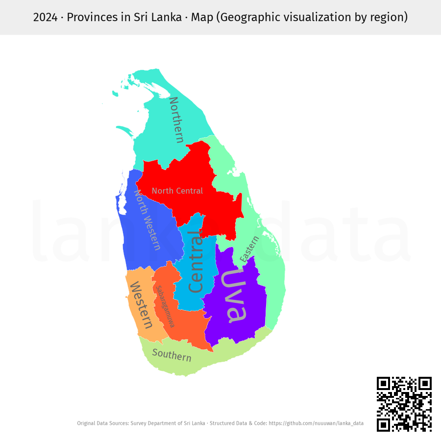

Source: [_output/Empty/2024/LK:province/Map/Image.png](_output/Empty/2024/LK:province/Map/Image.png)

#### 2.02) Empty/2024/LK-1,LK-2,LK-3,LK-9,LK-8/Map

```bash
Empty/2024/LK-1,LK-2,LK-3,LK-9,LK-8/Map
```

```json
{
    "command_str": "Empty/2024/LK-1,LK-2,LK-3,LK-9,LK-8/Map",
    "result": {
        "image_path": "_output/Empty/2024/LK-1,LK-2,LK-3,LK-9,LK-8/Map/Image.png"
    },
    "sources": [
        {
            "name": "Survey Department of Sri Lanka",
            "url": "https://survey.gov.lk/"
        }
    ],
    "query_time_ms": 0,
    "is_corrected": false,
    "corrections": []
}
```

Source: [_output/Empty/2024/LK-1,LK-2,LK-3,LK-9,LK-8/Map/Output.json](_output/Empty/2024/LK-1,LK-2,LK-3,LK-9,LK-8/Map/Output.json)

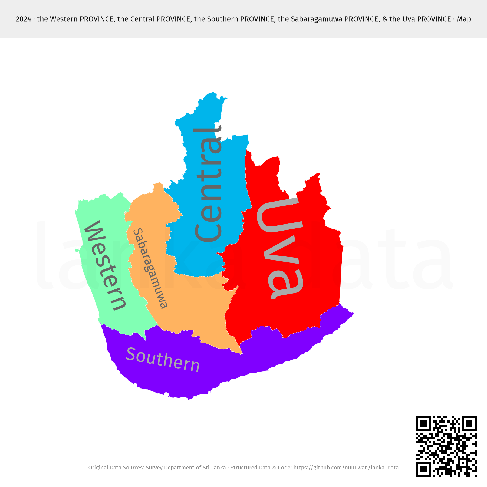

Source: [_output/Empty/2024/LK-1,LK-2,LK-3,LK-9,LK-8/Map/Image.png](_output/Empty/2024/LK-1,LK-2,LK-3,LK-9,LK-8/Map/Image.png)

#### 2.03) Empty/2024/LK-5...LK-8/Map

```bash
Empty/2024/LK-5...LK-8/Map
```

```json
{
    "command_str": "Empty/2024/LK-5...LK-8/Map",
    "result": {
        "image_path": "_output/Empty/2024/LK-5...LK-8/Map/Image.png"
    },
    "sources": [
        {
            "name": "Survey Department of Sri Lanka",
            "url": "https://survey.gov.lk/"
        }
    ],
    "query_time_ms": 0,
    "is_corrected": false,
    "corrections": []
}
```

Source: [_output/Empty/2024/LK-5...LK-8/Map/Output.json](_output/Empty/2024/LK-5...LK-8/Map/Output.json)

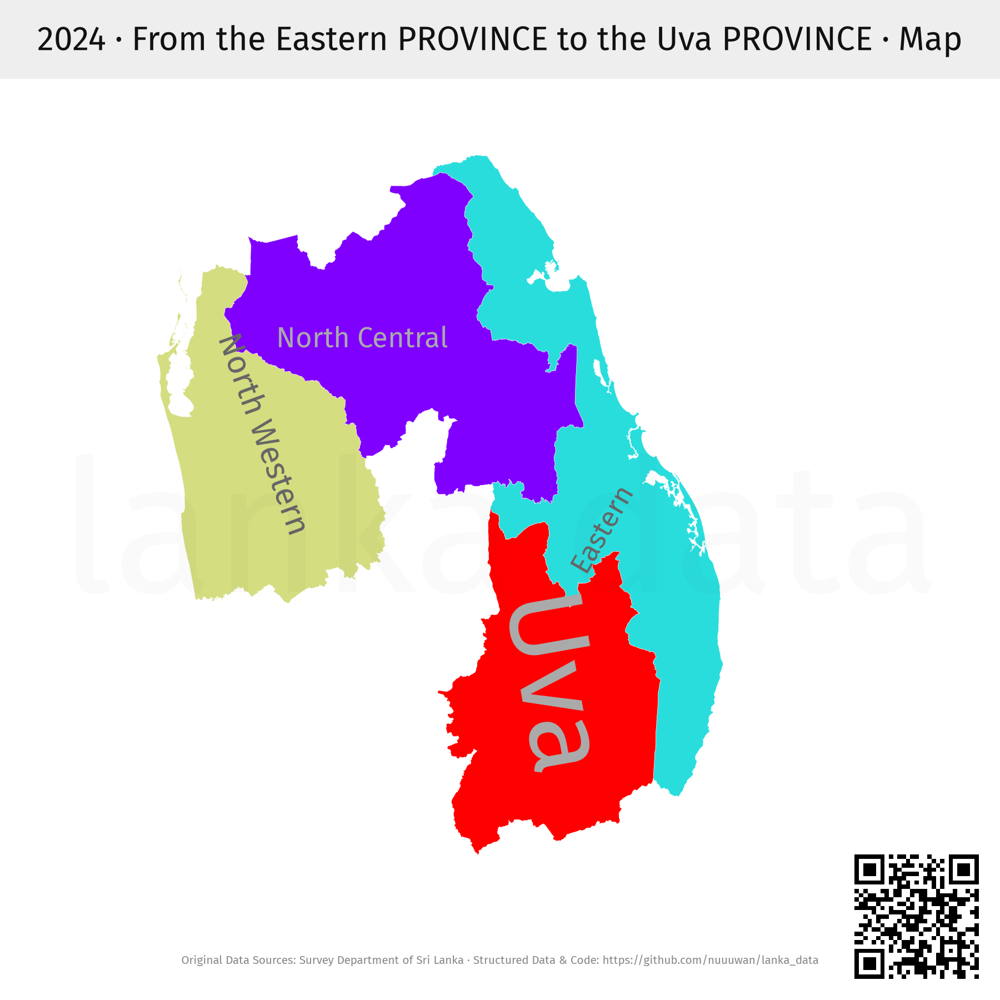

Source: [_output/Empty/2024/LK-5...LK-8/Map/Image.png](_output/Empty/2024/LK-5...LK-8/Map/Image.png)

#### 2.04) Empty/2024/LK-1127025@20/Map

```bash
Empty/2024/LK-1127025@20/Map
```

```json
{
    "command_str": "Empty/2024/LK-1127025@20/Map",
    "result": {
        "image_path": "_output/Empty/2024/LK-1127025@20/Map/Image.png"
    },
    "sources": [
        {
            "name": "Survey Department of Sri Lanka",
            "url": "https://survey.gov.lk/"
        }
    ],
    "query_time_ms": 0,
    "is_corrected": false,
    "corrections": []
}
```

Source: [_output/Empty/2024/LK-1127025@20/Map/Output.json](_output/Empty/2024/LK-1127025@20/Map/Output.json)

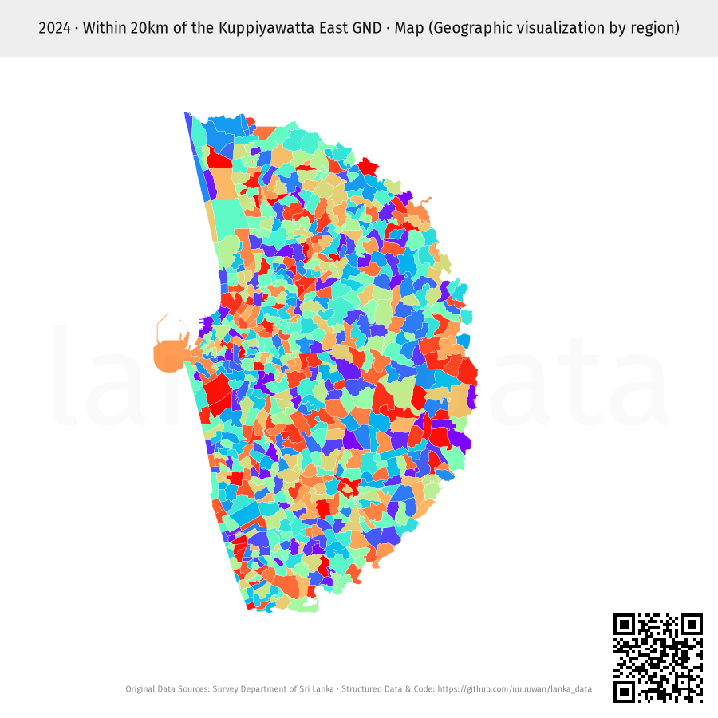

Source: [_output/Empty/2024/LK-1127025@20/Map/Image.png](_output/Empty/2024/LK-1127025@20/Map/Image.png)

## 3) Religion

#### 3.01) Religion/2012-2024/LK:district/Map:1st

```bash
Religion/2012-2024/LK:district/Map:1st
```

```json
{
    "command_str": "Religion/2012-2024/LK:district/Map:1st",
    "result": {
        "image_path": "_output/Religion/2012-2024/LK:district/Map:1st/Image.png"
    },
    "sources": [
        {
            "name": "Census of Population and Housing 2012",
            "url": "https://www.statistics.gov.lk/Resource/en/Population/CPH_2011/CPH_2012_5Per_Rpt.pdf"
        },
        {
            "name": "Census of Population and Housing 2024",
            "url": "https://www.statistics.gov.lk/Population/StaticalInformation/CPH2024"
        }
    ],
    "query_time_ms": 0,
    "is_corrected": false,
    "corrections": []
}
```

Source: [_output/Religion/2012-2024/LK:district/Map:1st/Output.json](_output/Religion/2012-2024/LK:district/Map:1st/Output.json)

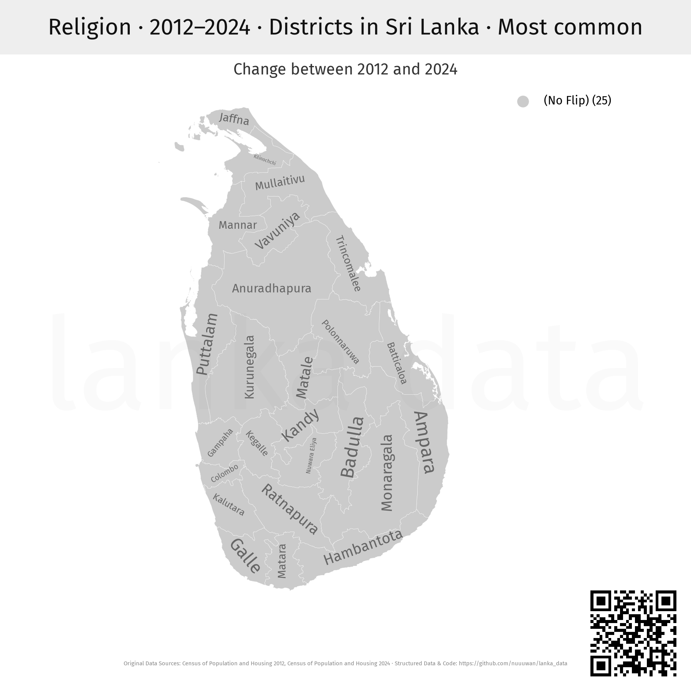

Source: [_output/Religion/2012-2024/LK:district/Map:1st/Image.png](_output/Religion/2012-2024/LK:district/Map:1st/Image.png)

#### 3.02) Religion/2012-2024/LK:district/Map:2nd

```bash
Religion/2012-2024/LK:district/Map:2nd
```

```json
{
    "command_str": "Religion/2012-2024/LK:district/Map:2nd",
    "result": {
        "image_path": "_output/Religion/2012-2024/LK:district/Map:2nd/Image.png"
    },
    "sources": [
        {
            "name": "Census of Population and Housing 2012",
            "url": "https://www.statistics.gov.lk/Resource/en/Population/CPH_2011/CPH_2012_5Per_Rpt.pdf"
        },
        {
            "name": "Census of Population and Housing 2024",
            "url": "https://www.statistics.gov.lk/Population/StaticalInformation/CPH2024"
        }
    ],
    "query_time_ms": 0,
    "is_corrected": false,
    "corrections": []
}
```

Source: [_output/Religion/2012-2024/LK:district/Map:2nd/Output.json](_output/Religion/2012-2024/LK:district/Map:2nd/Output.json)

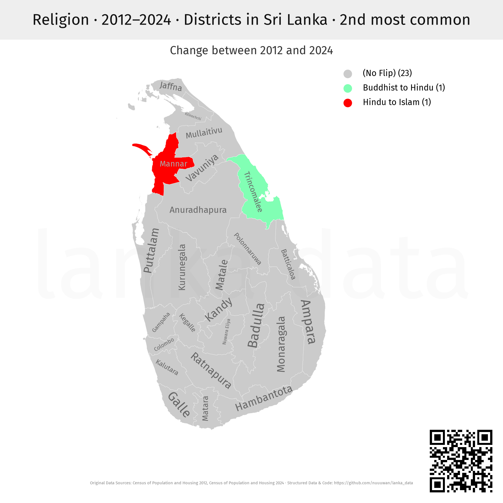

Source: [_output/Religion/2012-2024/LK:district/Map:2nd/Image.png](_output/Religion/2012-2024/LK:district/Map:2nd/Image.png)

#### 3.03) Religion/2012-2024/LK:district/Map:3rd

```bash
Religion/2012-2024/LK:district/Map:3rd
```

```json
{
    "command_str": "Religion/2012-2024/LK:district/Map:3rd",
    "result": {
        "image_path": "_output/Religion/2012-2024/LK:district/Map:3rd/Image.png"
    },
    "sources": [
        {
            "name": "Census of Population and Housing 2012",
            "url": "https://www.statistics.gov.lk/Resource/en/Population/CPH_2011/CPH_2012_5Per_Rpt.pdf"
        },
        {
            "name": "Census of Population and Housing 2024",
            "url": "https://www.statistics.gov.lk/Population/StaticalInformation/CPH2024"
        }
    ],
    "query_time_ms": 0,
    "is_corrected": false,
    "corrections": []
}
```

Source: [_output/Religion/2012-2024/LK:district/Map:3rd/Output.json](_output/Religion/2012-2024/LK:district/Map:3rd/Output.json)

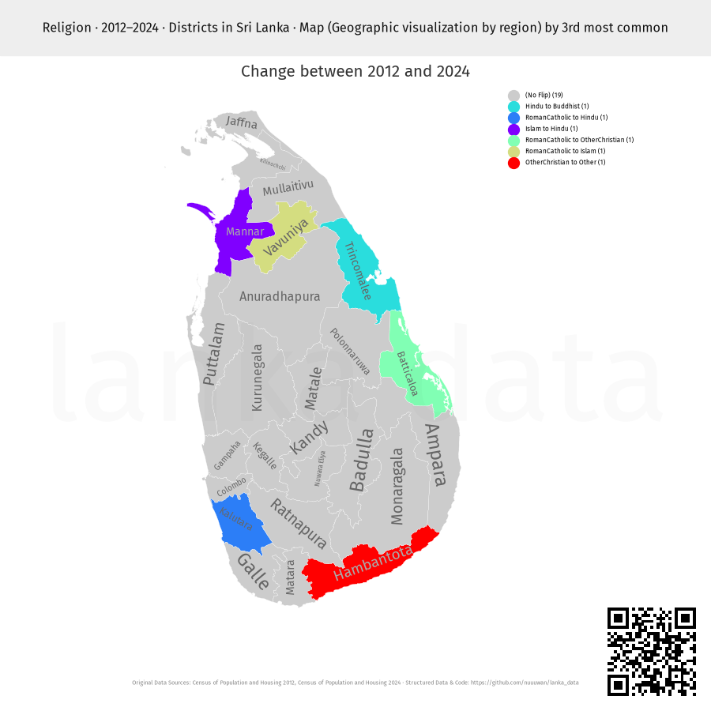

Source: [_output/Religion/2012-2024/LK:district/Map:3rd/Image.png](_output/Religion/2012-2024/LK:district/Map:3rd/Image.png)

#### 3.04) Religion/2012-2024/LK:district/Map:Top3

```bash
Religion/2012-2024/LK:district/Map:Top3
```

```json
{
    "command_str": "Religion/2012-2024/LK:district/Map:Top3",
    "result": {
        "image_path": "_output/Religion/2012-2024/LK:district/Map:Top3/Image.png"
    },
    "sources": [
        {
            "name": "Census of Population and Housing 2012",
            "url": "https://www.statistics.gov.lk/Resource/en/Population/CPH_2011/CPH_2012_5Per_Rpt.pdf"
        },
        {
            "name": "Census of Population and Housing 2024",
            "url": "https://www.statistics.gov.lk/Population/StaticalInformation/CPH2024"
        }
    ],
    "query_time_ms": 0
}
```

Source: [_output/Religion/2012-2024/LK:district/Map:Top3/Output.json](_output/Religion/2012-2024/LK:district/Map:Top3/Output.json)

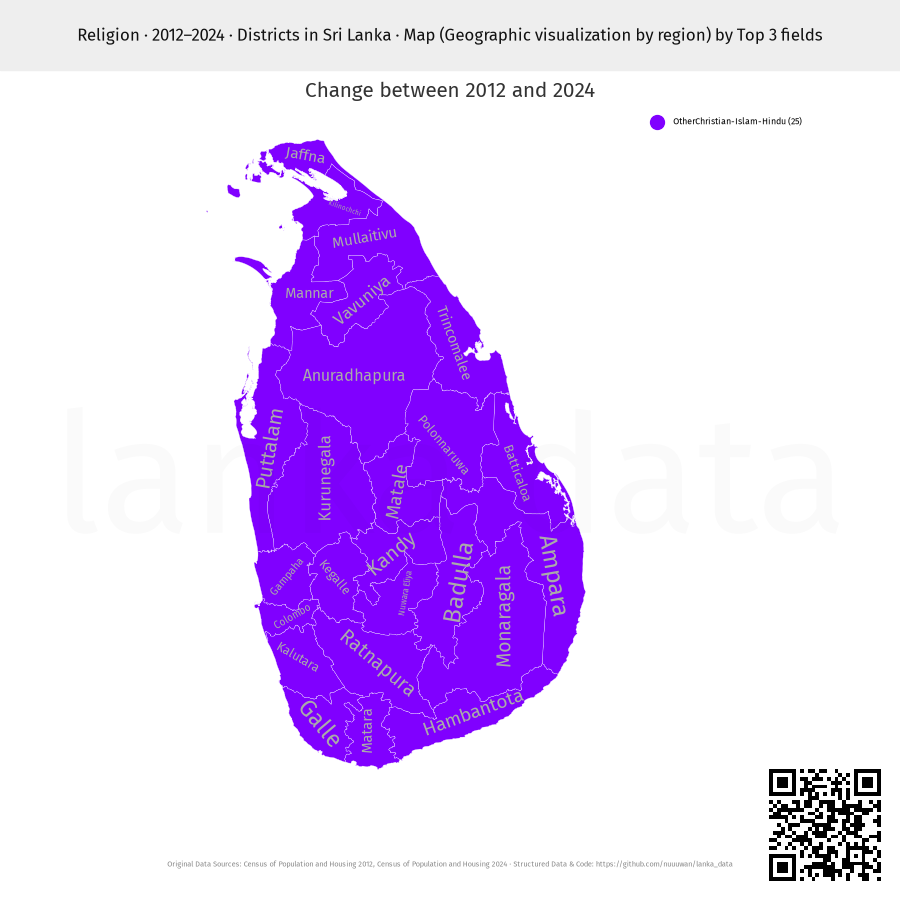

Source: [_output/Religion/2012-2024/LK:district/Map:Top3/Image.png](_output/Religion/2012-2024/LK:district/Map:Top3/Image.png)

#### 3.05) Religion/2012-2024/LK:district/Map:Change

```bash
Religion/2012-2024/LK:district/Map:Change
```

```json
{
    "command_str": "Religion/2012-2024/LK:district/Map:Change",
    "result": {
        "image_path": "_output/Religion/2012-2024/LK:district/Map:Change/Image.png"
    },
    "sources": [
        {
            "name": "Census of Population and Housing 2012",
            "url": "https://www.statistics.gov.lk/Resource/en/Population/CPH_2011/CPH_2012_5Per_Rpt.pdf"
        },
        {
            "name": "Census of Population and Housing 2024",
            "url": "https://www.statistics.gov.lk/Population/StaticalInformation/CPH2024"
        }
    ],
    "query_time_ms": 0,
    "is_corrected": false,
    "corrections": []
}
```

Source: [_output/Religion/2012-2024/LK:district/Map:Change/Output.json](_output/Religion/2012-2024/LK:district/Map:Change/Output.json)

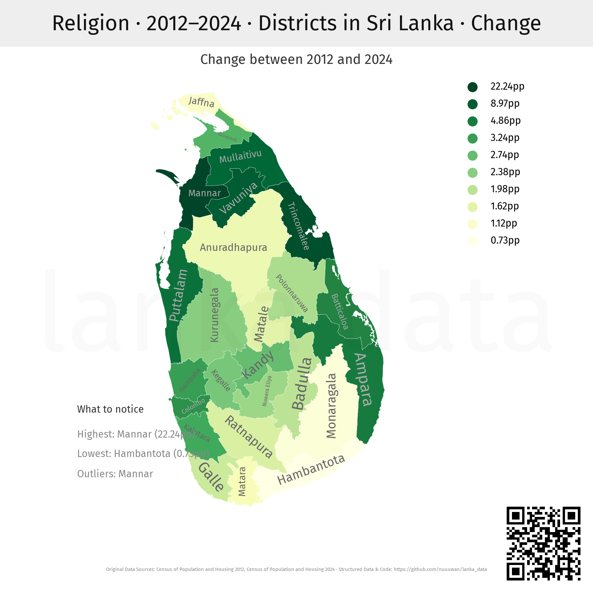

Source: [_output/Religion/2012-2024/LK:district/Map:Change/Image.png](_output/Religion/2012-2024/LK:district/Map:Change/Image.png)

#### 3.06) Religion/2012-2024/LK-42:district/BarChart

```bash
Religion/2012-2024/LK-42:district/BarChart
```

```json
{
    "command_str": "Religion/2012-2024/LK-42/BarChart",
    "result": {
        "image_path": "_output/Religion/2012-2024/LK-42/BarChart/Image.png"
    },
    "sources": [
        {
            "name": "Census of Population and Housing 2012",
            "url": "https://www.statistics.gov.lk/Resource/en/Population/CPH_2011/CPH_2012_5Per_Rpt.pdf"
        },
        {
            "name": "Census of Population and Housing 2024",
            "url": "https://www.statistics.gov.lk/Population/StaticalInformation/CPH2024"
        }
    ],
    "query_time_ms": 0,
    "is_corrected": true,
    "corrections": [
        {
            "field": "Where",
            "rule": "resolve_self_type",
            "from": "LK-42:district",
            "to": "LK-42",
            "severity": "lossless",
            "reason": "LK-42 is already a district; dropped redundant :district."
        }
    ],
    "original_command_str": "Religion/2012-2024/LK-42:district/BarChart",
    "correction_reason": "LK-42 is already a district; dropped redundant :district."
}
```

Source: [_output/Religion/2012-2024/LK-42:district/BarChart/Output.json](_output/Religion/2012-2024/LK-42:district/BarChart/Output.json)

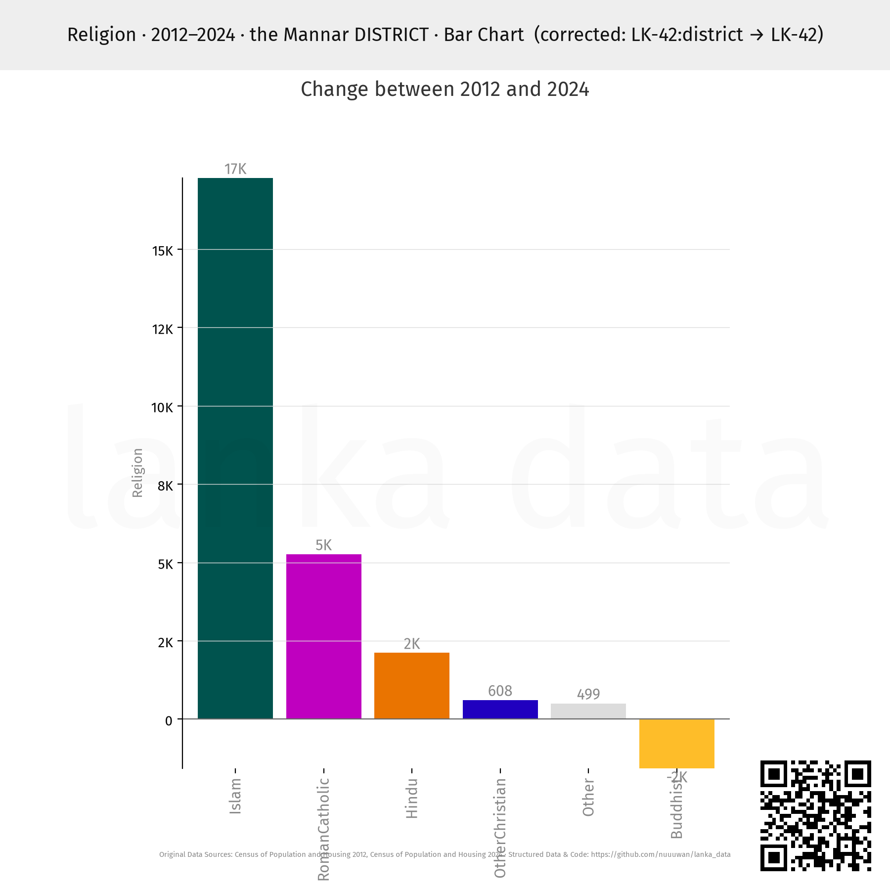

Source: [_output/Religion/2012-2024/LK-42/BarChart/Image.png](_output/Religion/2012-2024/LK-42/BarChart/Image.png)

#### 3.07) Religion/2012-2024/LK-43:dsd/BarChart

```bash
Religion/2012-2024/LK-43:dsd/BarChart
```

```json
{
    "command_str": "Religion/2012-2024/LK-43:dsd/BarChart",
    "result": {
        "image_path": "_output/Religion/2012-2024/LK-43:dsd/BarChart/Image.png"
    },
    "sources": [
        {
            "name": "Census of Population and Housing 2012",
            "url": "https://www.statistics.gov.lk/Resource/en/Population/CPH_2011/CPH_2012_5Per_Rpt.pdf"
        },
        {
            "name": "Census of Population and Housing 2024",
            "url": "https://www.statistics.gov.lk/Population/StaticalInformation/CPH2024"
        }
    ],
    "query_time_ms": 0,
    "is_corrected": false,
    "corrections": []
}
```

Source: [_output/Religion/2012-2024/LK-43:dsd/BarChart/Output.json](_output/Religion/2012-2024/LK-43:dsd/BarChart/Output.json)

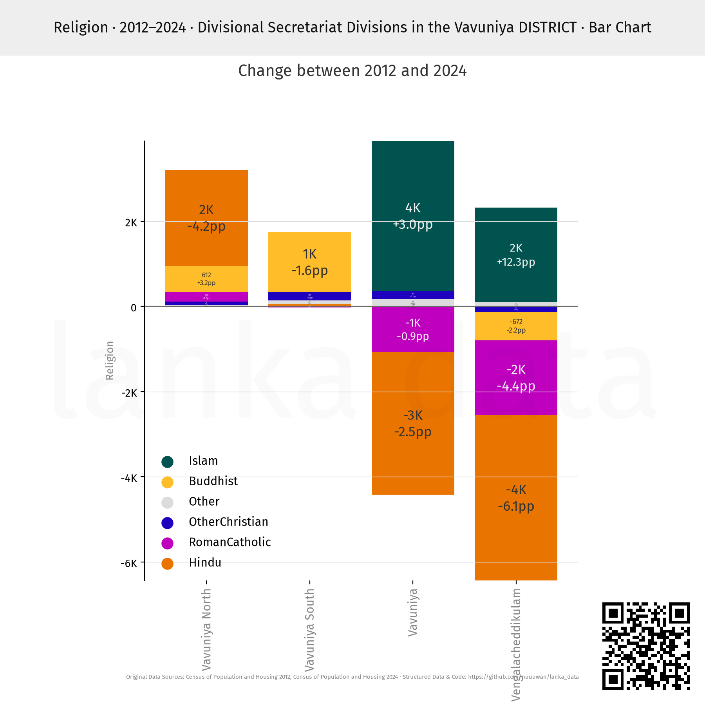

Source: [_output/Religion/2012-2024/LK-43:dsd/BarChart/Image.png](_output/Religion/2012-2024/LK-43:dsd/BarChart/Image.png)

#### 3.08) Religion/2012-2024/LK-53:district/BarChart

```bash
Religion/2012-2024/LK-53:district/BarChart
```

```json
{
    "command_str": "Religion/2012-2024/LK-53/BarChart",
    "result": {
        "image_path": "_output/Religion/2012-2024/LK-53/BarChart/Image.png"
    },
    "sources": [
        {
            "name": "Census of Population and Housing 2012",
            "url": "https://www.statistics.gov.lk/Resource/en/Population/CPH_2011/CPH_2012_5Per_Rpt.pdf"
        },
        {
            "name": "Census of Population and Housing 2024",
            "url": "https://www.statistics.gov.lk/Population/StaticalInformation/CPH2024"
        }
    ],
    "query_time_ms": 0,
    "is_corrected": true,
    "corrections": [
        {
            "field": "Where",
            "rule": "resolve_self_type",
            "from": "LK-53:district",
            "to": "LK-53",
            "severity": "lossless",
            "reason": "LK-53 is already a district; dropped redundant :district."
        }
    ],
    "original_command_str": "Religion/2012-2024/LK-53:district/BarChart",
    "correction_reason": "LK-53 is already a district; dropped redundant :district."
}
```

Source: [_output/Religion/2012-2024/LK-53:district/BarChart/Output.json](_output/Religion/2012-2024/LK-53:district/BarChart/Output.json)

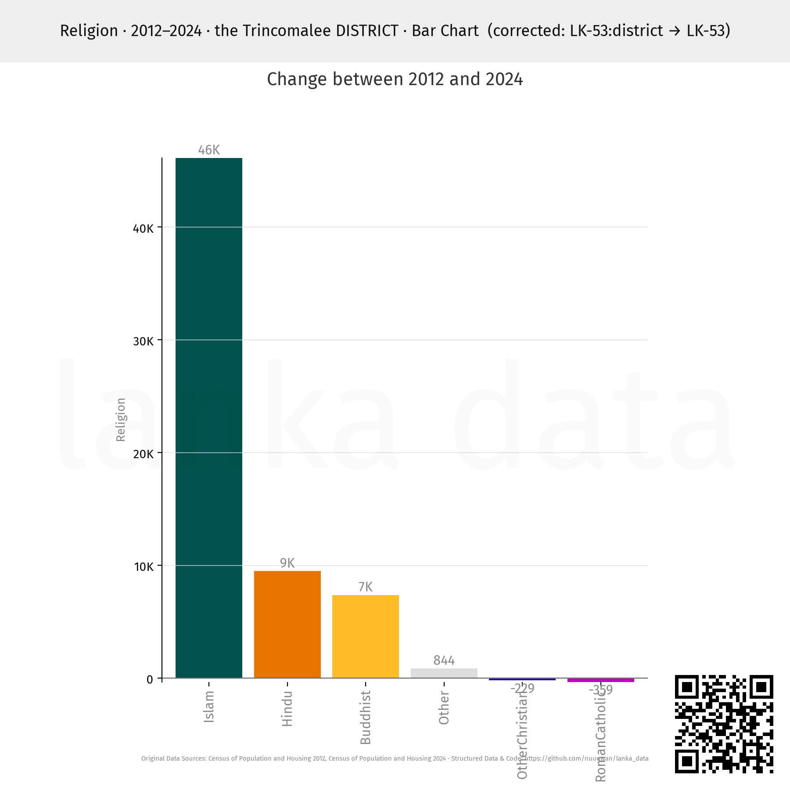

Source: [_output/Religion/2012-2024/LK-53/BarChart/Image.png](_output/Religion/2012-2024/LK-53/BarChart/Image.png)

#### 3.09) Religion/2012-2024/LK-33,LK-82,LK-32:district/BarChart

```bash
Religion/2012-2024/LK-33,LK-82,LK-32:district/BarChart
```

```json
{
    "command_str": "Religion/2012-2024/LK-33,LK-82,LK-32:district/BarChart",
    "result": {
        "image_path": "_output/Religion/2012-2024/LK-33,LK-82,LK-32:district/BarChart/Image.png"
    },
    "sources": [
        {
            "name": "Census of Population and Housing 2012",
            "url": "https://www.statistics.gov.lk/Resource/en/Population/CPH_2011/CPH_2012_5Per_Rpt.pdf"
        },
        {
            "name": "Census of Population and Housing 2024",
            "url": "https://www.statistics.gov.lk/Population/StaticalInformation/CPH2024"
        }
    ],
    "query_time_ms": 0,
    "is_corrected": false,
    "corrections": []
}
```

Source: [_output/Religion/2012-2024/LK-33,LK-82,LK-32:district/BarChart/Output.json](_output/Religion/2012-2024/LK-33,LK-82,LK-32:district/BarChart/Output.json)

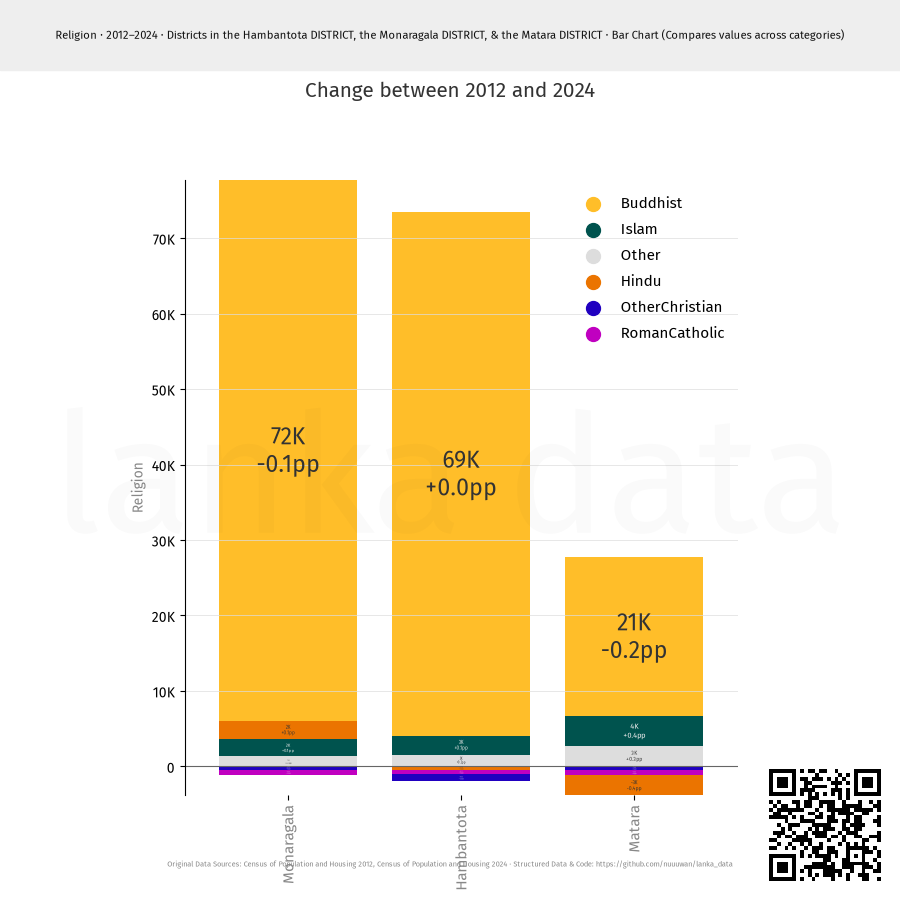

Source: [_output/Religion/2012-2024/LK-33,LK-82,LK-32:district/BarChart/Image.png](_output/Religion/2012-2024/LK-33,LK-82,LK-32:district/BarChart/Image.png)

#### 3.10) Religion/2012-2024/LK:district/BarChart

```bash
Religion/2012-2024/LK:district/BarChart
```

```json
{
    "command_str": "Religion/2012-2024/LK:district/BarChart",
    "result": {
        "image_path": "_output/Religion/2012-2024/LK:district/BarChart/Image.png"
    },
    "sources": [
        {
            "name": "Census of Population and Housing 2012",
            "url": "https://www.statistics.gov.lk/Resource/en/Population/CPH_2011/CPH_2012_5Per_Rpt.pdf"
        },
        {
            "name": "Census of Population and Housing 2024",
            "url": "https://www.statistics.gov.lk/Population/StaticalInformation/CPH2024"
        }
    ],
    "query_time_ms": 0,
    "is_corrected": false,
    "corrections": []
}
```

Source: [_output/Religion/2012-2024/LK:district/BarChart/Output.json](_output/Religion/2012-2024/LK:district/BarChart/Output.json)

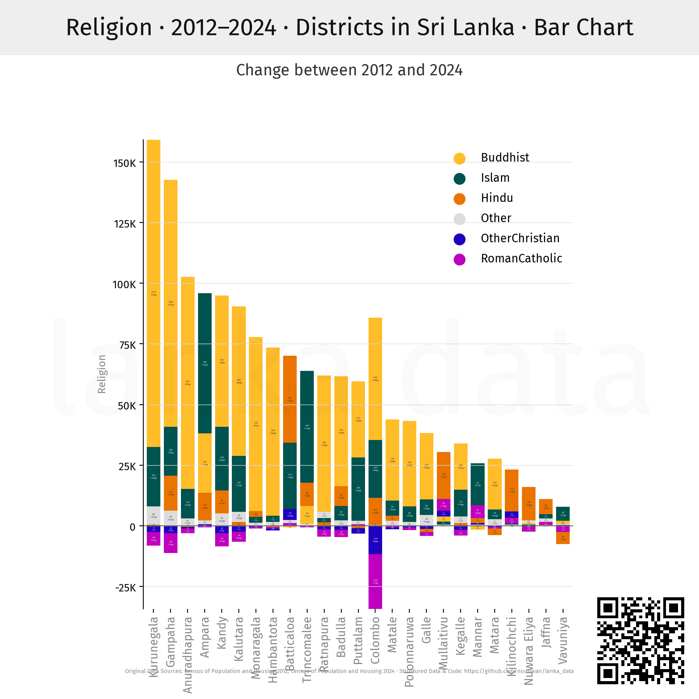

Source: [_output/Religion/2012-2024/LK:district/BarChart/Image.png](_output/Religion/2012-2024/LK:district/BarChart/Image.png)

#### 3.11) Religion/2012-2024/LK-11:dsd/BarChart

```bash
Religion/2012-2024/LK-11:dsd/BarChart
```

```json
{
    "command_str": "Religion/2012-2024/LK-11:dsd/BarChart",
    "result": {
        "image_path": "_output/Religion/2012-2024/LK-11:dsd/BarChart/Image.png"
    },
    "sources": [
        {
            "name": "Census of Population and Housing 2012",
            "url": "https://www.statistics.gov.lk/Resource/en/Population/CPH_2011/CPH_2012_5Per_Rpt.pdf"
        },
        {
            "name": "Census of Population and Housing 2024",
            "url": "https://www.statistics.gov.lk/Population/StaticalInformation/CPH2024"
        }
    ],
    "query_time_ms": 0,
    "is_corrected": false,
    "corrections": []
}
```

Source: [_output/Religion/2012-2024/LK-11:dsd/BarChart/Output.json](_output/Religion/2012-2024/LK-11:dsd/BarChart/Output.json)

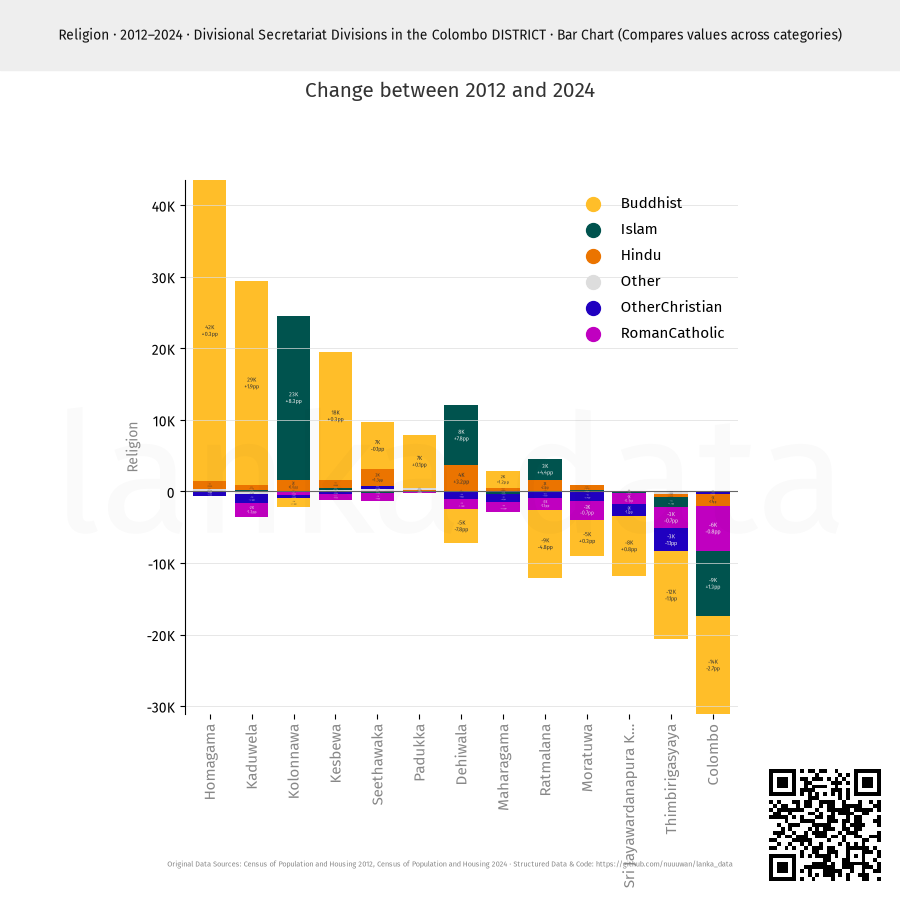

Source: [_output/Religion/2012-2024/LK-11:dsd/BarChart/Image.png](_output/Religion/2012-2024/LK-11:dsd/BarChart/Image.png)

#### 3.12) Religion/2012-2024/LK-11:lg/BarChart

```bash
Religion/2012-2024/LK-11:lg/BarChart
```

```json
{
    "command_str": "Religion/2012-2024/LK-11:lg/BarChart",
    "result": {
        "image_path": "_output/Religion/2012-2024/LK-11:lg/BarChart/Image.png"
    },
    "sources": [
        {
            "name": "Census of Population and Housing 2012",
            "url": "https://www.statistics.gov.lk/Resource/en/Population/CPH_2011/CPH_2012_5Per_Rpt.pdf"
        },
        {
            "name": "Census of Population and Housing 2024",
            "url": "https://www.statistics.gov.lk/Population/StaticalInformation/CPH2024"
        }
    ],
    "query_time_ms": 0,
    "is_corrected": false,
    "corrections": []
}
```

Source: [_output/Religion/2012-2024/LK-11:lg/BarChart/Output.json](_output/Religion/2012-2024/LK-11:lg/BarChart/Output.json)

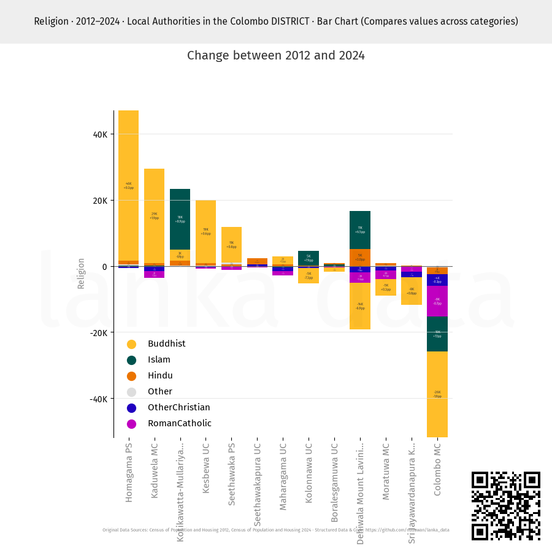

Source: [_output/Religion/2012-2024/LK-11:lg/BarChart/Image.png](_output/Religion/2012-2024/LK-11:lg/BarChart/Image.png)

#### 3.13) Religion/2012-2024/LK-12:dsd/BarChart

```bash
Religion/2012-2024/LK-12:dsd/BarChart
```

```json
{
    "command_str": "Religion/2012-2024/LK-12:dsd/BarChart",
    "result": {
        "image_path": "_output/Religion/2012-2024/LK-12:dsd/BarChart/Image.png"
    },
    "sources": [
        {
            "name": "Census of Population and Housing 2012",
            "url": "https://www.statistics.gov.lk/Resource/en/Population/CPH_2011/CPH_2012_5Per_Rpt.pdf"
        },
        {
            "name": "Census of Population and Housing 2024",
            "url": "https://www.statistics.gov.lk/Population/StaticalInformation/CPH2024"
        }
    ],
    "query_time_ms": 0,
    "is_corrected": false,
    "corrections": []
}
```

Source: [_output/Religion/2012-2024/LK-12:dsd/BarChart/Output.json](_output/Religion/2012-2024/LK-12:dsd/BarChart/Output.json)

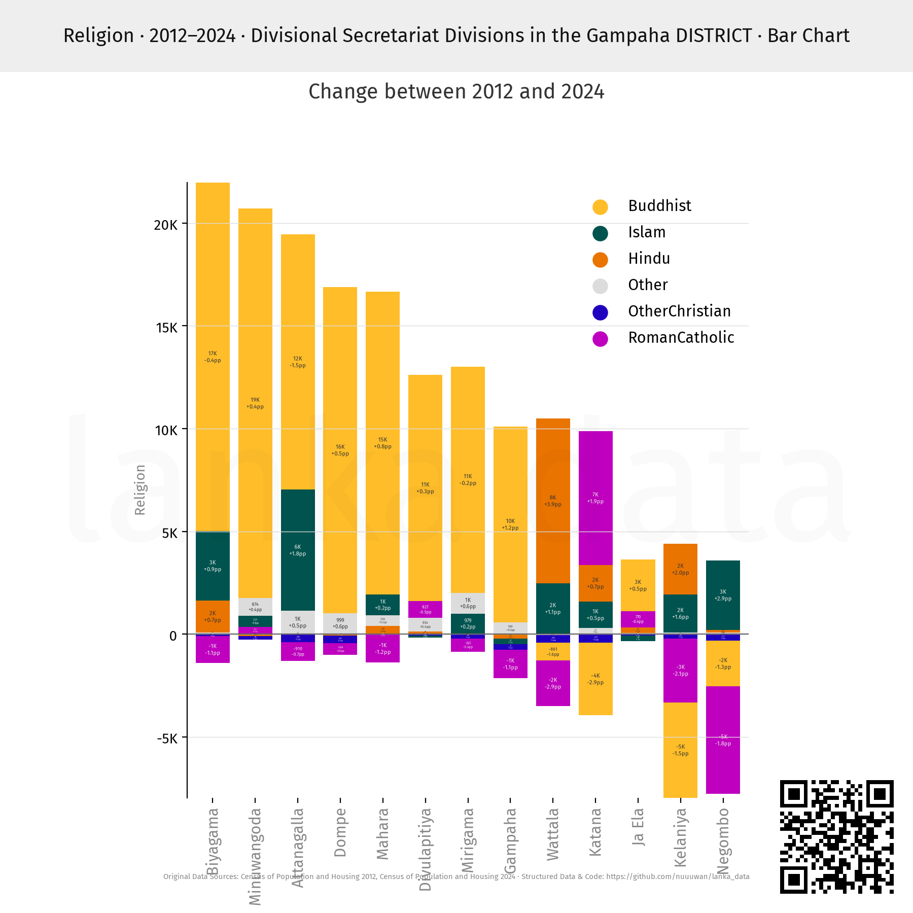

Source: [_output/Religion/2012-2024/LK-12:dsd/BarChart/Image.png](_output/Religion/2012-2024/LK-12:dsd/BarChart/Image.png)

#### 3.14) Religion/2012-2024/LK:district/Map:DiversityPew

```bash
Religion/2012-2024/LK:district/Map:DiversityPew
```

```json
{
    "command_str": "Religion/2012-2024/LK:district/Map:DiversityPew",
    "result": {
        "image_path": "_output/Religion/2012-2024/LK:district/Map:DiversityPew/Image.png"
    },
    "sources": [
        {
            "name": "Census of Population and Housing 2012",
            "url": "https://www.statistics.gov.lk/Resource/en/Population/CPH_2011/CPH_2012_5Per_Rpt.pdf"
        },
        {
            "name": "Census of Population and Housing 2024",
            "url": "https://www.statistics.gov.lk/Population/StaticalInformation/CPH2024"
        }
    ],
    "query_time_ms": 0,
    "is_corrected": false,
    "corrections": []
}
```

Source: [_output/Religion/2012-2024/LK:district/Map:DiversityPew/Output.json](_output/Religion/2012-2024/LK:district/Map:DiversityPew/Output.json)

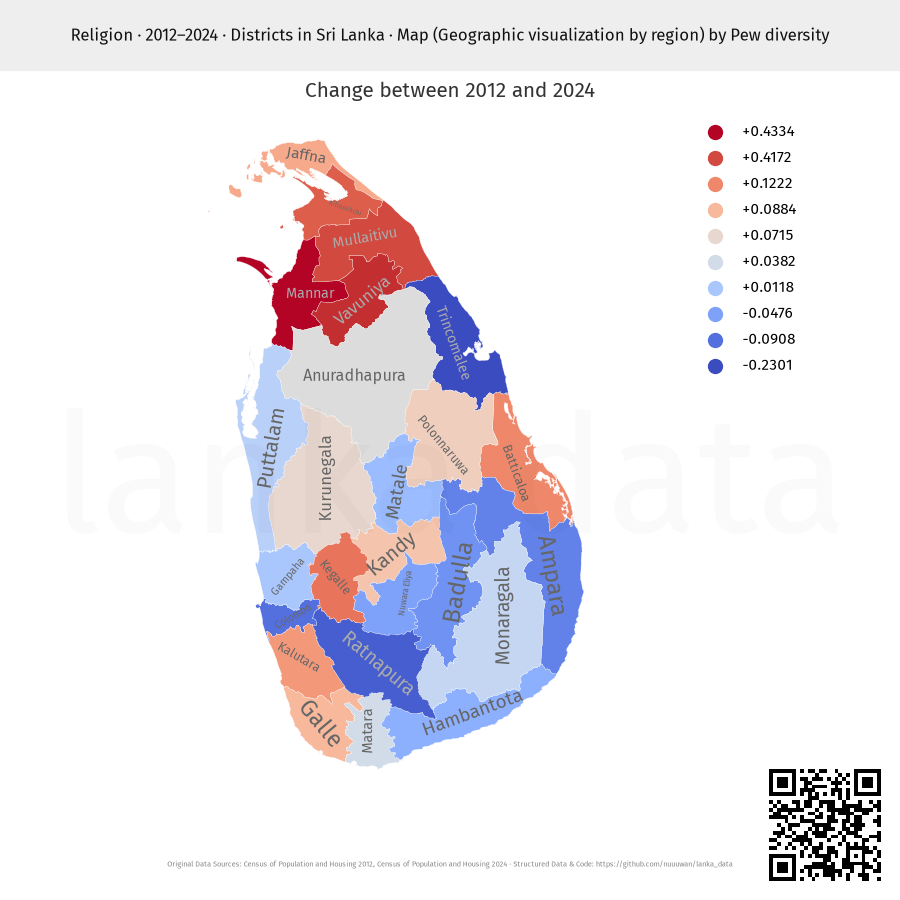

Source: [_output/Religion/2012-2024/LK:district/Map:DiversityPew/Image.png](_output/Religion/2012-2024/LK:district/Map:DiversityPew/Image.png)

#### 3.15) Religion/2012-2024/LK:district/Map:2ndPct

```bash
Religion/2012-2024/LK:district/Map:2ndPct
```

```json
{
    "command_str": "Religion/2012-2024/LK:district/Map:2ndPct",
    "result": {
        "image_path": "_output/Religion/2012-2024/LK:district/Map:2ndPct/Image.png"
    },
    "sources": [
        {
            "name": "Census of Population and Housing 2012",
            "url": "https://www.statistics.gov.lk/Resource/en/Population/CPH_2011/CPH_2012_5Per_Rpt.pdf"
        },
        {
            "name": "Census of Population and Housing 2024",
            "url": "https://www.statistics.gov.lk/Population/StaticalInformation/CPH2024"
        }
    ],
    "query_time_ms": 0,
    "is_corrected": false,
    "corrections": []
}
```

Source: [_output/Religion/2012-2024/LK:district/Map:2ndPct/Output.json](_output/Religion/2012-2024/LK:district/Map:2ndPct/Output.json)

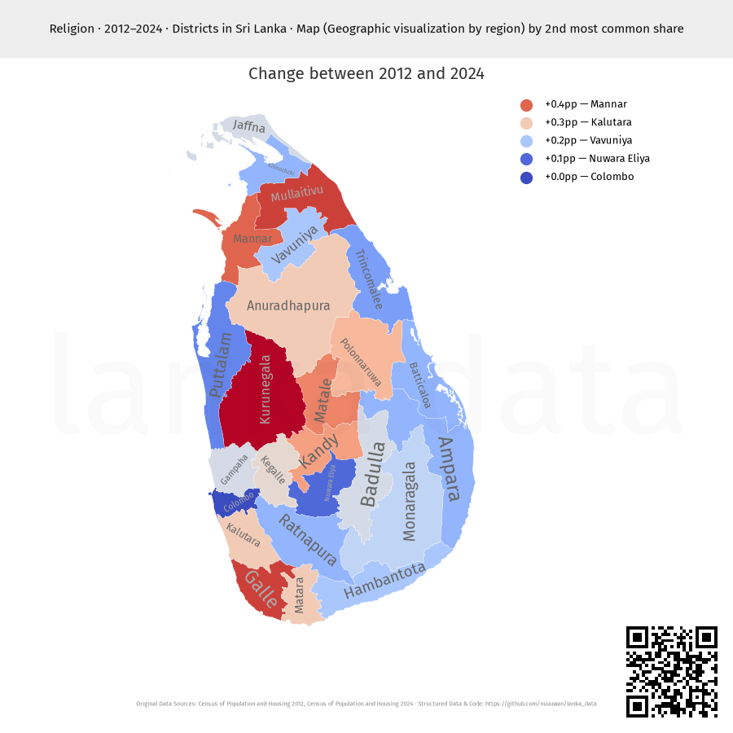

Source: [_output/Religion/2012-2024/LK:district/Map:2ndPct/Image.png](_output/Religion/2012-2024/LK:district/Map:2ndPct/Image.png)

#### 3.16) Religion/2012-2024/LK:district/Map:3rdPct

```bash
Religion/2012-2024/LK:district/Map:3rdPct
```

```json
{
    "command_str": "Religion/2012-2024/LK:district/Map:3rdPct",
    "result": {
        "image_path": "_output/Religion/2012-2024/LK:district/Map:3rdPct/Image.png"
    },
    "sources": [
        {
            "name": "Census of Population and Housing 2012",
            "url": "https://www.statistics.gov.lk/Resource/en/Population/CPH_2011/CPH_2012_5Per_Rpt.pdf"
        },
        {
            "name": "Census of Population and Housing 2024",
            "url": "https://www.statistics.gov.lk/Population/StaticalInformation/CPH2024"
        }
    ],
    "query_time_ms": 0,
    "is_corrected": false,
    "corrections": []
}
```

Source: [_output/Religion/2012-2024/LK:district/Map:3rdPct/Output.json](_output/Religion/2012-2024/LK:district/Map:3rdPct/Output.json)

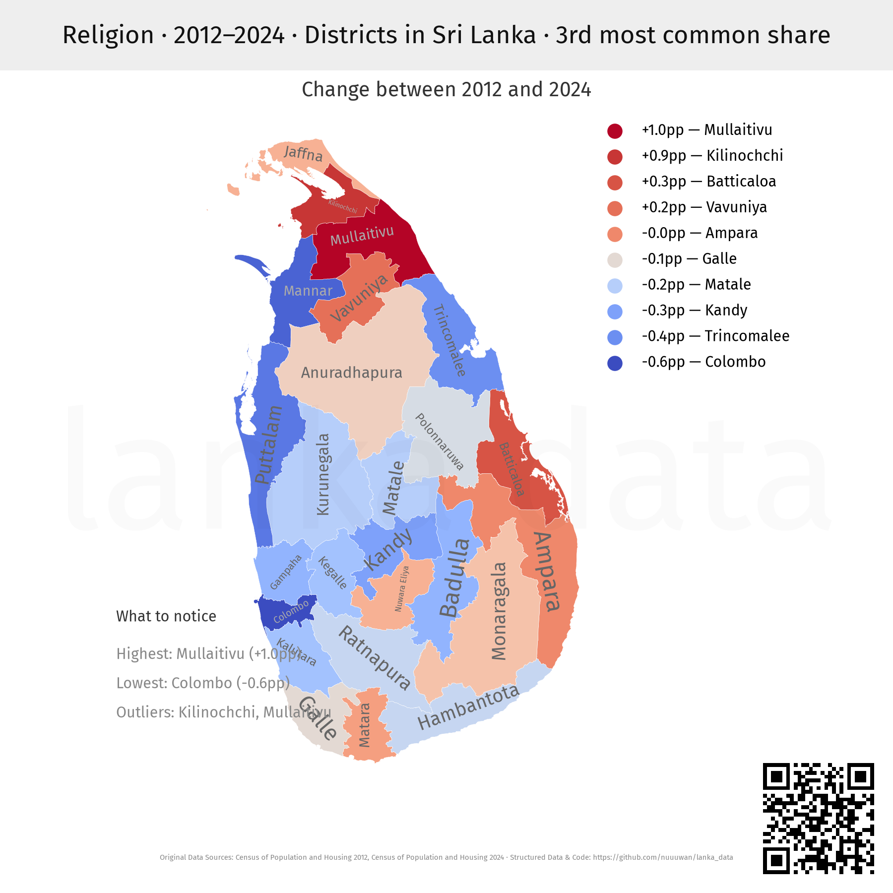

Source: [_output/Religion/2012-2024/LK:district/Map:3rdPct/Image.png](_output/Religion/2012-2024/LK:district/Map:3rdPct/Image.png)

#### 3.17) Religion/2012-2024/LK-21:dsd/BarChart

```bash
Religion/2012-2024/LK-21:dsd/BarChart
```

```json
{
    "command_str": "Religion/2012-2024/LK-21:dsd/BarChart",
    "result": {
        "image_path": "_output/Religion/2012-2024/LK-21:dsd/BarChart/Image.png"
    },
    "sources": [
        {
            "name": "Census of Population and Housing 2012",
            "url": "https://www.statistics.gov.lk/Resource/en/Population/CPH_2011/CPH_2012_5Per_Rpt.pdf"
        },
        {
            "name": "Census of Population and Housing 2024",
            "url": "https://www.statistics.gov.lk/Population/StaticalInformation/CPH2024"
        }
    ],
    "query_time_ms": 0,
    "is_corrected": false,
    "corrections": []
}
```

Source: [_output/Religion/2012-2024/LK-21:dsd/BarChart/Output.json](_output/Religion/2012-2024/LK-21:dsd/BarChart/Output.json)

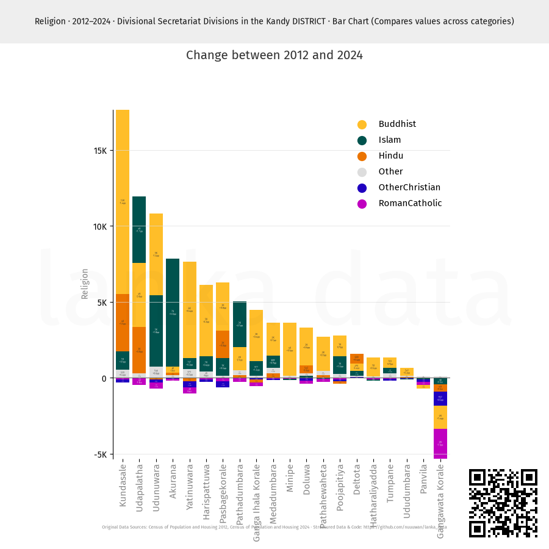

Source: [_output/Religion/2012-2024/LK-21:dsd/BarChart/Image.png](_output/Religion/2012-2024/LK-21:dsd/BarChart/Image.png)

#### 3.18) Religion/2012-2024/LK-31-pre2019:dsd/BarChart

```bash
Religion/2012-2024/LK-31-pre2019:dsd/BarChart
```

```json
{
    "command_str": "Religion/2012-2024/LK-31-pre2019:dsd/BarChart",
    "result": {
        "image_path": "_output/Religion/2012-2024/LK-31-pre2019:dsd/BarChart/Image.png"
    },
    "sources": [
        {
            "name": "Census of Population and Housing 2012",
            "url": "https://www.statistics.gov.lk/Resource/en/Population/CPH_2011/CPH_2012_5Per_Rpt.pdf"
        },
        {
            "name": "Census of Population and Housing 2024",
            "url": "https://www.statistics.gov.lk/Population/StaticalInformation/CPH2024"
        }
    ],
    "query_time_ms": 0,
    "is_corrected": false,
    "corrections": []
}
```

Source: [_output/Religion/2012-2024/LK-31-pre2019:dsd/BarChart/Output.json](_output/Religion/2012-2024/LK-31-pre2019:dsd/BarChart/Output.json)

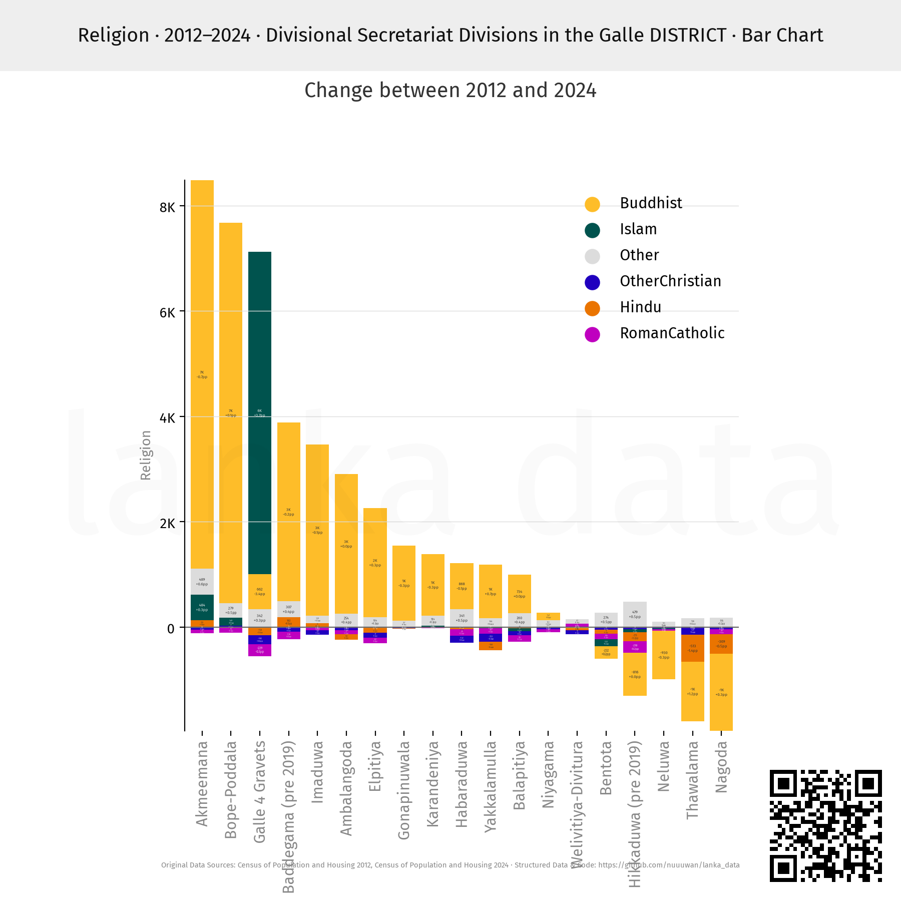

Source: [_output/Religion/2012-2024/LK-31-pre2019:dsd/BarChart/Image.png](_output/Religion/2012-2024/LK-31-pre2019:dsd/BarChart/Image.png)

#### 3.19) Religion/2012-2024/LK-11:district/BarChart

```bash
Religion/2012-2024/LK-11:district/BarChart
```

```json
{
    "command_str": "Religion/2012-2024/LK-11/BarChart",
    "result": {
        "image_path": "_output/Religion/2012-2024/LK-11/BarChart/Image.png"
    },
    "sources": [
        {
            "name": "Census of Population and Housing 2012",
            "url": "https://www.statistics.gov.lk/Resource/en/Population/CPH_2011/CPH_2012_5Per_Rpt.pdf"
        },
        {
            "name": "Census of Population and Housing 2024",
            "url": "https://www.statistics.gov.lk/Population/StaticalInformation/CPH2024"
        }
    ],
    "query_time_ms": 0,
    "is_corrected": true,
    "corrections": [
        {
            "field": "Where",
            "rule": "resolve_self_type",
            "from": "LK-11:district",
            "to": "LK-11",
            "severity": "lossless",
            "reason": "LK-11 is already a district; dropped redundant :district."
        }
    ],
    "original_command_str": "Religion/2012-2024/LK-11:district/BarChart",
    "correction_reason": "LK-11 is already a district; dropped redundant :district."
}
```

Source: [_output/Religion/2012-2024/LK-11:district/BarChart/Output.json](_output/Religion/2012-2024/LK-11:district/BarChart/Output.json)

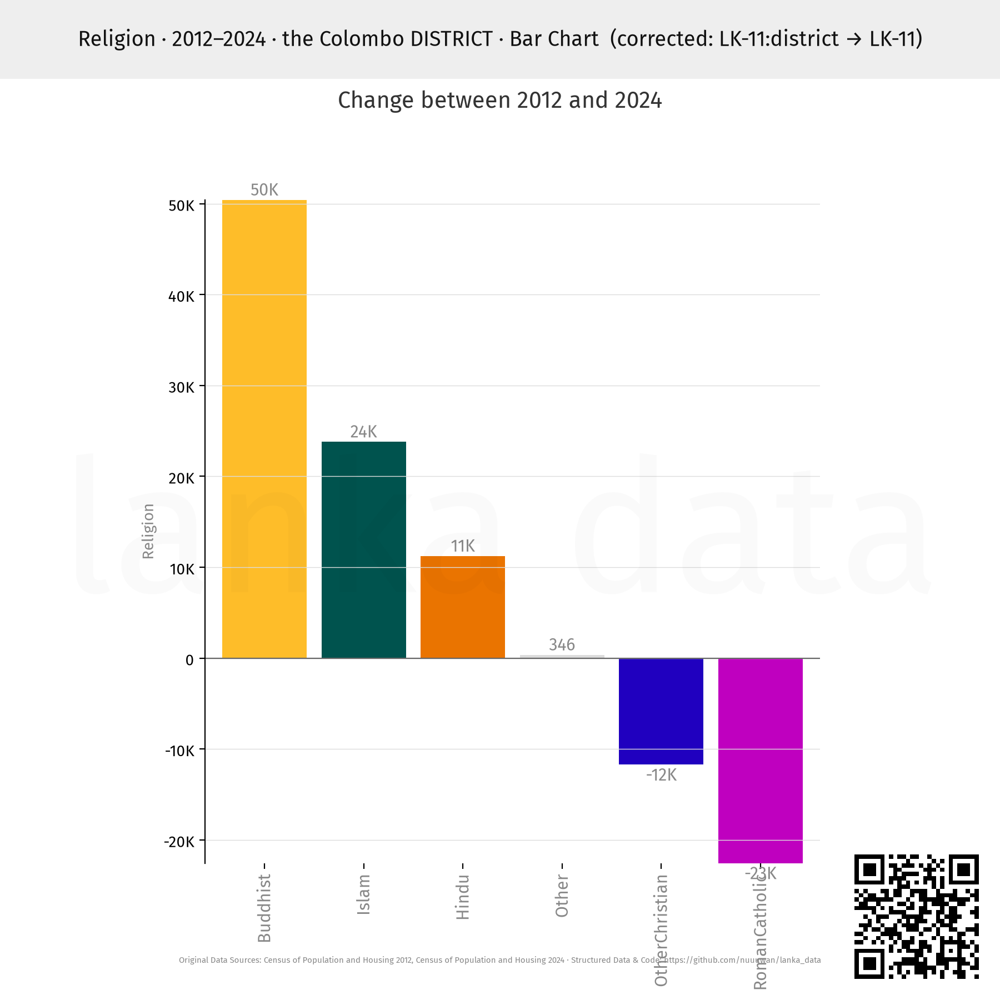

Source: [_output/Religion/2012-2024/LK-11/BarChart/Image.png](_output/Religion/2012-2024/LK-11/BarChart/Image.png)

## 4) Bivariate

#### 4.01) Religion+Ethnicity/2024/LK:district/BivariateMap

```bash
Religion+Ethnicity/2024/LK:district/BivariateMap
```

```json
{
    "command_str": "Religion+Ethnicity/2024/LK:district/BivariateMap",
    "result": {
        "image_path": "_output/Religion+Ethnicity/2024/LK:district/BivariateMap/Image.png"
    },
    "sources": [
        {
            "name": "Census of Population and Housing 2024",
            "url": "https://www.statistics.gov.lk/Population/StaticalInformation/CPH2024"
        }
    ],
    "query_time_ms": 0,
    "is_corrected": false,
    "corrections": []
}
```

Source: [_output/Religion+Ethnicity/2024/LK:district/BivariateMap/Output.json](_output/Religion+Ethnicity/2024/LK:district/BivariateMap/Output.json)

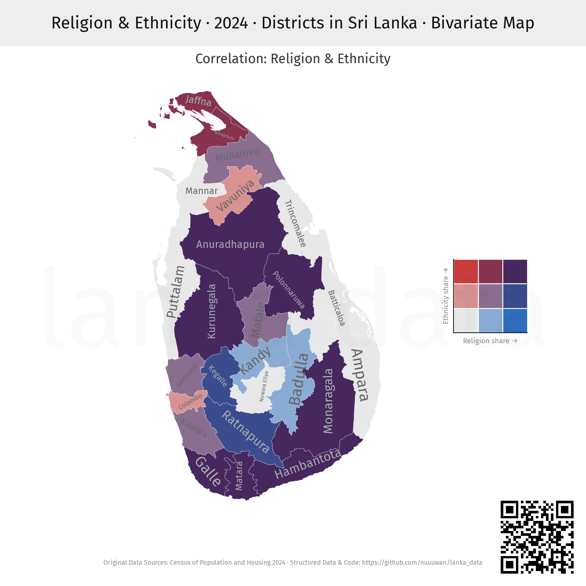

Source: [_output/Religion+Ethnicity/2024/LK:district/BivariateMap/Image.png](_output/Religion+Ethnicity/2024/LK:district/BivariateMap/Image.png)

#### 4.02) Religion+Ethnicity/2024/LK:district/QuadrantChart:Buddhist+Sinhalese

```bash
Religion+Ethnicity/2024/LK:district/QuadrantChart:Buddhist+Sinhalese
```

```json
{
    "command_str": "Religion+Ethnicity/2024/LK:district/QuadrantChart:Buddhist+Sinhalese",
    "result": {
        "image_path": "_output/Religion+Ethnicity/2024/LK:district/QuadrantChart:Buddhist+Sinhalese/Image.png"
    },
    "sources": [
        {
            "name": "Census of Population and Housing 2024",
            "url": "https://www.statistics.gov.lk/Population/StaticalInformation/CPH2024"
        }
    ],
    "query_time_ms": 0,
    "is_corrected": false,
    "corrections": []
}
```

Source: [_output/Religion+Ethnicity/2024/LK:district/QuadrantChart:Buddhist+Sinhalese/Output.json](_output/Religion+Ethnicity/2024/LK:district/QuadrantChart:Buddhist+Sinhalese/Output.json)

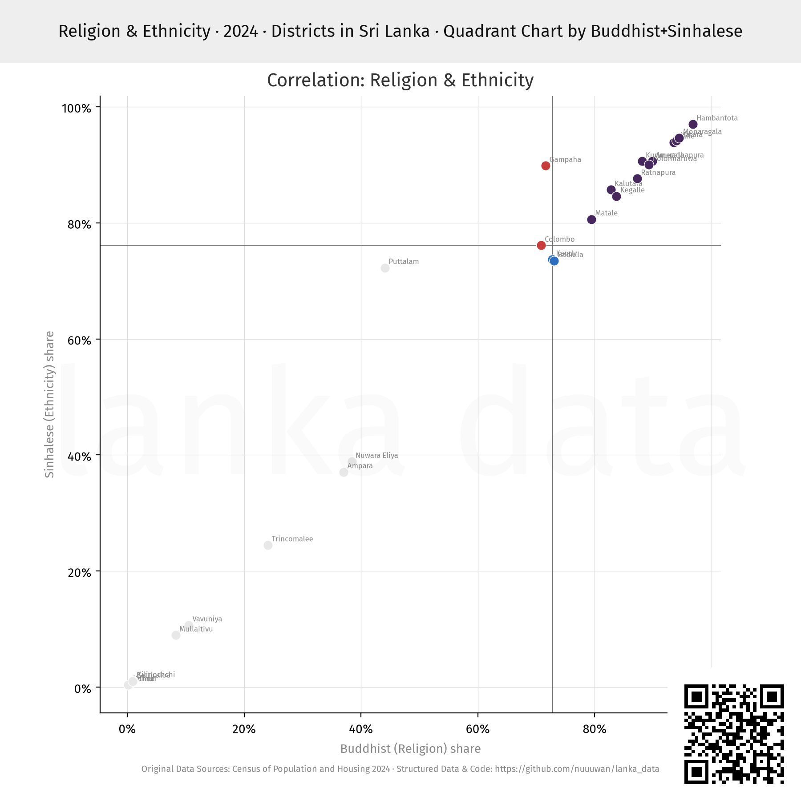

Source: [_output/Religion+Ethnicity/2024/LK:district/QuadrantChart:Buddhist+Sinhalese/Image.png](_output/Religion+Ethnicity/2024/LK:district/QuadrantChart:Buddhist+Sinhalese/Image.png)

#### 4.03) Religion+Ethnicity/2024/LK:district/ScatterPlot:Buddhist+Sinhalese

```bash
Religion+Ethnicity/2024/LK:district/ScatterPlot:Buddhist+Sinhalese
```

```json
{
    "command_str": "Religion+Ethnicity/2024/LK:district/ScatterPlot:Buddhist+Sinhalese",
    "result": {
        "image_path": "_output/Religion+Ethnicity/2024/LK:district/ScatterPlot:Buddhist+Sinhalese/Image.png"
    },
    "sources": [
        {
            "name": "Census of Population and Housing 2024",
            "url": "https://www.statistics.gov.lk/Population/StaticalInformation/CPH2024"
        }
    ],
    "query_time_ms": 0,
    "is_corrected": false,
    "corrections": []
}
```

Source: [_output/Religion+Ethnicity/2024/LK:district/ScatterPlot:Buddhist+Sinhalese/Output.json](_output/Religion+Ethnicity/2024/LK:district/ScatterPlot:Buddhist+Sinhalese/Output.json)

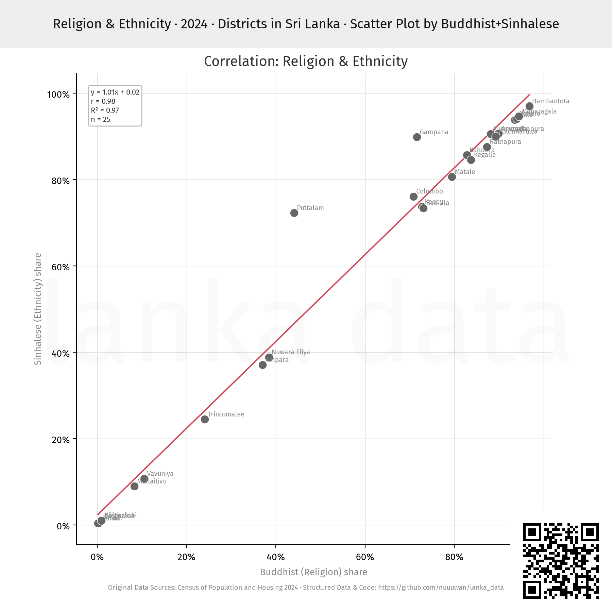

Source: [_output/Religion+Ethnicity/2024/LK:district/ScatterPlot:Buddhist+Sinhalese/Image.png](_output/Religion+Ethnicity/2024/LK:district/ScatterPlot:Buddhist+Sinhalese/Image.png)

## 5) Elections

#### 5.01) Parliamentary/2024/LK/JSON

```bash
Parliamentary/2024/LK/JSON
```

```json
{
    "command_str": "Parliamentary/2024/LK/JSON",
    "result": [
        {
            "region_id": "LK",
            "region_name": "Sri Lanka",
            "center_lat": 7.621831,
            "center_lng": 80.6983,
            "current_ids": [
                "LK"
            ],
            "values": {
                "NPP": 6863186,
                "SJB": 1968716,
                "NDF": 500835,
                "SLPP": 350429,
                "ITAK": 257813,
                "SB": 178006,
                "SLMC": 87038,
                "UDV": 83488,
                ... // 650 lines ...
                "IND05-13": 0.0,
                "IND07-13": 0.0,
                "IND08-14": 0.0,
                "IND32-13": 0.0,
                "IND40-13": 0.0,
                "IND37-13": 0.0,
                "IND33-13": 0.0
            }
        }
    ],
    "sources": [
        {
            "name": "Election Commission of Sri lanka",
            "url": "https://www.elections.gov.lk"
        }
    ],
    "query_time_ms": 0,
    "is_corrected": false,
    "corrections": []
}
```

Source: [_output/Parliamentary/2024/LK/JSON/Output.json](_output/Parliamentary/2024/LK/JSON/Output.json)

#### 5.02) Presidential/2015/LK-11:pd/Map

```bash
Presidential/2015/LK-11:pd/Map
```

```json
{
    "command_str": "Presidential/2015/LK-11:pd/Map",
    "result": {
        "image_path": "_output/Presidential/2015/LK-11:pd/Map/Image.png"
    },
    "sources": [
        {
            "name": "Election Commission of Sri lanka",
            "url": "https://www.elections.gov.lk"
        }
    ],
    "query_time_ms": 0,
    "is_corrected": false,
    "corrections": []
}
```

Source: [_output/Presidential/2015/LK-11:pd/Map/Output.json](_output/Presidential/2015/LK-11:pd/Map/Output.json)

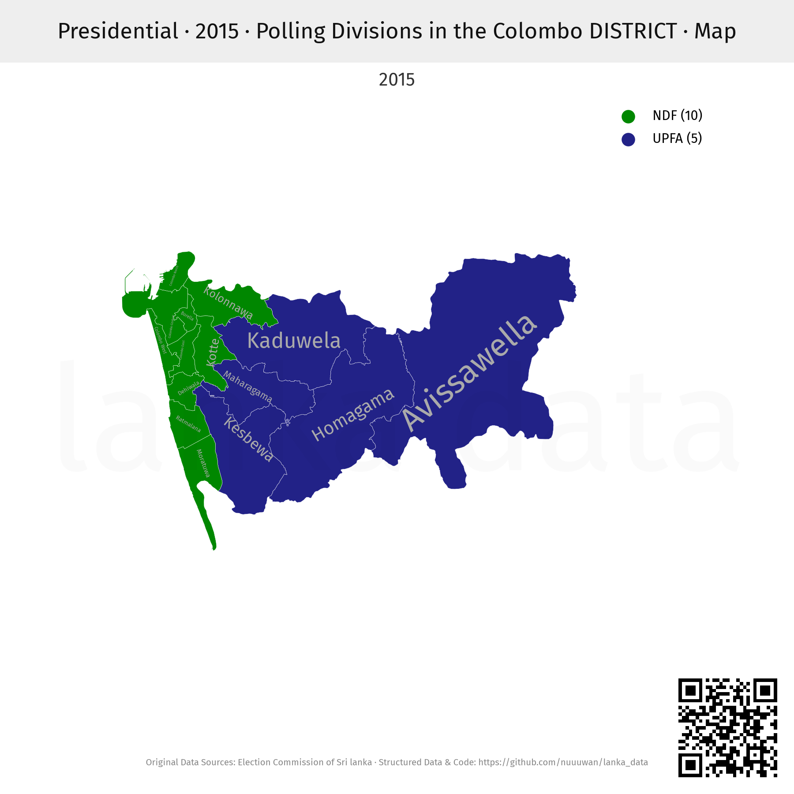

Source: [_output/Presidential/2015/LK-11:pd/Map/Image.png](_output/Presidential/2015/LK-11:pd/Map/Image.png)

#### 5.03) Local/2025/LK:district/Map

```bash
Local/2025/LK:district/Map
```

```json
{
    "command_str": "Local/2025/LK:district/Map",
    "result": {
        "image_path": "_output/Local/2025/LK:district/Map/Image.png"
    },
    "sources": [
        {
            "name": "Election Commission of Sri lanka",
            "url": "https://www.elections.gov.lk"
        }
    ],
    "query_time_ms": 0,
    "is_corrected": false,
    "corrections": []
}
```

Source: [_output/Local/2025/LK:district/Map/Output.json](_output/Local/2025/LK:district/Map/Output.json)

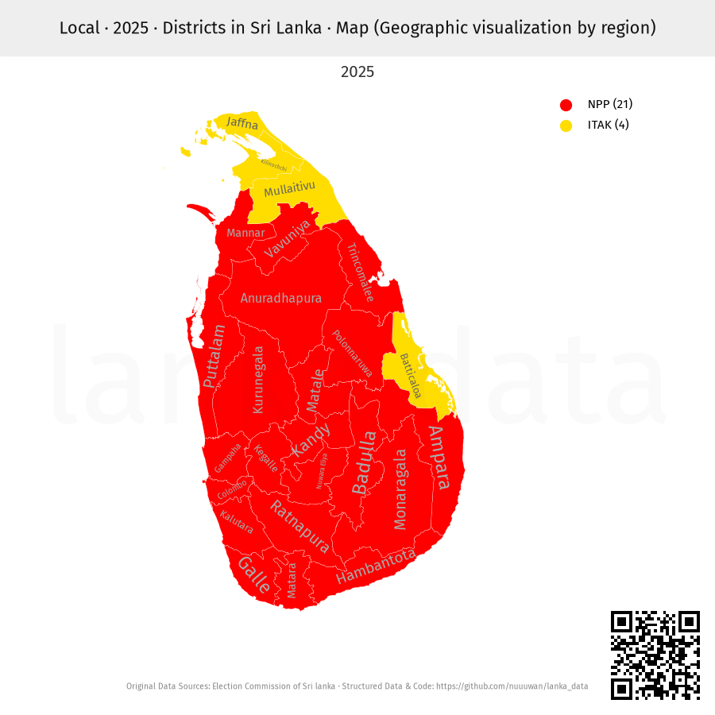

Source: [_output/Local/2025/LK:district/Map/Image.png](_output/Local/2025/LK:district/Map/Image.png)

## 6) History

#### 6.01) Empty/2012/LK-pre1845:province/Map

```bash
Empty/2012/LK-pre1845:province/Map
```

```json
{
    "command_str": "Empty/2012/LK-pre1845:province/Map",
    "result": {
        "image_path": "_output/Empty/2012/LK-pre1845:province/Map/Image.png"
    },
    "sources": [
        {
            "name": "Survey Department of Sri Lanka",
            "url": "https://survey.gov.lk/"
        }
    ],
    "query_time_ms": 0,
    "is_corrected": false,
    "corrections": []
}
```

Source: [_output/Empty/2012/LK-pre1845:province/Map/Output.json](_output/Empty/2012/LK-pre1845:province/Map/Output.json)

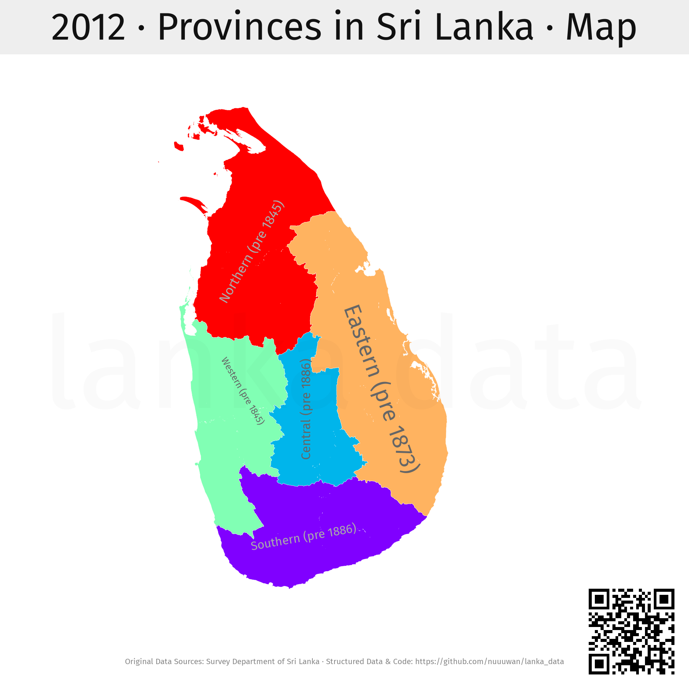

Source: [_output/Empty/2012/LK-pre1845:province/Map/Image.png](_output/Empty/2012/LK-pre1845:province/Map/Image.png)

#### 6.02) Empty/2012/LK-pre1873:province/Map

```bash
Empty/2012/LK-pre1873:province/Map
```

```json
{
    "command_str": "Empty/2012/LK-pre1873:province/Map",
    "result": {
        "image_path": "_output/Empty/2012/LK-pre1873:province/Map/Image.png"
    },
    "sources": [
        {
            "name": "Survey Department of Sri Lanka",
            "url": "https://survey.gov.lk/"
        }
    ],
    "query_time_ms": 0,
    "is_corrected": false,
    "corrections": []
}
```

Source: [_output/Empty/2012/LK-pre1873:province/Map/Output.json](_output/Empty/2012/LK-pre1873:province/Map/Output.json)

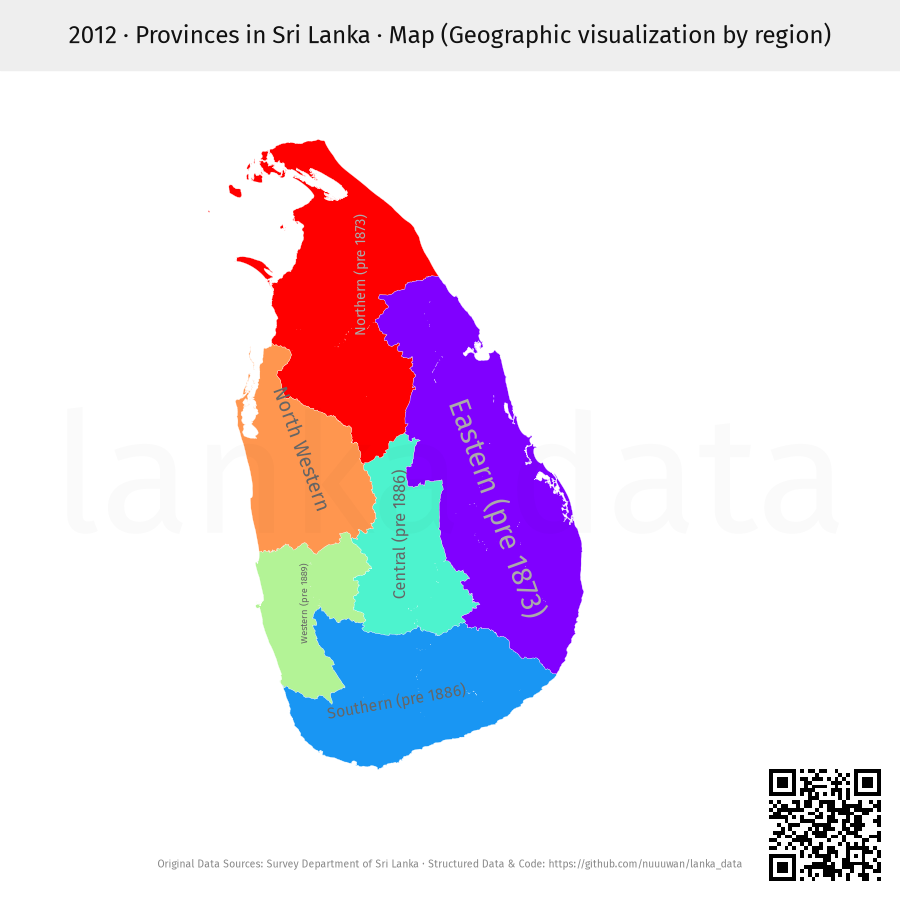

Source: [_output/Empty/2012/LK-pre1873:province/Map/Image.png](_output/Empty/2012/LK-pre1873:province/Map/Image.png)

#### 6.03) Empty/2012/LK-pre1886:province/Map

```bash
Empty/2012/LK-pre1886:province/Map
```

```json
{
    "command_str": "Empty/2012/LK-pre1886:province/Map",
    "result": {
        "image_path": "_output/Empty/2012/LK-pre1886:province/Map/Image.png"
    },
    "sources": [
        {
            "name": "Survey Department of Sri Lanka",
            "url": "https://survey.gov.lk/"
        }
    ],
    "query_time_ms": 0,
    "is_corrected": false,
    "corrections": []
}
```

Source: [_output/Empty/2012/LK-pre1886:province/Map/Output.json](_output/Empty/2012/LK-pre1886:province/Map/Output.json)

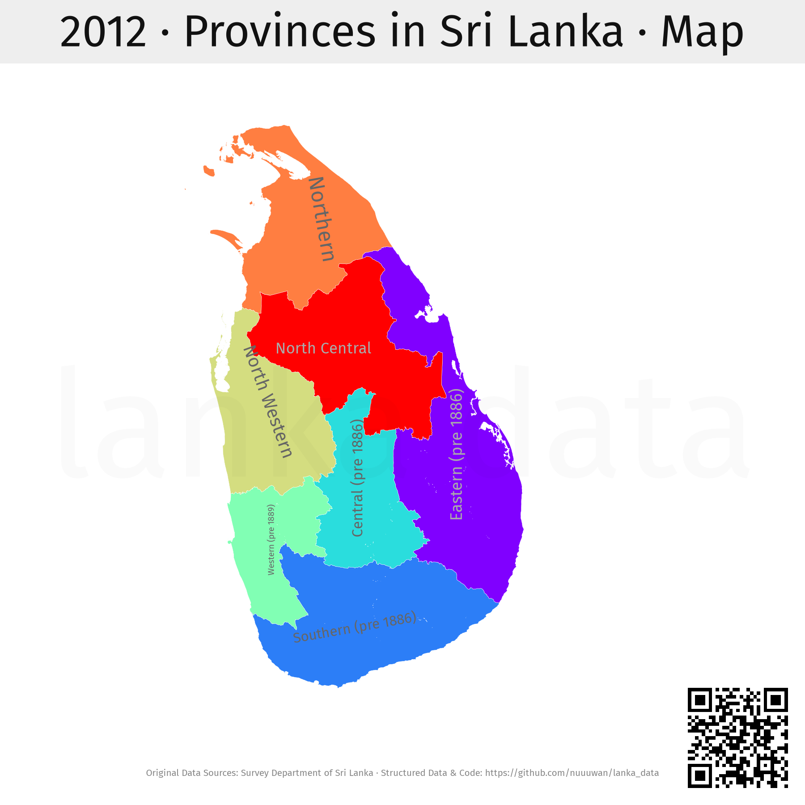

Source: [_output/Empty/2012/LK-pre1886:province/Map/Image.png](_output/Empty/2012/LK-pre1886:province/Map/Image.png)

#### 6.04) Empty/2012/LK-pre1889:province/Map

```bash
Empty/2012/LK-pre1889:province/Map
```

```json
{
    "command_str": "Empty/2012/LK-pre1889:province/Map",
    "result": {
        "image_path": "_output/Empty/2012/LK-pre1889:province/Map/Image.png"
    },
    "sources": [
        {
            "name": "Survey Department of Sri Lanka",
            "url": "https://survey.gov.lk/"
        }
    ],
    "query_time_ms": 0,
    "is_corrected": false,
    "corrections": []
}
```

Source: [_output/Empty/2012/LK-pre1889:province/Map/Output.json](_output/Empty/2012/LK-pre1889:province/Map/Output.json)


Source: [_output/Empty/2012/LK-pre1889:province/Map/Image.png](_output/Empty/2012/LK-pre1889:province/Map/Image.png)

#### 6.05) Empty/2012/LK:province/Map

```bash
Empty/2012/LK:province/Map
```

```json
{
    "command_str": "Empty/2012/LK:province/Map",
    "result": {
        "image_path": "_output/Empty/2012/LK:province/Map/Image.png"
    },
    "sources": [
        {
            "name": "Survey Department of Sri Lanka",
            "url": "https://survey.gov.lk/"
        }
    ],
    "query_time_ms": 0,
    "is_corrected": false,
    "corrections": []
}
```

Source: [_output/Empty/2012/LK:province/Map/Output.json](_output/Empty/2012/LK:province/Map/Output.json)


Source: [_output/Empty/2012/LK:province/Map/Image.png](_output/Empty/2012/LK:province/Map/Image.png)

#### 6.06) Empty/2012/LK-pre1959:district/Map

```bash
Empty/2012/LK-pre1959:district/Map
```

```json
{
    "command_str": "Empty/2012/LK-pre1959:district/Map",
    "result": {
        "image_path": "_output/Empty/2012/LK-pre1959:district/Map/Image.png"
    },
    "sources": [
        {
            "name": "Survey Department of Sri Lanka",
            "url": "https://survey.gov.lk/"
        }
    ],
    "query_time_ms": 0,
    "is_corrected": false,
    "corrections": []
}
```

Source: [_output/Empty/2012/LK-pre1959:district/Map/Output.json](_output/Empty/2012/LK-pre1959:district/Map/Output.json)

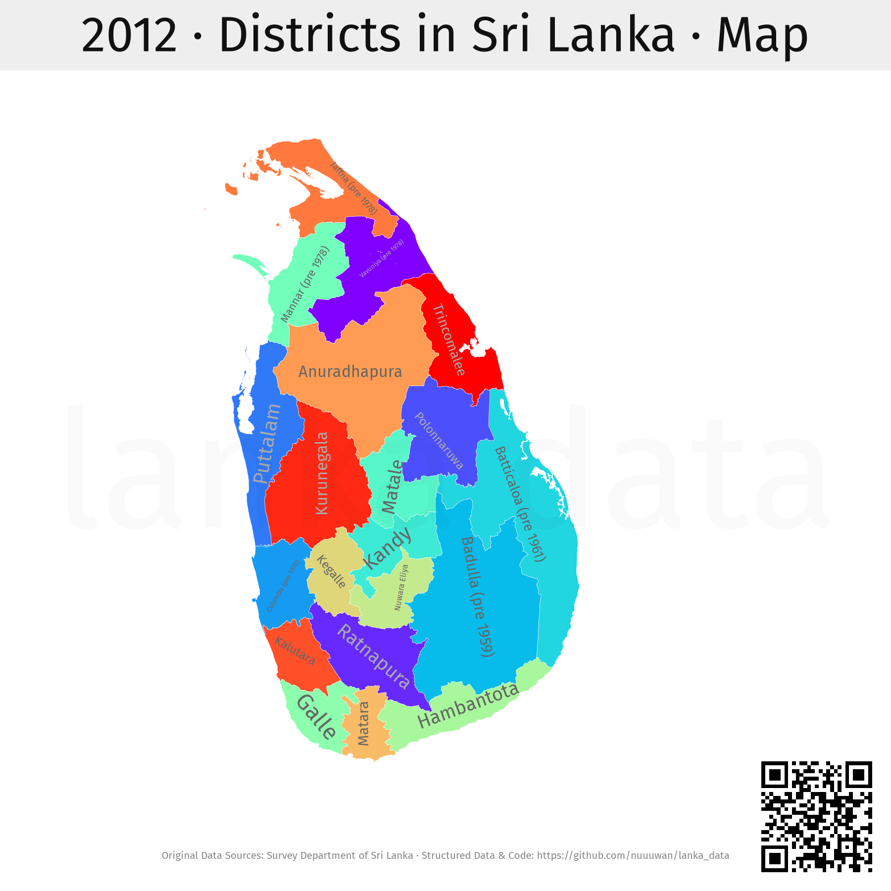

Source: [_output/Empty/2012/LK-pre1959:district/Map/Image.png](_output/Empty/2012/LK-pre1959:district/Map/Image.png)

#### 6.07) Empty/2012/LK-pre1961:district/Map

```bash
Empty/2012/LK-pre1961:district/Map
```

```json
{
    "command_str": "Empty/2012/LK-pre1961:district/Map",
    "result": {
        "image_path": "_output/Empty/2012/LK-pre1961:district/Map/Image.png"
    },
    "sources": [
        {
            "name": "Survey Department of Sri Lanka",
            "url": "https://survey.gov.lk/"
        }
    ],
    "query_time_ms": 0,
    "is_corrected": false,
    "corrections": []
}
```

Source: [_output/Empty/2012/LK-pre1961:district/Map/Output.json](_output/Empty/2012/LK-pre1961:district/Map/Output.json)


Source: [_output/Empty/2012/LK-pre1961:district/Map/Image.png](_output/Empty/2012/LK-pre1961:district/Map/Image.png)

#### 6.08) Empty/2012/LK-pre1978:district/Map

```bash
Empty/2012/LK-pre1978:district/Map
```

```json
{
    "command_str": "Empty/2012/LK-pre1978:district/Map",
    "result": {
        "image_path": "_output/Empty/2012/LK-pre1978:district/Map/Image.png"
    },
    "sources": [
        {
            "name": "Survey Department of Sri Lanka",
            "url": "https://survey.gov.lk/"
        }
    ],
    "query_time_ms": 0,
    "is_corrected": false,
    "corrections": []
}
```

Source: [_output/Empty/2012/LK-pre1978:district/Map/Output.json](_output/Empty/2012/LK-pre1978:district/Map/Output.json)

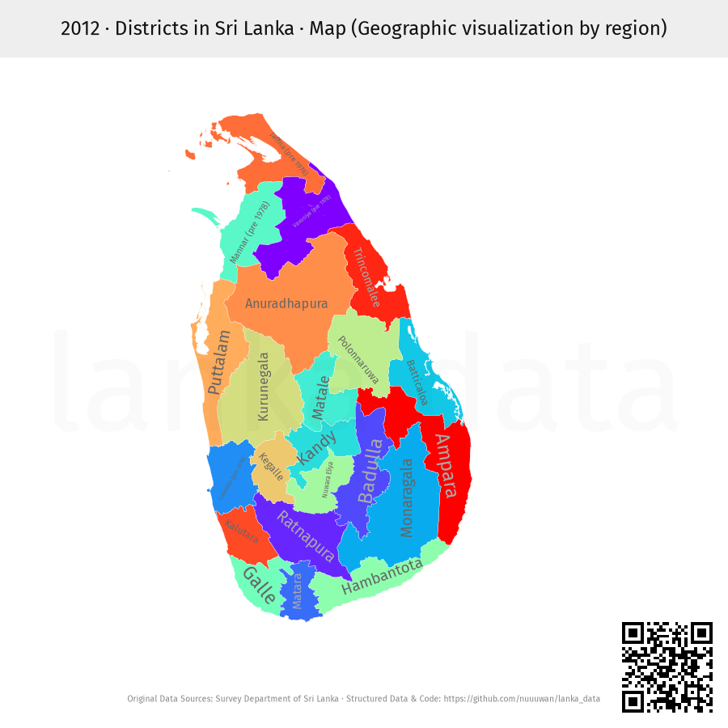

Source: [_output/Empty/2012/LK-pre1978:district/Map/Image.png](_output/Empty/2012/LK-pre1978:district/Map/Image.png)

#### 6.09) Empty/2012/LK-pre1984:district/Map

```bash
Empty/2012/LK-pre1984:district/Map
```

```json
{
    "command_str": "Empty/2012/LK-pre1984:district/Map",
    "result": {
        "image_path": "_output/Empty/2012/LK-pre1984:district/Map/Image.png"
    },
    "sources": [
        {
            "name": "Survey Department of Sri Lanka",
            "url": "https://survey.gov.lk/"
        }
    ],
    "query_time_ms": 0,
    "is_corrected": false,
    "corrections": []
}
```

Source: [_output/Empty/2012/LK-pre1984:district/Map/Output.json](_output/Empty/2012/LK-pre1984:district/Map/Output.json)

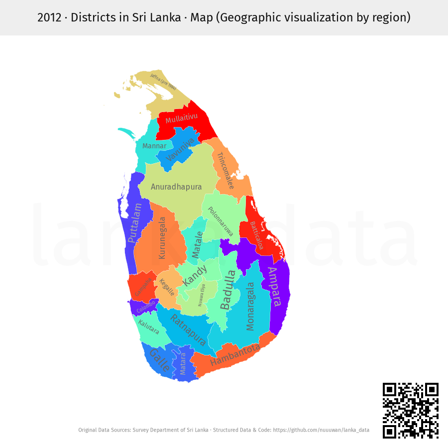

Source: [_output/Empty/2012/LK-pre1984:district/Map/Image.png](_output/Empty/2012/LK-pre1984:district/Map/Image.png)

#### 6.10) Empty/2012/LK:district/Map

```bash
Empty/2012/LK:district/Map
```

```json
{
    "command_str": "Empty/2012/LK:district/Map",
    "result": {
        "image_path": "_output/Empty/2012/LK:district/Map/Image.png"
    },
    "sources": [
        {
            "name": "Survey Department of Sri Lanka",
            "url": "https://survey.gov.lk/"
        }
    ],
    "query_time_ms": 0,
    "is_corrected": false,
    "corrections": []
}
```

Source: [_output/Empty/2012/LK:district/Map/Output.json](_output/Empty/2012/LK:district/Map/Output.json)


Source: [_output/Empty/2012/LK:district/Map/Image.png](_output/Empty/2012/LK:district/Map/Image.png)

#### 6.11) Ethnicity/2012/LK-23-pre2019:dsd/Map

```bash
Ethnicity/2012/LK-23-pre2019:dsd/Map
```

```json
{
    "command_str": "Ethnicity/2012/LK-23-pre2019:dsd/Map",
    "result": {
        "image_path": "_output/Ethnicity/2012/LK-23-pre2019:dsd/Map/Image.png"
    },
    "sources": [
        {
            "name": "Census of Population and Housing 2012",
            "url": "https://www.statistics.gov.lk/Resource/en/Population/CPH_2011/CPH_2012_5Per_Rpt.pdf"
        }
    ],
    "query_time_ms": 0,
    "is_corrected": false,
    "corrections": []
}
```

Source: [_output/Ethnicity/2012/LK-23-pre2019:dsd/Map/Output.json](_output/Ethnicity/2012/LK-23-pre2019:dsd/Map/Output.json)


Source: [_output/Ethnicity/2012/LK-23-pre2019:dsd/Map/Image.png](_output/Ethnicity/2012/LK-23-pre2019:dsd/Map/Image.png)

#### 6.12) Ethnicity/2024/LK-23-pre2019:dsd/Map

```bash
Ethnicity/2024/LK-23-pre2019:dsd/Map
```

```json
{
    "command_str": "Ethnicity/2024/LK-23-pre2019:dsd/Map",
    "result": {
        "image_path": "_output/Ethnicity/2024/LK-23-pre2019:dsd/Map/Image.png"
    },
    "sources": [
        {
            "name": "Census of Population and Housing 2024",
            "url": "https://www.statistics.gov.lk/Population/StaticalInformation/CPH2024"
        }
    ],
    "query_time_ms": 0,
    "is_corrected": false,
    "corrections": []
}
```

Source: [_output/Ethnicity/2024/LK-23-pre2019:dsd/Map/Output.json](_output/Ethnicity/2024/LK-23-pre2019:dsd/Map/Output.json)

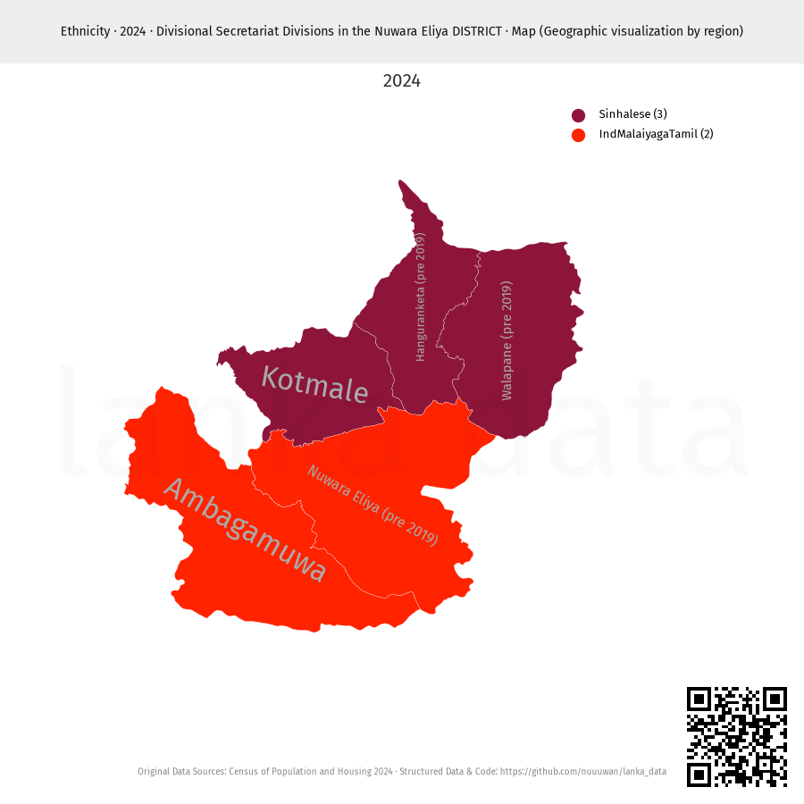

Source: [_output/Ethnicity/2024/LK-23-pre2019:dsd/Map/Image.png](_output/Ethnicity/2024/LK-23-pre2019:dsd/Map/Image.png)

#### 6.13) Ethnicity/2024/LK-23:dsd/Map

```bash
Ethnicity/2024/LK-23:dsd/Map
```

```json
{
    "command_str": "Ethnicity/2024/LK-23:dsd/Map",
    "result": {
        "image_path": "_output/Ethnicity/2024/LK-23:dsd/Map/Image.png"
    },
    "sources": [
        {
            "name": "Census of Population and Housing 2024",
            "url": "https://www.statistics.gov.lk/Population/StaticalInformation/CPH2024"
        }
    ],
    "query_time_ms": 0,
    "is_corrected": false,
    "corrections": []
}
```

Source: [_output/Ethnicity/2024/LK-23:dsd/Map/Output.json](_output/Ethnicity/2024/LK-23:dsd/Map/Output.json)

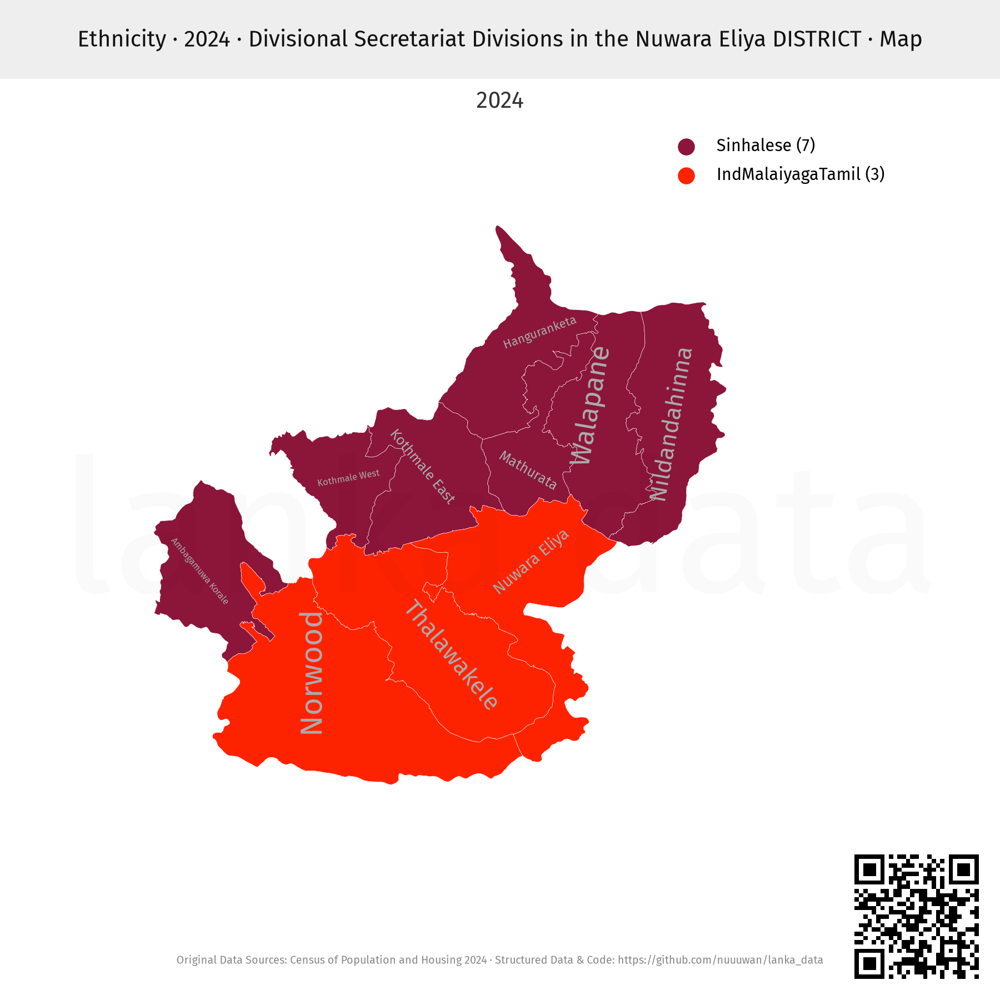

Source: [_output/Ethnicity/2024/LK-23:dsd/Map/Image.png](_output/Ethnicity/2024/LK-23:dsd/Map/Image.png)

#### 6.14) Empty/2024/LK:dsd/Map

```bash
Empty/2024/LK:dsd/Map
```

```json
{
    "command_str": "Empty/2024/LK:dsd/Map",
    "result": {
        "image_path": "_output/Empty/2024/LK:dsd/Map/Image.png"
    },
    "sources": [
        {
            "name": "Survey Department of Sri Lanka",
            "url": "https://survey.gov.lk/"
        }
    ],
    "query_time_ms": 0,
    "is_corrected": false,
    "corrections": []
}
```

Source: [_output/Empty/2024/LK:dsd/Map/Output.json](_output/Empty/2024/LK:dsd/Map/Output.json)

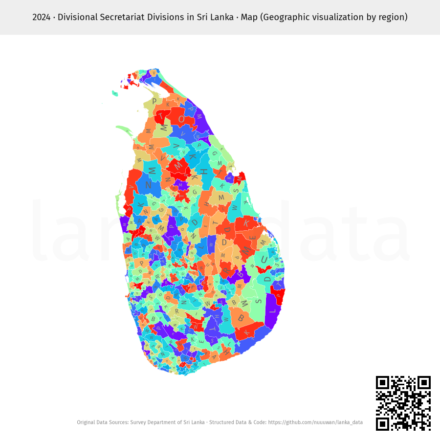

Source: [_output/Empty/2024/LK:dsd/Map/Image.png](_output/Empty/2024/LK:dsd/Map/Image.png)

#### 6.15) Empty/2024/LK:gnd/Map

```bash
Empty/2024/LK:gnd/Map
```

```json
{
    "command_str": "Empty/2024/LK:gnd/Map",
    "result": {
        "image_path": "_output/Empty/2024/LK:gnd/Map/Image.png"
    },
    "sources": [
        {
            "name": "Survey Department of Sri Lanka",
            "url": "https://survey.gov.lk/"
        }
    ],
    "query_time_ms": 0,
    "is_corrected": false,
    "corrections": []
}
```

Source: [_output/Empty/2024/LK:gnd/Map/Output.json](_output/Empty/2024/LK:gnd/Map/Output.json)


Source: [_output/Empty/2024/LK:gnd/Map/Image.png](_output/Empty/2024/LK:gnd/Map/Image.png)
