# Lanka Data

This repo implements a simple interface to query data about Sri Lanka.

## Data Sources

- [Census of Population and Housing 2012](https://www.statistics.gov.lk/Resource/en/Population/CPH_2011/CPH_2012_5Per_Rpt.pdf)
- [Department of Census and Statistics, Sri Lanka](https://www.statistics.gov.lk/)
- [Election Commission of Sri Lanka](https://www.elections.gov.lk)
- [lanka_data](https://github.com/nuuuwan/lanka_data/blob/main/README.md)

## Usage

### Run Code

```python
from lanka_data import Db


db = Db("<cmd>")
output = db.run()
print(output)

```

### workflows/run.py

```bash
python workflows/run.py <cmd>
```

### workflows/console.py

```bash
python workflows/console.py <cmd>

/Where/What/When/How

> /<cmd>
```

## Example cmds (`<cmd>`)

### 1) Help

#### 1.01) `*`

```json
{
    "result": {
        "what_to_whens": {
            "AgeGroup": [
                "2012",
                "2024"
            ],
            "Basic": [
                "2024"
            ],
            "Communication": [
                "2012"
            ],
            "ConstructionYear": [
                "2012"
            ],
            "CookingFuel": [
                "2024"
            ],
            "Economy": [
            ... // 125 lines ...
            "Water": [
                "2012",
                "2024"
            ]
        },
        "where": [
            "LK*",
            "EC-*",
            "LG-*"
        ],
        "how": [
            "JSON",
            "Map"
        ],
        "source": "lanka_data",
        "source_url": "https://github.com/nuuuwan/lanka_data/blob/main/README.md"
    },
    "query_time_ms": 0,
    "cache_hit": false
}
```

### 2) Selection

#### 2.01) `Basic/2024/LK/Map`

```json
{
    "result": {
        "title_items": [
            "Sri Lanka Country",
            "Basic Information",
            "2024",
            "Map"
        ],
        "image_path": "/tmp/lanka_data/images/48853a44.png",
        "source": "Department of Census and Statistics, Sri Lanka",
        "source_url": "https://www.statistics.gov.lk/"
    },
    "query_time_ms": 0,
    "cache_hit": false
}
```

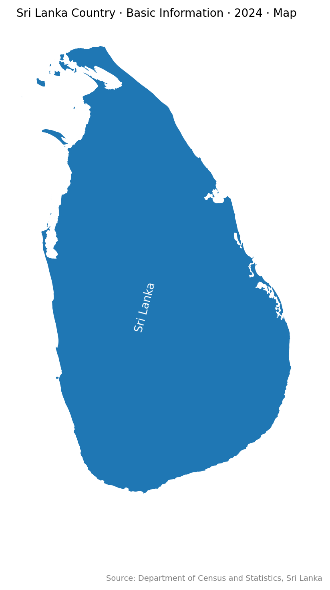

#### 2.02) `Basic/2024/LK-1:district/Map`

```json
{
    "result": {
        "title_items": [
            "Colombo, Gampaha, Kalutara Districts",
            "Basic Information",
            "2024",
            "Map"
        ],
        "image_path": "/tmp/lanka_data/images/d81caf73.png",
        "source": "Department of Census and Statistics, Sri Lanka",
        "source_url": "https://www.statistics.gov.lk/"
    },
    "query_time_ms": 0,
    "cache_hit": false
}
```

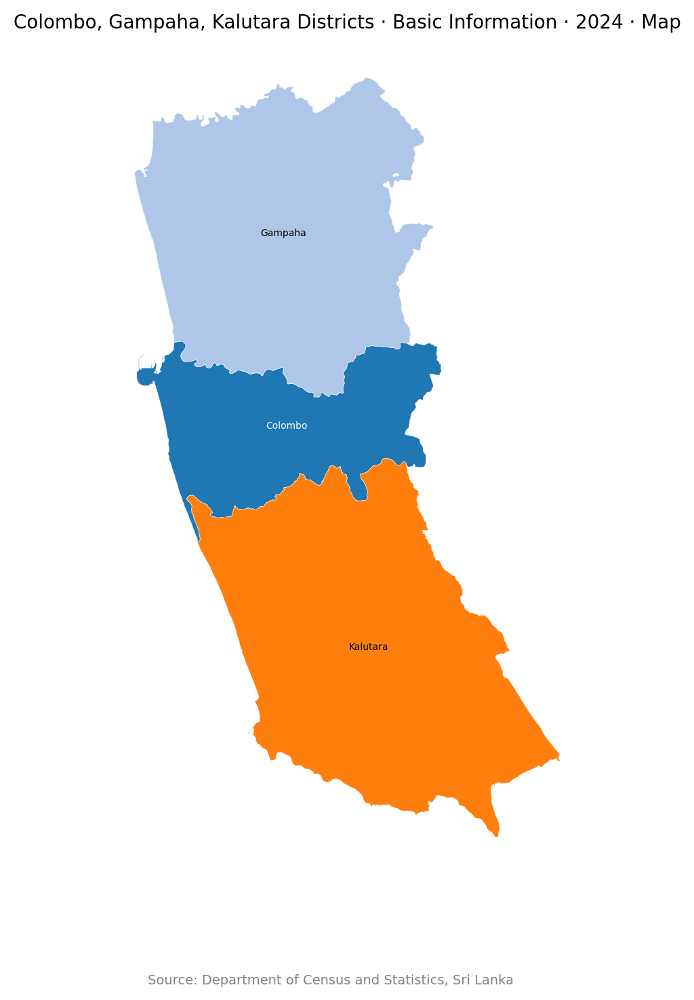

#### 2.03) `Basic/2024/LK-2,LK-3/Map`

```json
{
    "result": {
        "title_items": [
            "Central, Southern Provinces",
            "Basic Information",
            "2024",
            "Map"
        ],
        "image_path": "/tmp/lanka_data/images/0233d3fd.png",
        "source": "Department of Census and Statistics, Sri Lanka",
        "source_url": "https://www.statistics.gov.lk/"
    },
    "query_time_ms": 0,
    "cache_hit": false
}
```

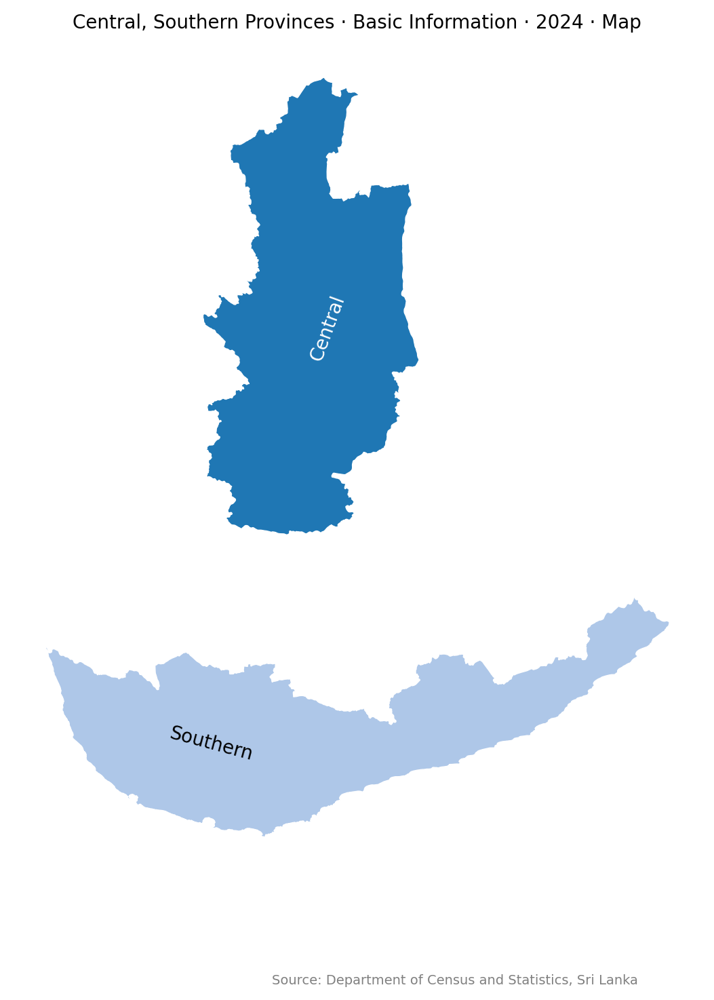

#### 2.04) `Basic/2024/LK-3,LK-9,LK-8/Map`

```json
{
    "result": {
        "title_items": [
            "Southern, Uva, Sabaragamuwa Provinces",
            "Basic Information",
            "2024",
            "Map"
        ],
        "image_path": "/tmp/lanka_data/images/4399d293.png",
        "source": "Department of Census and Statistics, Sri Lanka",
        "source_url": "https://www.statistics.gov.lk/"
    },
    "query_time_ms": 0,
    "cache_hit": false
}
```

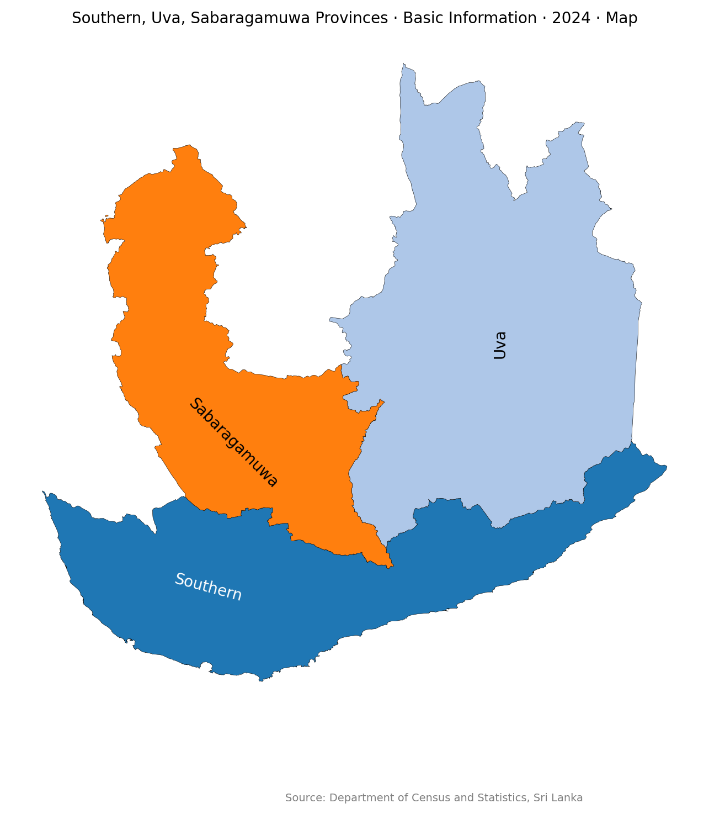

#### 2.05) `Basic/2024/LK-5...LK-8/Map`

```json
{
    "result": {
        "title_items": [
            "Eastern, North Western, North Central, Uva Provinces",
            "Basic Information",
            "2024",
            "Map"
        ],
        "image_path": "/tmp/lanka_data/images/58e0fbfb.png",
        "source": "Department of Census and Statistics, Sri Lanka",
        "source_url": "https://www.statistics.gov.lk/"
    },
    "query_time_ms": 0,
    "cache_hit": false
}
```

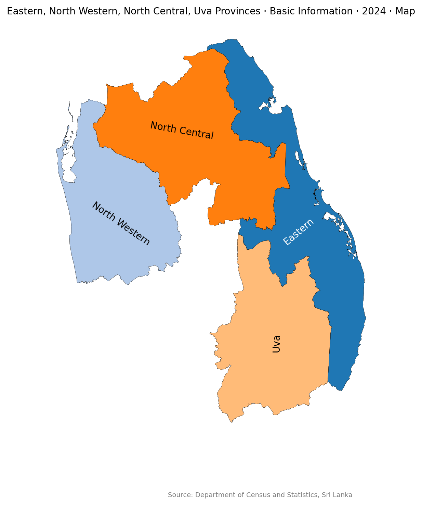

#### 2.06) `Basic/2024/LK-1127025@20/Map`

```json
{
    "result": {
        "title_items": [
            "718 Gnds",
            "Basic Information",
            "2024",
            "Map"
        ],
        "image_path": "/tmp/lanka_data/images/f57d8427.png",
        "source": "Department of Census and Statistics, Sri Lanka",
        "source_url": "https://www.statistics.gov.lk/"
    },
    "query_time_ms": 0,
    "cache_hit": false
}
```

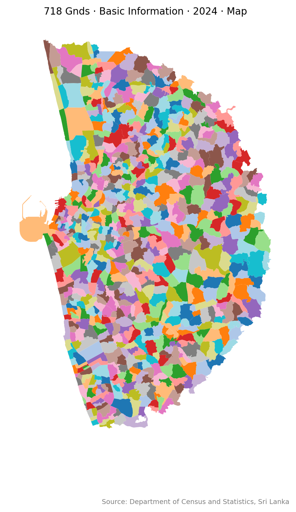

#### 2.07) `Basic/2024/LK-1103&EC-01B/Map`

```json
{
    "result": {
        "title_items": [
            "24 Gnds",
            "Basic Information",
            "2024",
            "Map"
        ],
        "image_path": "/tmp/lanka_data/images/15de4034.png",
        "source": "Department of Census and Statistics, Sri Lanka",
        "source_url": "https://www.statistics.gov.lk/"
    },
    "query_time_ms": 0,
    "cache_hit": false
}
```


### 3) Sub-Regions

#### 3.01) `Basic/2024/LK-61/Map`

```json
{
    "result": {
        "title_items": [
            "Kurunegala District",
            "Basic Information",
            "2024",
            "Map"
        ],
        "image_path": "/tmp/lanka_data/images/f3dd60f4.png",
        "source": "Department of Census and Statistics, Sri Lanka",
        "source_url": "https://www.statistics.gov.lk/"
    },
    "query_time_ms": 0,
    "cache_hit": false
}
```


#### 3.02) `Basic/2024/LK-71:dsd/Map`

```json
{
    "result": {
        "title_items": [
            "22 Dsds",
            "Basic Information",
            "2024",
            "Map"
        ],
        "image_path": "/tmp/lanka_data/images/98aa28e2.png",
        "source": "Department of Census and Statistics, Sri Lanka",
        "source_url": "https://www.statistics.gov.lk/"
    },
    "query_time_ms": 0,
    "cache_hit": false
}
```

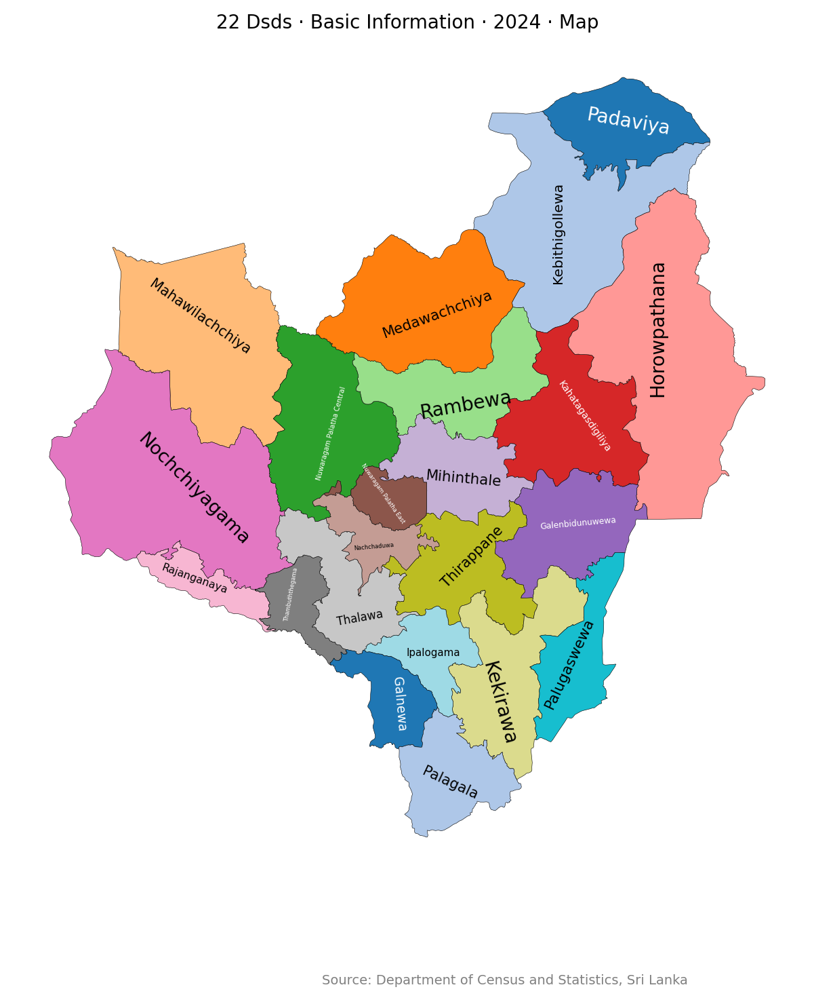

#### 3.03) `Basic/2024/LK-81:pd/Map`

```json
{
    "result": {
        "title_items": [
            "9 Pds",
            "Basic Information",
            "2024",
            "Map"
        ],
        "image_path": "/tmp/lanka_data/images/bfa7d721.png",
        "source": "Department of Census and Statistics, Sri Lanka",
        "source_url": "https://www.statistics.gov.lk/"
    },
    "query_time_ms": 0,
    "cache_hit": false
}
```


### 4) Religion

#### 4.01) `Religion/2012/LK-23:dsd/Map`

```json
{
    "result": {
        "title_items": [
            "Kotmale, Hanguranketa (pre 2019), Walapane (pre 2019), Nuwara Eliya (pre 2019), Ambagamuwa Dsds",
            "Religion",
            "2012",
            "Map"
        ],
        "image_path": "/tmp/lanka_data/images/a2b164d4.png",
        "source": "Department of Census and Statistics, Sri Lanka",
        "source_url": "https://www.statistics.gov.lk/"
    },
    "query_time_ms": 0,
    "cache_hit": false
}
```


#### 4.02) `Religion/2024/LK-23:dsd/Map`

```json
{
    "result": {
        "title_items": [
            "10 Dsds",
            "Religion",
            "2024",
            "Map"
        ],
        "image_path": "/tmp/lanka_data/images/3147011c.png",
        "source": "Department of Census and Statistics, Sri Lanka",
        "source_url": "https://www.statistics.gov.lk/"
    },
    "query_time_ms": 0,
    "cache_hit": false
}
```


#### 4.03) `Religion/2012/LK-1103:gnd/JSON`

```json
{
    "result": {
        "title_items": [
            "35 Gnds",
            "Religion",
            "2012",
            "JSON"
        ],
        "data_list": [
            {
                "region_id": "LK-1103005",
                "region_name": "Sammanthranapura",
                "region_type": "gnd",
                "history_year": "Current",
                "area_sqkm": 0.18,
                "center_lat": 6.977933,
                "center_lng": 79.878128,
                "num": " ",
                "country_id": "LK",
                "province_id": "LK-1",
                ... // 1185 lines ...
                "Roman Catholic": 42435,
                "Other Christian": 10715,
                "Other": 251
            },
            "total_value": 323223,
            "pct_values": {
                "Islam": 0.4177,
                "Hindu": 0.227,
                "Buddhist": 0.1901,
                "Roman Catholic": 0.1313,
                "Other Christian": 0.0332,
                "Other": 0.0008
            }
        },
        "source": "Census of Population and Housing 2012",
        "source_url": "https://www.statistics.gov.lk/Resource/en/Population/CPH_2011/CPH_2012_5Per_Rpt.pdf"
    },
    "query_time_ms": 0,
    "cache_hit": false
}
```

#### 4.04) `Religion/2012/LK-1127:gnd/Map`

```json
{
    "result": {
        "title_items": [
            "20 Gnds",
            "Religion",
            "2012",
            "Map"
        ],
        "image_path": "/tmp/lanka_data/images/0d265f1a.png",
        "source": "Department of Census and Statistics, Sri Lanka",
        "source_url": "https://www.statistics.gov.lk/"
    },
    "query_time_ms": 0,
    "cache_hit": false
}
```


#### 4.05) `Religion/2012/LK-41:dsd/Map:2nd`

```json
{
    "result": {
        "title_items": [
            "15 Dsds",
            "Religion",
            "2012",
            "Map (2nd)"
        ],
        "image_path": "/tmp/lanka_data/images/09cd4316.png",
        "source": "Department of Census and Statistics, Sri Lanka",
        "source_url": "https://www.statistics.gov.lk/"
    },
    "query_time_ms": 0,
    "cache_hit": false
}
```


#### 4.06) `Religion/2012/LK-51:dsd/Map:Buddhist`

```json
{
    "result": {
        "title_items": [
            "14 Dsds",
            "Religion",
            "2012",
            "Map (Buddhist)"
        ],
        "image_path": "/tmp/lanka_data/images/6b7887b6.png",
        "source": "Department of Census and Statistics, Sri Lanka",
        "source_url": "https://www.statistics.gov.lk/"
    },
    "query_time_ms": 0,
    "cache_hit": false
}
```

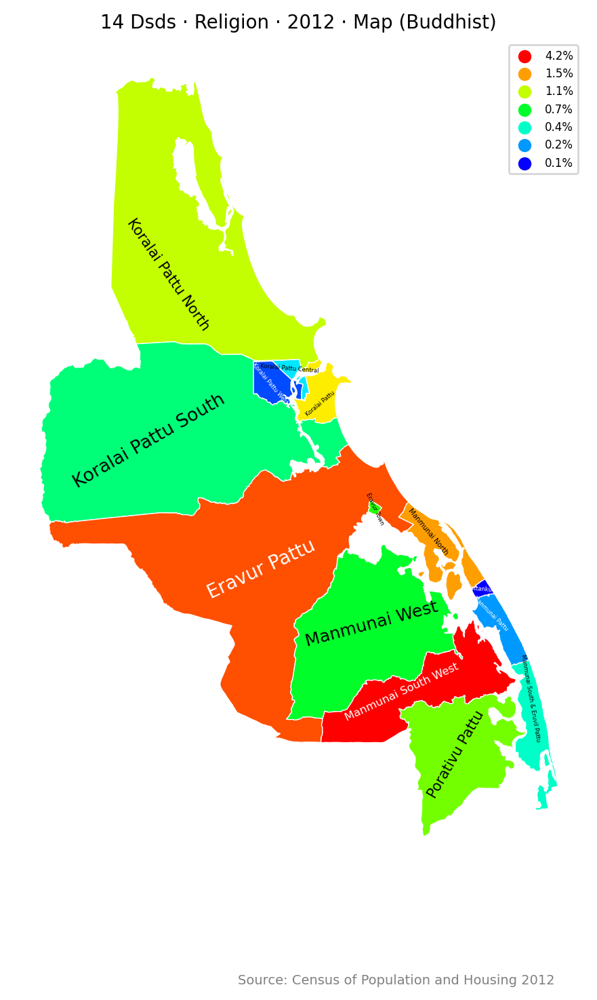

### 5) Ethnicity

#### 5.01) `Ethnicity/2024/LK-53:dsd/Map`

```json
{
    "result": {
        "title_items": [
            "11 Dsds",
            "Ethnicity",
            "2024",
            "Map"
        ],
        "image_path": "/tmp/lanka_data/images/8069c8aa.png",
        "source": "Department of Census and Statistics, Sri Lanka",
        "source_url": "https://www.statistics.gov.lk/"
    },
    "query_time_ms": 0,
    "cache_hit": false
}
```


#### 5.02) `Ethnicity/Latest/LK-2:dsd/Map`

```json
{
    "result": {
        "title_items": [
            "41 Dsds",
            "Ethnicity",
            "Latest",
            "Map"
        ],
        "image_path": "/tmp/lanka_data/images/bade8195.png",
        "source": "Department of Census and Statistics, Sri Lanka",
        "source_url": "https://www.statistics.gov.lk/"
    },
    "query_time_ms": 0,
    "cache_hit": false
}
```


#### 5.03) `Ethnicity/2024/LK-23:dsd/Map`

```json
{
    "result": {
        "title_items": [
            "10 Dsds",
            "Ethnicity",
            "2024",
            "Map"
        ],
        "image_path": "/tmp/lanka_data/images/d6f9c6e3.png",
        "source": "Department of Census and Statistics, Sri Lanka",
        "source_url": "https://www.statistics.gov.lk/"
    },
    "query_time_ms": 0,
    "cache_hit": false
}
```


### 6) Elections

#### 6.01) `Parliamentary/2024/LK/JSON`

```json
{
    "result": {
        "title_items": [
            "Sri Lanka Country",
            "Parliamentary",
            "2024",
            "JSON"
        ],
        "data_list": [
            {
                "region_id": "LK",
                "region_name": "Sri Lanka",
                "region_type": "country",
                "history_year": "Current",
                "area_sqkm": 65983.58,
                "center_lat": 7.621863,
                "center_lng": 80.698448,
                "summary": {
                    "electors": 17140354,
                    "polled": 11815246,
                    ... // 1337 lines ...
                "IND28-13": 0.0,
                "IND36-13": 0.0,
                "IND42-13": 0.0,
                "IND34-13": 0.0,
                "IND26-12": 0.0,
                "IND05-13": 0.0,
                "IND07-13": 0.0,
                "IND08-14": 0.0,
                "IND32-13": 0.0,
                "IND40-13": 0.0,
                "IND37-13": 0.0,
                "IND33-13": 0.0
            }
        },
        "source": "Election Commission of Sri Lanka",
        "source_url": "https://www.elections.gov.lk"
    },
    "query_time_ms": 0,
    "cache_hit": false
}
```

#### 6.02) `Presidential/Latest/LK-2:pd/Map`

```json
{
    "result": {
        "title_items": [
            "21 Pds",
            "Presidential",
            "Latest",
            "Map"
        ],
        "image_path": "/tmp/lanka_data/images/9aa59ecf.png",
        "source": "Department of Census and Statistics, Sri Lanka",
        "source_url": "https://www.statistics.gov.lk/"
    },
    "query_time_ms": 0,
    "cache_hit": false
}
```


### 7) History

#### 7.01) `Basic/2012/LK-pre1984:district/JSON`

```json
{
    "result": {
        "title_items": [
            "24 Districts",
            "Basic Information",
            "2012",
            "JSON"
        ],
        "data_list": [
            {
                "region_id": "LK-11",
                "region_name": "Colombo",
                "region_type": "district",
                "history_year": "1984",
                "area_sqkm": 688.17,
                "center_lat": 6.869822,
                "center_lng": 80.018487,
                "current_ids": [
                    "LK-11"
                ]
                ... // 265 lines ...
            },
            {
                "region_id": "LK-92",
                "region_name": "Kegalle",
                "region_type": "district",
                "history_year": "1984",
                "area_sqkm": 1657.73,
                "center_lat": 7.104294,
                "center_lng": 80.342772,
                "current_ids": [
                    "LK-92"
                ]
            }
        ],
        "source": "Department of Census and Statistics, Sri Lanka",
        "source_url": "https://www.statistics.gov.lk/"
    },
    "query_time_ms": 0,
    "cache_hit": false
}
```

#### 7.02) `Religion/2012/LK-pre1959:district/Map`

```json
{
    "result": {
        "title_items": [
            "20 Districts",
            "Religion",
            "2012",
            "Map"
        ],
        "image_path": "/tmp/lanka_data/images/4e535cda.png",
        "source": "Department of Census and Statistics, Sri Lanka",
        "source_url": "https://www.statistics.gov.lk/"
    },
    "query_time_ms": 0,
    "cache_hit": false
}
```


#### 7.03) `Basic/2012/LK-pre1845:province/Map`

```json
{
    "result": {
        "title_items": [
            "Western (pre 1845), Central (pre 1886), Southern (pre 1886), Northern (pre 1873), Eastern (pre 1873) Provinces",
            "Basic Information",
            "2012",
            "Map"
        ],
        "image_path": "/tmp/lanka_data/images/a85c9f82.png",
        "source": "Department of Census and Statistics, Sri Lanka",
        "source_url": "https://www.statistics.gov.lk/"
    },
    "query_time_ms": 0,
    "cache_hit": false
}
```


#### 7.04) `Ethnicity/2012/LK-23-pre2019:dsd/Map`

```json
{
    "result": {
        "title_items": [
            "Kotmale, Hanguranketa (pre 2019), Walapane (pre 2019), Nuwara Eliya (pre 2019), Ambagamuwa Dsds",
            "Ethnicity",
            "2012",
            "Map"
        ],
        "image_path": "/tmp/lanka_data/images/d9a29dc7.png",
        "source": "Department of Census and Statistics, Sri Lanka",
        "source_url": "https://www.statistics.gov.lk/"
    },
    "query_time_ms": 0,
    "cache_hit": false
}
```


#### 7.05) `Ethnicity/2024/LK-23-pre2019:dsd/Map`

```json
{
    "result": {
        "title_items": [
            "Kotmale, Hanguranketa (pre 2019), Walapane (pre 2019), Nuwara Eliya (pre 2019), Ambagamuwa Dsds",
            "Ethnicity",
            "2024",
            "Map"
        ],
        "image_path": "/tmp/lanka_data/images/a7f89f48.png",
        "source": "Department of Census and Statistics, Sri Lanka",
        "source_url": "https://www.statistics.gov.lk/"
    },
    "query_time_ms": 0,
    "cache_hit": false
}
```


### 8) Other-Whats

#### 8.01) `AgeGroup/2024/LK-1:district/Map`

```json
{
    "result": {
        "title_items": [
            "Colombo, Gampaha, Kalutara Districts",
            "AgeGroup",
            "2024",
            "Map"
        ],
        "image_path": "/tmp/lanka_data/images/834057ce.png",
        "source": "Department of Census and Statistics, Sri Lanka",
        "source_url": "https://www.statistics.gov.lk/"
    },
    "query_time_ms": 0,
    "cache_hit": false
}
```

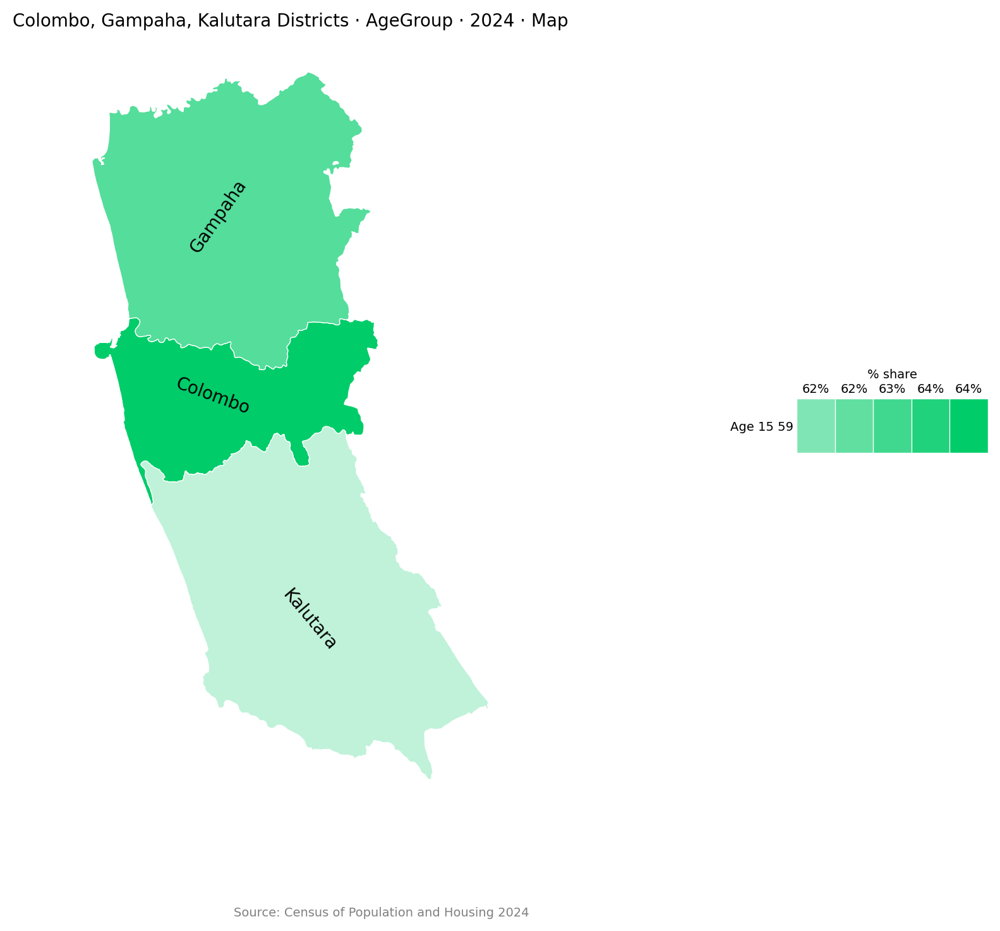

#### 8.02) `Communication/2012/LK-2:dsd/Map`

```json
{
    "result": {
        "title_items": [
            "36 Dsds",
            "Communication",
            "2012",
            "Map"
        ],
        "image_path": "/tmp/lanka_data/images/150c7b9f.png",
        "source": "Department of Census and Statistics, Sri Lanka",
        "source_url": "https://www.statistics.gov.lk/"
    },
    "query_time_ms": 0,
    "cache_hit": false
}
```

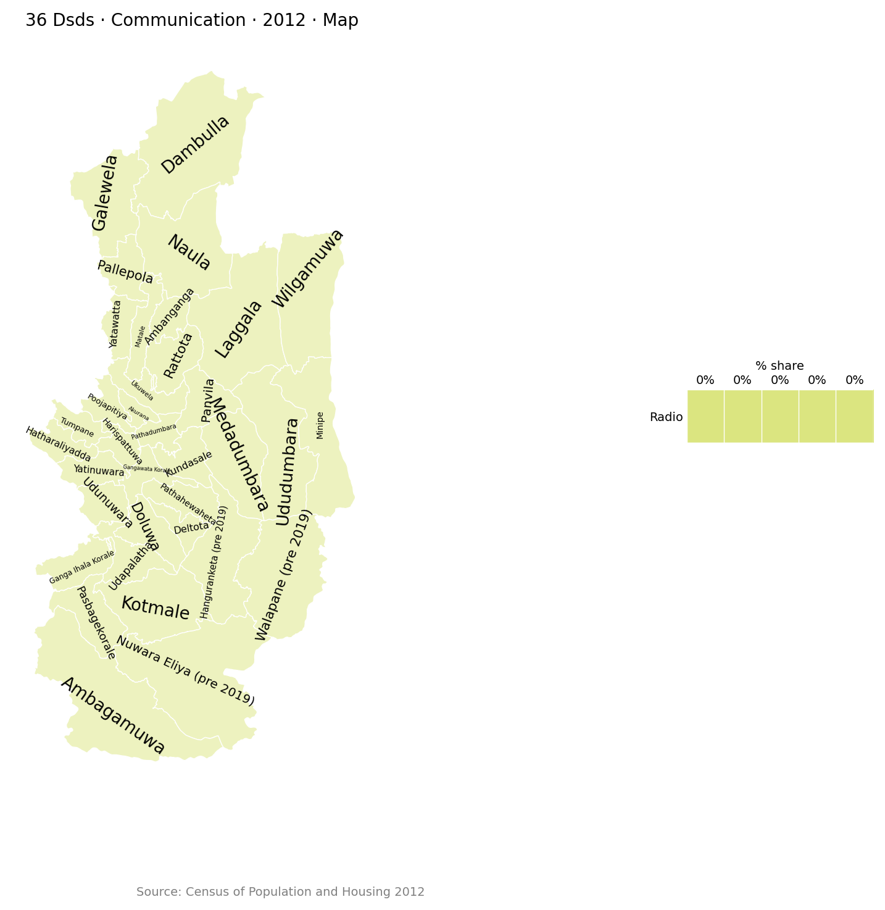

#### 8.03) `ConstructionYear/2012/LK-3:dsd/Map`

```json
{
    "result": {
        "title_items": [
            "47 Dsds",
            "ConstructionYear",
            "2012",
            "Map"
        ],
        "image_path": "/tmp/lanka_data/images/42b51986.png",
        "source": "Department of Census and Statistics, Sri Lanka",
        "source_url": "https://www.statistics.gov.lk/"
    },
    "query_time_ms": 0,
    "cache_hit": false
}
```

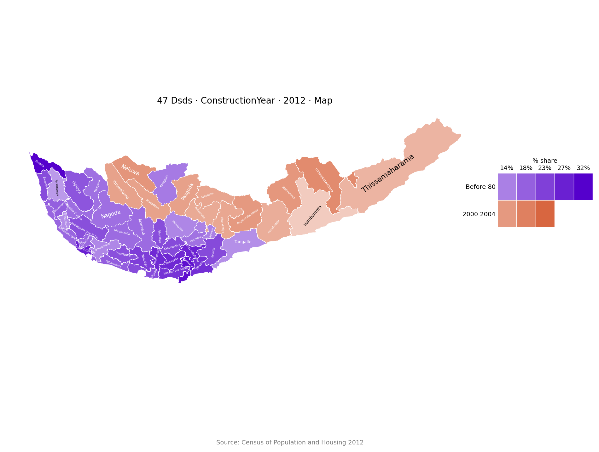

#### 8.04) `CookingFuel/2024/LK-4:dsd/Map`

```json
{
    "result": {
        "title_items": [
            "34 Dsds",
            "CookingFuel",
            "2024",
            "Map"
        ],
        "image_path": "/tmp/lanka_data/images/fdfb9a54.png",
        "source": "Department of Census and Statistics, Sri Lanka",
        "source_url": "https://www.statistics.gov.lk/"
    },
    "query_time_ms": 0,
    "cache_hit": false
}
```

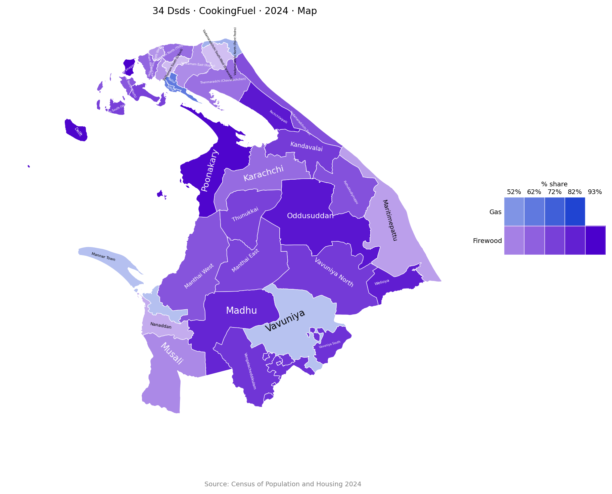

#### 8.05) `Economy/2012/LK-5:dsd/Map`

```json
{
    "result": {
        "title_items": [
            "45 Dsds",
            "Economy",
            "2012",
            "Map"
        ],
        "image_path": "/tmp/lanka_data/images/848930b3.png",
        "source": "Department of Census and Statistics, Sri Lanka",
        "source_url": "https://www.statistics.gov.lk/"
    },
    "query_time_ms": 0,
    "cache_hit": false
}
```

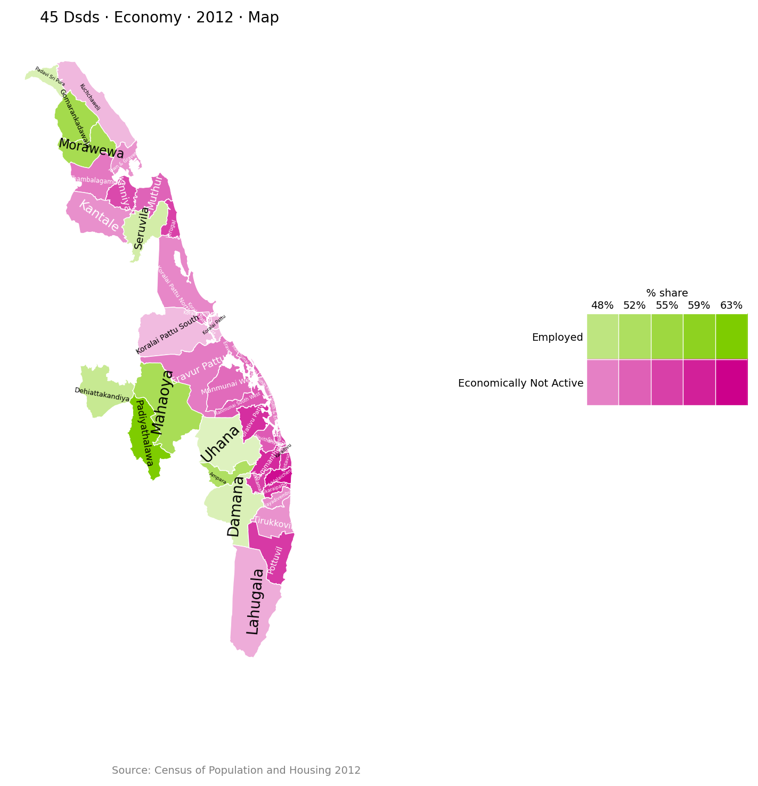

#### 8.06) `Education/2012/LK-6:dsd/Map`

```json
{
    "result": {
        "title_items": [
            "46 Dsds",
            "Education",
            "2012",
            "Map"
        ],
        "image_path": "/tmp/lanka_data/images/54683c50.png",
        "source": "Department of Census and Statistics, Sri Lanka",
        "source_url": "https://www.statistics.gov.lk/"
    },
    "query_time_ms": 0,
    "cache_hit": false
}
```

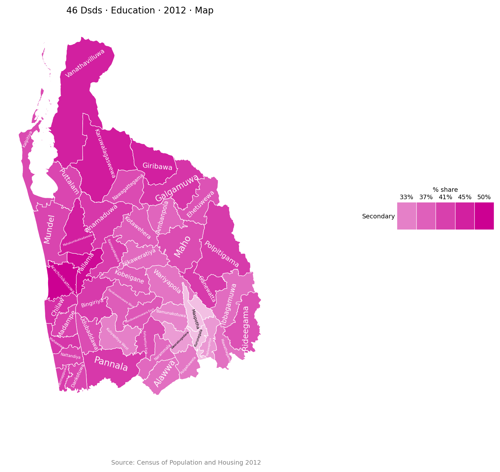

#### 8.07) `EnergyFuel/2024/LK-7:dsd/Map`

```json
{
    "result": {
        "title_items": [
            "29 Dsds",
            "EnergyFuel",
            "2024",
            "Map"
        ],
        "image_path": "/tmp/lanka_data/images/53075548.png",
        "source": "Department of Census and Statistics, Sri Lanka",
        "source_url": "https://www.statistics.gov.lk/"
    },
    "query_time_ms": 0,
    "cache_hit": false
}
```

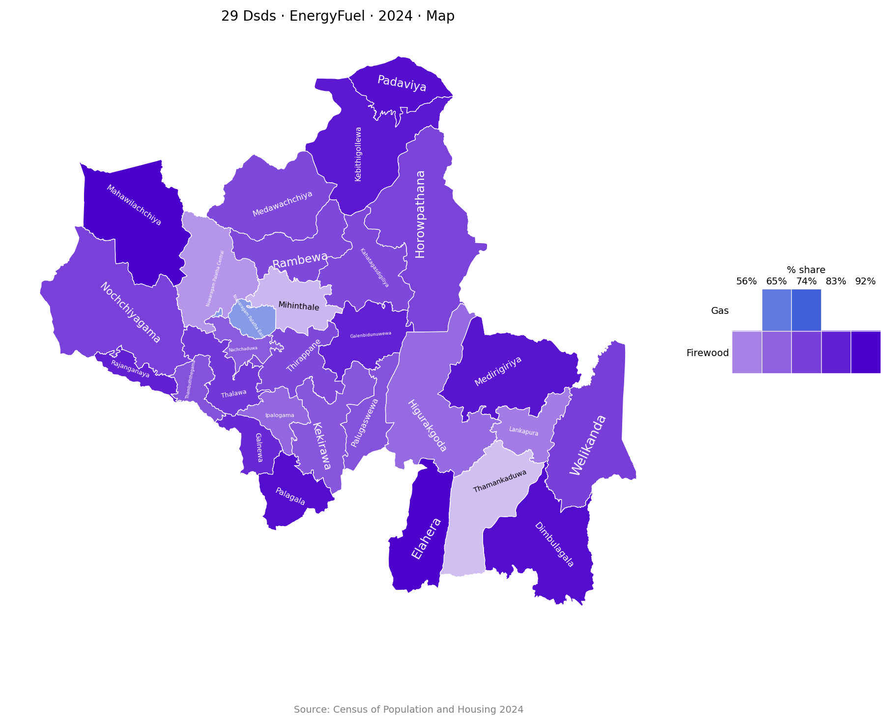

#### 8.08) `Floor/2024/LK-2,LK-3/Map`

```json
{
    "result": {
        "title_items": [
            "Central, Southern Provinces",
            "Floor",
            "2024",
            "Map"
        ],
        "image_path": "/tmp/lanka_data/images/415ee2d5.png",
        "source": "Department of Census and Statistics, Sri Lanka",
        "source_url": "https://www.statistics.gov.lk/"
    },
    "query_time_ms": 0,
    "cache_hit": false
}
```

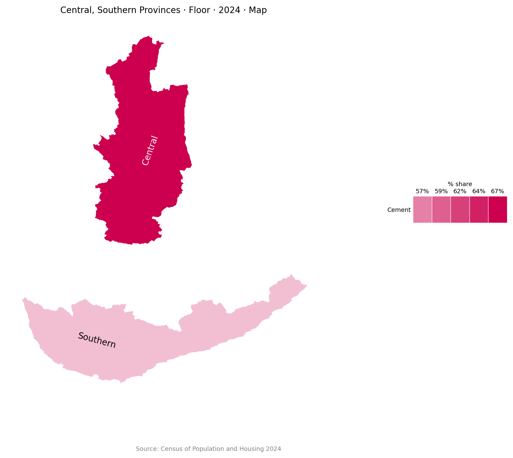

#### 8.09) `Fuel/2012/LK-5...LK-8/Map`

```json
{
    "result": {
        "title_items": [
            "Eastern, North Western, North Central, Uva Provinces",
            "Fuel",
            "2012",
            "Map"
        ],
        "image_path": "/tmp/lanka_data/images/9f684050.png",
        "source": "Department of Census and Statistics, Sri Lanka",
        "source_url": "https://www.statistics.gov.lk/"
    },
    "query_time_ms": 0,
    "cache_hit": false
}
```

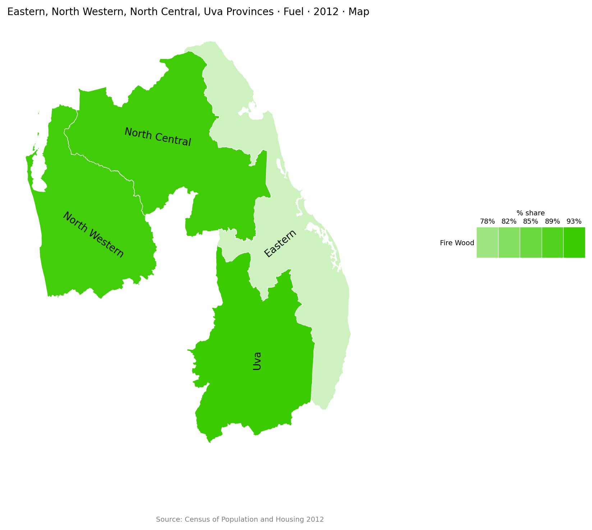

#### 8.10) `Gender/2024/LK-1127025@20/Map`

```json
{
    "result": {
        "title_items": [
            "718 Gnds",
            "Gender",
            "2024",
            "Map"
        ],
        "image_path": "/tmp/lanka_data/images/d2e11f6f.png",
        "source": "Department of Census and Statistics, Sri Lanka",
        "source_url": "https://www.statistics.gov.lk/"
    },
    "query_time_ms": 0,
    "cache_hit": false
}
```

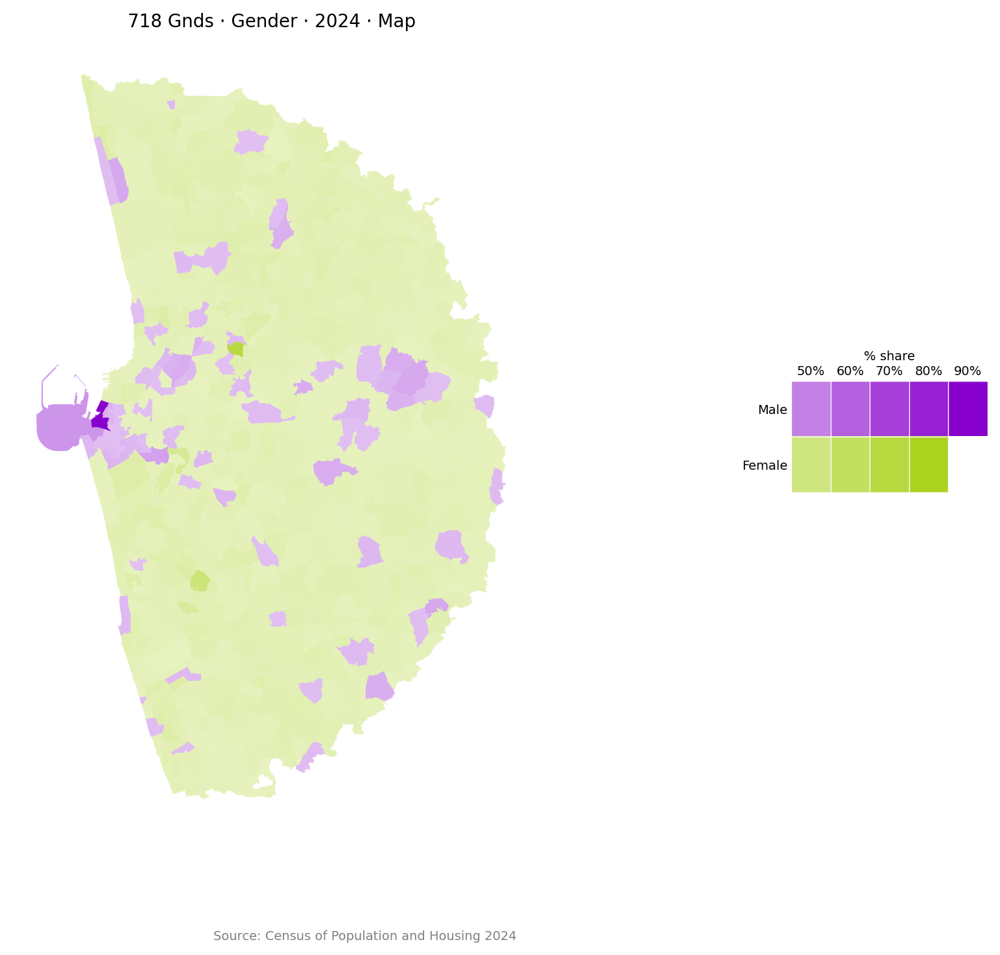

#### 8.11) `GenderAndAgeGroup/2024/LK-1103/Map`

```json
{
    "result": {
        "title_items": [
            "Colombo Dsd",
            "GenderAndAgeGroup",
            "2024",
            "Map"
        ],
        "image_path": "/tmp/lanka_data/images/ef2bf007.png",
        "source": "Department of Census and Statistics, Sri Lanka",
        "source_url": "https://www.statistics.gov.lk/"
    },
    "query_time_ms": 0,
    "cache_hit": false
}
```

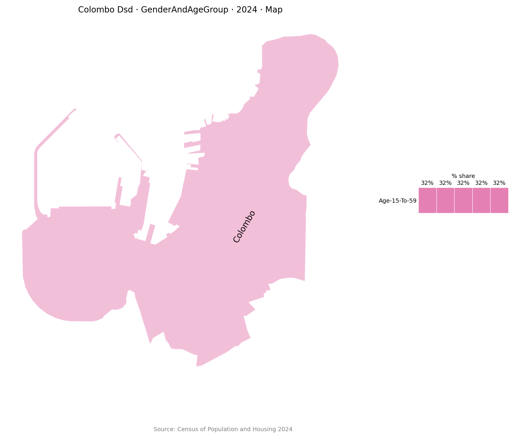

#### 8.12) `Households/2024/LK-71:dsd/Map`

```json
{
    "result": {
        "title_items": [
            "22 Dsds",
            "Households",
            "2024",
            "Map"
        ],
        "image_path": "/tmp/lanka_data/images/804f2d2f.png",
        "source": "Department of Census and Statistics, Sri Lanka",
        "source_url": "https://www.statistics.gov.lk/"
    },
    "query_time_ms": 0,
    "cache_hit": false
}
```

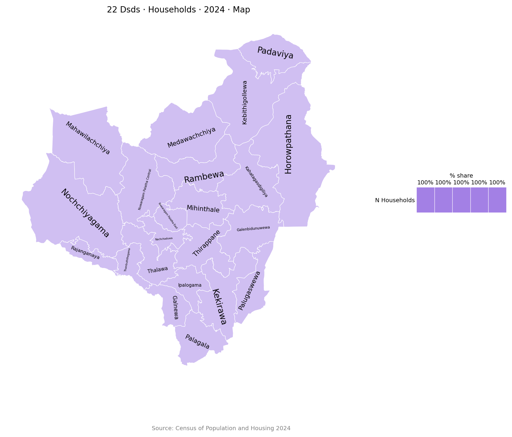

#### 8.13) `HouseholdsCookingFuel/2024/LK-81:pd/Map`

```json
{
    "result": {
        "title_items": [
            "9 Pds",
            "HouseholdsCookingFuel",
            "2024",
            "Map"
        ],
        "image_path": "/tmp/lanka_data/images/fe7e7210.png",
        "source": "Department of Census and Statistics, Sri Lanka",
        "source_url": "https://www.statistics.gov.lk/"
    },
    "query_time_ms": 0,
    "cache_hit": false
}
```

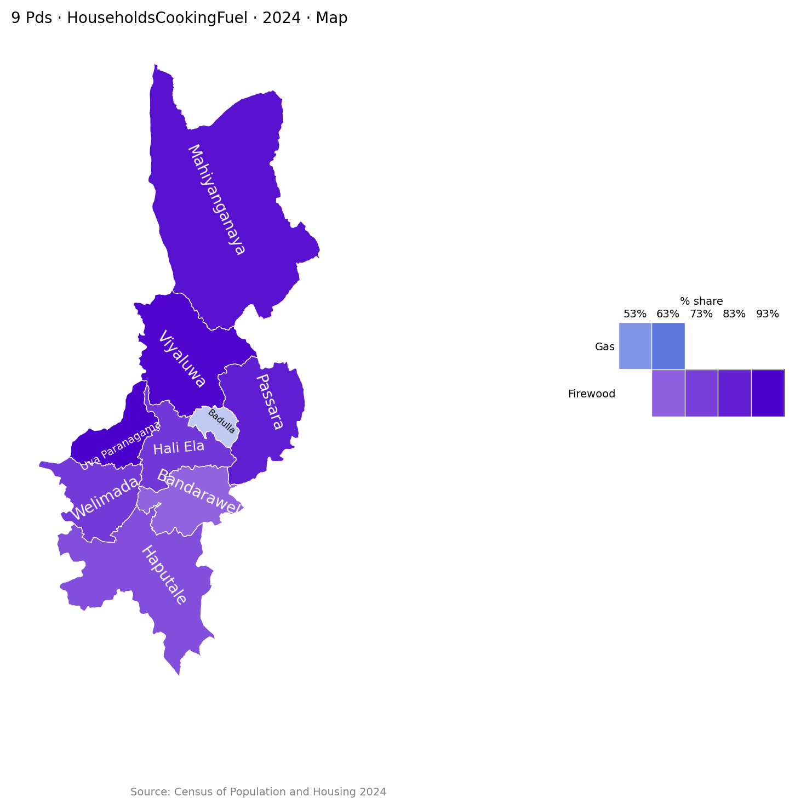

#### 8.14) `HouseholdsLighting/2024/LK-23:dsd/Map`

```json
{
    "result": {
        "title_items": [
            "10 Dsds",
            "HouseholdsLighting",
            "2024",
            "Map"
        ],
        "image_path": "/tmp/lanka_data/images/2846abfd.png",
        "source": "Department of Census and Statistics, Sri Lanka",
        "source_url": "https://www.statistics.gov.lk/"
    },
    "query_time_ms": 0,
    "cache_hit": false
}
```

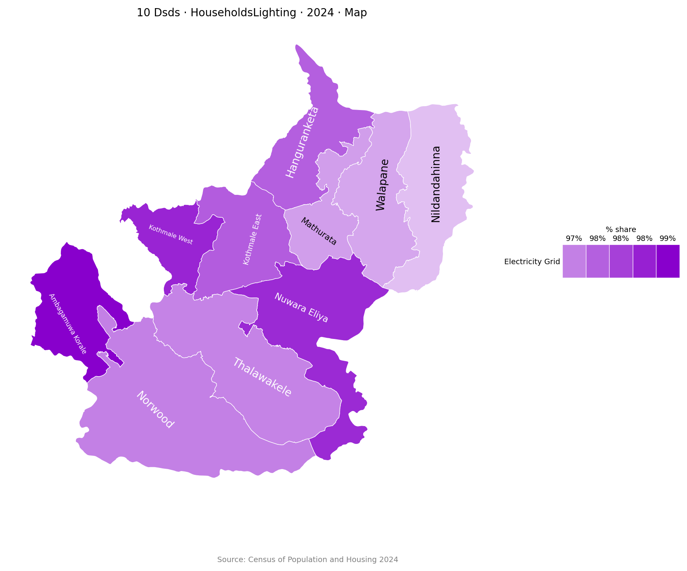

#### 8.15) `HouseholdsToilet/2024/LK-41:dsd/Map`

```json
{
    "result": {
        "title_items": [
            "15 Dsds",
            "HouseholdsToilet",
            "2024",
            "Map"
        ],
        "image_path": "/tmp/lanka_data/images/cba445e5.png",
        "source": "Department of Census and Statistics, Sri Lanka",
        "source_url": "https://www.statistics.gov.lk/"
    },
    "query_time_ms": 0,
    "cache_hit": false
}
```

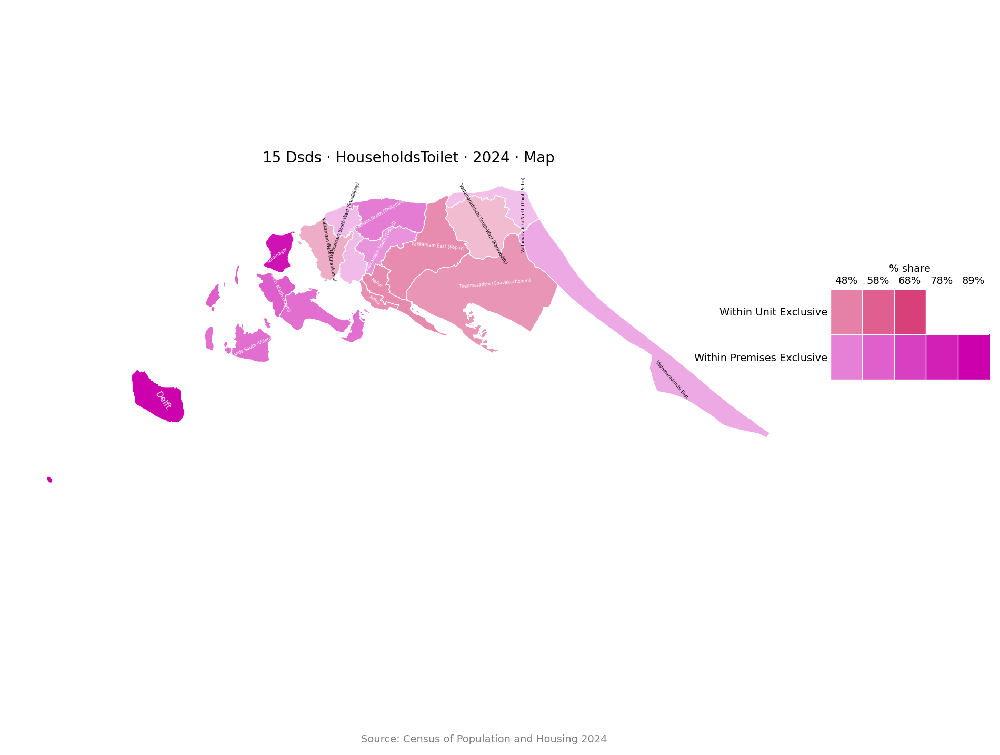

#### 8.16) `HouseholdsWater/2024/LK-51:dsd/Map`

```json
{
    "result": {
        "title_items": [
            "14 Dsds",
            "HouseholdsWater",
            "2024",
            "Map"
        ],
        "image_path": "/tmp/lanka_data/images/c68396f1.png",
        "source": "Department of Census and Statistics, Sri Lanka",
        "source_url": "https://www.statistics.gov.lk/"
    },
    "query_time_ms": 0,
    "cache_hit": false
}
```

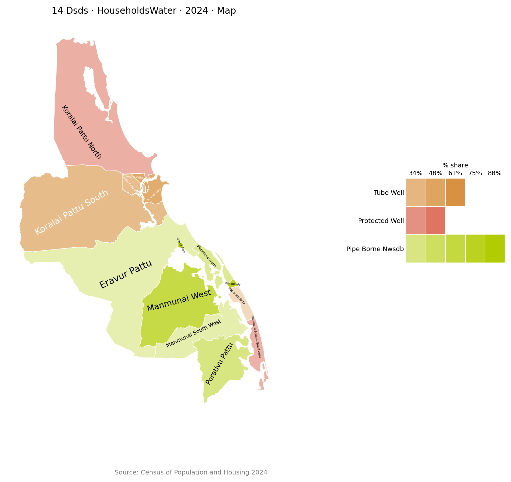

#### 8.17) `Lighting/2024/LK-61:dsd/Map`

```json
{
    "result": {
        "title_items": [
            "30 Dsds",
            "Lighting",
            "2024",
            "Map"
        ],
        "image_path": "/tmp/lanka_data/images/e8dadecc.png",
        "source": "Department of Census and Statistics, Sri Lanka",
        "source_url": "https://www.statistics.gov.lk/"
    },
    "query_time_ms": 0,
    "cache_hit": false
}
```

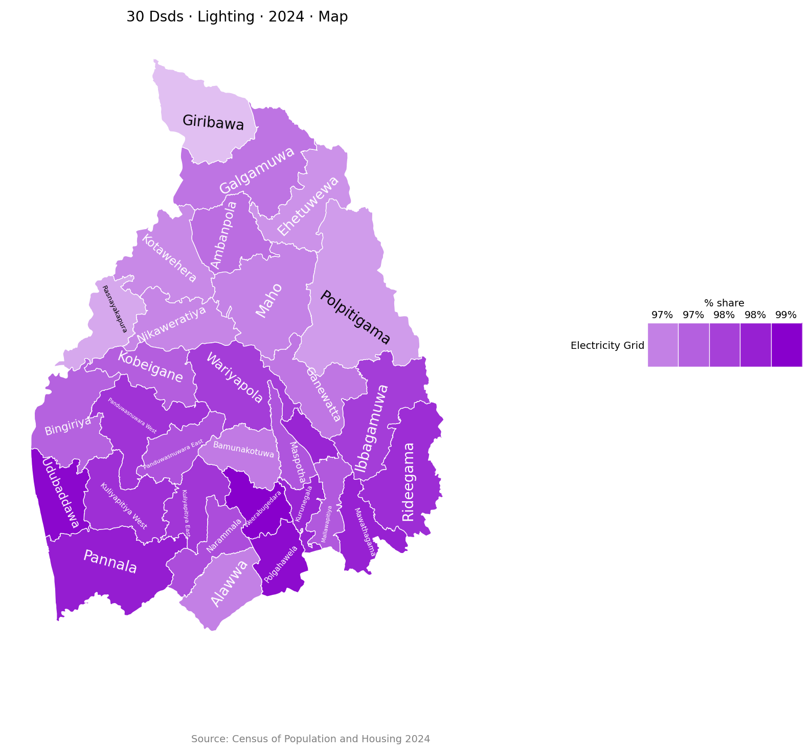

#### 8.18) `Local/2025/LK:district/Map`

```json
{
    "result": {
        "title_items": [
            "25 Districts",
            "Local",
            "2025",
            "Map"
        ],
        "image_path": "/tmp/lanka_data/images/4f4123dc.png",
        "source": "Department of Census and Statistics, Sri Lanka",
        "source_url": "https://www.statistics.gov.lk/"
    },
    "query_time_ms": 0,
    "cache_hit": false
}
```

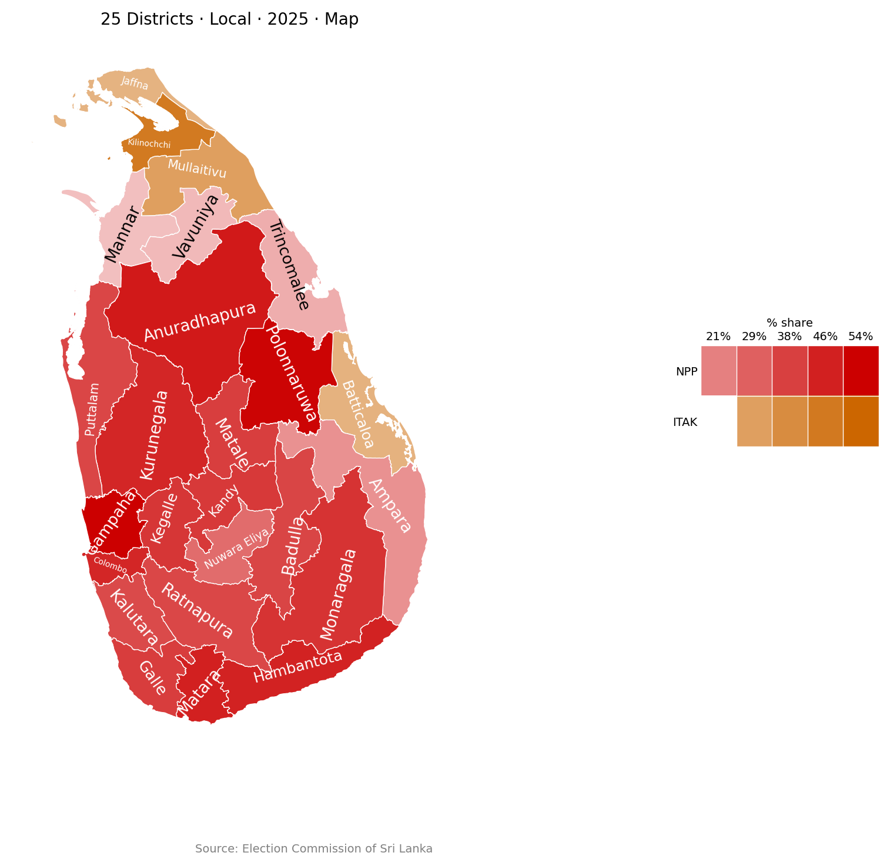

#### 8.19) `Marital/2012/LK-3,LK-9,LK-8/Map`

```json
{
    "result": {
        "title_items": [
            "Southern, Uva, Sabaragamuwa Provinces",
            "Marital",
            "2012",
            "Map"
        ],
        "image_path": "/tmp/lanka_data/images/b5352f71.png",
        "source": "Department of Census and Statistics, Sri Lanka",
        "source_url": "https://www.statistics.gov.lk/"
    },
    "query_time_ms": 0,
    "cache_hit": false
}
```

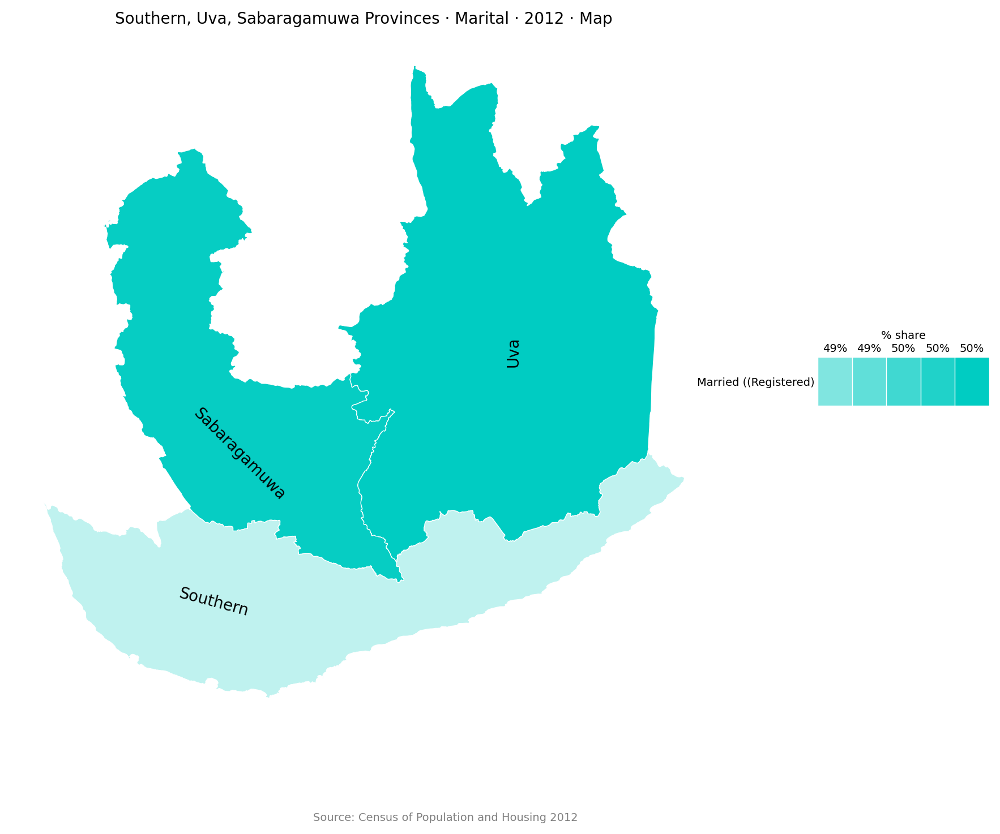

#### 8.20) `Occupancy/2012/LK-1127:gnd/Map`

```json
{
    "result": {
        "title_items": [
            "20 Gnds",
            "Occupancy",
            "2012",
            "Map"
        ],
        "image_path": "/tmp/lanka_data/images/1f6aaf88.png",
        "source": "Department of Census and Statistics, Sri Lanka",
        "source_url": "https://www.statistics.gov.lk/"
    },
    "query_time_ms": 0,
    "cache_hit": false
}
```

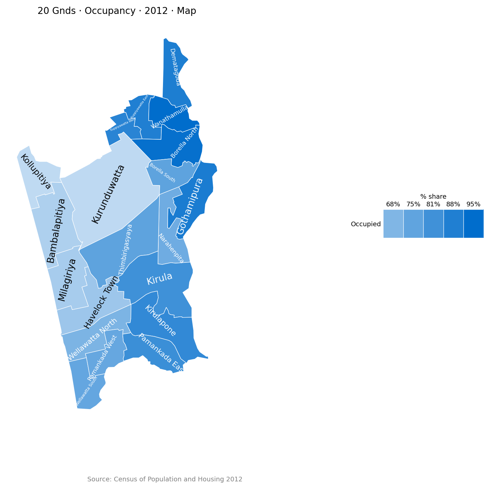

#### 8.21) `OccupiedUnits/2024/LK-2:district/Map`

```json
{
    "result": {
        "title_items": [
            "Kandy, Matale, Nuwara Eliya Districts",
            "OccupiedUnits",
            "2024",
            "Map"
        ],
        "image_path": "/tmp/lanka_data/images/1c305ccf.png",
        "source": "Department of Census and Statistics, Sri Lanka",
        "source_url": "https://www.statistics.gov.lk/"
    },
    "query_time_ms": 0,
    "cache_hit": false
}
```

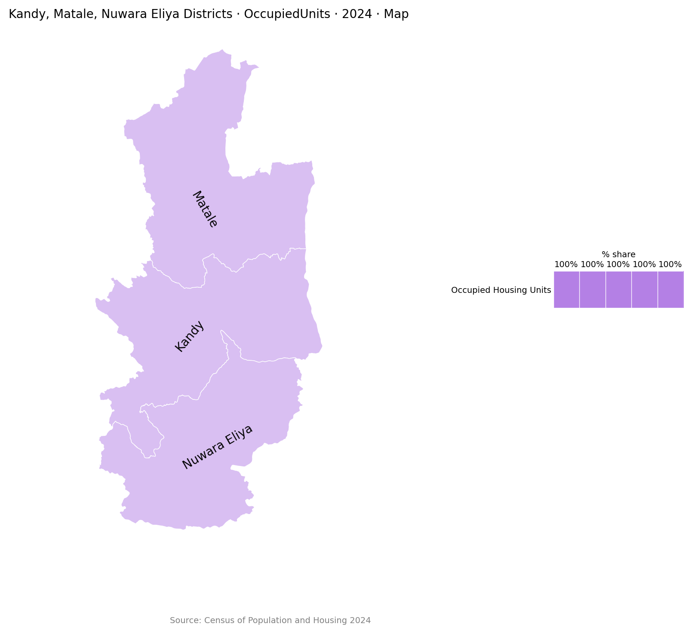

#### 8.22) `Ownership/2012/LK-53:dsd/Map`

```json
{
    "result": {
        "title_items": [
            "11 Dsds",
            "Ownership",
            "2012",
            "Map"
        ],
        "image_path": "/tmp/lanka_data/images/90e24c24.png",
        "source": "Department of Census and Statistics, Sri Lanka",
        "source_url": "https://www.statistics.gov.lk/"
    },
    "query_time_ms": 0,
    "cache_hit": false
}
```

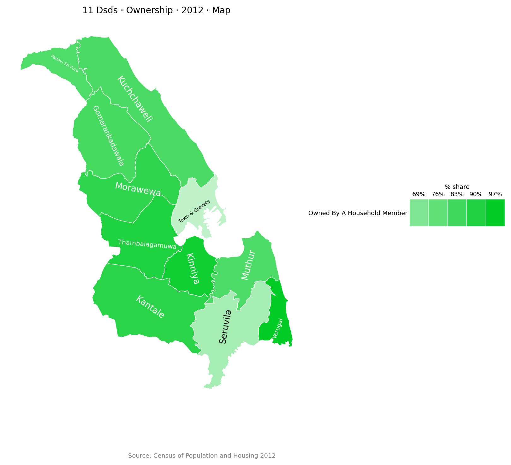

#### 8.23) `Persons/2012/LK-1103:gnd/Map`

```json
{
    "result": {
        "title_items": [
            "35 Gnds",
            "Persons",
            "2012",
            "Map"
        ],
        "image_path": "/tmp/lanka_data/images/c178877a.png",
        "source": "Department of Census and Statistics, Sri Lanka",
        "source_url": "https://www.statistics.gov.lk/"
    },
    "query_time_ms": 0,
    "cache_hit": false
}
```

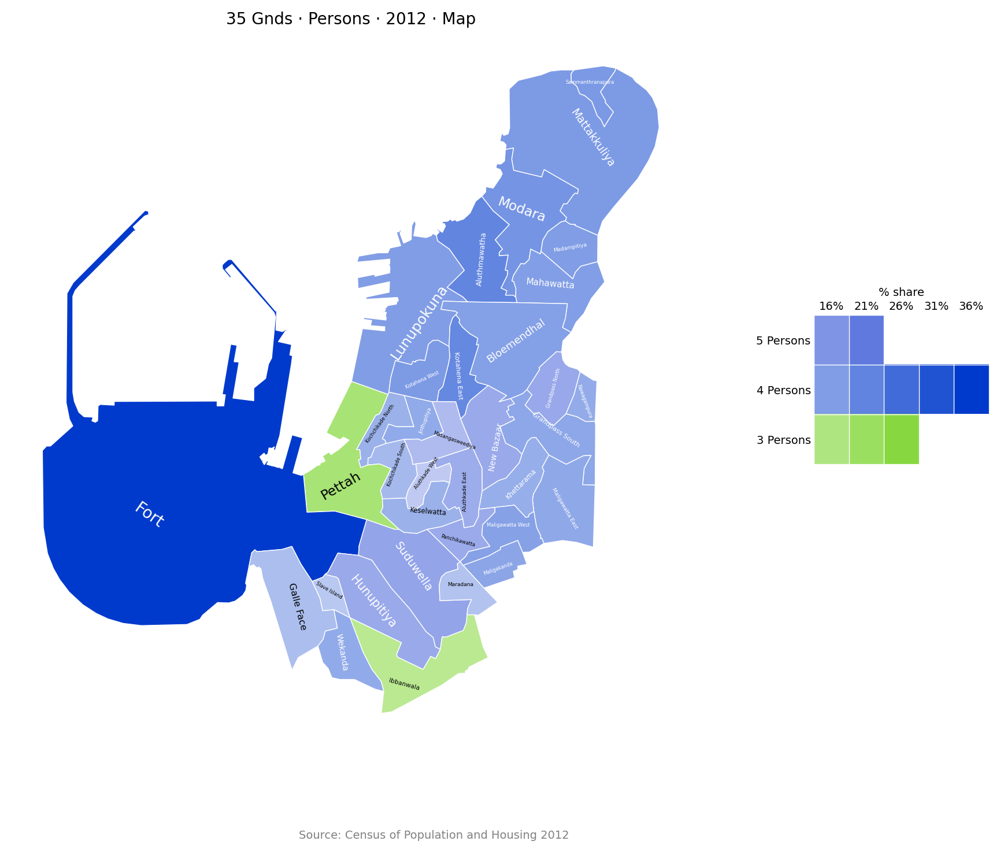

#### 8.24) `Quarters/2012/LK-4...LK-6/Map`

```json
{
    "result": {
        "title_items": [
            "Northern, Eastern, North Western Provinces",
            "Quarters",
            "2012",
            "Map"
        ],
        "image_path": "/tmp/lanka_data/images/2cad1482.png",
        "source": "Department of Census and Statistics, Sri Lanka",
        "source_url": "https://www.statistics.gov.lk/"
    },
    "query_time_ms": 0,
    "cache_hit": false
}
```

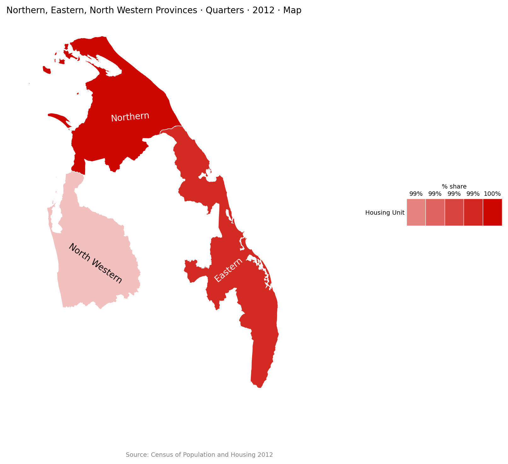

#### 8.25) `RelationshipToHead/2012/LK-23:dsd/Map`

```json
{
    "result": {
        "title_items": [
            "Kotmale, Hanguranketa (pre 2019), Walapane (pre 2019), Nuwara Eliya (pre 2019), Ambagamuwa Dsds",
            "RelationshipToHead",
            "2012",
            "Map"
        ],
        "image_path": "/tmp/lanka_data/images/cc5bb087.png",
        "source": "Department of Census and Statistics, Sri Lanka",
        "source_url": "https://www.statistics.gov.lk/"
    },
    "query_time_ms": 0,
    "cache_hit": false
}
```

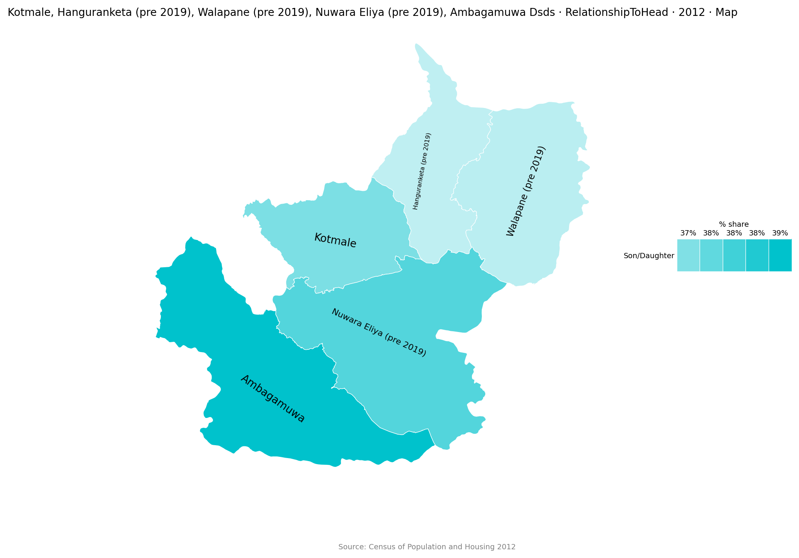

#### 8.26) `Roof/2024/LK-9:dsd/Map`

```json
{
    "result": {
        "title_items": [
            "29 Dsds",
            "Roof",
            "2024",
            "Map"
        ],
        "image_path": "/tmp/lanka_data/images/bd9cf7c8.png",
        "source": "Department of Census and Statistics, Sri Lanka",
        "source_url": "https://www.statistics.gov.lk/"
    },
    "query_time_ms": 0,
    "cache_hit": false
}
```

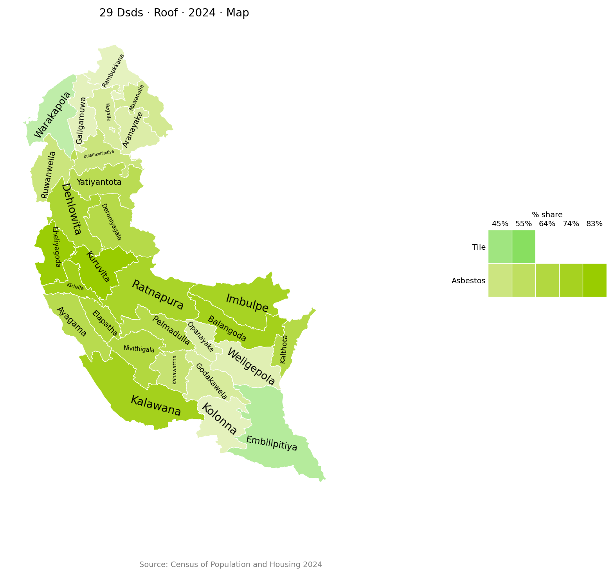

#### 8.27) `Rooms/2012/LK-2:pd/Map`

```json
{
    "result": {
        "title_items": [
            "21 Pds",
            "Rooms",
            "2012",
            "Map"
        ],
        "image_path": "/tmp/lanka_data/images/df465f56.png",
        "source": "Department of Census and Statistics, Sri Lanka",
        "source_url": "https://www.statistics.gov.lk/"
    },
    "query_time_ms": 0,
    "cache_hit": false
}
```

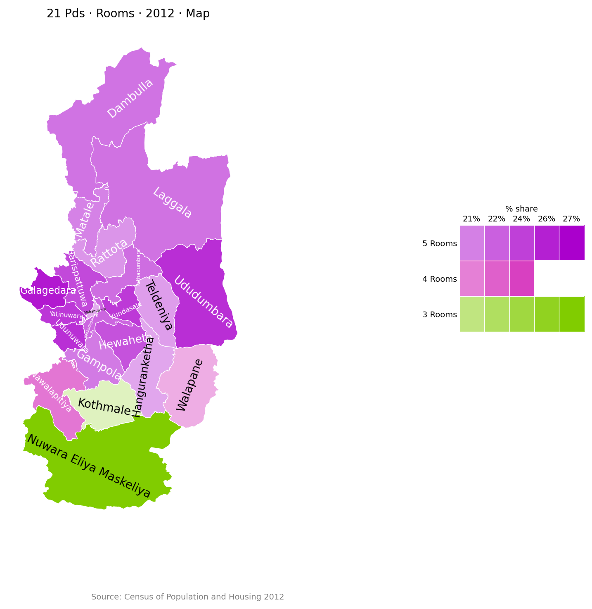

#### 8.28) `Structure/2024/LK-3:district/Map`

```json
{
    "result": {
        "title_items": [
            "Galle, Matara, Hambantota Districts",
            "Structure",
            "2024",
            "Map"
        ],
        "image_path": "/tmp/lanka_data/images/492b8ace.png",
        "source": "Department of Census and Statistics, Sri Lanka",
        "source_url": "https://www.statistics.gov.lk/"
    },
    "query_time_ms": 0,
    "cache_hit": false
}
```

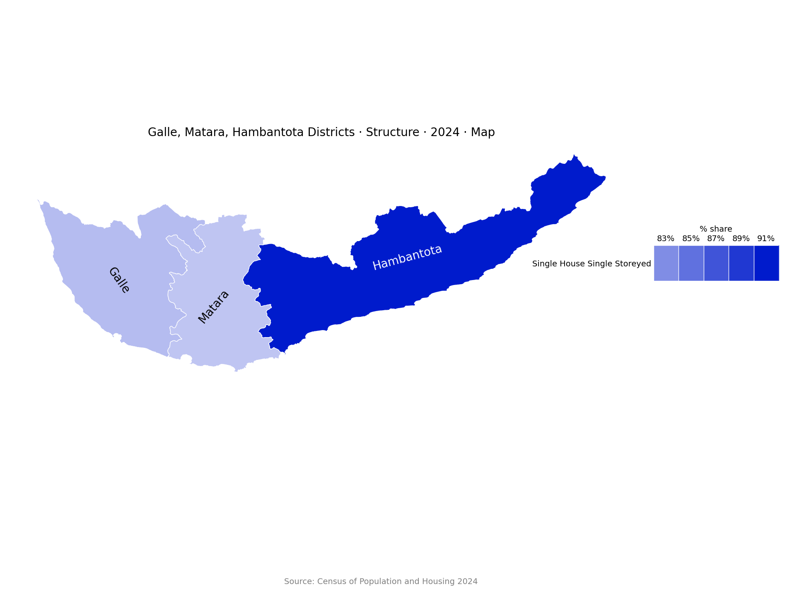

#### 8.29) `Toilet/2024/LK-5:dsd/Map`

```json
{
    "result": {
        "title_items": [
            "45 Dsds",
            "Toilet",
            "2024",
            "Map"
        ],
        "image_path": "/tmp/lanka_data/images/78bd7d5f.png",
        "source": "Department of Census and Statistics, Sri Lanka",
        "source_url": "https://www.statistics.gov.lk/"
    },
    "query_time_ms": 0,
    "cache_hit": false
}
```

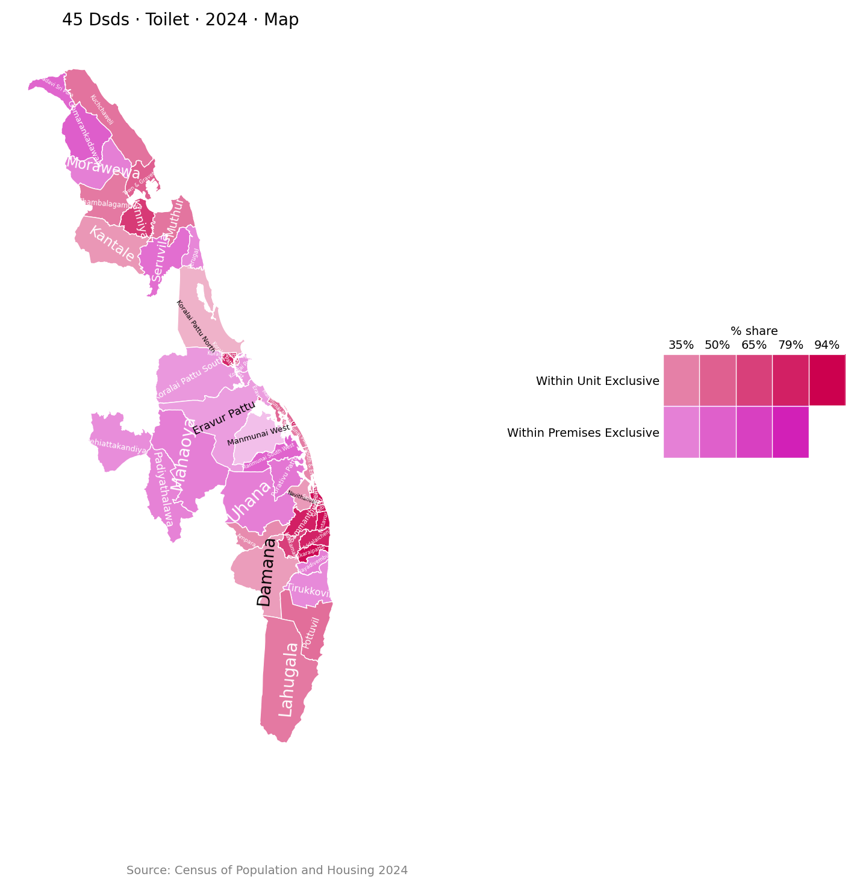

#### 8.30) `Unit/2012/LK-6:dsd/Map`

```json
{
    "result": {
        "title_items": [
            "46 Dsds",
            "Unit",
            "2012",
            "Map"
        ],
        "image_path": "/tmp/lanka_data/images/790f7553.png",
        "source": "Department of Census and Statistics, Sri Lanka",
        "source_url": "https://www.statistics.gov.lk/"
    },
    "query_time_ms": 0,
    "cache_hit": false
}
```

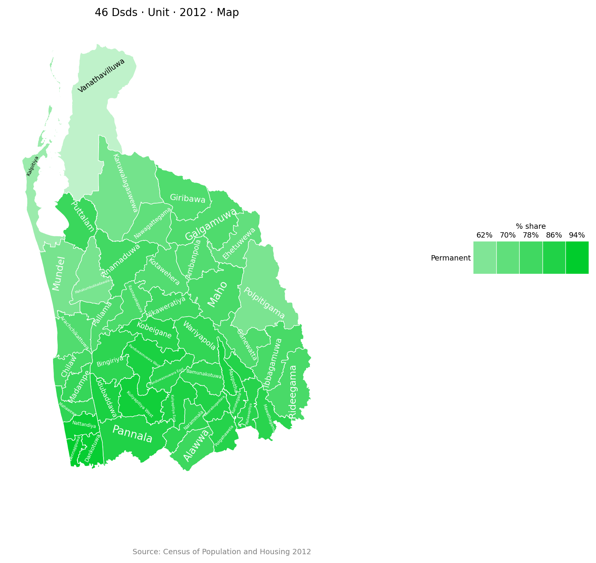

#### 8.31) `Wall/2012/LK-7:dsd/Map`

```json
{
    "result": {
        "title_items": [
            "29 Dsds",
            "Wall",
            "2012",
            "Map"
        ],
        "image_path": "/tmp/lanka_data/images/268040e0.png",
        "source": "Department of Census and Statistics, Sri Lanka",
        "source_url": "https://www.statistics.gov.lk/"
    },
    "query_time_ms": 0,
    "cache_hit": false
}
```

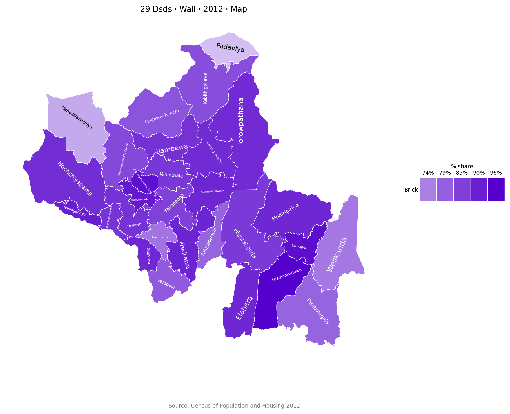

#### 8.32) `Walls/2024/LK-8:dsd/Map`

```json
{
    "result": {
        "title_items": [
            "26 Dsds",
            "Walls",
            "2024",
            "Map"
        ],
        "image_path": "/tmp/lanka_data/images/1b82d282.png",
        "source": "Department of Census and Statistics, Sri Lanka",
        "source_url": "https://www.statistics.gov.lk/"
    },
    "query_time_ms": 0,
    "cache_hit": false
}
```

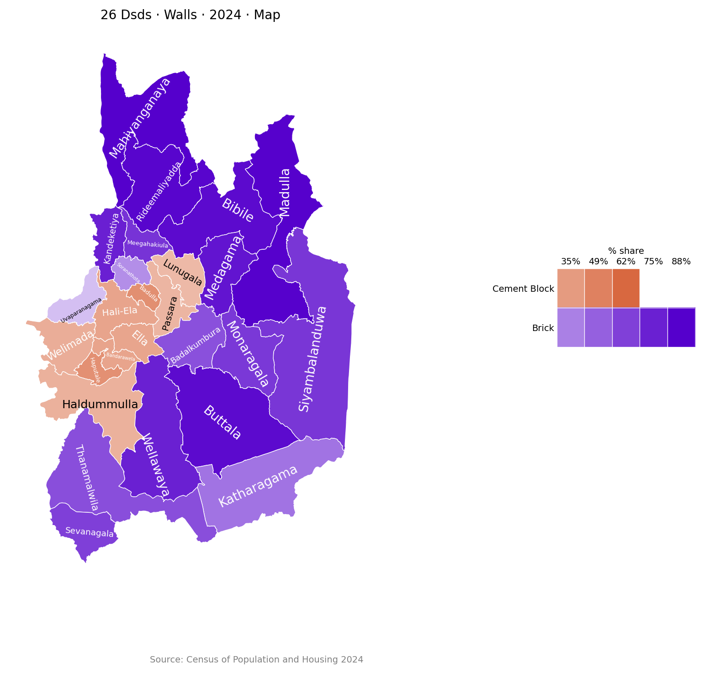

#### 8.33) `Waste/2012/LK-1:dsd/Map`

```json
{
    "result": {
        "title_items": [
            "40 Dsds",
            "Waste",
            "2012",
            "Map"
        ],
        "image_path": "/tmp/lanka_data/images/d7929424.png",
        "source": "Department of Census and Statistics, Sri Lanka",
        "source_url": "https://www.statistics.gov.lk/"
    },
    "query_time_ms": 0,
    "cache_hit": false
}
```

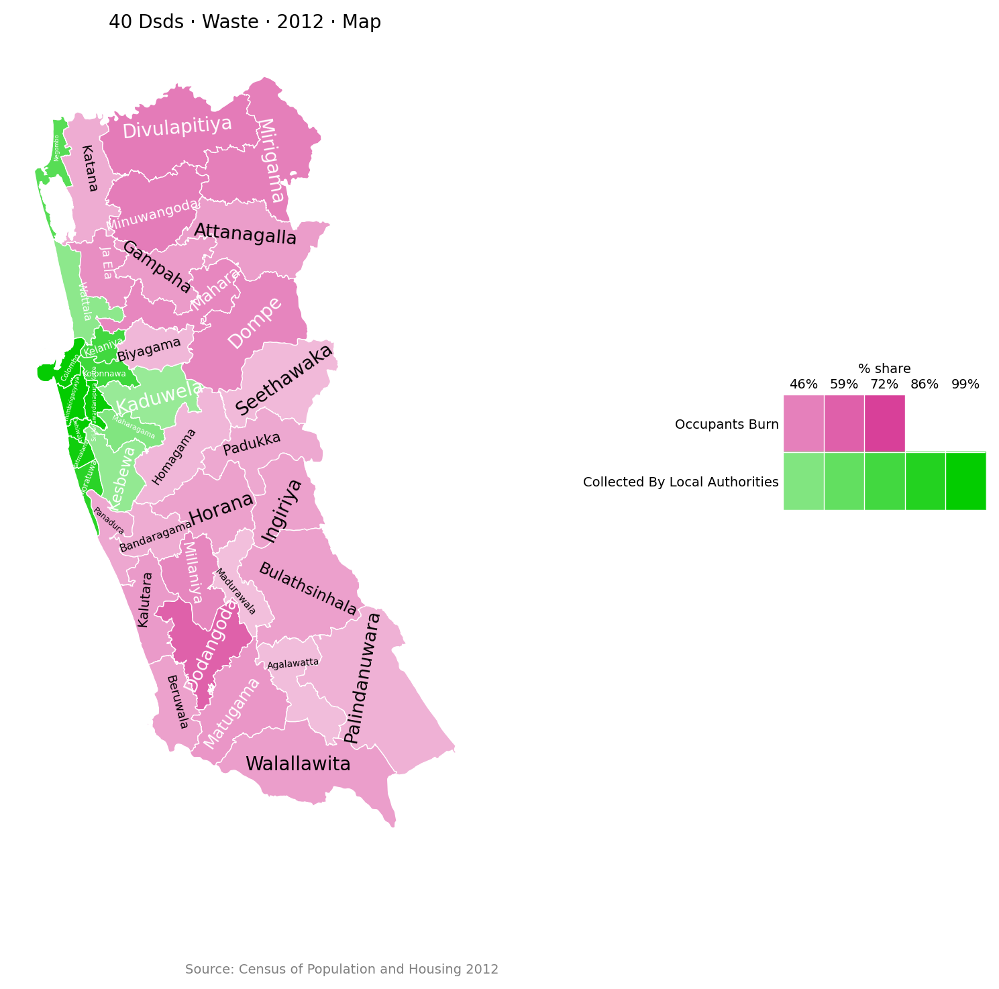

#### 8.34) `Water/2024/LK-2,LK-4/Map`

```json
{
    "result": {
        "title_items": [
            "Central, Northern Provinces",
            "Water",
            "2024",
            "Map"
        ],
        "image_path": "/tmp/lanka_data/images/b5745e1b.png",
        "source": "Department of Census and Statistics, Sri Lanka",
        "source_url": "https://www.statistics.gov.lk/"
    },
    "query_time_ms": 0,
    "cache_hit": false
}
```

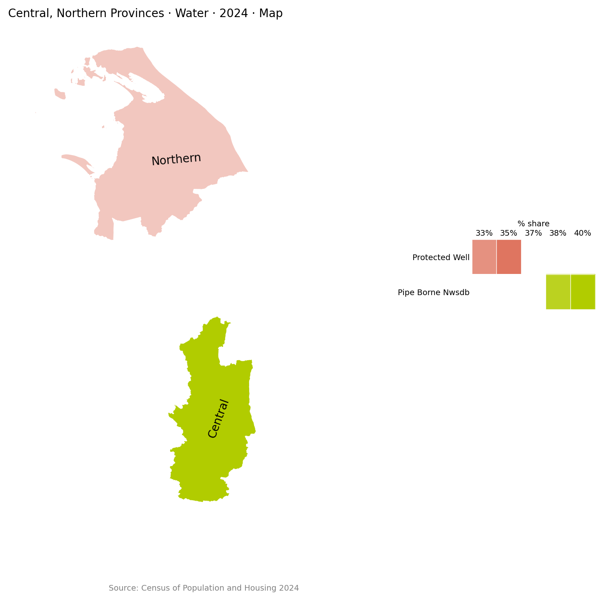


[](https://opensource.org/licenses/MIT)
