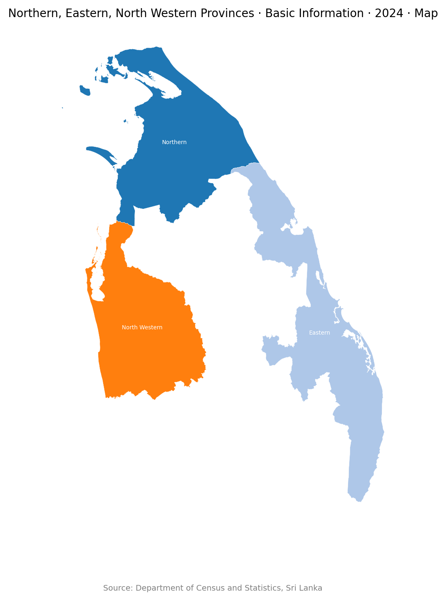
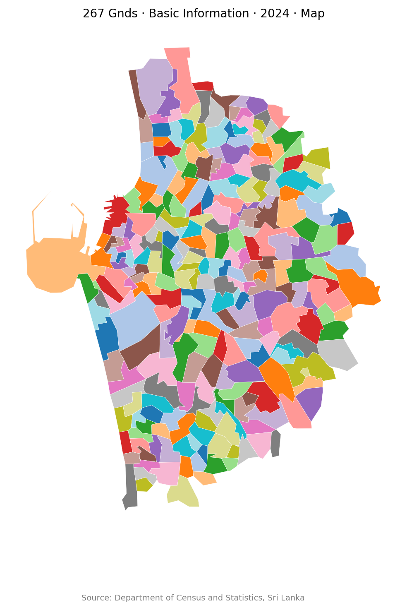
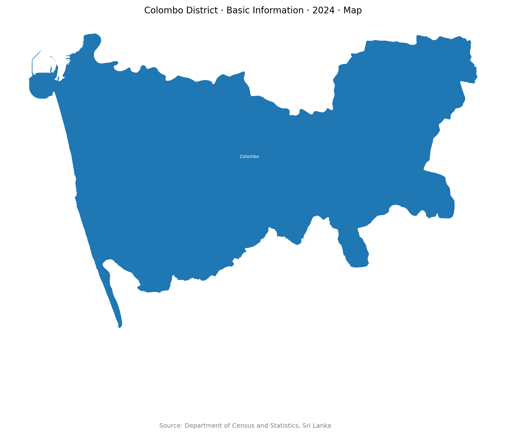
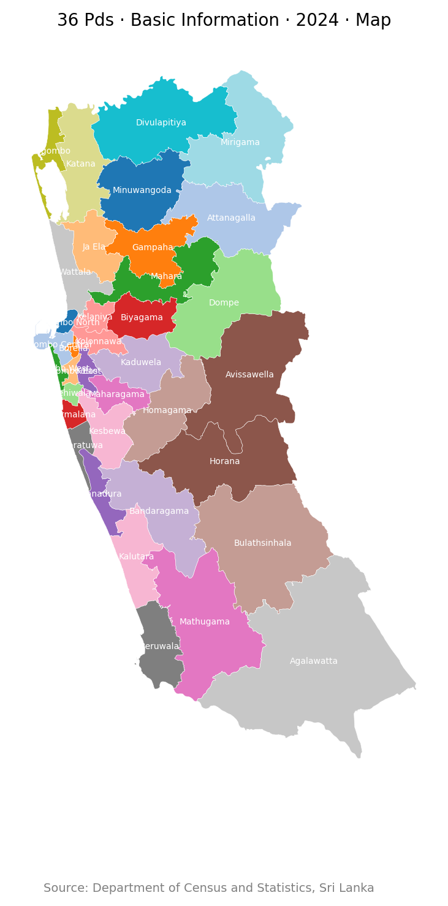
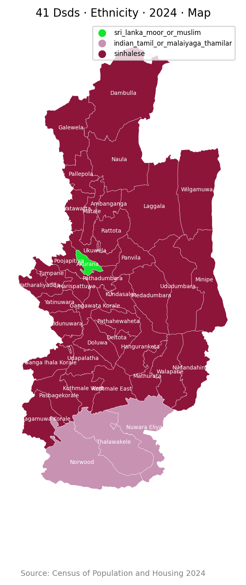

# Lanka Data

This repo implements a simple interface to query data about Sri Lanka.

## Data Sources

- [Department of Census and Statistics, Sri Lanka](https://www.statistics.gov.lk/)
- [Election Commission of Sri Lanka](https://www.elections.gov.lk)

## Usage

### Run Code

```python
from lanka_data import Db


db = Db("<cmd>")
output = db.run()
print(output)

```

### workflows/run.py

```bash
python workflows/run.py <cmd>
```

### workflows/console.py

```bash
python workflows/console.py <cmd>

/Where/What/When/How

> /<cmd>
```

## Example cmds (`<cmd>`)

### 01. `LK`

```json
{
    "result": {
        "title": "Sri Lanka Country \u00b7 Basic Information \u00b7 2024 \u00b7 JSON",
        "data_list": [
            {
                "region_id": "LK",
                "region_name": "Sri Lanka",
                "area_sqkm": 65983.58,
                "center_lat": 7.621863,
                "center_lng": 80.698448
            }
        ],
        "source": "Department of Census and Statistics, Sri Lanka",
        "source_url": "https://www.statistics.gov.lk/"
    },
    "query_time_ms": 0,
    "cache_hit": false
}
```

### 02. `LK-1:district`

```json
{
    "result": {
        "title": "Colombo, Gampaha, Kalutara Districts \u00b7 Basic Information \u00b7 2024 \u00b7 JSON",
        "data_list": [
            {
                "region_id": "LK-11",
                "region_name": "Colombo",
                "area_sqkm": 688.17,
                "center_lat": 6.869822,
                "center_lng": 80.018487,
                "province_id": "LK-1",
                "ed_id": "EC-01",
                "pd_id": null
            },
            {
                "region_id": "LK-12",
                "region_name": "Gampaha",
                "area_sqkm": 1385.23,
                "center_lat": 7.123406,
                "center_lng": 80.018206,
                ... // 1 lines ...
                "ed_id": "EC-02",
                "pd_id": null
            },
            {
                "region_id": "LK-13",
                "region_name": "Kalutara",
                "area_sqkm": 1646.99,
                "center_lat": 6.577185,
                "center_lng": 80.127744,
                "province_id": "LK-1",
                "ed_id": "EC-03",
                "pd_id": null
            }
        ],
        "source": "Department of Census and Statistics, Sri Lanka",
        "source_url": "https://www.statistics.gov.lk/"
    },
    "query_time_ms": 0,
    "cache_hit": false
}
```

### 03. `LK-1,LK-2`

```json
{
    "result": {
        "title": "Western, Central Provinces \u00b7 Basic Information \u00b7 2024 \u00b7 JSON",
        "data_list": [
            {
                "region_id": "LK-1",
                "region_name": "Western",
                "area_sqkm": 3720.39,
                "center_lat": 6.834692,
                "center_lng": 80.06675
            },
            {
                "region_id": "LK-2",
                "region_name": "Central",
                "area_sqkm": 5731.25,
                "center_lat": 7.324022,
                "center_lng": 80.717397
            }
        ],
        "source": "Department of Census and Statistics, Sri Lanka",
        "source_url": "https://www.statistics.gov.lk/"
    },
    "query_time_ms": 0,
    "cache_hit": false
}
```

### 04. `LK-1,LK-9,LK-3/Map`

```json
{
    "result": {
        "title": "Western, Southern, Sabaragamuwa Provinces \u00b7 Basic Information \u00b7 2024 \u00b7 Map",
        "image_path": "/tmp/lanka_data/images/9faefea7.png",
        "source": "Department of Census and Statistics, Sri Lanka",
        "source_url": "https://www.statistics.gov.lk/"
    },
    "query_time_ms": 0,
    "cache_hit": false
}
```


### 05. `LK-4...LK-6/Map`

```json
{
    "result": {
        "title": "Northern, Eastern, North Western Provinces \u00b7 Basic Information \u00b7 2024 \u00b7 Map",
        "image_path": "/tmp/lanka_data/images/19402bf6.png",
        "source": "Department of Census and Statistics, Sri Lanka",
        "source_url": "https://www.statistics.gov.lk/"
    },
    "query_time_ms": 0,
    "cache_hit": false
}
```



### 06. `LK-1127025@10/Map`

```json
{
    "result": {
        "title": "267 Gnds \u00b7 Basic Information \u00b7 2024 \u00b7 Map",
        "image_path": "/tmp/lanka_data/images/cf6f62d6.png",
        "source": "Department of Census and Statistics, Sri Lanka",
        "source_url": "https://www.statistics.gov.lk/"
    },
    "query_time_ms": 0,
    "cache_hit": false
}
```



### 07. `LK-1103&EC-01B/Map`

```json
{
    "result": {
        "title": "24 Gnds \u00b7 Basic Information \u00b7 2024 \u00b7 Map",
        "image_path": "/tmp/lanka_data/images/dcc7b0dc.png",
        "source": "Department of Census and Statistics, Sri Lanka",
        "source_url": "https://www.statistics.gov.lk/"
    },
    "query_time_ms": 0,
    "cache_hit": false
}
```


### 08. `LK-11/Map`

```json
{
    "result": {
        "title": "Colombo District \u00b7 Basic Information \u00b7 2024 \u00b7 Map",
        "image_path": "/tmp/lanka_data/images/4dcb2f68.png",
        "source": "Department of Census and Statistics, Sri Lanka",
        "source_url": "https://www.statistics.gov.lk/"
    },
    "query_time_ms": 0,
    "cache_hit": false
}
```



### 09. `LK-1:district/Map`

```json
{
    "result": {
        "title": "Colombo, Gampaha, Kalutara Districts \u00b7 Basic Information \u00b7 2024 \u00b7 Map",
        "image_path": "/tmp/lanka_data/images/61a5010c.png",
        "source": "Department of Census and Statistics, Sri Lanka",
        "source_url": "https://www.statistics.gov.lk/"
    },
    "query_time_ms": 0,
    "cache_hit": false
}
```


### 10. `LK-1:pd/Map`

```json
{
    "result": {
        "title": "36 Pds \u00b7 Basic Information \u00b7 2024 \u00b7 Map",
        "image_path": "/tmp/lanka_data/images/21180992.png",
        "source": "Department of Census and Statistics, Sri Lanka",
        "source_url": "https://www.statistics.gov.lk/"
    },
    "query_time_ms": 0,
    "cache_hit": false
}
```



### 11. `LK-1103:gnd/Religion/2012/Map`

```json
{
    "result": {
        "title": "35 Gnds \u00b7 Religion \u00b7 2012 \u00b7 Map",
        "image_path": "/tmp/lanka_data/images/965e6627.png",
        "source": "Department of Census and Statistics, Sri Lanka",
        "source_url": "https://www.statistics.gov.lk/"
    },
    "query_time_ms": 0,
    "cache_hit": false
}
```


### 12. `LK-2:dsd/Ethnicity/2024/Map`

```json
{
    "result": {
        "title": "41 Dsds \u00b7 Ethnicity \u00b7 2024 \u00b7 Map",
        "image_path": "/tmp/lanka_data/images/8319364a.png",
        "source": "Department of Census and Statistics, Sri Lanka",
        "source_url": "https://www.statistics.gov.lk/"
    },
    "query_time_ms": 0,
    "cache_hit": false
}
```



### 13. `LK/ParliamentaryElection/2024`

```json
{
    "result": {
        "title": "Sri Lanka Country \u00b7 ParliamentaryElection \u00b7 2024 \u00b7 JSON",
        "data_list": [
            {
                "region_id": "LK",
                "region_name": "Sri Lanka",
                "summary": {
                    "electors": 17140354,
                    "polled": 11815246,
                    "valid": 11148006,
                    "rejected": 667240,
                    "p_turnout": 0.6893,
                    "p_valid": 0.9435,
                    "p_rejected": 0.0565
                },
                "votes_by_party": {
                    "NPP": 6863186,
                    "SJB": 1968716,
                    "NDF": 500835,
                    ... // 1327 lines ...
                "IND28-13": 0.0,
                "IND36-13": 0.0,
                "IND42-13": 0.0,
                "IND34-13": 0.0,
                "IND26-12": 0.0,
                "IND05-13": 0.0,
                "IND07-13": 0.0,
                "IND08-14": 0.0,
                "IND32-13": 0.0,
                "IND40-13": 0.0,
                "IND37-13": 0.0,
                "IND33-13": 0.0
            }
        },
        "source": "Election Commission of Sri Lanka",
        "source_url": "https://www.elections.gov.lk"
    },
    "query_time_ms": 0,
    "cache_hit": false
}
```

### 14. `LK:pd/PresidentialElection/2024/Map`

```json
{
    "result": {
        "title": "160 Pds \u00b7 PresidentialElection \u00b7 2024 \u00b7 Map",
        "image_path": "/tmp/lanka_data/images/4ac73cd9.png",
        "source": "Department of Census and Statistics, Sri Lanka",
        "source_url": "https://www.statistics.gov.lk/"
    },
    "query_time_ms": 0,
    "cache_hit": false
}
```


[](https://opensource.org/licenses/MIT)
