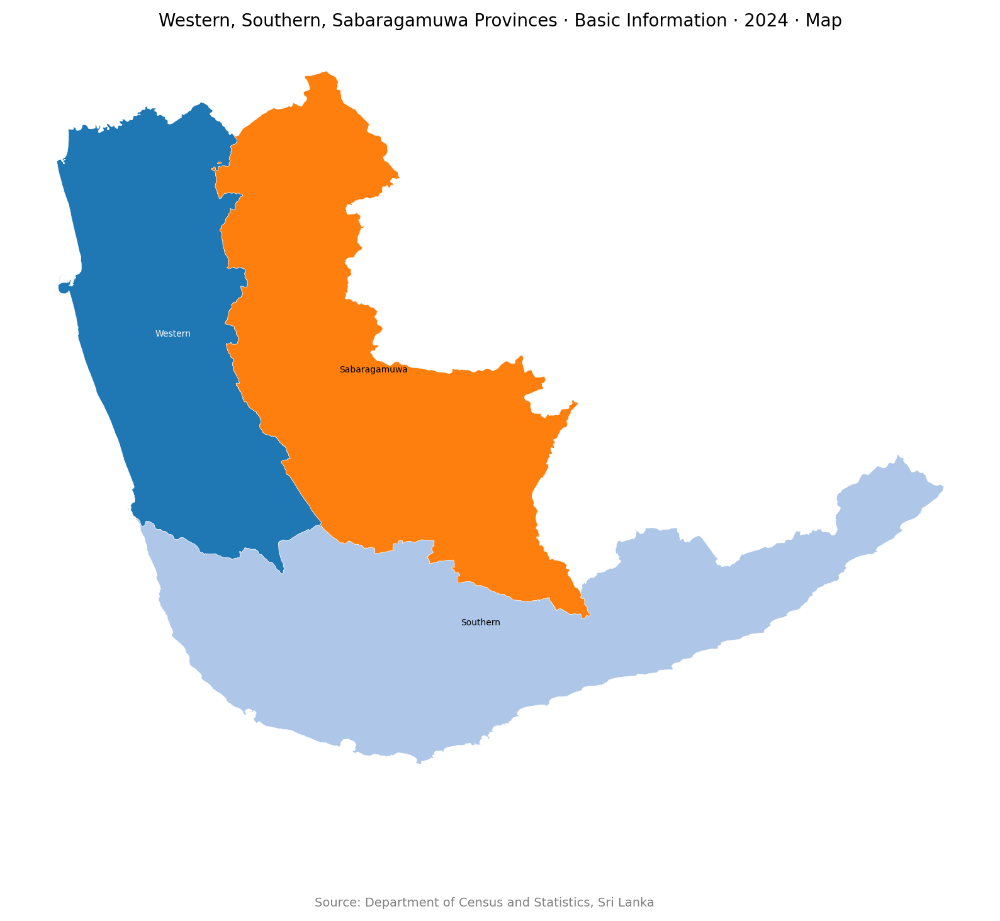
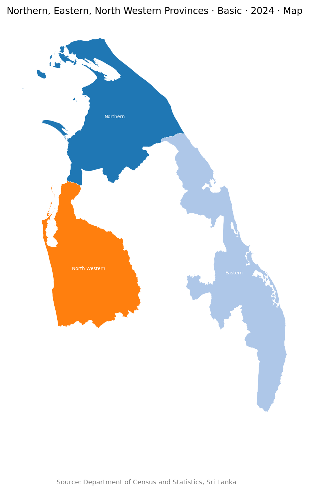
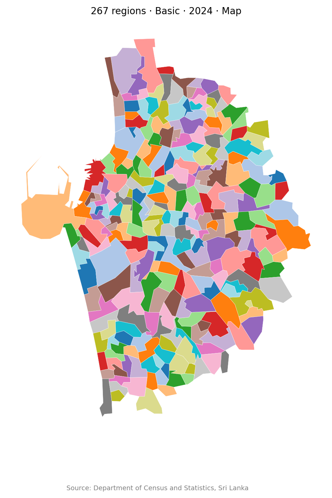
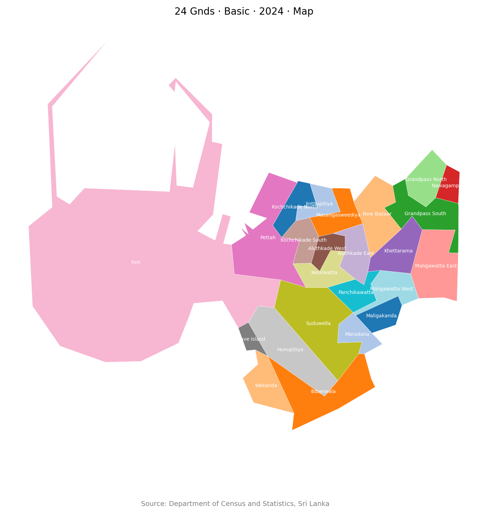
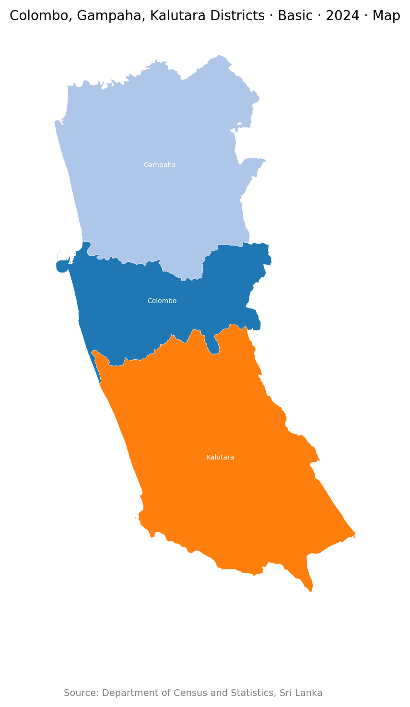
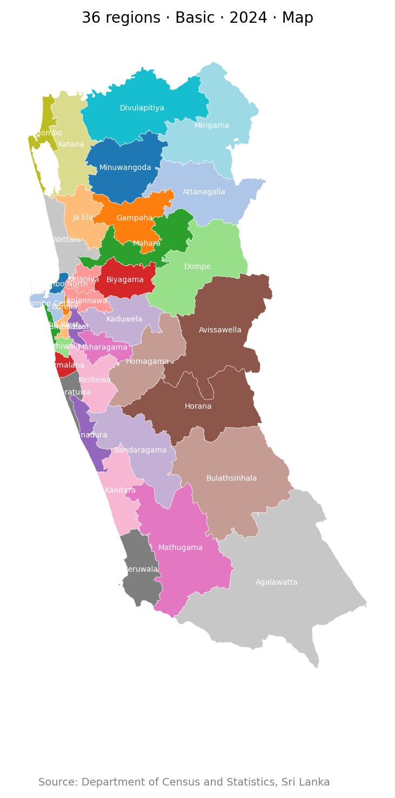
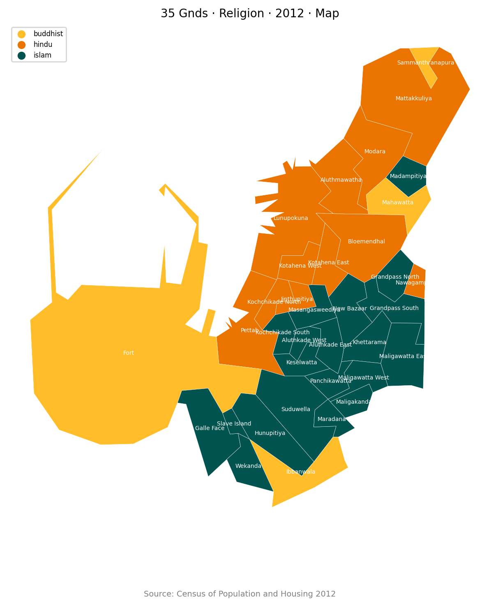
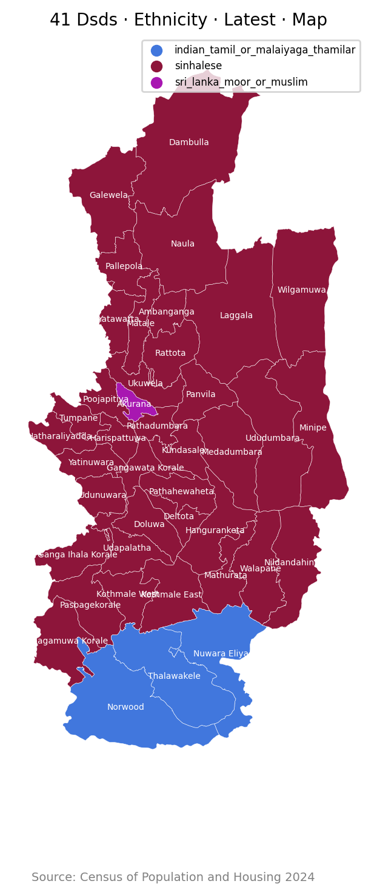
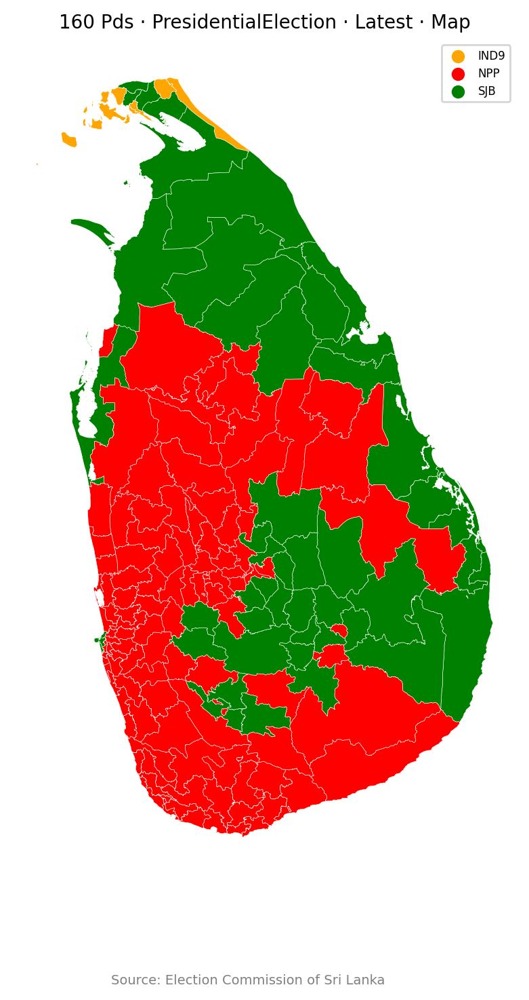
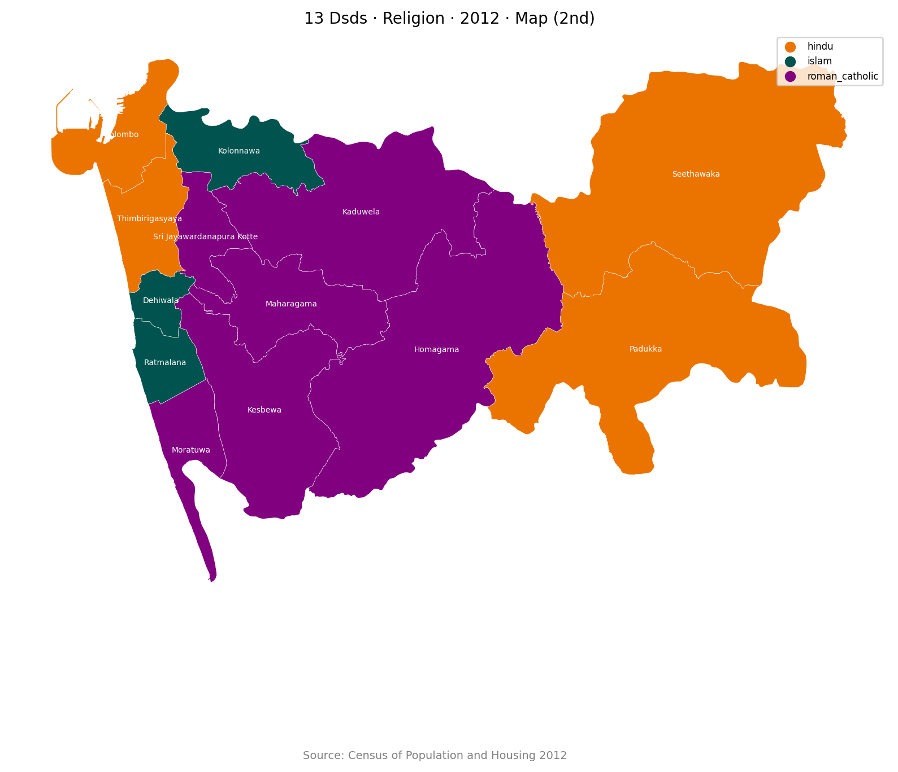

# Lanka Data

This repo implements a simple interface to query data about Sri Lanka.

## Data Sources

- [Department of Census and Statistics, Sri Lanka](https://www.statistics.gov.lk/)
- [Election Commission of Sri Lanka](https://www.elections.gov.lk)

## Usage

### Run Code

```python
from lanka_data import Db


db = Db("<cmd>")
output = db.run()
print(output)

```

### workflows/run.py

```bash
python workflows/run.py <cmd>
```

### workflows/console.py

```bash
python workflows/console.py <cmd>

/Where/What/When/How

> /<cmd>
```

## Example cmds (`<cmd>`)

### 01. `LK`

```json
{
    "result": {
        "title_items": [
            "Sri Lanka Country",
            "Basic Information",
            "2024",
            "JSON"
        ],
        "data_list": [
            {
                "region_id": "LK",
                "region_name": "Sri Lanka",
                "area_sqkm": 65983.58,
                "center_lat": 7.621863,
                "center_lng": 80.698448
            }
        ],
        "source": "Department of Census and Statistics, Sri Lanka",
        "source_url": "https://www.statistics.gov.lk/"
    },
    "query_time_ms": 0,
    "cache_hit": false
}
```

### 02. `LK-1:district`

```json
{
    "result": {
        "title_items": [
            "Colombo, Gampaha, Kalutara Districts",
            "Basic Information",
            "2024",
            "JSON"
        ],
        "data_list": [
            {
                "region_id": "LK-11",
                "region_name": "Colombo",
                "area_sqkm": 688.17,
                "center_lat": 6.869822,
                "center_lng": 80.018487,
                "province_id": "LK-1",
                "ed_id": "EC-01",
                "pd_id": null
            },
            {
            ... // 6 lines ...
                "ed_id": "EC-02",
                "pd_id": null
            },
            {
                "region_id": "LK-13",
                "region_name": "Kalutara",
                "area_sqkm": 1646.99,
                "center_lat": 6.577185,
                "center_lng": 80.127744,
                "province_id": "LK-1",
                "ed_id": "EC-03",
                "pd_id": null
            }
        ],
        "source": "Department of Census and Statistics, Sri Lanka",
        "source_url": "https://www.statistics.gov.lk/"
    },
    "query_time_ms": 0,
    "cache_hit": false
}
```

### 03. `LK-1,LK-2`

```json
{
    "result": {
        "title_items": [
            "Western, Central Provinces",
            "Basic Information",
            "2024",
            "JSON"
        ],
        "data_list": [
            {
                "region_id": "LK-1",
                "region_name": "Western",
                "area_sqkm": 3720.39,
                "center_lat": 6.834692,
                "center_lng": 80.06675
            },
            {
                "region_id": "LK-2",
                "region_name": "Central",
                "area_sqkm": 5731.25,
                "center_lat": 7.324022,
                "center_lng": 80.717397
            }
        ],
        "source": "Department of Census and Statistics, Sri Lanka",
        "source_url": "https://www.statistics.gov.lk/"
    },
    "query_time_ms": 0,
    "cache_hit": false
}
```

### 04. `LK-1,LK-9,LK-3/Map`

```json
{
    "result": {
        "title_items": [
            "Western, Southern, Sabaragamuwa Provinces",
            "Basic Information",
            "2024",
            "Map"
        ],
        "image_path": "/tmp/lanka_data/images/e7f935bd.png",
        "source": "Department of Census and Statistics, Sri Lanka",
        "source_url": "https://www.statistics.gov.lk/"
    },
    "query_time_ms": 0,
    "cache_hit": false
}
```



### 05. `LK-4...LK-6/Map`

```json
{
    "result": {
        "title_items": [
            "Northern, Eastern, North Western Provinces",
            "Basic Information",
            "2024",
            "Map"
        ],
        "image_path": "/tmp/lanka_data/images/b2bd492e.png",
        "source": "Department of Census and Statistics, Sri Lanka",
        "source_url": "https://www.statistics.gov.lk/"
    },
    "query_time_ms": 0,
    "cache_hit": false
}
```



### 06. `LK-1127025@10/Map`

```json
{
    "result": {
        "title_items": [
            "267 Gnds",
            "Basic Information",
            "2024",
            "Map"
        ],
        "image_path": "/tmp/lanka_data/images/d12f8e75.png",
        "source": "Department of Census and Statistics, Sri Lanka",
        "source_url": "https://www.statistics.gov.lk/"
    },
    "query_time_ms": 0,
    "cache_hit": false
}
```



### 07. `LK-1103&EC-01B/Map`

```json
{
    "result": {
        "title_items": [
            "24 Gnds",
            "Basic Information",
            "2024",
            "Map"
        ],
        "image_path": "/tmp/lanka_data/images/50e76e14.png",
        "source": "Department of Census and Statistics, Sri Lanka",
        "source_url": "https://www.statistics.gov.lk/"
    },
    "query_time_ms": 0,
    "cache_hit": false
}
```



### 08. `LK-11/Map`

```json
{
    "result": {
        "title_items": [
            "Colombo District",
            "Basic Information",
            "2024",
            "Map"
        ],
        "image_path": "/tmp/lanka_data/images/7338b18f.png",
        "source": "Department of Census and Statistics, Sri Lanka",
        "source_url": "https://www.statistics.gov.lk/"
    },
    "query_time_ms": 0,
    "cache_hit": false
}
```


### 09. `LK-1:district/Map`

```json
{
    "result": {
        "title_items": [
            "Colombo, Gampaha, Kalutara Districts",
            "Basic Information",
            "2024",
            "Map"
        ],
        "image_path": "/tmp/lanka_data/images/c7e1e9ea.png",
        "source": "Department of Census and Statistics, Sri Lanka",
        "source_url": "https://www.statistics.gov.lk/"
    },
    "query_time_ms": 0,
    "cache_hit": false
}
```



### 10. `LK-1:pd/Map`

```json
{
    "result": {
        "title_items": [
            "36 Pds",
            "Basic Information",
            "2024",
            "Map"
        ],
        "image_path": "/tmp/lanka_data/images/8af968fb.png",
        "source": "Department of Census and Statistics, Sri Lanka",
        "source_url": "https://www.statistics.gov.lk/"
    },
    "query_time_ms": 0,
    "cache_hit": false
}
```



### 11. `LK-1103:gnd/Religion/2012/Map`

```json
{
    "result": {
        "title_items": [
            "35 Gnds",
            "Religion",
            "2012",
            "Map"
        ],
        "image_path": "/tmp/lanka_data/images/87273908.png",
        "source": "Department of Census and Statistics, Sri Lanka",
        "source_url": "https://www.statistics.gov.lk/"
    },
    "query_time_ms": 0,
    "cache_hit": false
}
```



### 12. `LK-2:dsd/Ethnicity/2024/Map`

```json
{
    "result": {
        "title_items": [
            "41 Dsds",
            "Ethnicity",
            "2024",
            "Map"
        ],
        "image_path": "/tmp/lanka_data/images/48ba887e.png",
        "source": "Department of Census and Statistics, Sri Lanka",
        "source_url": "https://www.statistics.gov.lk/"
    },
    "query_time_ms": 0,
    "cache_hit": false
}
```



### 13. `LK/ParliamentaryElection/2024`

```json
{
    "result": {
        "title_items": [
            "Sri Lanka Country",
            "ParliamentaryElection",
            "2024",
            "JSON"
        ],
        "data_list": [
            {
                "region_id": "LK",
                "region_name": "Sri Lanka",
                "summary": {
                    "electors": 17140354,
                    "polled": 11815246,
                    "valid": 11148006,
                    "rejected": 667240,
                    "p_turnout": 0.6893,
                    "p_valid": 0.9435,
                    "p_rejected": 0.0565
                    ... // 1332 lines ...
                "IND28-13": 0.0,
                "IND36-13": 0.0,
                "IND42-13": 0.0,
                "IND34-13": 0.0,
                "IND26-12": 0.0,
                "IND05-13": 0.0,
                "IND07-13": 0.0,
                "IND08-14": 0.0,
                "IND32-13": 0.0,
                "IND40-13": 0.0,
                "IND37-13": 0.0,
                "IND33-13": 0.0
            }
        },
        "source": "Election Commission of Sri Lanka",
        "source_url": "https://www.elections.gov.lk"
    },
    "query_time_ms": 0,
    "cache_hit": false
}
```

### 14. `LK:pd/PresidentialElection/Latest/Map`

```json
{
    "result": {
        "title_items": [
            "160 Pds",
            "PresidentialElection",
            "Latest",
            "Map"
        ],
        "image_path": "/tmp/lanka_data/images/2f6f18c2.png",
        "source": "Department of Census and Statistics, Sri Lanka",
        "source_url": "https://www.statistics.gov.lk/"
    },
    "query_time_ms": 0,
    "cache_hit": false
}
```



### 15. `LK-2:dsd/Ethnicity/Latest/Map`

```json
{
    "result": {
        "title_items": [
            "41 Dsds",
            "Ethnicity",
            "Latest",
            "Map"
        ],
        "image_path": "/tmp/lanka_data/images/48ba887e.png",
        "source": "Department of Census and Statistics, Sri Lanka",
        "source_url": "https://www.statistics.gov.lk/"
    },
    "query_time_ms": 0,
    "cache_hit": false
}
```


### 16. `LK-11:dsd/Religion/2012/Map:2nd`

```json
{
    "result": {
        "title_items": [
            "13 Dsds",
            "Religion",
            "2012",
            "Map (2nd)"
        ],
        "image_path": "/tmp/lanka_data/images/03705447.png",
        "source": "Department of Census and Statistics, Sri Lanka",
        "source_url": "https://www.statistics.gov.lk/"
    },
    "query_time_ms": 0,
    "cache_hit": false
}
```




[](https://opensource.org/licenses/MIT)
