# Lanka Data

This repo implements a simple interface to query data about Sri Lanka.

## Data Sources

- [Census of Population and Housing 2012](https://www.statistics.gov.lk/Resource/en/Population/CPH_2011/CPH_2012_5Per_Rpt.pdf)
- [Department of Census and Statistics, Sri Lanka](https://www.statistics.gov.lk/)
- [Election Commission of Sri Lanka](https://www.elections.gov.lk)
- [lanka_data](https://github.com/nuuuwan/lanka_data/blob/main/README.md)

## Usage

### Run Code

```python
from lanka_data import Db


db = Db("<cmd>")
output = db.run()
print(output)

```

### workflows/run.py

```bash
python workflows/run.py <cmd>
```

### workflows/console.py

```bash
python workflows/console.py <cmd>

/Where/What/When/How

> /<cmd>
```

## Example cmds (`<cmd>`)

### 1) Help

#### 1.01) `*`

```json
{
    "result": {
        "what_to_whens": {
            "AgeGroup": [
                "2012",
                "2024"
            ],
            "Basic": [
                "2024"
            ],
            "Communication": [
                "2012"
            ],
            "ConstructionYear": [
                "2012"
            ],
            "Economy": [
                "2012"
            ],
            "Education": [
            ... // 101 lines ...
            "Water": [
                "2012",
                "2024"
            ]
        },
        "where": [
            "LK*",
            "EC-*",
            "LG-*"
        ],
        "how": [
            "JSON",
            "Map"
        ],
        "source": "lanka_data",
        "source_url": "https://github.com/nuuuwan/lanka_data/blob/main/README.md"
    },
    "query_time_ms": 0,
    "cache_hit": false
}
```

### 2) Selection

#### 2.01) `Basic/2024/LK/Map`

Map of Basic information (2024) for Countrys with IDs LK.

```json
{
    "result": {
        "what_description": "Basic information",
        "when_description": "2024",
        "where_description": "Countrys with IDs LK",
        "how_description": "Map",
        "image_path": "/tmp/lanka_data/images/2c70d732.png",
        "source": "Department of Census and Statistics, Sri Lanka",
        "source_url": "https://www.statistics.gov.lk/",
        "cmd": "Basic/2024/LK/Map"
    },
    "query_time_ms": 0,
    "cache_hit": false
}
```


#### 2.02) `Basic/2024/LK-1:district/Map`

Map of Basic information (2024) for Districts within LK-1.

```json
{
    "result": {
        "what_description": "Basic information",
        "when_description": "2024",
        "where_description": "Districts within LK-1",
        "how_description": "Map",
        "image_path": "/tmp/lanka_data/images/56178688.png",
        "source": "Department of Census and Statistics, Sri Lanka",
        "source_url": "https://www.statistics.gov.lk/",
        "cmd": "Basic/2024/LK-1:district/Map"
    },
    "query_time_ms": 0,
    "cache_hit": false
}
```

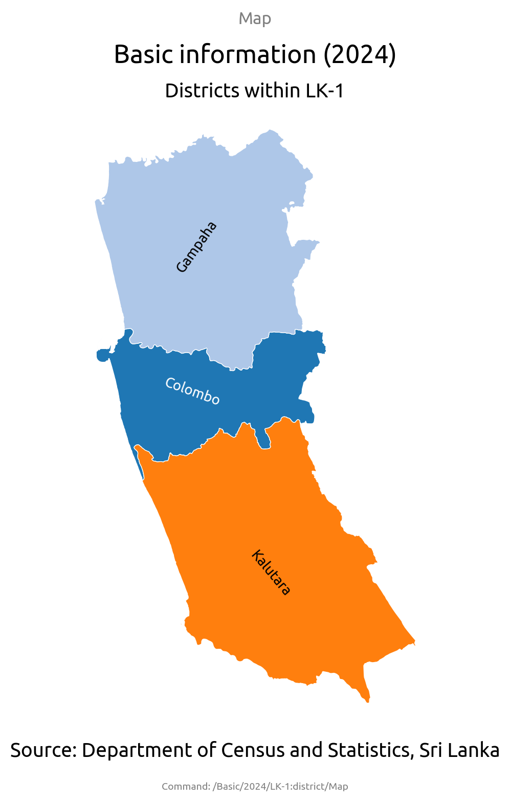

#### 2.03) `Basic/2024/LK-2,LK-3/Map`

Map of Basic information (2024) for Provinces with IDs LK-2,LK-3.

```json
{
    "result": {
        "what_description": "Basic information",
        "when_description": "2024",
        "where_description": "Provinces with IDs LK-2,LK-3",
        "how_description": "Map",
        "image_path": "/tmp/lanka_data/images/0e0c3550.png",
        "source": "Department of Census and Statistics, Sri Lanka",
        "source_url": "https://www.statistics.gov.lk/",
        "cmd": "Basic/2024/LK-2,LK-3/Map"
    },
    "query_time_ms": 0,
    "cache_hit": false
}
```

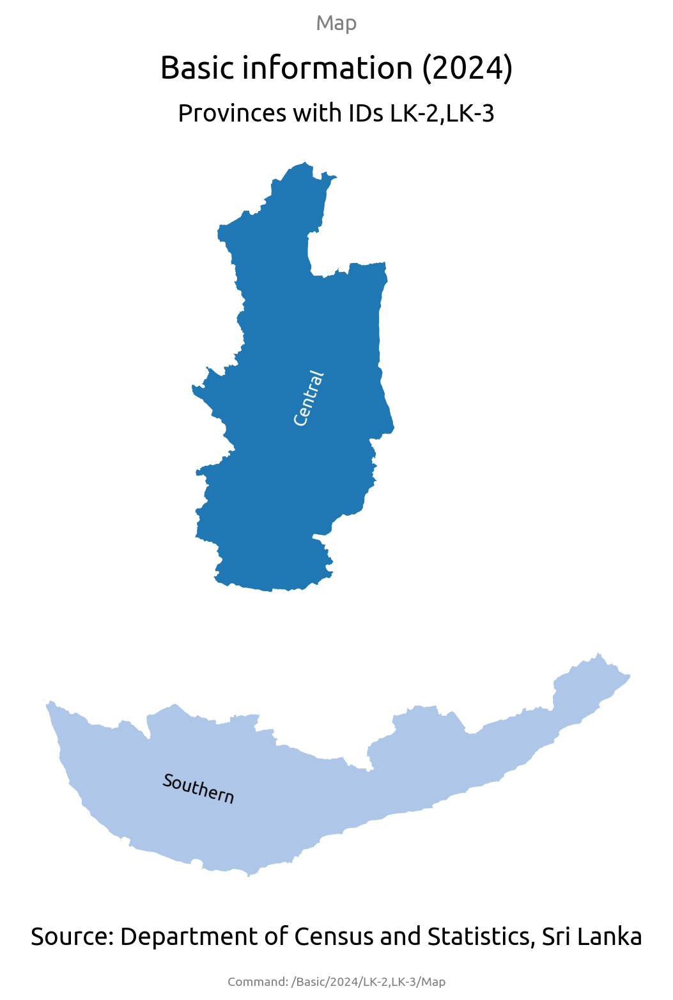

#### 2.04) `Basic/2024/LK-3,LK-9,LK-8/Map`

Map of Basic information (2024) for Provinces with IDs LK-3,LK-9,LK-8.

```json
{
    "result": {
        "what_description": "Basic information",
        "when_description": "2024",
        "where_description": "Provinces with IDs LK-3,LK-9,LK-8",
        "how_description": "Map",
        "image_path": "/tmp/lanka_data/images/1e11809a.png",
        "source": "Department of Census and Statistics, Sri Lanka",
        "source_url": "https://www.statistics.gov.lk/",
        "cmd": "Basic/2024/LK-3,LK-9,LK-8/Map"
    },
    "query_time_ms": 0,
    "cache_hit": false
}
```

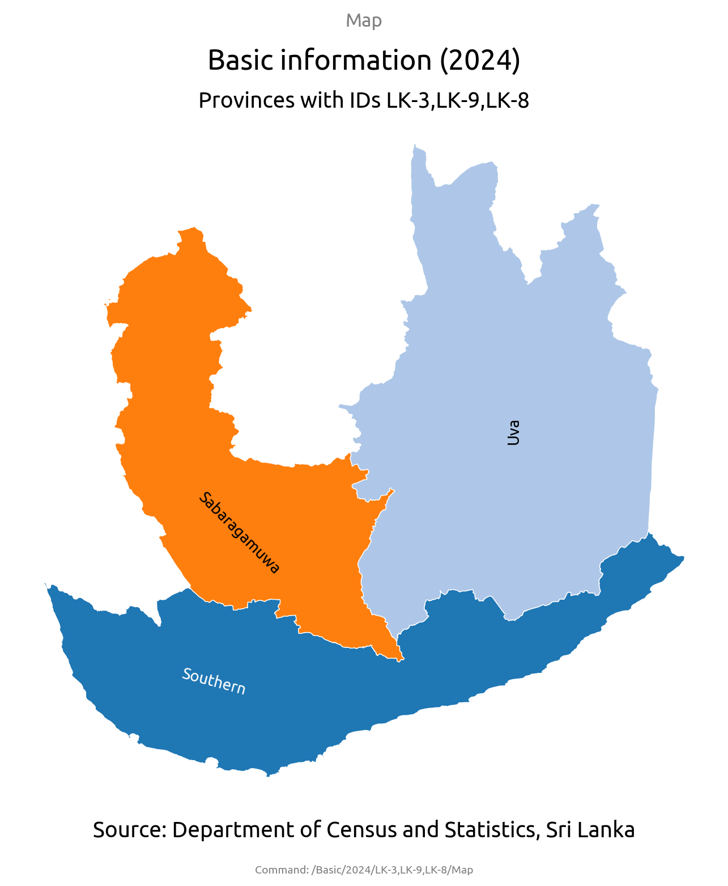

#### 2.05) `Basic/2024/LK-5...LK-8/Map`

Map of Basic information (2024) for Provinces, from LK-5 to LK-8.

```json
{
    "result": {
        "what_description": "Basic information",
        "when_description": "2024",
        "where_description": "Provinces, from LK-5 to LK-8",
        "how_description": "Map",
        "image_path": "/tmp/lanka_data/images/c11facd1.png",
        "source": "Department of Census and Statistics, Sri Lanka",
        "source_url": "https://www.statistics.gov.lk/",
        "cmd": "Basic/2024/LK-5...LK-8/Map"
    },
    "query_time_ms": 0,
    "cache_hit": false
}
```

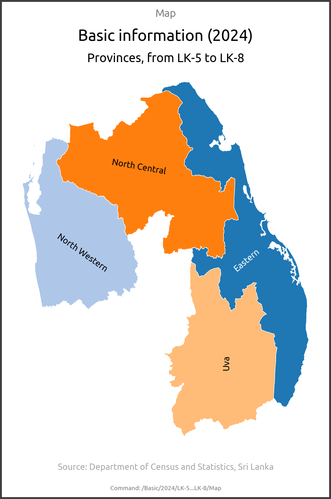

#### 2.06) `Basic/2024/LK-1127025@20/Map`

Map of Basic information (2024) for Gnds within 20 km of LK-1127025.

```json
{
    "result": {
        "what_description": "Basic information",
        "when_description": "2024",
        "where_description": "Gnds within 20 km of LK-1127025",
        "how_description": "Map",
        "image_path": "/tmp/lanka_data/images/8f0011f7.png",
        "source": "Department of Census and Statistics, Sri Lanka",
        "source_url": "https://www.statistics.gov.lk/",
        "cmd": "Basic/2024/LK-1127025@20/Map"
    },
    "query_time_ms": 0,
    "cache_hit": false
}
```

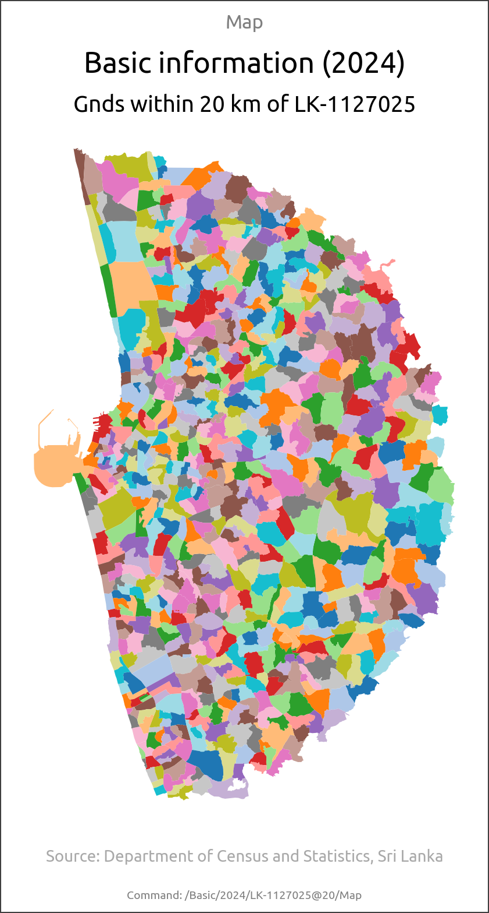

#### 2.07) `Basic/2024/LK-1103&EC-01B/Map`

Map of Basic information (2024) for Intersection of Dsd LK-1103 and Pd EC-01B.

```json
{
    "result": {
        "what_description": "Basic information",
        "when_description": "2024",
        "where_description": "Intersection of Dsd LK-1103 and Pd EC-01B",
        "how_description": "Map",
        "image_path": "/tmp/lanka_data/images/e9e8511d.png",
        "source": "Department of Census and Statistics, Sri Lanka",
        "source_url": "https://www.statistics.gov.lk/",
        "cmd": "Basic/2024/LK-1103&EC-01B/Map"
    },
    "query_time_ms": 0,
    "cache_hit": false
}
```

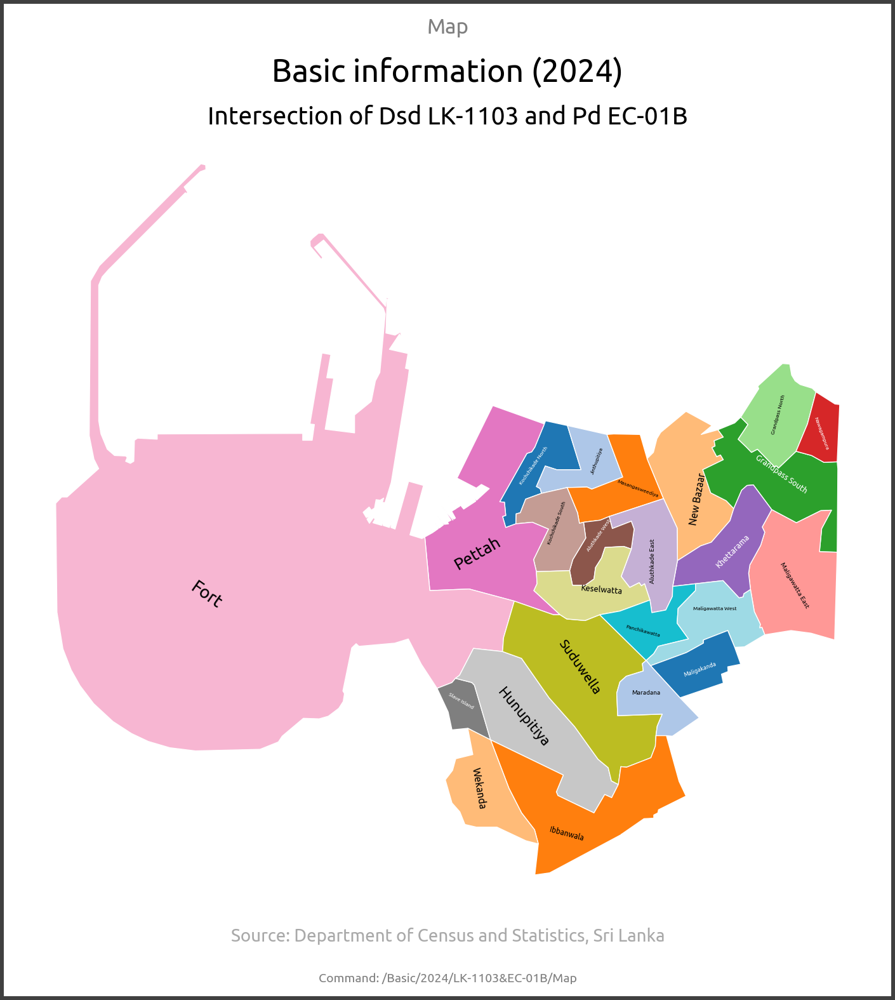

### 3) Sub-Regions

#### 3.01) `Basic/2024/LK-61/Map`

Map of Basic information (2024) for Districts with IDs LK-61.

```json
{
    "result": {
        "what_description": "Basic information",
        "when_description": "2024",
        "where_description": "Districts with IDs LK-61",
        "how_description": "Map",
        "image_path": "/tmp/lanka_data/images/15248e4a.png",
        "source": "Department of Census and Statistics, Sri Lanka",
        "source_url": "https://www.statistics.gov.lk/",
        "cmd": "Basic/2024/LK-61/Map"
    },
    "query_time_ms": 0,
    "cache_hit": false
}
```

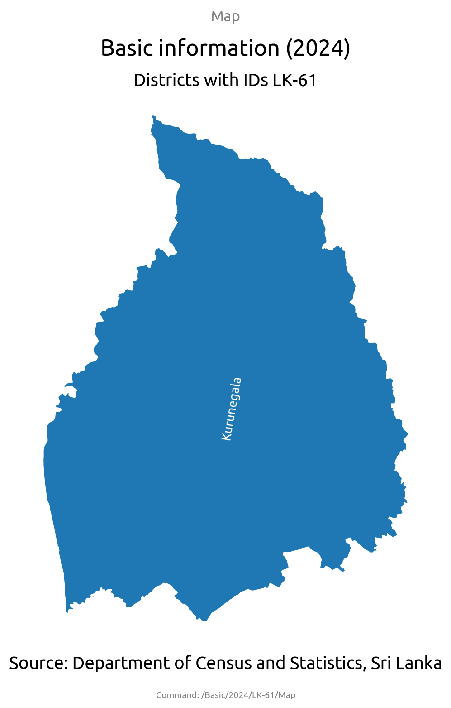

#### 3.02) `Basic/2024/LK-71:dsd/Map`

Map of Basic information (2024) for Dsds within LK-71.

```json
{
    "result": {
        "what_description": "Basic information",
        "when_description": "2024",
        "where_description": "Dsds within LK-71",
        "how_description": "Map",
        "image_path": "/tmp/lanka_data/images/3d988813.png",
        "source": "Department of Census and Statistics, Sri Lanka",
        "source_url": "https://www.statistics.gov.lk/",
        "cmd": "Basic/2024/LK-71:dsd/Map"
    },
    "query_time_ms": 0,
    "cache_hit": false
}
```

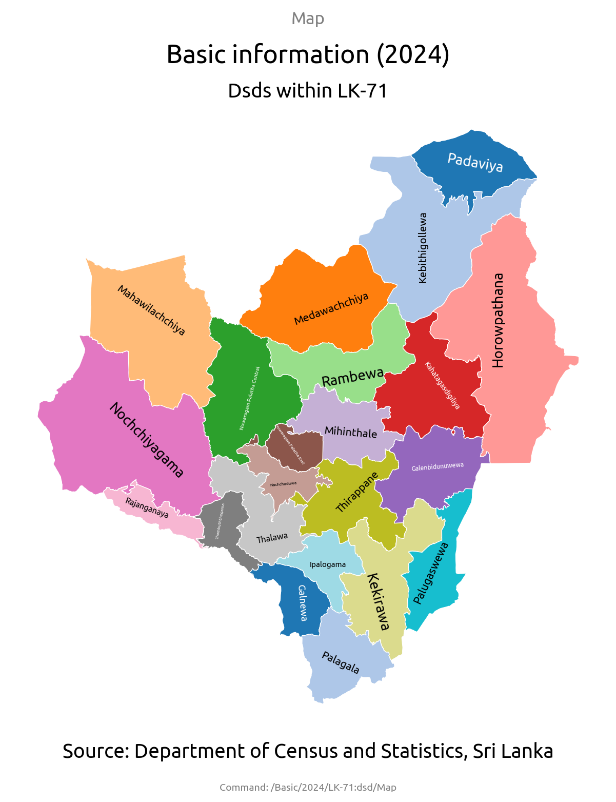

#### 3.03) `Basic/2024/LK-81:pd/Map`

Map of Basic information (2024) for Pds within LK-81.

```json
{
    "result": {
        "what_description": "Basic information",
        "when_description": "2024",
        "where_description": "Pds within LK-81",
        "how_description": "Map",
        "image_path": "/tmp/lanka_data/images/4b99b325.png",
        "source": "Department of Census and Statistics, Sri Lanka",
        "source_url": "https://www.statistics.gov.lk/",
        "cmd": "Basic/2024/LK-81:pd/Map"
    },
    "query_time_ms": 0,
    "cache_hit": false
}
```

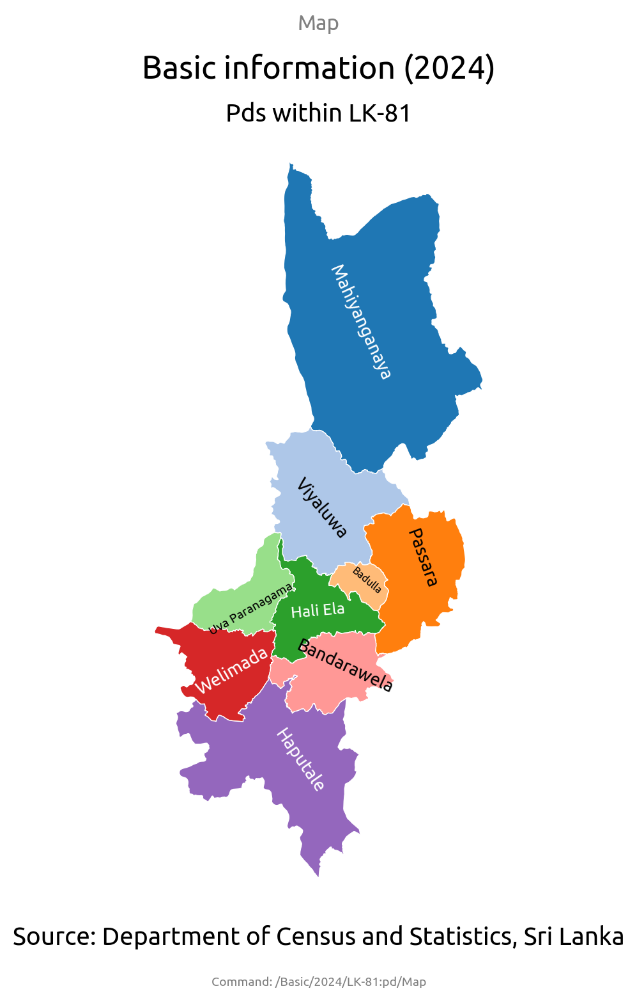

### 4) Religion

#### 4.01) `Religion/2012/LK-23:dsd/Map`

Map of Population distributed by religious affiliation such as Buddhist, Hindu, Islam, and Christian (2012) for Dsds within LK-23.

```json
{
    "result": {
        "what_description": "Population distributed by religious affiliation such as Buddhist, Hindu, Islam, and Christian",
        "when_description": "2012",
        "where_description": "Dsds within LK-23",
        "how_description": "Map",
        "image_path": "/tmp/lanka_data/images/8b2a4952.png",
        "source": "Department of Census and Statistics, Sri Lanka",
        "source_url": "https://www.statistics.gov.lk/",
        "cmd": "Religion/2012/LK-23:dsd/Map"
    },
    "query_time_ms": 0,
    "cache_hit": false
}
```

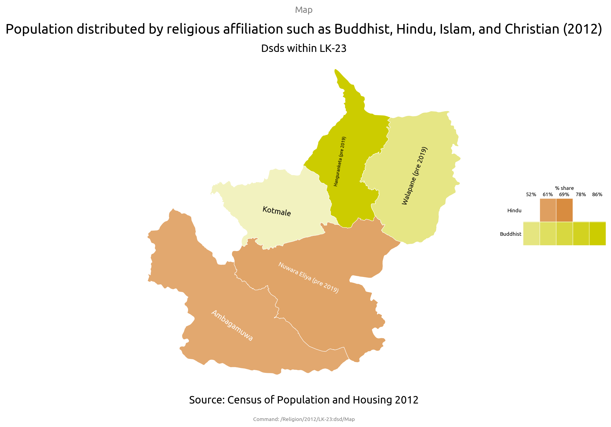

#### 4.02) `Religion/2024/LK-23:dsd/Map`

Map of Population distributed by religious affiliation (e.g. Buddhist, Hindu, Islam) (2024) for Dsds within LK-23.

```json
{
    "result": {
        "what_description": "Population distributed by religious affiliation (e.g. Buddhist, Hindu, Islam)",
        "when_description": "2024",
        "where_description": "Dsds within LK-23",
        "how_description": "Map",
        "image_path": "/tmp/lanka_data/images/dccbd315.png",
        "source": "Department of Census and Statistics, Sri Lanka",
        "source_url": "https://www.statistics.gov.lk/",
        "cmd": "Religion/2024/LK-23:dsd/Map"
    },
    "query_time_ms": 0,
    "cache_hit": false
}
```

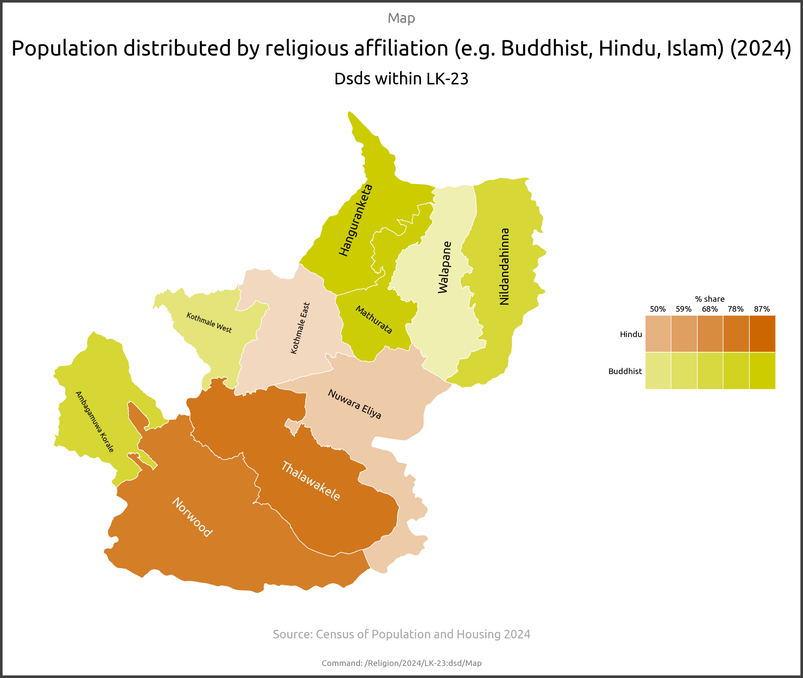

#### 4.03) `Religion/2012/LK-1103:gnd/JSON`

JSON data of Population distributed by religious affiliation such as Buddhist, Hindu, Islam, and Christian (2012) for Gnds within LK-1103.

```json
{
    "result": {
        "what_description": "Population distributed by religious affiliation such as Buddhist, Hindu, Islam, and Christian",
        "when_description": "2012",
        "where_description": "Gnds within LK-1103",
        "how_description": "JSON data",
        "data_list": [
            {
                "region_id": "LK-1103005",
                "region_name": "Sammanthranapura",
                "region_type": "gnd",
                "history_year": "Current",
                "area_sqkm": 0.18,
                "center_lat": 6.977933,
                "center_lng": 79.878128,
                "num": " ",
                "country_id": "LK",
                "province_id": "LK-1",
                "district_id": "LK-11",
                "dsd_id": "LK-1103",
                ... // 1185 lines ...
                "Other": 251
            },
            "total_value": 323223,
            "pct_values": {
                "Islam": 0.4177,
                "Hindu": 0.227,
                "Buddhist": 0.1901,
                "RomanCatholic": 0.1313,
                "OtherChristian": 0.0332,
                "Other": 0.0008
            }
        },
        "source": "Census of Population and Housing 2012",
        "source_url": "https://www.statistics.gov.lk/Resource/en/Population/CPH_2011/CPH_2012_5Per_Rpt.pdf",
        "description": "Population distributed by religious affiliation such as Buddhist, Hindu, Islam, and Christian",
        "cmd": "Religion/2012/LK-1103:gnd/JSON"
    },
    "query_time_ms": 0,
    "cache_hit": false
}
```

#### 4.04) `Religion/2012/LK-1127:gnd/Map`

Map of Population distributed by religious affiliation such as Buddhist, Hindu, Islam, and Christian (2012) for Gnds within LK-1127.

```json
{
    "result": {
        "what_description": "Population distributed by religious affiliation such as Buddhist, Hindu, Islam, and Christian",
        "when_description": "2012",
        "where_description": "Gnds within LK-1127",
        "how_description": "Map",
        "image_path": "/tmp/lanka_data/images/c9ea8f62.png",
        "source": "Department of Census and Statistics, Sri Lanka",
        "source_url": "https://www.statistics.gov.lk/",
        "cmd": "Religion/2012/LK-1127:gnd/Map"
    },
    "query_time_ms": 0,
    "cache_hit": false
}
```

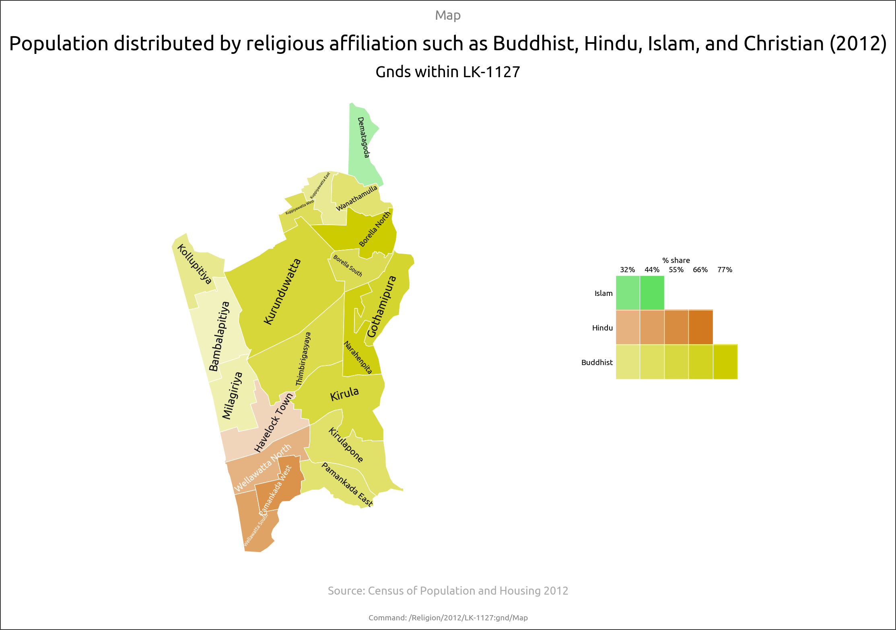

#### 4.05) `Religion/2012/LK-41:dsd/Map:2nd`

Map of Population distributed by religious affiliation such as Buddhist, Hindu, Islam, and Christian (2012) for Dsds within LK-41.

```json
{
    "result": {
        "what_description": "Population distributed by religious affiliation such as Buddhist, Hindu, Islam, and Christian",
        "when_description": "2012",
        "where_description": "Dsds within LK-41",
        "how_description": "Map",
        "image_path": "/tmp/lanka_data/images/047339bc.png",
        "source": "Department of Census and Statistics, Sri Lanka",
        "source_url": "https://www.statistics.gov.lk/",
        "cmd": "Religion/2012/LK-41:dsd/Map:2nd"
    },
    "query_time_ms": 0,
    "cache_hit": false
}
```

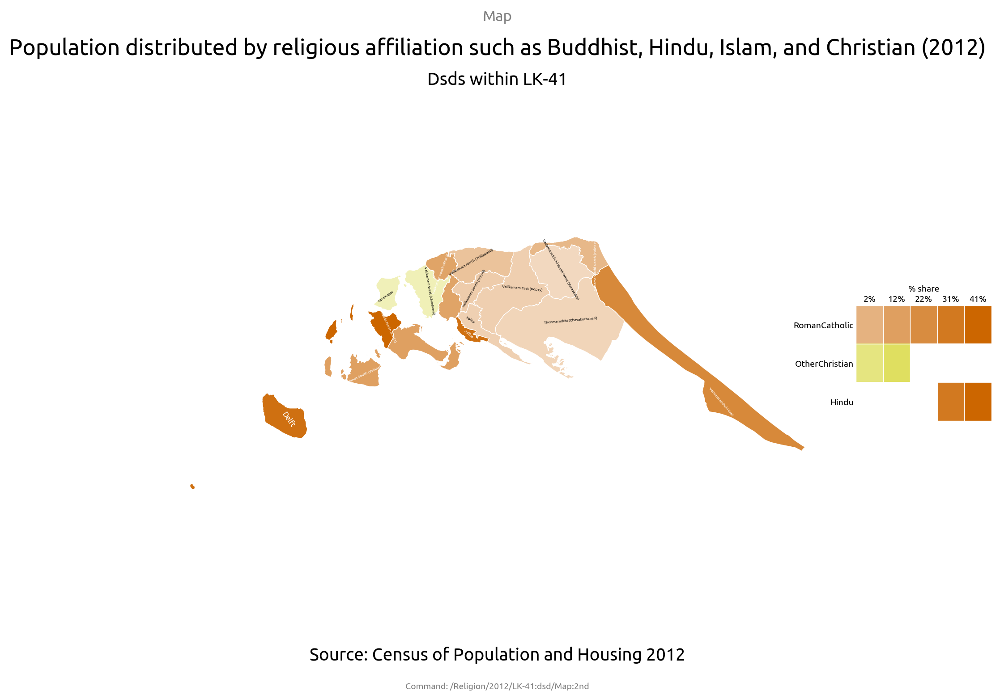

#### 4.06) `Religion/2012/LK-51:dsd/Map:Buddhist`

Map of Population distributed by religious affiliation such as Buddhist, Hindu, Islam, and Christian (2012) for Dsds within LK-51.

```json
{
    "result": {
        "what_description": "Population distributed by religious affiliation such as Buddhist, Hindu, Islam, and Christian",
        "when_description": "2012",
        "where_description": "Dsds within LK-51",
        "how_description": "Map",
        "image_path": "/tmp/lanka_data/images/978911d6.png",
        "source": "Department of Census and Statistics, Sri Lanka",
        "source_url": "https://www.statistics.gov.lk/",
        "cmd": "Religion/2012/LK-51:dsd/Map:Buddhist"
    },
    "query_time_ms": 0,
    "cache_hit": false
}
```

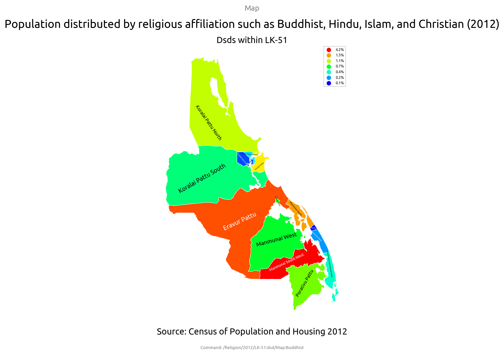

### 5) Ethnicity

#### 5.01) `Ethnicity/2024/LK-53:dsd/Map`

Map of Population distributed by ethnic group (e.g. Sinhalese, Sri Lanka Tamil, Moor) (2024) for Dsds within LK-53.

```json
{
    "result": {
        "what_description": "Population distributed by ethnic group (e.g. Sinhalese, Sri Lanka Tamil, Moor)",
        "when_description": "2024",
        "where_description": "Dsds within LK-53",
        "how_description": "Map",
        "image_path": "/tmp/lanka_data/images/12e17292.png",
        "source": "Department of Census and Statistics, Sri Lanka",
        "source_url": "https://www.statistics.gov.lk/",
        "cmd": "Ethnicity/2024/LK-53:dsd/Map"
    },
    "query_time_ms": 0,
    "cache_hit": false
}
```

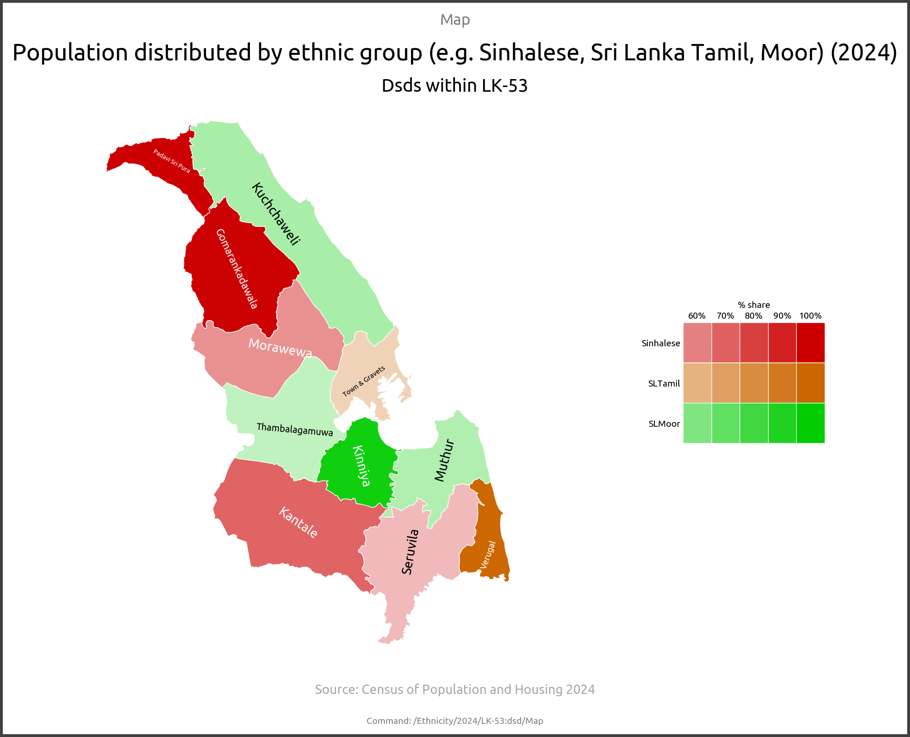

#### 5.02) `Ethnicity/Latest/LK-2:dsd/Map`

Map of Population distributed by ethnic group (e.g. Sinhalese, Sri Lanka Tamil, Moor) (Latest) for Dsds within LK-2.

```json
{
    "result": {
        "what_description": "Population distributed by ethnic group (e.g. Sinhalese, Sri Lanka Tamil, Moor)",
        "when_description": "Latest",
        "where_description": "Dsds within LK-2",
        "how_description": "Map",
        "image_path": "/tmp/lanka_data/images/bb6f5bc5.png",
        "source": "Department of Census and Statistics, Sri Lanka",
        "source_url": "https://www.statistics.gov.lk/",
        "cmd": "Ethnicity/Latest/LK-2:dsd/Map"
    },
    "query_time_ms": 0,
    "cache_hit": false
}
```

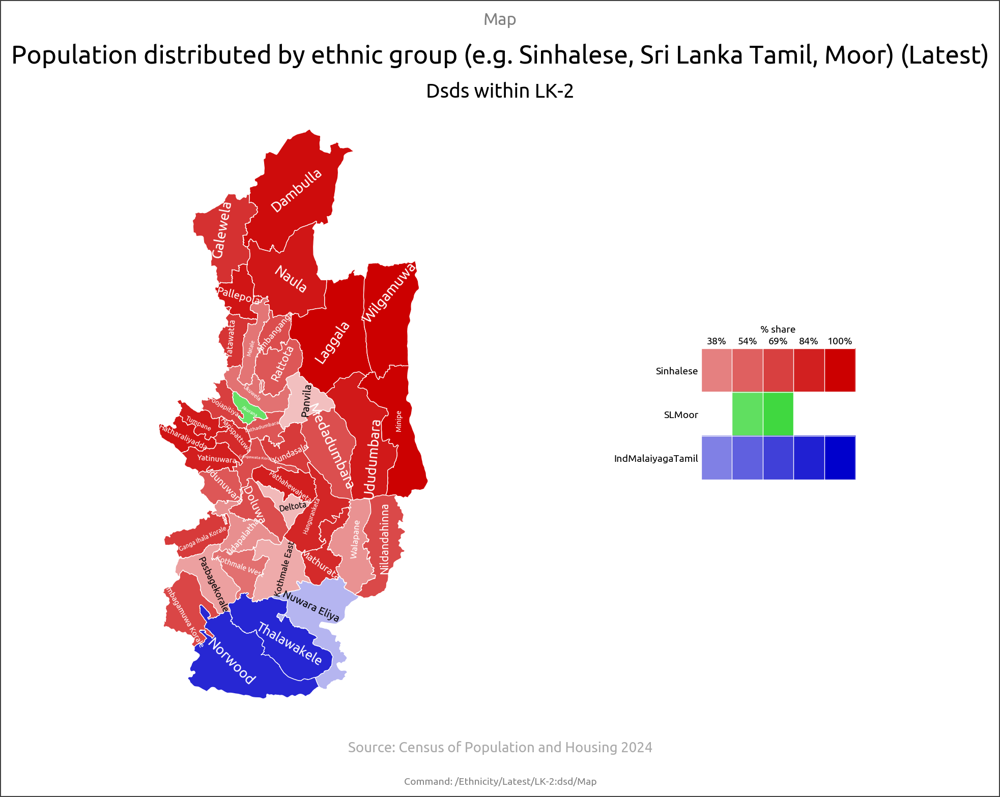

#### 5.03) `Ethnicity/2024/LK-23:dsd/Map`

Map of Population distributed by ethnic group (e.g. Sinhalese, Sri Lanka Tamil, Moor) (2024) for Dsds within LK-23.

```json
{
    "result": {
        "what_description": "Population distributed by ethnic group (e.g. Sinhalese, Sri Lanka Tamil, Moor)",
        "when_description": "2024",
        "where_description": "Dsds within LK-23",
        "how_description": "Map",
        "image_path": "/tmp/lanka_data/images/8e56f8e3.png",
        "source": "Department of Census and Statistics, Sri Lanka",
        "source_url": "https://www.statistics.gov.lk/",
        "cmd": "Ethnicity/2024/LK-23:dsd/Map"
    },
    "query_time_ms": 0,
    "cache_hit": false
}
```

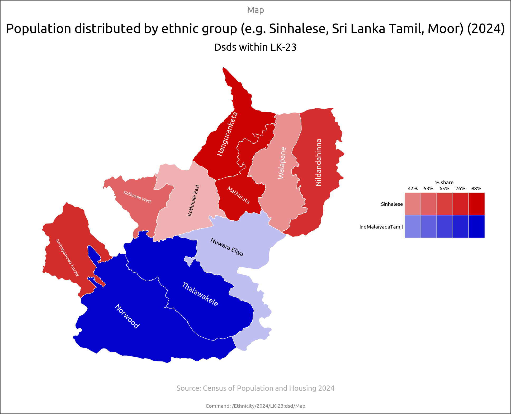

### 6) Elections

#### 6.01) `Parliamentary/2024/LK/JSON`

JSON data of Results of the 2024 Sri Lankan Parliamentary Election (2024) for Countrys with IDs LK.

```json
{
    "result": {
        "what_description": "Results of the 2024 Sri Lankan Parliamentary Election",
        "when_description": "2024",
        "where_description": "Countrys with IDs LK",
        "how_description": "JSON data",
        "data_list": [
            {
                "region_id": "LK",
                "region_name": "Sri Lanka",
                "region_type": "country",
                "history_year": "Current",
                "area_sqkm": 65983.58,
                "center_lat": 7.621863,
                "center_lng": 80.698448,
                "summary": {
                    "electors": 17140354,
                    "polled": 11815246,
                    "valid": 11148006,
                    "rejected": 667240,
                    ... // 1336 lines ...
                "IND36-13": 0.0,
                "IND42-13": 0.0,
                "IND34-13": 0.0,
                "IND26-12": 0.0,
                "IND05-13": 0.0,
                "IND07-13": 0.0,
                "IND08-14": 0.0,
                "IND32-13": 0.0,
                "IND40-13": 0.0,
                "IND37-13": 0.0,
                "IND33-13": 0.0
            }
        },
        "source": "Election Commission of Sri Lanka",
        "source_url": "https://www.elections.gov.lk",
        "cmd": "Parliamentary/2024/LK/JSON"
    },
    "query_time_ms": 0,
    "cache_hit": false
}
```

#### 6.02) `Presidential/Latest/LK-2:pd/Map`

Map of Results of the 2024 Sri Lankan Presidential Election (Latest) for Pds within LK-2.

```json
{
    "result": {
        "what_description": "Results of the 2024 Sri Lankan Presidential Election",
        "when_description": "Latest",
        "where_description": "Pds within LK-2",
        "how_description": "Map",
        "image_path": "/tmp/lanka_data/images/535aa587.png",
        "source": "Department of Census and Statistics, Sri Lanka",
        "source_url": "https://www.statistics.gov.lk/",
        "cmd": "Presidential/Latest/LK-2:pd/Map"
    },
    "query_time_ms": 0,
    "cache_hit": false
}
```

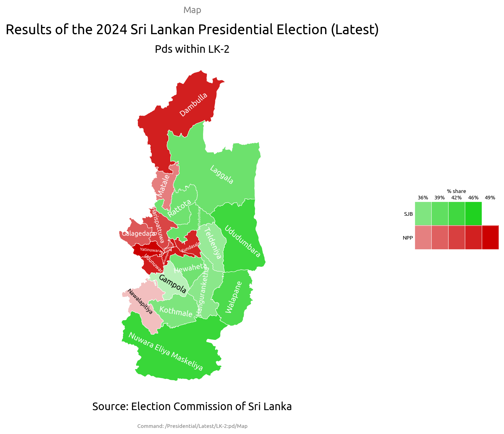

### 7) History

#### 7.01) `Basic/2012/LK-pre1984:district/JSON`

JSON data of Basic information (2012) for Districts within LK.

```json
{
    "result": {
        "what_description": "Basic information",
        "when_description": "2012",
        "where_description": "Districts within LK",
        "how_description": "JSON data",
        "data_list": [
            {
                "region_id": "LK-11",
                "region_name": "Colombo",
                "region_type": "district",
                "history_year": "1984",
                "area_sqkm": 688.17,
                "center_lat": 6.869822,
                "center_lng": 80.018487,
                "current_ids": [
                    "LK-11"
                ]
            },
            {
            ... // 264 lines ...
            {
                "region_id": "LK-92",
                "region_name": "Kegalle",
                "region_type": "district",
                "history_year": "1984",
                "area_sqkm": 1657.73,
                "center_lat": 7.104294,
                "center_lng": 80.342772,
                "current_ids": [
                    "LK-92"
                ]
            }
        ],
        "source": "Department of Census and Statistics, Sri Lanka",
        "source_url": "https://www.statistics.gov.lk/",
        "cmd": "Basic/2012/LK-pre1984:district/JSON"
    },
    "query_time_ms": 0,
    "cache_hit": false
}
```

#### 7.02) `Religion/2012/LK-pre1959:district/Map`

Map of Population distributed by religious affiliation such as Buddhist, Hindu, Islam, and Christian (2012) for Districts within LK.

```json
{
    "result": {
        "what_description": "Population distributed by religious affiliation such as Buddhist, Hindu, Islam, and Christian",
        "when_description": "2012",
        "where_description": "Districts within LK",
        "how_description": "Map",
        "image_path": "/tmp/lanka_data/images/581f1378.png",
        "source": "Department of Census and Statistics, Sri Lanka",
        "source_url": "https://www.statistics.gov.lk/",
        "cmd": "Religion/2012/LK-pre1959:district/Map"
    },
    "query_time_ms": 0,
    "cache_hit": false
}
```

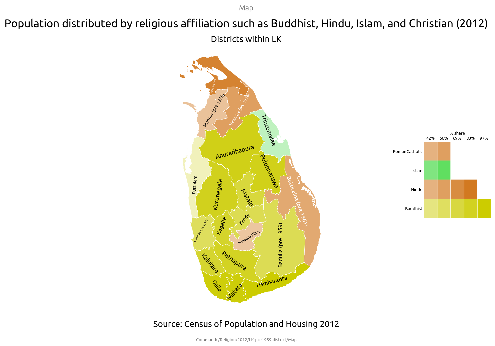

#### 7.03) `Basic/2012/LK-pre1845:province/Map`

Map of Basic information (2012) for Provinces within LK.

```json
{
    "result": {
        "what_description": "Basic information",
        "when_description": "2012",
        "where_description": "Provinces within LK",
        "how_description": "Map",
        "image_path": "/tmp/lanka_data/images/52038455.png",
        "source": "Department of Census and Statistics, Sri Lanka",
        "source_url": "https://www.statistics.gov.lk/",
        "cmd": "Basic/2012/LK-pre1845:province/Map"
    },
    "query_time_ms": 0,
    "cache_hit": false
}
```

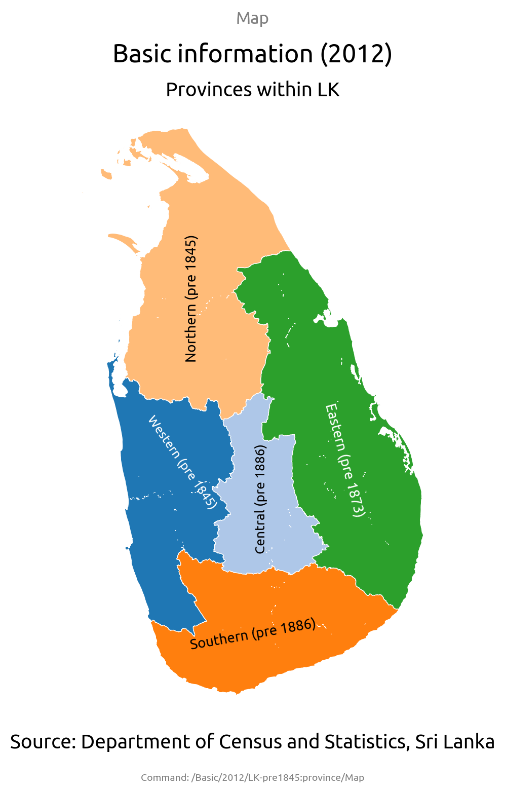

#### 7.04) `Ethnicity/2012/LK-23-pre2019:dsd/Map`

Map of Population distributed by ethnic group such as Sinhalese, Sri Lanka Tamil, Moor, and others (2012) for Dsds within LK-23.

```json
{
    "result": {
        "what_description": "Population distributed by ethnic group such as Sinhalese, Sri Lanka Tamil, Moor, and others",
        "when_description": "2012",
        "where_description": "Dsds within LK-23",
        "how_description": "Map",
        "image_path": "/tmp/lanka_data/images/e747034e.png",
        "source": "Department of Census and Statistics, Sri Lanka",
        "source_url": "https://www.statistics.gov.lk/",
        "cmd": "Ethnicity/2012/LK-23-pre2019:dsd/Map"
    },
    "query_time_ms": 0,
    "cache_hit": false
}
```

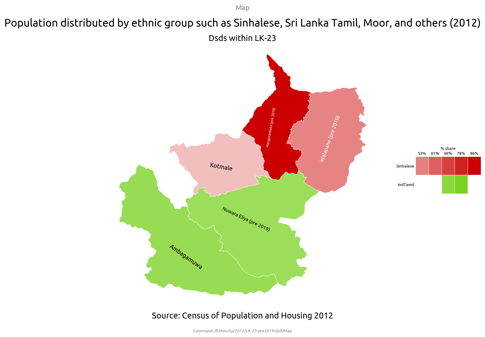

#### 7.05) `Ethnicity/2024/LK-23-pre2019:dsd/Map`

Map of Population distributed by ethnic group (e.g. Sinhalese, Sri Lanka Tamil, Moor) (2024) for Dsds within LK-23.

```json
{
    "result": {
        "what_description": "Population distributed by ethnic group (e.g. Sinhalese, Sri Lanka Tamil, Moor)",
        "when_description": "2024",
        "where_description": "Dsds within LK-23",
        "how_description": "Map",
        "image_path": "/tmp/lanka_data/images/8e56f8e3.png",
        "source": "Department of Census and Statistics, Sri Lanka",
        "source_url": "https://www.statistics.gov.lk/",
        "cmd": "Ethnicity/2024/LK-23-pre2019:dsd/Map"
    },
    "query_time_ms": 0,
    "cache_hit": false
}
```


### 8) Other-Whats

#### 8.01) `AgeGroup/2024/LK-1:district/Map`

Map of Population distributed across standard age bands (2024) for Districts within LK-1.

```json
{
    "result": {
        "what_description": "Population distributed across standard age bands",
        "when_description": "2024",
        "where_description": "Districts within LK-1",
        "how_description": "Map",
        "image_path": "/tmp/lanka_data/images/fc30a57a.png",
        "source": "Department of Census and Statistics, Sri Lanka",
        "source_url": "https://www.statistics.gov.lk/",
        "cmd": "AgeGroup/2024/LK-1:district/Map"
    },
    "query_time_ms": 0,
    "cache_hit": false
}
```

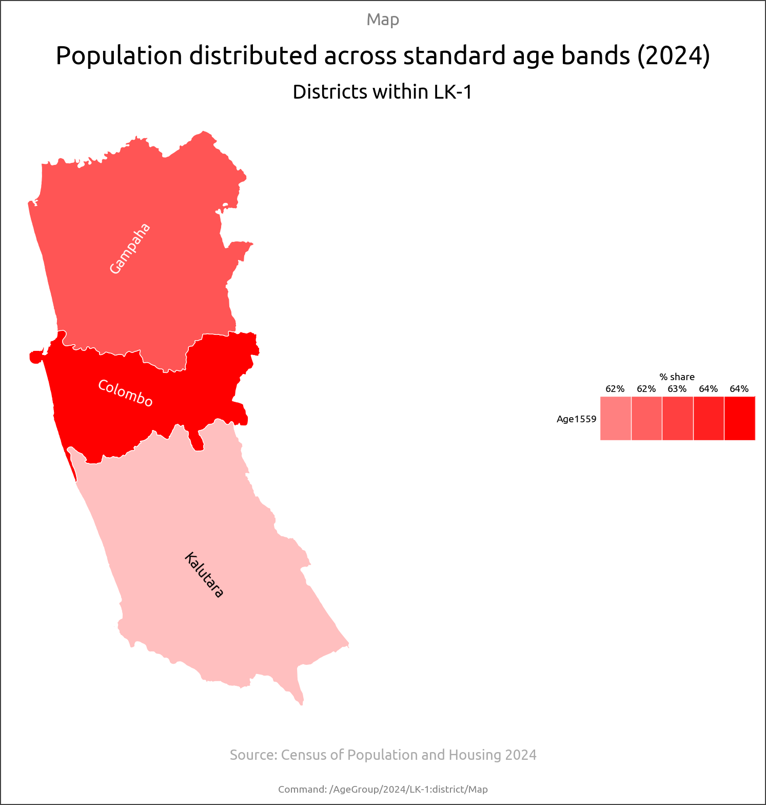

#### 8.02) `Communication/2012/LK-2:dsd/Map`

Map of Households classified by ownership of communication items such as telephone, radio, and television (2012) for Dsds within LK-2.

```json
{
    "result": {
        "what_description": "Households classified by ownership of communication items such as telephone, radio, and television",
        "when_description": "2012",
        "where_description": "Dsds within LK-2",
        "how_description": "Map",
        "image_path": "/tmp/lanka_data/images/48491cc4.png",
        "source": "Department of Census and Statistics, Sri Lanka",
        "source_url": "https://www.statistics.gov.lk/",
        "cmd": "Communication/2012/LK-2:dsd/Map"
    },
    "query_time_ms": 0,
    "cache_hit": false
}
```

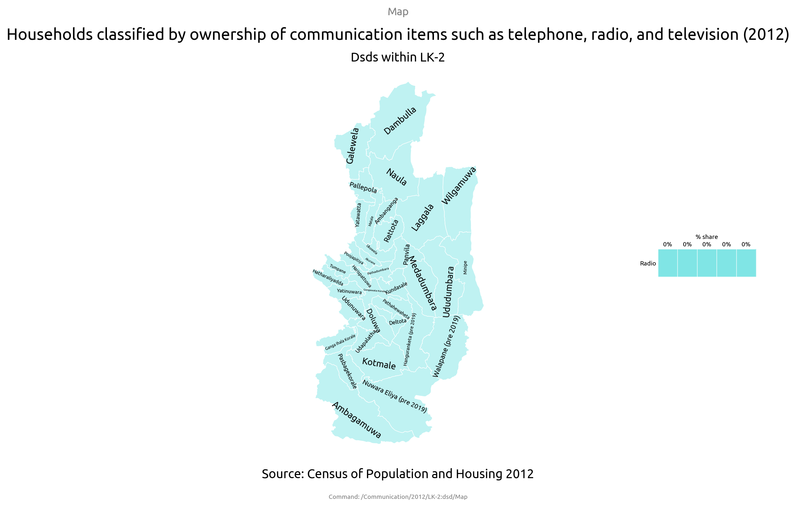

#### 8.03) `ConstructionYear/2012/LK-3:dsd/Map`

Map of Housing units classified by the decade or period in which they were constructed (2012) for Dsds within LK-3.

```json
{
    "result": {
        "what_description": "Housing units classified by the decade or period in which they were constructed",
        "when_description": "2012",
        "where_description": "Dsds within LK-3",
        "how_description": "Map",
        "image_path": "/tmp/lanka_data/images/b33d7da0.png",
        "source": "Department of Census and Statistics, Sri Lanka",
        "source_url": "https://www.statistics.gov.lk/",
        "cmd": "ConstructionYear/2012/LK-3:dsd/Map"
    },
    "query_time_ms": 0,
    "cache_hit": false
}
```

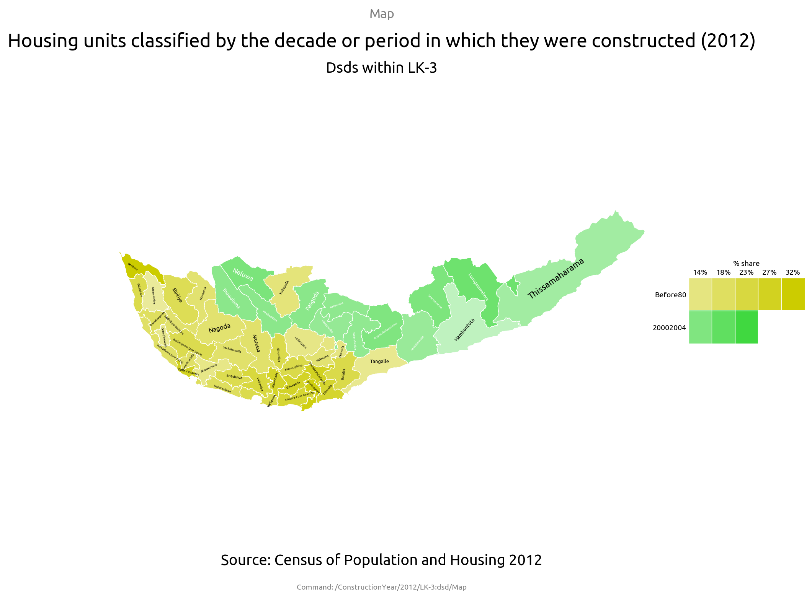

#### 8.04) `Fuel/2024/LK-4:dsd/Map`

Map of Number of households classified by the main fuel or energy source used for cooking (2024) for Dsds within LK-4.

```json
{
    "result": {
        "what_description": "Number of households classified by the main fuel or energy source used for cooking",
        "when_description": "2024",
        "where_description": "Dsds within LK-4",
        "how_description": "Map",
        "image_path": "/tmp/lanka_data/images/7b63105b.png",
        "source": "Department of Census and Statistics, Sri Lanka",
        "source_url": "https://www.statistics.gov.lk/",
        "cmd": "Fuel/2024/LK-4:dsd/Map"
    },
    "query_time_ms": 0,
    "cache_hit": false
}
```

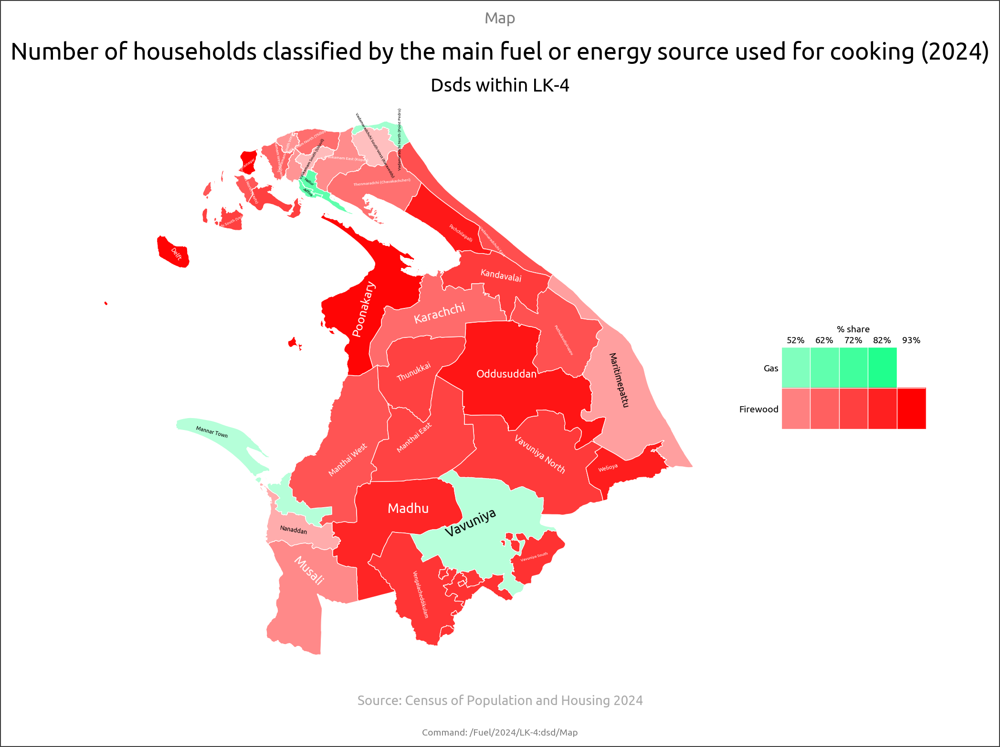

#### 8.05) `Economy/2012/LK-5:dsd/Map`

Map of Population classified by economic activity status including employed, unemployed, and economically inactive (2012) for Dsds within LK-5.

```json
{
    "result": {
        "what_description": "Population classified by economic activity status including employed, unemployed, and economically inactive",
        "when_description": "2012",
        "where_description": "Dsds within LK-5",
        "how_description": "Map",
        "image_path": "/tmp/lanka_data/images/ab12490b.png",
        "source": "Department of Census and Statistics, Sri Lanka",
        "source_url": "https://www.statistics.gov.lk/",
        "cmd": "Economy/2012/LK-5:dsd/Map"
    },
    "query_time_ms": 0,
    "cache_hit": false
}
```

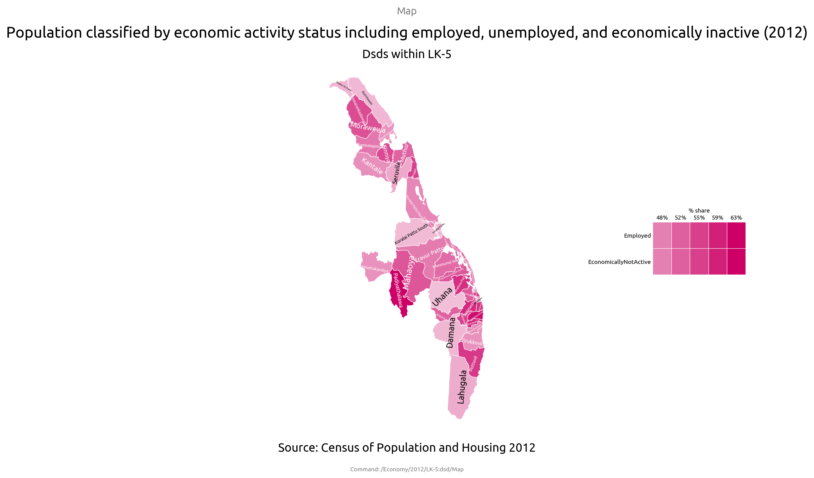

#### 8.06) `Education/2012/LK-6:dsd/Map`

Map of Population classified by the highest level of educational qualification attained (2012) for Dsds within LK-6.

```json
{
    "result": {
        "what_description": "Population classified by the highest level of educational qualification attained",
        "when_description": "2012",
        "where_description": "Dsds within LK-6",
        "how_description": "Map",
        "image_path": "/tmp/lanka_data/images/b29be328.png",
        "source": "Department of Census and Statistics, Sri Lanka",
        "source_url": "https://www.statistics.gov.lk/",
        "cmd": "Education/2012/LK-6:dsd/Map"
    },
    "query_time_ms": 0,
    "cache_hit": false
}
```

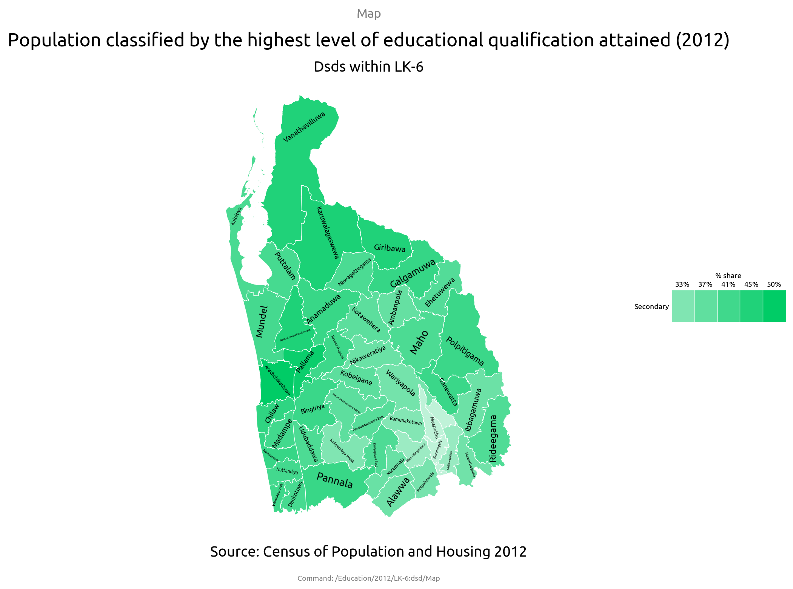

#### 8.07) `Energy/2024/LK-7:dsd/Map`

Map of Households classified by the main energy fuel used for any purpose (2024) for Dsds within LK-7.

```json
{
    "result": {
        "what_description": "Households classified by the main energy fuel used for any purpose",
        "when_description": "2024",
        "where_description": "Dsds within LK-7",
        "how_description": "Map",
        "image_path": "/tmp/lanka_data/images/c93741a2.png",
        "source": "Department of Census and Statistics, Sri Lanka",
        "source_url": "https://www.statistics.gov.lk/",
        "cmd": "Energy/2024/LK-7:dsd/Map"
    },
    "query_time_ms": 0,
    "cache_hit": false
}
```

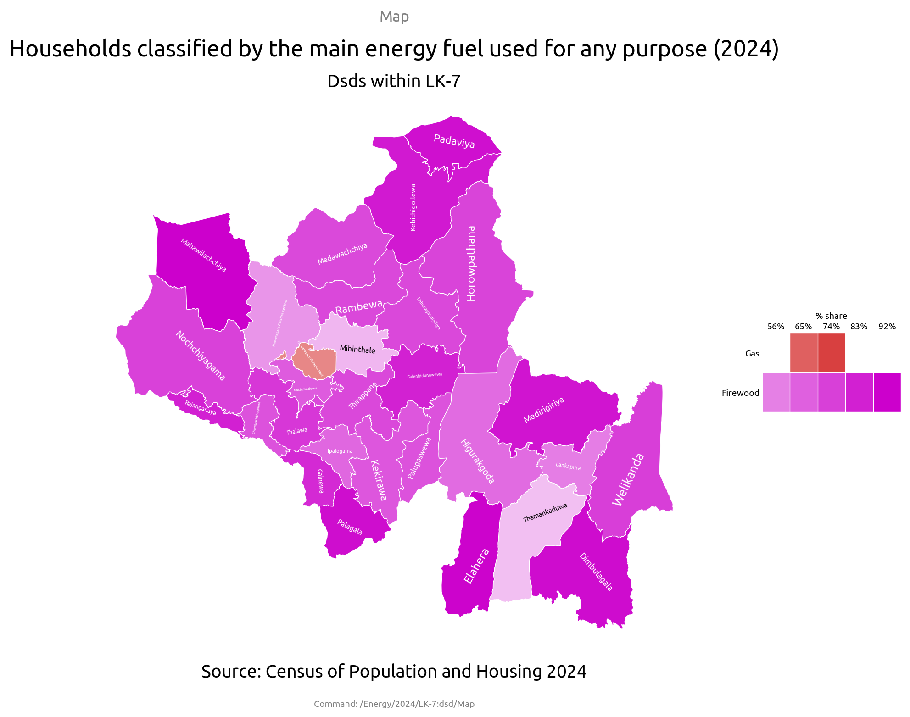

#### 8.08) `Floor/2024/LK-2,LK-3/Map`

Map of Households classified by the main material used for floor construction (e.g. cement, tile, mud) (2024) for Provinces with IDs LK-2,LK-3.

```json
{
    "result": {
        "what_description": "Households classified by the main material used for floor construction (e.g. cement, tile, mud)",
        "when_description": "2024",
        "where_description": "Provinces with IDs LK-2,LK-3",
        "how_description": "Map",
        "image_path": "/tmp/lanka_data/images/7f3bf03e.png",
        "source": "Department of Census and Statistics, Sri Lanka",
        "source_url": "https://www.statistics.gov.lk/",
        "cmd": "Floor/2024/LK-2,LK-3/Map"
    },
    "query_time_ms": 0,
    "cache_hit": false
}
```

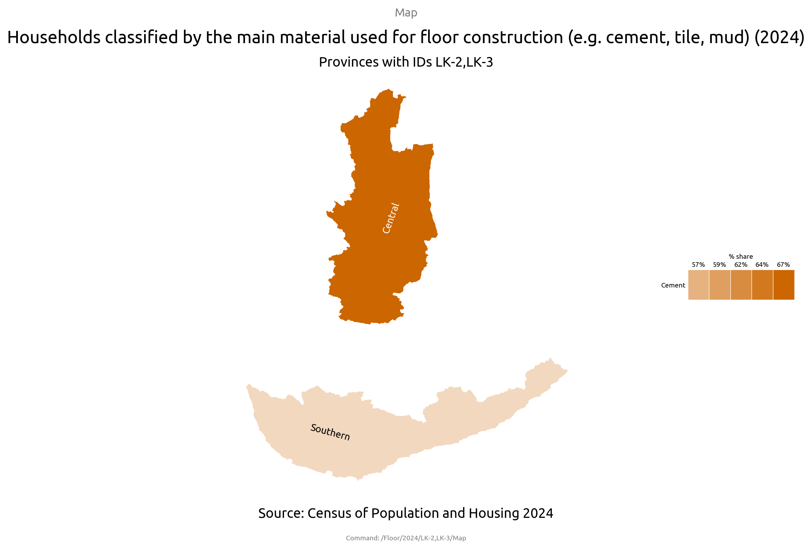

#### 8.09) `Gender/2024/LK-1127025@20/Map`

Map of Population broken down by male and female (2024) for Gnds within 20 km of LK-1127025.

```json
{
    "result": {
        "what_description": "Population broken down by male and female",
        "when_description": "2024",
        "where_description": "Gnds within 20 km of LK-1127025",
        "how_description": "Map",
        "image_path": "/tmp/lanka_data/images/a9bb4fea.png",
        "source": "Department of Census and Statistics, Sri Lanka",
        "source_url": "https://www.statistics.gov.lk/",
        "cmd": "Gender/2024/LK-1127025@20/Map"
    },
    "query_time_ms": 0,
    "cache_hit": false
}
```

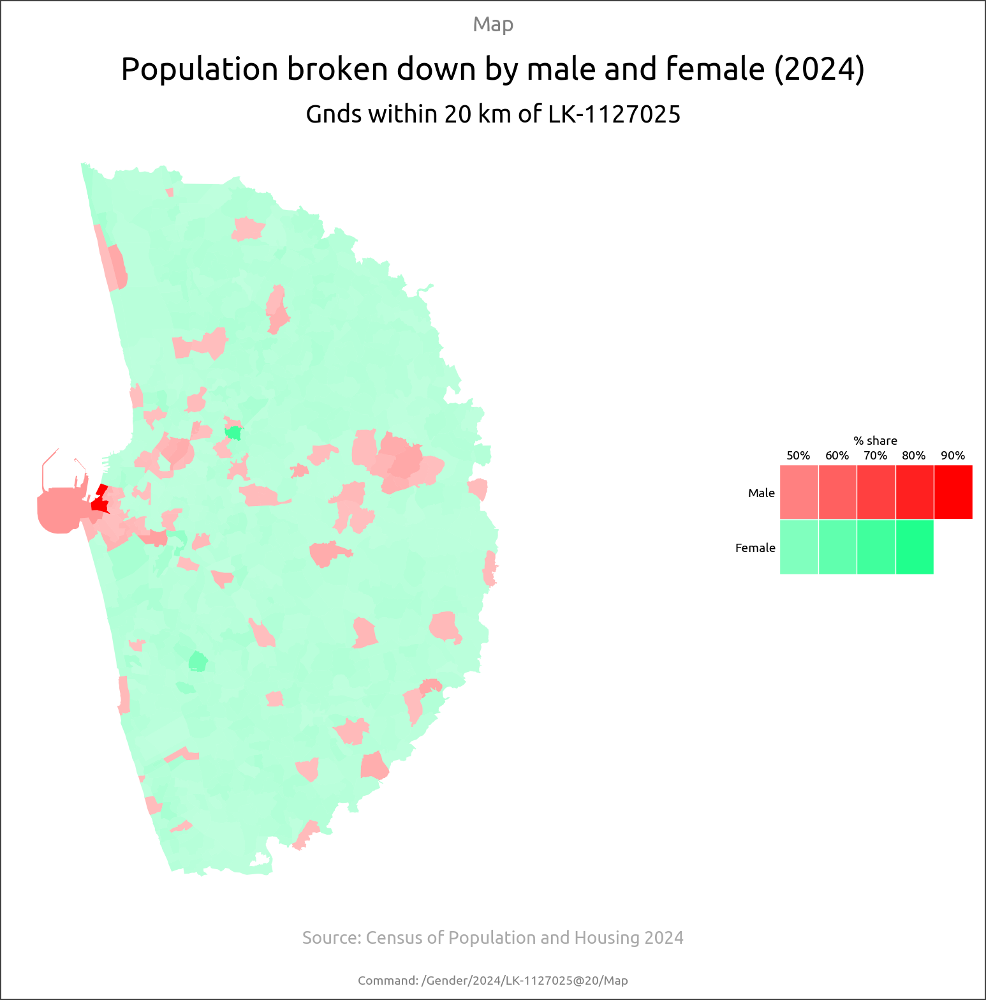

#### 8.10) `GenderAndAgeGroup/2024/LK-1103/Map`

Map of Population cross-tabulated by sex and age group (2024) for Dsds with IDs LK-1103.

```json
{
    "result": {
        "what_description": "Population cross-tabulated by sex and age group",
        "when_description": "2024",
        "where_description": "Dsds with IDs LK-1103",
        "how_description": "Map",
        "image_path": "/tmp/lanka_data/images/47e1ee3a.png",
        "source": "Department of Census and Statistics, Sri Lanka",
        "source_url": "https://www.statistics.gov.lk/",
        "cmd": "GenderAndAgeGroup/2024/LK-1103/Map"
    },
    "query_time_ms": 0,
    "cache_hit": false
}
```

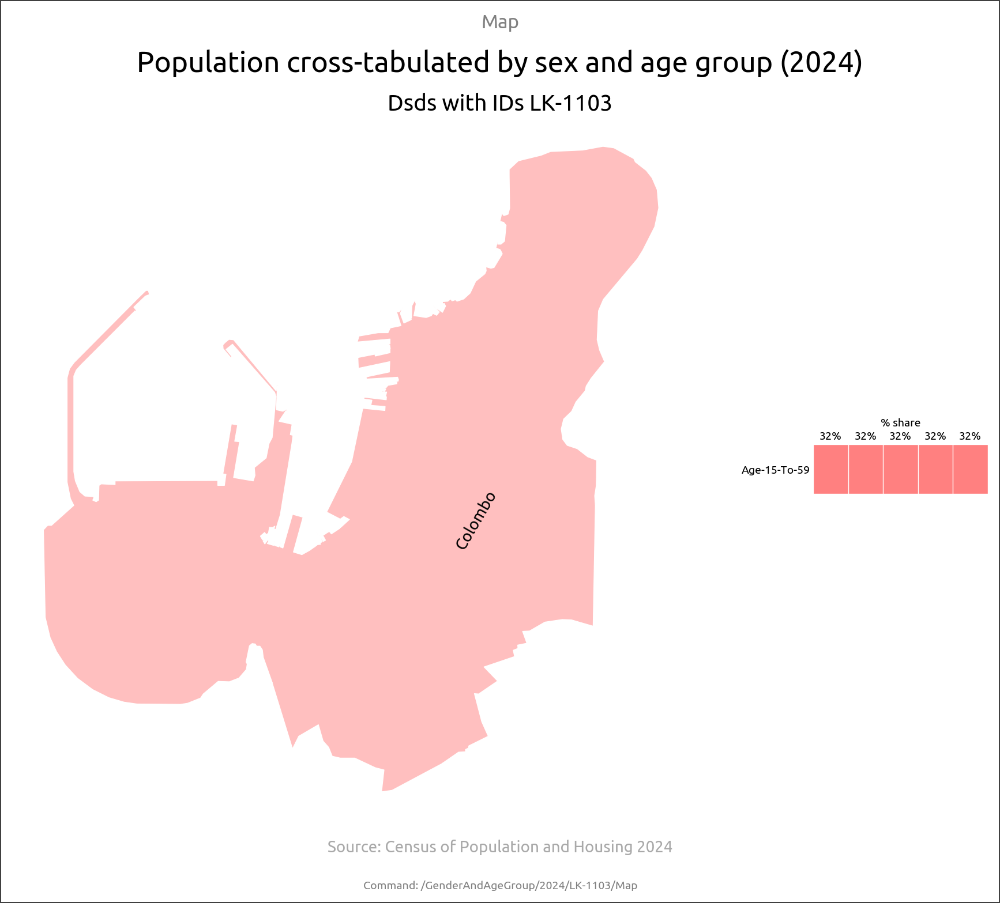

#### 8.11) `Lighting/2024/LK-61:dsd/Map`

Map of Number of households classified by their primary source of lighting (2024) for Dsds within LK-61.

```json
{
    "result": {
        "what_description": "Number of households classified by their primary source of lighting",
        "when_description": "2024",
        "where_description": "Dsds within LK-61",
        "how_description": "Map",
        "image_path": "/tmp/lanka_data/images/c17cb1b8.png",
        "source": "Department of Census and Statistics, Sri Lanka",
        "source_url": "https://www.statistics.gov.lk/",
        "cmd": "Lighting/2024/LK-61:dsd/Map"
    },
    "query_time_ms": 0,
    "cache_hit": false
}
```

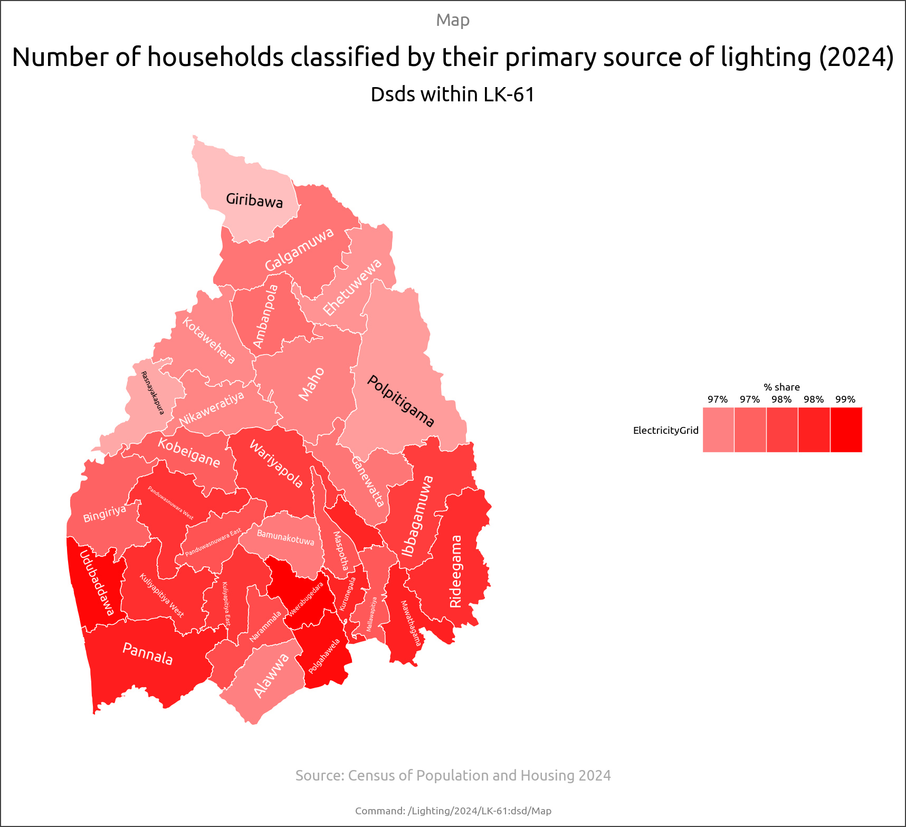

#### 8.12) `Local/2025/LK:district/Map`

Map of Results of the 2025 Sri Lankan Local Election (2025) for Districts within LK.

```json
{
    "result": {
        "what_description": "Results of the 2025 Sri Lankan Local Election",
        "when_description": "2025",
        "where_description": "Districts within LK",
        "how_description": "Map",
        "image_path": "/tmp/lanka_data/images/90997add.png",
        "source": "Department of Census and Statistics, Sri Lanka",
        "source_url": "https://www.statistics.gov.lk/",
        "cmd": "Local/2025/LK:district/Map"
    },
    "query_time_ms": 0,
    "cache_hit": false
}
```

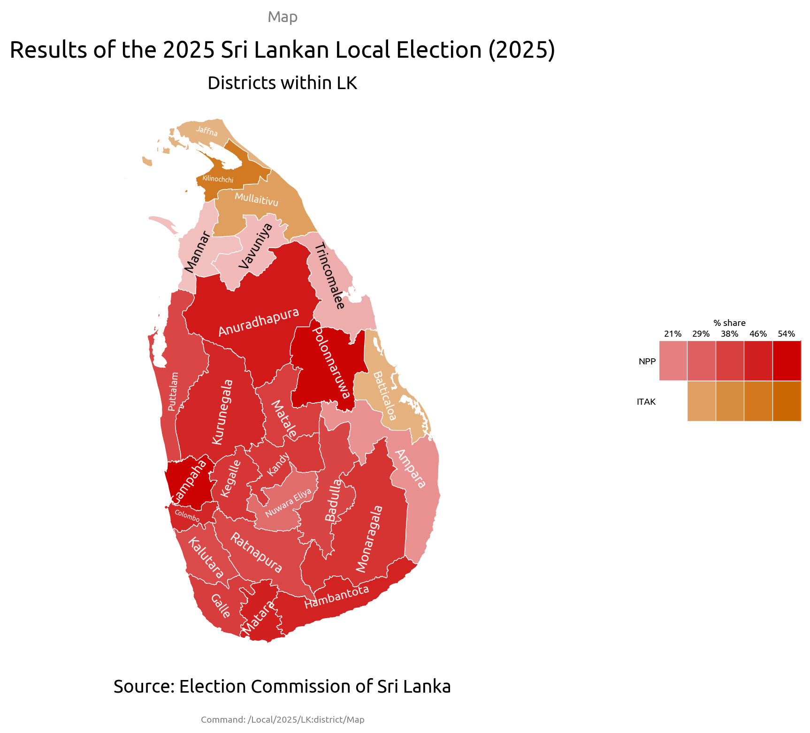

#### 8.13) `Marital/2012/LK-3,LK-9,LK-8/Map`

Map of Population classified by marital status such as never married, married, widowed, and divorced (2012) for Provinces with IDs LK-3,LK-9,LK-8.

```json
{
    "result": {
        "what_description": "Population classified by marital status such as never married, married, widowed, and divorced",
        "when_description": "2012",
        "where_description": "Provinces with IDs LK-3,LK-9,LK-8",
        "how_description": "Map",
        "image_path": "/tmp/lanka_data/images/14c4da11.png",
        "source": "Department of Census and Statistics, Sri Lanka",
        "source_url": "https://www.statistics.gov.lk/",
        "cmd": "Marital/2012/LK-3,LK-9,LK-8/Map"
    },
    "query_time_ms": 0,
    "cache_hit": false
}
```

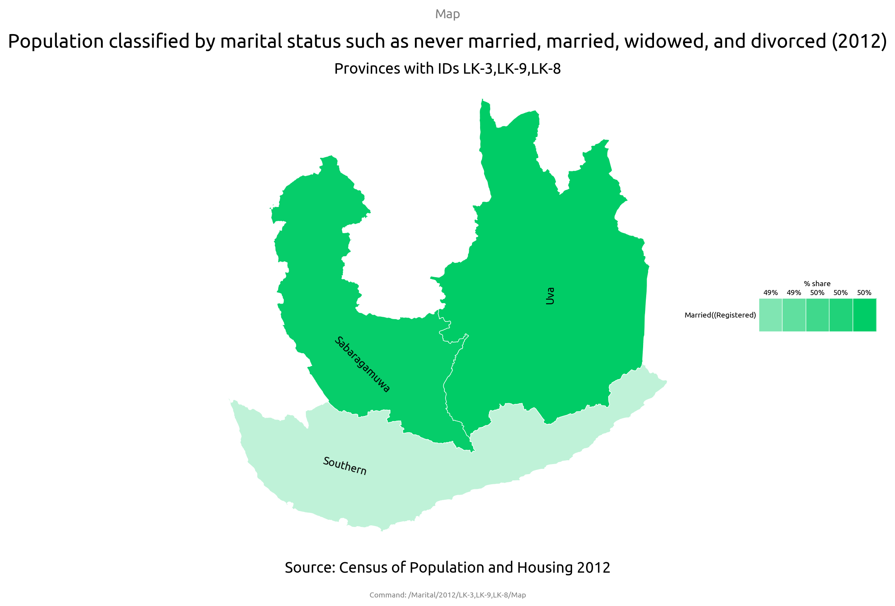

#### 8.14) `Occupancy/2012/LK-1127:gnd/Map`

Map of Housing units classified by occupancy status, distinguishing occupied from vacant units (2012) for Gnds within LK-1127.

```json
{
    "result": {
        "what_description": "Housing units classified by occupancy status, distinguishing occupied from vacant units",
        "when_description": "2012",
        "where_description": "Gnds within LK-1127",
        "how_description": "Map",
        "image_path": "/tmp/lanka_data/images/e09aca73.png",
        "source": "Department of Census and Statistics, Sri Lanka",
        "source_url": "https://www.statistics.gov.lk/",
        "cmd": "Occupancy/2012/LK-1127:gnd/Map"
    },
    "query_time_ms": 0,
    "cache_hit": false
}
```

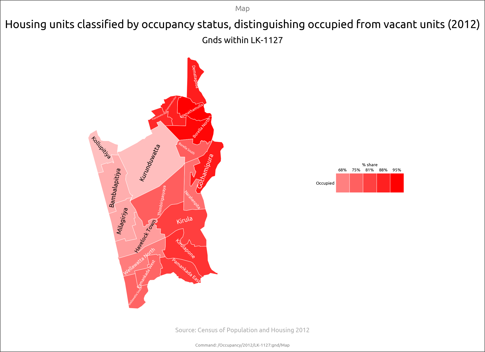

#### 8.15) `Ownership/2012/LK-53:dsd/Map`

Map of Households classified by the ownership status of their dwelling, such as owned or rented (2012) for Dsds within LK-53.

```json
{
    "result": {
        "what_description": "Households classified by the ownership status of their dwelling, such as owned or rented",
        "when_description": "2012",
        "where_description": "Dsds within LK-53",
        "how_description": "Map",
        "image_path": "/tmp/lanka_data/images/04ab4952.png",
        "source": "Department of Census and Statistics, Sri Lanka",
        "source_url": "https://www.statistics.gov.lk/",
        "cmd": "Ownership/2012/LK-53:dsd/Map"
    },
    "query_time_ms": 0,
    "cache_hit": false
}
```

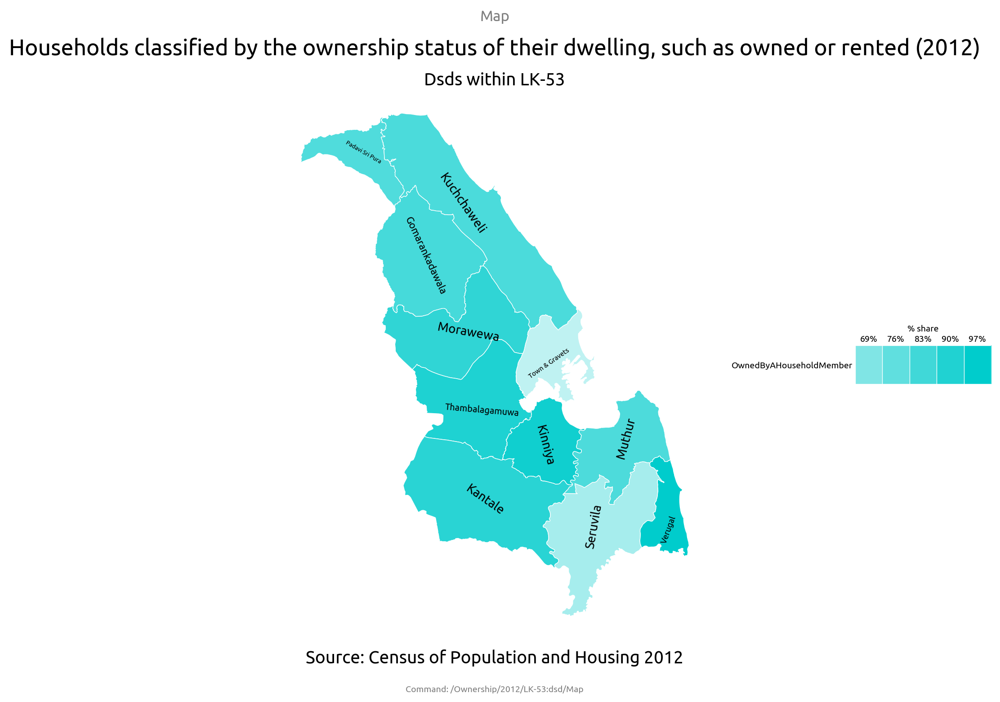

#### 8.16) `Quarters/2012/LK-4...LK-6/Map`

Map of Households classified by the type of living quarters such as housing units, collective living quarters, and makeshift housing (2012) for Provinces, from LK-4 to LK-6.

```json
{
    "result": {
        "what_description": "Households classified by the type of living quarters such as housing units, collective living quarters, and makeshift housing",
        "when_description": "2012",
        "where_description": "Provinces, from LK-4 to LK-6",
        "how_description": "Map",
        "image_path": "/tmp/lanka_data/images/657e433d.png",
        "source": "Department of Census and Statistics, Sri Lanka",
        "source_url": "https://www.statistics.gov.lk/",
        "cmd": "Quarters/2012/LK-4...LK-6/Map"
    },
    "query_time_ms": 0,
    "cache_hit": false
}
```

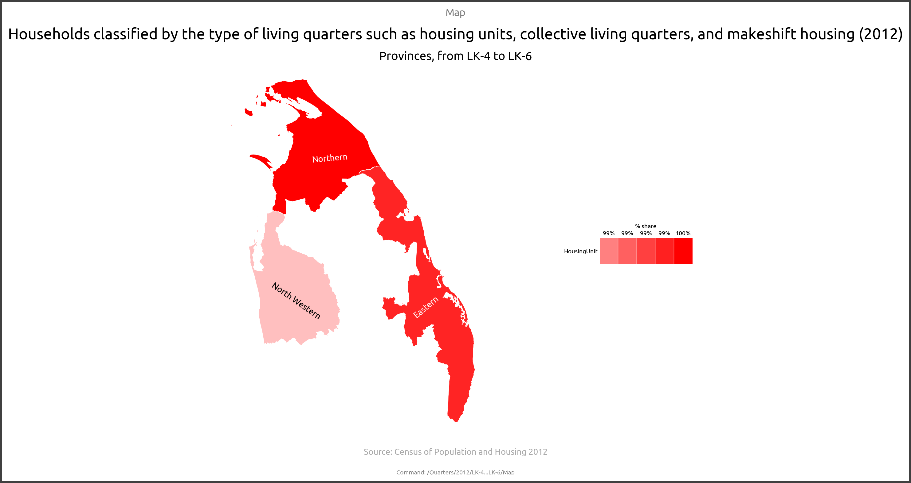

#### 8.17) `RelationshipToHead/2012/LK-23:dsd/Map`

Map of Population classified by their relationship to the head of the household (2012) for Dsds within LK-23.

```json
{
    "result": {
        "what_description": "Population classified by their relationship to the head of the household",
        "when_description": "2012",
        "where_description": "Dsds within LK-23",
        "how_description": "Map",
        "image_path": "/tmp/lanka_data/images/12793d6f.png",
        "source": "Department of Census and Statistics, Sri Lanka",
        "source_url": "https://www.statistics.gov.lk/",
        "cmd": "RelationshipToHead/2012/LK-23:dsd/Map"
    },
    "query_time_ms": 0,
    "cache_hit": false
}
```

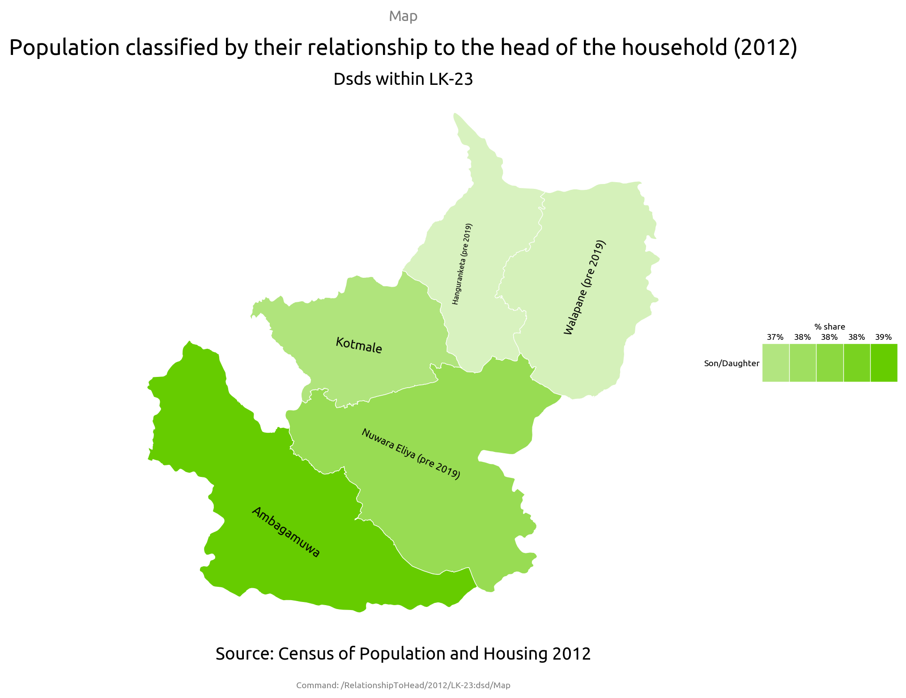

#### 8.18) `Roof/2024/LK-9:dsd/Map`

Map of Housing units classified by the main material used for roof construction (e.g. tile, sheet, concrete) (2024) for Dsds within LK-9.

```json
{
    "result": {
        "what_description": "Housing units classified by the main material used for roof construction (e.g. tile, sheet, concrete)",
        "when_description": "2024",
        "where_description": "Dsds within LK-9",
        "how_description": "Map",
        "image_path": "/tmp/lanka_data/images/07980346.png",
        "source": "Department of Census and Statistics, Sri Lanka",
        "source_url": "https://www.statistics.gov.lk/",
        "cmd": "Roof/2024/LK-9:dsd/Map"
    },
    "query_time_ms": 0,
    "cache_hit": false
}
```

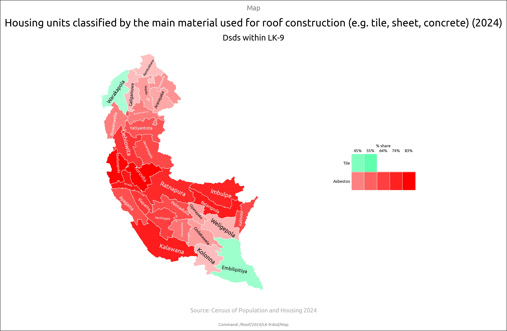

#### 8.19) `Rooms/2012/LK-2:pd/Map`

Map of Households classified by the number of rooms in the dwelling (2012) for Pds within LK-2.

```json
{
    "result": {
        "what_description": "Households classified by the number of rooms in the dwelling",
        "when_description": "2012",
        "where_description": "Pds within LK-2",
        "how_description": "Map",
        "image_path": "/tmp/lanka_data/images/5517e3d3.png",
        "source": "Department of Census and Statistics, Sri Lanka",
        "source_url": "https://www.statistics.gov.lk/",
        "cmd": "Rooms/2012/LK-2:pd/Map"
    },
    "query_time_ms": 0,
    "cache_hit": false
}
```

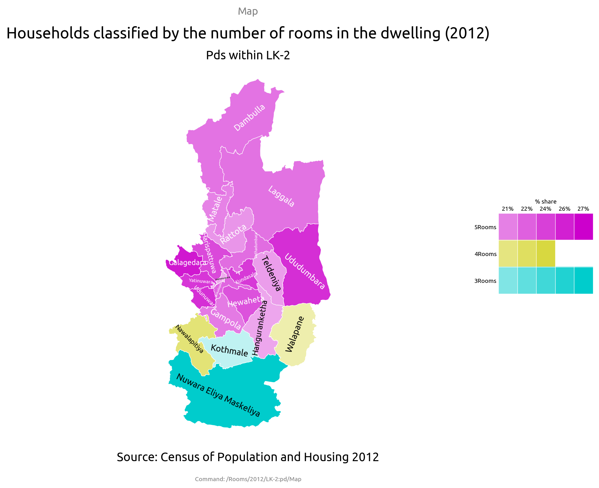

#### 8.20) `Structure/2024/LK-3:district/Map`

Map of Housing units classified by structural type (e.g. permanent, semi-permanent, temporary) (2024) for Districts within LK-3.

```json
{
    "result": {
        "what_description": "Housing units classified by structural type (e.g. permanent, semi-permanent, temporary)",
        "when_description": "2024",
        "where_description": "Districts within LK-3",
        "how_description": "Map",
        "image_path": "/tmp/lanka_data/images/779a358c.png",
        "source": "Department of Census and Statistics, Sri Lanka",
        "source_url": "https://www.statistics.gov.lk/",
        "cmd": "Structure/2024/LK-3:district/Map"
    },
    "query_time_ms": 0,
    "cache_hit": false
}
```

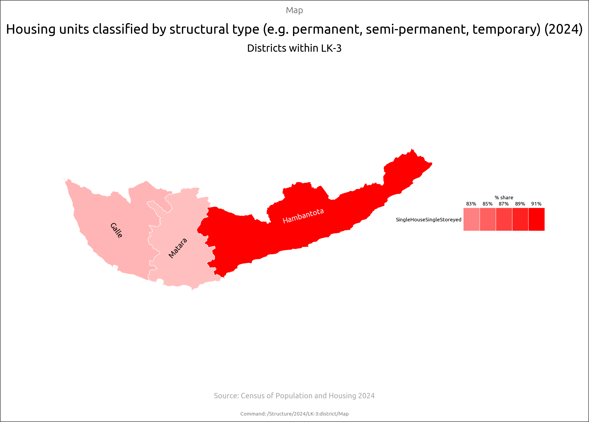

#### 8.21) `Toilet/2024/LK-5:dsd/Map`

Map of Number of households classified by the type of toilet facility used (2024) for Dsds within LK-5.

```json
{
    "result": {
        "what_description": "Number of households classified by the type of toilet facility used",
        "when_description": "2024",
        "where_description": "Dsds within LK-5",
        "how_description": "Map",
        "image_path": "/tmp/lanka_data/images/22a03fe8.png",
        "source": "Department of Census and Statistics, Sri Lanka",
        "source_url": "https://www.statistics.gov.lk/",
        "cmd": "Toilet/2024/LK-5:dsd/Map"
    },
    "query_time_ms": 0,
    "cache_hit": false
}
```

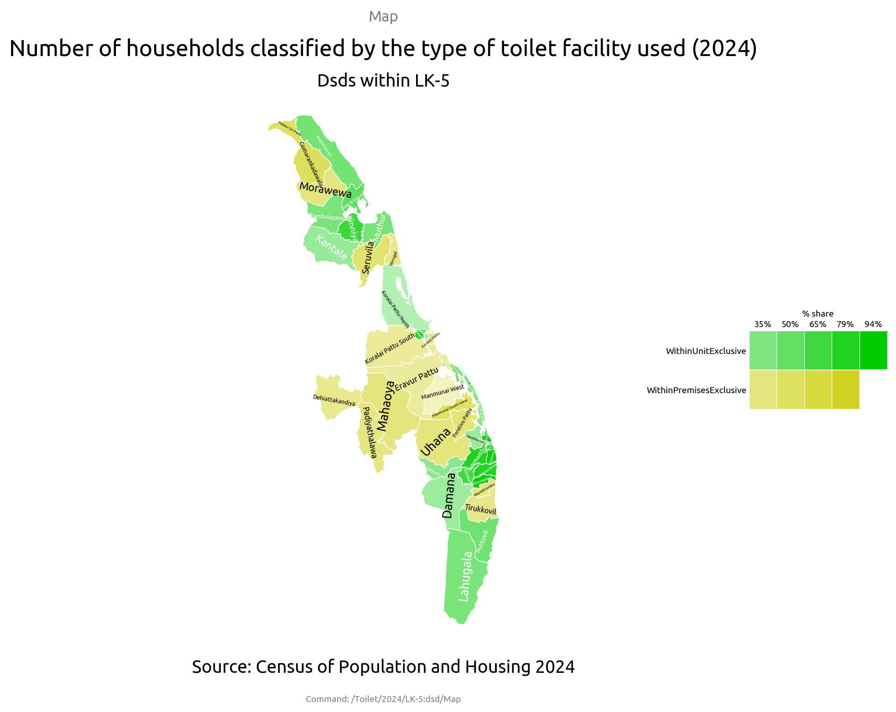

#### 8.22) `Walls/2024/LK-8:dsd/Map`

Map of Housing units classified by the main material used for wall construction (e.g. brick, cabook, cadjan) (2024) for Dsds within LK-8.

```json
{
    "result": {
        "what_description": "Housing units classified by the main material used for wall construction (e.g. brick, cabook, cadjan)",
        "when_description": "2024",
        "where_description": "Dsds within LK-8",
        "how_description": "Map",
        "image_path": "/tmp/lanka_data/images/13043e75.png",
        "source": "Department of Census and Statistics, Sri Lanka",
        "source_url": "https://www.statistics.gov.lk/",
        "cmd": "Walls/2024/LK-8:dsd/Map"
    },
    "query_time_ms": 0,
    "cache_hit": false
}
```

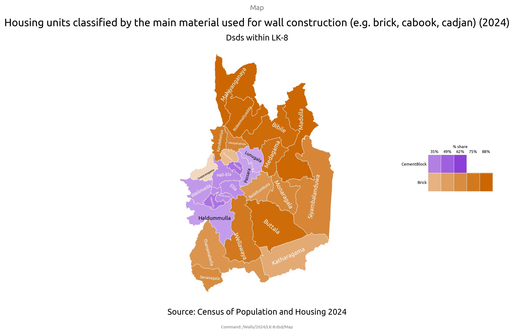

#### 8.23) `Waste/2012/LK-1:dsd/Map`

Map of Households classified by the method used for solid waste disposal (2012) for Dsds within LK-1.

```json
{
    "result": {
        "what_description": "Households classified by the method used for solid waste disposal",
        "when_description": "2012",
        "where_description": "Dsds within LK-1",
        "how_description": "Map",
        "image_path": "/tmp/lanka_data/images/0e97efe7.png",
        "source": "Department of Census and Statistics, Sri Lanka",
        "source_url": "https://www.statistics.gov.lk/",
        "cmd": "Waste/2012/LK-1:dsd/Map"
    },
    "query_time_ms": 0,
    "cache_hit": false
}
```

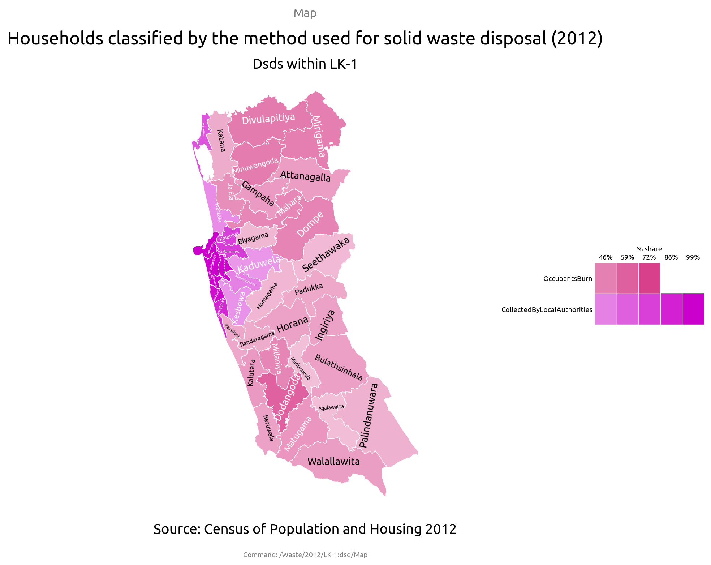

#### 8.24) `Water/2024/LK-2,LK-4/Map`

Map of Number of households classified by their main source of drinking water (2024) for Provinces with IDs LK-2,LK-4.

```json
{
    "result": {
        "what_description": "Number of households classified by their main source of drinking water",
        "when_description": "2024",
        "where_description": "Provinces with IDs LK-2,LK-4",
        "how_description": "Map",
        "image_path": "/tmp/lanka_data/images/10799406.png",
        "source": "Department of Census and Statistics, Sri Lanka",
        "source_url": "https://www.statistics.gov.lk/",
        "cmd": "Water/2024/LK-2,LK-4/Map"
    },
    "query_time_ms": 0,
    "cache_hit": false
}
```


[](https://opensource.org/licenses/MIT)
