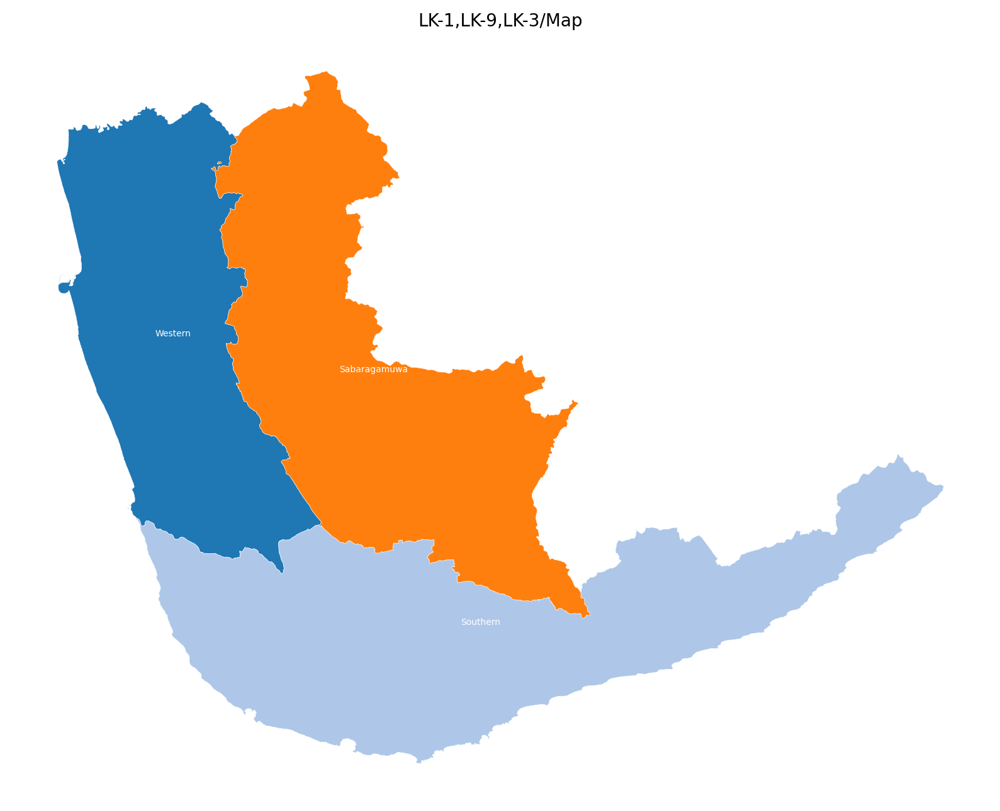
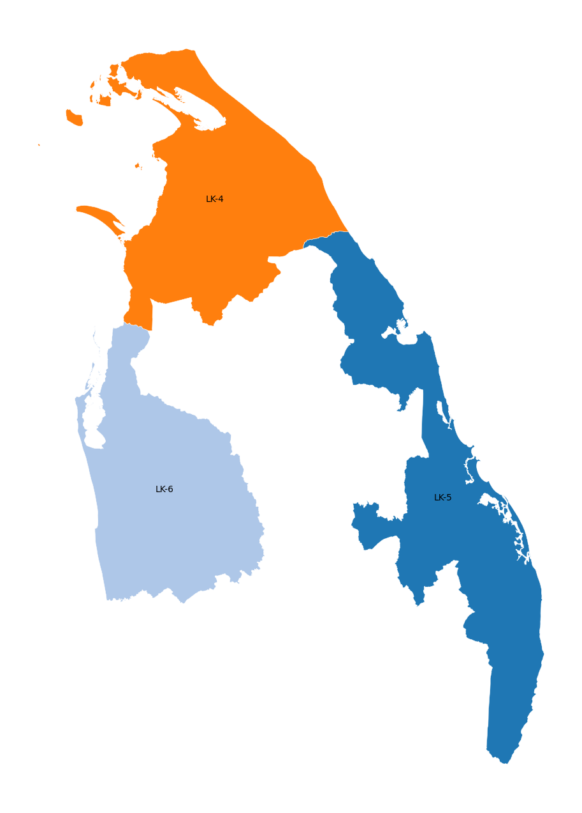
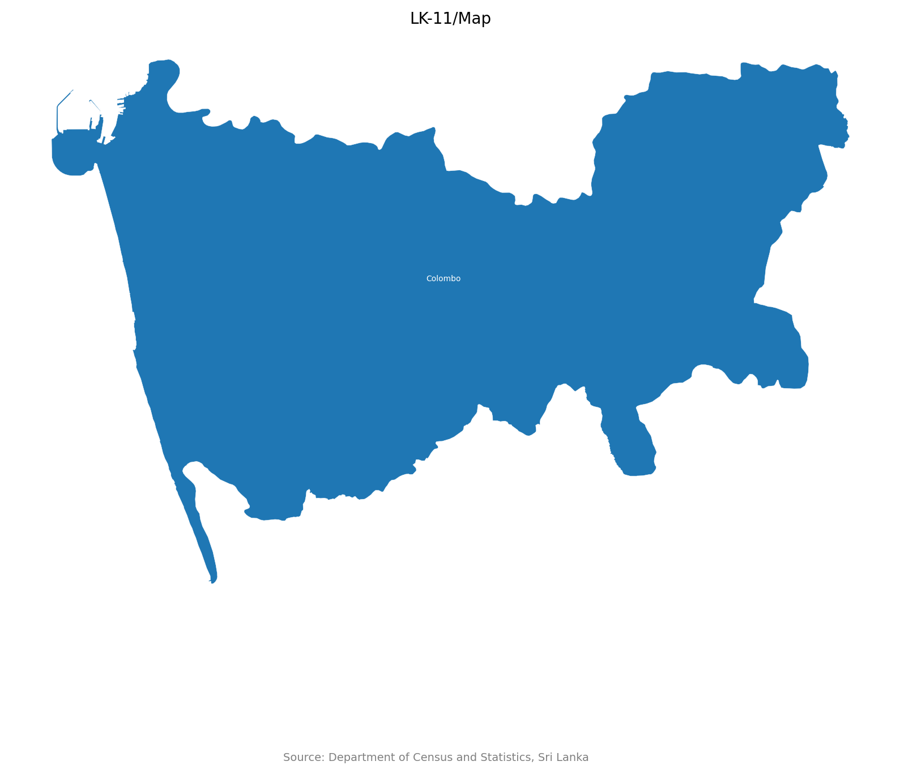
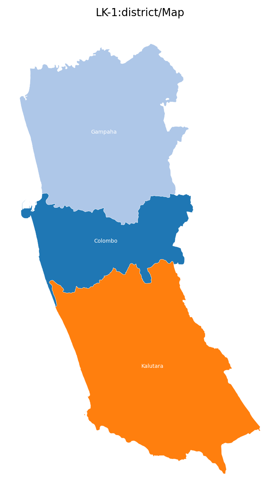
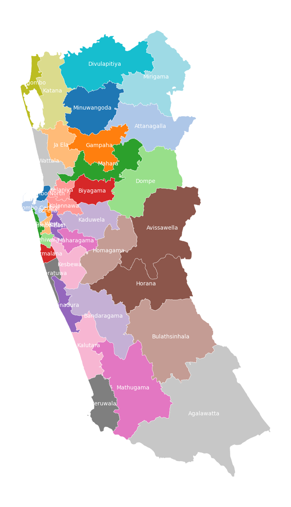

# Lanka Data

This repo implements a simple interface to query data about Sri Lanka.

## Data Sources

- [Census of Population and Housing 2012](https://www.statistics.gov.lk/Resource/en/Population/CPH_2011/CPH_2012_5Per_Rpt.pdf)
- [Census of Population and Housing 2024](https://www.statistics.gov.lk/Population/StaticalInformation/CPH2024)
- [Department of Census and Statistics, Sri Lanka](https://www.statistics.gov.lk/)
- [Election Commission of Sri Lanka](https://www.elections.gov.lk)

## Usage

### Run Code

```python
from lanka_data import Db


db = Db("<cmd>")
output = db.run()
print(output)

```

### workflows/run.py

```bash
python workflows/run.py <cmd>
```

### workflows/console.py

```bash
python workflows/console.py <cmd>

/Where/What/When/How

> /<cmd>
```

## Example Commands (`<cmd>`)

### 01. `LK`

```json
{
    "result": {
        "data_list": [
            {
                "region_id": "LK",
                "region_name": "Sri Lanka",
                "region_type": "country",
                "area_sqkm": 65983.58,
                "center_lat": 7.621863,
                "center_lng": 80.698448
            }
        ],
        "source": "Department of Census and Statistics, Sri Lanka",
        "source_url": "https://www.statistics.gov.lk/"
    },
    "query_time_ms": 0,
    "cache_hit": false
}
```

### 02. `LK-99`

```json
{
    "error": "Region ID not found: LK-99"
}
```

### 03. `LK-1:district`

```json
{
    "result": {
        "data_list": [
            {
                "region_id": "LK-11",
                "region_name": "Colombo",
                "region_type": "district",
                "area_sqkm": 688.17,
                "center_lat": 6.869822,
                "center_lng": 80.018487,
                "province_id": "LK-1",
                "ed_id": "EC-01",
                "pd_id": null
            },
            {
                "region_id": "LK-12",
                "region_name": "Gampaha",
                "region_type": "district",
                "area_sqkm": 1385.23,
                "center_lat": 7.123406,
                ... // 3 lines ...
                "pd_id": null
            },
            {
                "region_id": "LK-13",
                "region_name": "Kalutara",
                "region_type": "district",
                "area_sqkm": 1646.99,
                "center_lat": 6.577185,
                "center_lng": 80.127744,
                "province_id": "LK-1",
                "ed_id": "EC-03",
                "pd_id": null
            }
        ],
        "source": "Department of Census and Statistics, Sri Lanka",
        "source_url": "https://www.statistics.gov.lk/"
    },
    "query_time_ms": 0,
    "cache_hit": false
}
```

### 04. `LK-1,LK-2`

```json
{
    "result": {
        "data_list": [
            {
                "region_id": "LK-1",
                "region_name": "Western",
                "region_type": "province",
                "area_sqkm": 3720.39,
                "center_lat": 6.834692,
                "center_lng": 80.06675
            },
            {
                "region_id": "LK-2",
                "region_name": "Central",
                "region_type": "province",
                "area_sqkm": 5731.25,
                "center_lat": 7.324022,
                "center_lng": 80.717397
            }
        ],
        "source": "Department of Census and Statistics, Sri Lanka",
        "source_url": "https://www.statistics.gov.lk/"
    },
    "query_time_ms": 0,
    "cache_hit": false
}
```

### 05. `LK-1,LK-9,LK-3/Map`

```json
{
    "result": {
        "image_path": "/tmp/lanka_data/cache/00b5c25f.png",
        "source": "Department of Census and Statistics, Sri Lanka",
        "source_url": "https://www.statistics.gov.lk/"
    },
    "query_time_ms": 126,
    "cache_hit": false
}
```



### 06. `LK-4...LK-6/Map`

```json
{
    "result": {
        "image_path": "/tmp/lanka_data/cache/7359ab60.png",
        "source": "Department of Census and Statistics, Sri Lanka",
        "source_url": "https://www.statistics.gov.lk/"
    },
    "query_time_ms": 50,
    "cache_hit": false
}
```



### 07. `LK-11/Map`

```json
{
    "result": {
        "image_path": "/tmp/lanka_data/cache/4cb7cf4c.png",
        "source": "Department of Census and Statistics, Sri Lanka",
        "source_url": "https://www.statistics.gov.lk/"
    },
    "query_time_ms": 41,
    "cache_hit": false
}
```



### 08. `LK-1:district/Map`

```json
{
    "result": {
        "image_path": "/tmp/lanka_data/cache/11923f96.png",
        "source": "Department of Census and Statistics, Sri Lanka",
        "source_url": "https://www.statistics.gov.lk/"
    },
    "query_time_ms": 32,
    "cache_hit": false
}
```



### 09. `LK-1:pd/Map`

```json
{
    "result": {
        "image_path": "/tmp/lanka_data/cache/7e17ed4b.png",
        "source": "Department of Census and Statistics, Sri Lanka",
        "source_url": "https://www.statistics.gov.lk/"
    },
    "query_time_ms": 68,
    "cache_hit": false
}
```



### 10. `LK-1103/Religion/2024`

```json
{
    "result": {
        "data_list": [
            {
                "region_id": "LK-1103",
                "region_name": "Colombo",
                "values": {
                    "islam": 125890,
                    "hindu": 71811,
                    "buddhist": 47726,
                    "roman_catholic": 36117,
                    "other_christian": 10381,
                    "other": 164
                },
                "total_value": 292089,
                "pct_values": {
                    "islam": 0.431,
                    "hindu": 0.2459,
                    "buddhist": 0.1634,
                    "roman_catholic": 0.1237,
                    "other_christian": 0.0355,
                    "other": 0.0006
                }
            }
        ],
        "source": "Census of Population and Housing 2024",
        "source_url": "https://www.statistics.gov.lk/Population/StaticalInformation/CPH2024"
    },
    "query_time_ms": 0,
    "cache_hit": false
}
```

### 11. `LK-9:district/Ethnicity/2012`

```json
{
    "result": {
        "data_list": [
            {
                "region_id": "LK-91",
                "region_name": "Ratnapura",
                "values": {
                    "sinhalese": 947811,
                    "ind_tamil": 62124,
                    "sl_tamil": 54437,
                    "sl_moor": 22346,
                    "other_eth": 549,
                    "burgher": 405,
                    "malay": 288,
                    "sl_chetty": 35,
                    "bharatha": 12
                },
                "total_value": 1088007,
                "pct_values": {
                    "sinhalese": 0.8711,
                    ... // 24 lines ...
                "total_value": 840648,
                "pct_values": {
                    "sinhalese": 0.8545,
                    "sl_moor": 0.0714,
                    "ind_tamil": 0.052,
                    "sl_tamil": 0.0212,
                    "burgher": 0.0003,
                    "other_eth": 0.0002,
                    "malay": 0.0002,
                    "sl_chetty": 0.0001,
                    "bharatha": 0.0
                }
            }
        ],
        "source": "Census of Population and Housing 2012",
        "source_url": "https://www.statistics.gov.lk/Resource/en/Population/CPH_2011/CPH_2012_5Per_Rpt.pdf"
    },
    "query_time_ms": 15,
    "cache_hit": false
}
```

### 12. `LK/ParliamentaryElection/2024`

```json
{
    "result": {
        "data_list": [
            {
                "region_id": "LK",
                "region_name": "Sri Lanka",
                "summary": {
                    "electors": 17140354,
                    "polled": 11815246,
                    "valid": 11148006,
                    "rejected": 667240,
                    "p_turnout": 0.6893,
                    "p_valid": 0.9435,
                    "p_rejected": 0.0565
                },
                "by_party": {
                    "NPP": 6863186,
                    "SJB": 1968716,
                    "NDF": 500835,
                    "SLPP": 350429,
                    ... // 649 lines ...
                    "IND36-13": 0.0,
                    "IND42-13": 0.0,
                    "IND34-13": 0.0,
                    "IND26-12": 0.0,
                    "IND05-13": 0.0,
                    "IND07-13": 0.0,
                    "IND08-14": 0.0,
                    "IND32-13": 0.0,
                    "IND40-13": 0.0,
                    "IND37-13": 0.0,
                    "IND33-13": 0.0
                }
            }
        ],
        "source": "Election Commission of Sri Lanka",
        "source_url": "https://www.elections.gov.lk"
    },
    "query_time_ms": 176,
    "cache_hit": false
}
```

### 13. `LK/PresidentialElection/2024`

```json
{
    "result": {
        "data_list": [
            {
                "region_id": "LK",
                "region_name": "Sri Lanka",
                "summary": {
                    "electors": 17140354,
                    "polled": 13619916,
                    "valid": 13319616,
                    "rejected": 300300,
                    "p_turnout": 0.7946,
                    "p_valid": 0.978,
                    "p_rejected": 0.022
                },
                "by_party": {
                    "NPP": 5634915,
                    "SJB": 4363035,
                    "IND16": 2299767,
                    "SLPP": 342781,
                    ... // 63 lines ...
                    "SEP": 0.0003,
                    "NIF": 0.0003,
                    "IND15": 0.0003,
                    "NDF": 0.0003,
                    "IND6": 0.0003,
                    "UNFF": 0.0002,
                    "IND7": 0.0002,
                    "ELPP": 0.0002,
                    "IND8": 0.0002,
                    "NSU": 0.0001,
                    "SLLP": 0.0001
                }
            }
        ],
        "source": "Election Commission of Sri Lanka",
        "source_url": "https://www.elections.gov.lk"
    },
    "query_time_ms": 33,
    "cache_hit": false
}
```


[](https://opensource.org/licenses/MIT)
