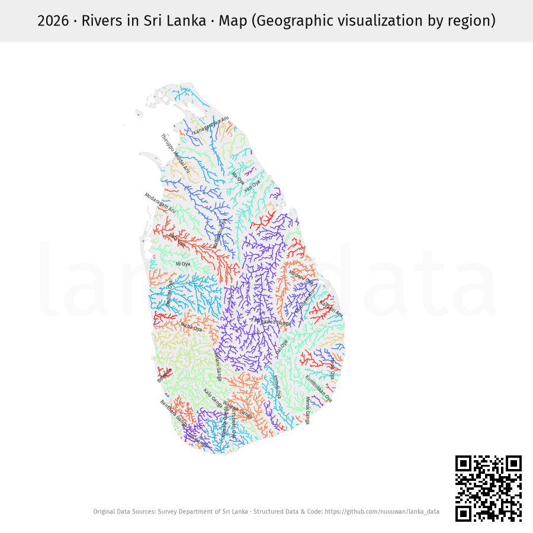
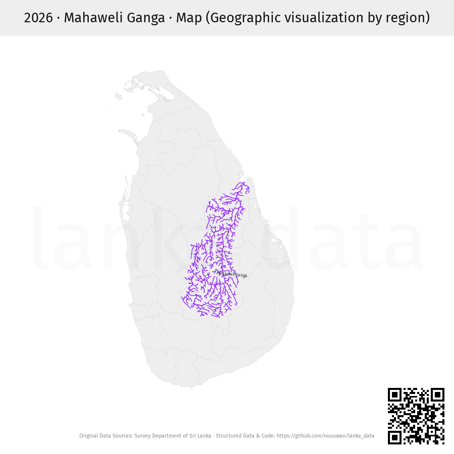
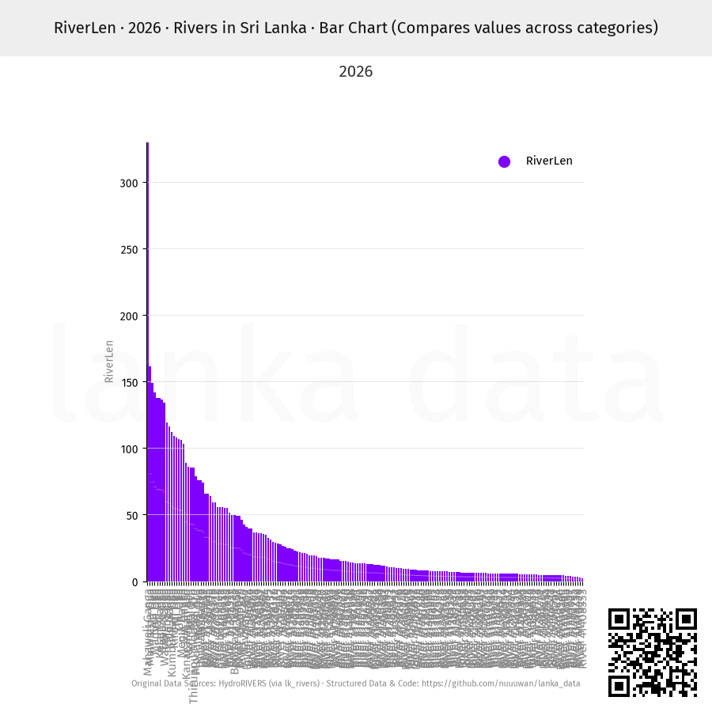
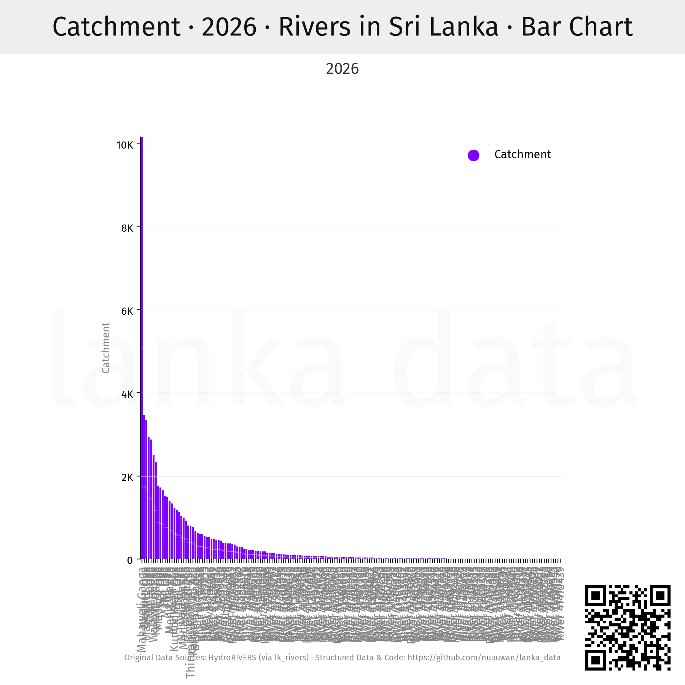
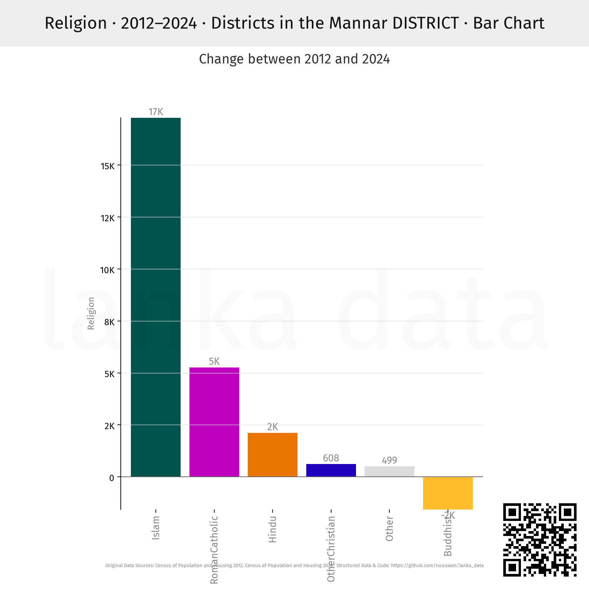
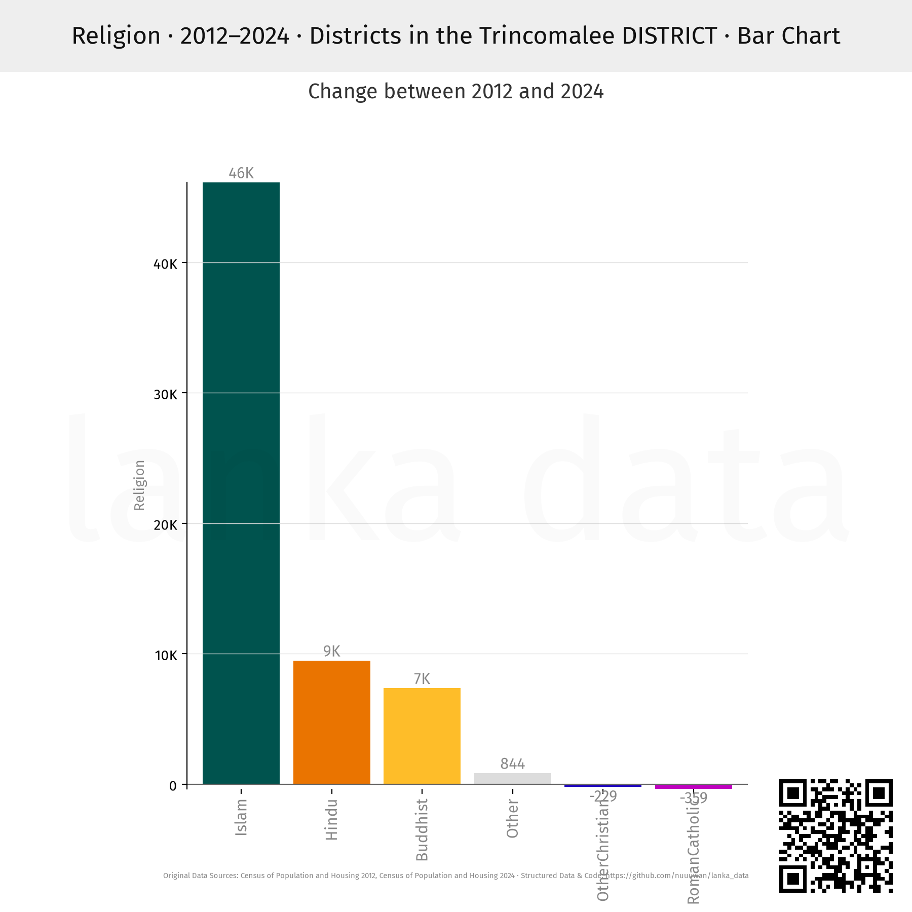
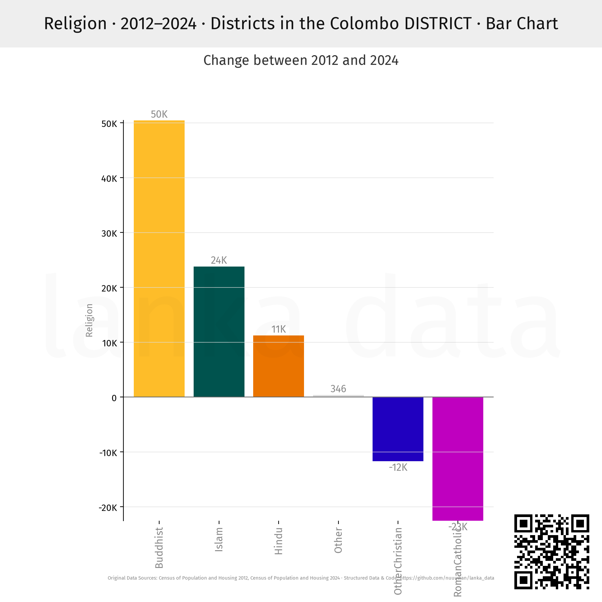
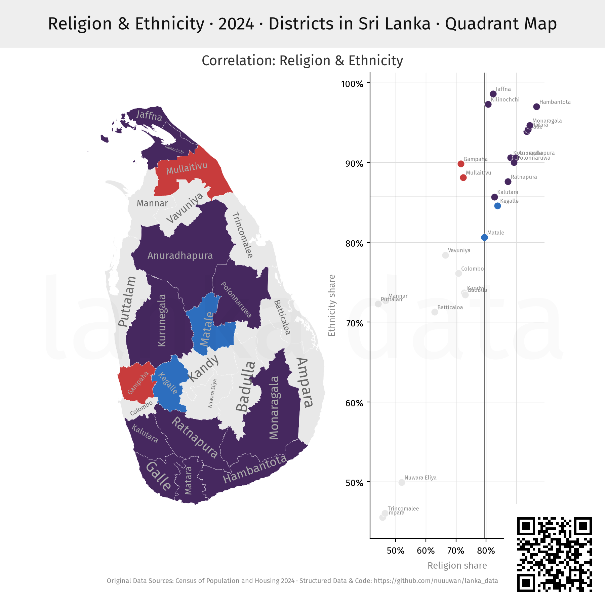

# Lanka Data

This repo implements "one API to rule them all": a single interface that can express *any* query to access public data about Sri Lanka 🇱🇰.

## 0. Design Philosophy & Code

See [README.philosophy.md](README.philosophy.md) and [README.code.md](README.code.md)

## 1. Data Sources

- [Census of Population and Housing 2012](https://www.statistics.gov.lk/Resource/en/Population/CPH_2011/CPH_2012_5Per_Rpt.pdf)
- [Census of Population and Housing 2024](https://www.statistics.gov.lk/Population/StaticalInformation/CPH2024)
- [Election Commission of Sri lanka](https://www.elections.gov.lk)
- [HydroRIVERS (via lk_rivers)](https://github.com/nuuuwan/lk_rivers)
- [Lanka Data](https://github.com/nuuuwan/lanka_data/blob/main/README.md)
- [Survey Department of Sri Lanka](https://survey.gov.lk/)

## 2. Usage

### Install Library

```bash
pip install lanka-data
```

### Run Code

```python
from lanka_data import CommandRunner


output = CommandRunner.run("<cmd>")

```

### HTTP Request (via Vercel App)

Runs single command over HTTP.

```bash
https://lanka-data-phi.vercel.app/Religion/2024/LK/Map/Image.png
```

For print-quality, zoomable vector graphics, request `Image.svg` instead of `Image.png`.

```bash
https://lanka-data-phi.vercel.app/Religion/2024/LK/Map/Image.svg
```

### workflows/single.py

Runs single command.

```bash
python workflows/single.py <cmd>
```

## 3. Example cmds (`<cmd>`)

### 1) Help

#### 1.01) Help

```bash
Help
```

```json
{
    "command_str": "Help",
    "result": {
        "what_to_whens": {
            "AgeGroup": [
                "2001",
                "2012",
                "2024"
            ],
            "AgriOccupations": [
                "2001"
            ],
            "Attendance": [
                "2001"
            ],
            "Catchment": [
                "2026"
            ],
            "Communication": [
                "2012"
                ... // 283 lines ...
                "3rdPct",
                "Bottom",
                "Change",
                "Diversity",
                "DiversityPew",
                "Segregation",
                "Top"
            ]
        },
        "source": "lanka_data",
        "source_url": "https://github.com/nuuuwan/lanka_data/blob/main/README.md"
    },
    "sources": [
        {
            "name": "Lanka Data",
            "url": "https://github.com/nuuuwan/lanka_data/blob/main/README.md"
        }
    ],
    "query_time_ms": 0
}
```

Source: [_output/Help/Output.json](_output/Help/Output.json)
 
### 2) Selection

#### 2.01) Empty/2024/LK:province/Map

```bash
Empty/2024/LK:province/Map
```

```json
{
    "command_str": "Empty/2024/LK:province/Map",
    "result": {
        "image_path": "_output/Empty/2024/LK:province/Map/Image.png",
        "svg_path": "_output/Empty/2024/LK:province/Map/Image.svg"
    },
    "sources": [
        {
            "name": "Survey Department of Sri Lanka",
            "url": "https://survey.gov.lk/"
        }
    ],
    "query_time_ms": 0
}
```

Source: [_output/Empty/2024/LK:province/Map/Output.json](_output/Empty/2024/LK:province/Map/Output.json)


Source: [_output/Empty/2024/LK:province/Map/Image.png](_output/Empty/2024/LK:province/Map/Image.png)

#### 2.02) Empty/2024/LK-1,LK-2,LK-3,LK-9,LK-8/Map

```bash
Empty/2024/LK-1,LK-2,LK-3,LK-9,LK-8/Map
```

```json
{
    "command_str": "Empty/2024/LK-1,LK-2,LK-3,LK-9,LK-8/Map",
    "result": {
        "image_path": "_output/Empty/2024/LK-1,LK-2,LK-3,LK-9,LK-8/Map/Image.png",
        "svg_path": "_output/Empty/2024/LK-1,LK-2,LK-3,LK-9,LK-8/Map/Image.svg"
    },
    "sources": [
        {
            "name": "Survey Department of Sri Lanka",
            "url": "https://survey.gov.lk/"
        }
    ],
    "query_time_ms": 0
}
```

Source: [_output/Empty/2024/LK-1,LK-2,LK-3,LK-9,LK-8/Map/Output.json](_output/Empty/2024/LK-1,LK-2,LK-3,LK-9,LK-8/Map/Output.json)


Source: [_output/Empty/2024/LK-1,LK-2,LK-3,LK-9,LK-8/Map/Image.png](_output/Empty/2024/LK-1,LK-2,LK-3,LK-9,LK-8/Map/Image.png)

#### 2.03) Empty/2024/LK-5...LK-8/Map

```bash
Empty/2024/LK-5...LK-8/Map
```

```json
{
    "command_str": "Empty/2024/LK-5...LK-8/Map",
    "result": {
        "image_path": "_output/Empty/2024/LK-5...LK-8/Map/Image.png",
        "svg_path": "_output/Empty/2024/LK-5...LK-8/Map/Image.svg"
    },
    "sources": [
        {
            "name": "Survey Department of Sri Lanka",
            "url": "https://survey.gov.lk/"
        }
    ],
    "query_time_ms": 0
}
```

Source: [_output/Empty/2024/LK-5...LK-8/Map/Output.json](_output/Empty/2024/LK-5...LK-8/Map/Output.json)


Source: [_output/Empty/2024/LK-5...LK-8/Map/Image.png](_output/Empty/2024/LK-5...LK-8/Map/Image.png)

#### 2.04) Empty/2024/LK-1127025@20/Map

```bash
Empty/2024/LK-1127025@20/Map
```

```json
{
    "command_str": "Empty/2024/LK-1127025@20/Map",
    "result": {
        "image_path": "_output/Empty/2024/LK-1127025@20/Map/Image.png",
        "svg_path": "_output/Empty/2024/LK-1127025@20/Map/Image.svg"
    },
    "sources": [
        {
            "name": "Survey Department of Sri Lanka",
            "url": "https://survey.gov.lk/"
        }
    ],
    "query_time_ms": 0
}
```

Source: [_output/Empty/2024/LK-1127025@20/Map/Output.json](_output/Empty/2024/LK-1127025@20/Map/Output.json)


Source: [_output/Empty/2024/LK-1127025@20/Map/Image.png](_output/Empty/2024/LK-1127025@20/Map/Image.png)

### 3) Rivers

#### 3.01) Empty/2026/LK:rivers/Map

```bash
Empty/2026/LK:rivers/Map
```

```json
{
    "command_str": "Empty/2026/LK:rivers/Map",
    "result": {
        "image_path": "_output/Empty/2026/LK:rivers/Map/Image.png",
        "svg_path": "_output/Empty/2026/LK:rivers/Map/Image.svg"
    },
    "sources": [
        {
            "name": "Survey Department of Sri Lanka",
            "url": "https://survey.gov.lk/"
        }
    ],
    "query_time_ms": 0
}
```

Source: [_output/Empty/2026/LK:rivers/Map/Output.json](_output/Empty/2026/LK:rivers/Map/Output.json)



Source: [_output/Empty/2026/LK:rivers/Map/Image.png](_output/Empty/2026/LK:rivers/Map/Image.png)

#### 3.02) Empty/2026/R-41399660/Map

```bash
Empty/2026/R-41399660/Map
```

```json
{
    "command_str": "Empty/2026/R-41399660/Map",
    "result": {
        "image_path": "_output/Empty/2026/R-41399660/Map/Image.png",
        "svg_path": "_output/Empty/2026/R-41399660/Map/Image.svg"
    },
    "sources": [
        {
            "name": "Survey Department of Sri Lanka",
            "url": "https://survey.gov.lk/"
        }
    ],
    "query_time_ms": 0
}
```

Source: [_output/Empty/2026/R-41399660/Map/Output.json](_output/Empty/2026/R-41399660/Map/Output.json)



Source: [_output/Empty/2026/R-41399660/Map/Image.png](_output/Empty/2026/R-41399660/Map/Image.png)

#### 3.03) RiverLen/2026/LK:rivers/BarChart

```bash
RiverLen/2026/LK:rivers/BarChart
```

```json
{
    "command_str": "RiverLen/2026/LK:rivers/BarChart",
    "result": {
        "image_path": "_output/RiverLen/2026/LK:rivers/BarChart/Image.png",
        "svg_path": "_output/RiverLen/2026/LK:rivers/BarChart/Image.svg"
    },
    "sources": [
        {
            "name": "HydroRIVERS (via lk_rivers)",
            "url": "https://github.com/nuuuwan/lk_rivers"
        }
    ],
    "query_time_ms": 0
}
```

Source: [_output/RiverLen/2026/LK:rivers/BarChart/Output.json](_output/RiverLen/2026/LK:rivers/BarChart/Output.json)



Source: [_output/RiverLen/2026/LK:rivers/BarChart/Image.png](_output/RiverLen/2026/LK:rivers/BarChart/Image.png)

#### 3.04) Catchment/2026/LK:rivers/BarChart

```bash
Catchment/2026/LK:rivers/BarChart
```

```json
{
    "command_str": "Catchment/2026/LK:rivers/BarChart",
    "result": {
        "image_path": "_output/Catchment/2026/LK:rivers/BarChart/Image.png",
        "svg_path": "_output/Catchment/2026/LK:rivers/BarChart/Image.svg"
    },
    "sources": [
        {
            "name": "HydroRIVERS (via lk_rivers)",
            "url": "https://github.com/nuuuwan/lk_rivers"
        }
    ],
    "query_time_ms": 0
}
```

Source: [_output/Catchment/2026/LK:rivers/BarChart/Output.json](_output/Catchment/2026/LK:rivers/BarChart/Output.json)



Source: [_output/Catchment/2026/LK:rivers/BarChart/Image.png](_output/Catchment/2026/LK:rivers/BarChart/Image.png)

### 4) Religion

#### 4.01) Religion/2012-2024/LK:district/Map:1st

```bash
Religion/2012-2024/LK:district/Map:1st
```

```json
{
    "command_str": "Religion/2012-2024/LK:district/Map:1st",
    "result": {
        "image_path": "_output/Religion/2012-2024/LK:district/Map:1st/Image.png",
        "svg_path": "_output/Religion/2012-2024/LK:district/Map:1st/Image.svg"
    },
    "sources": [
        {
            "name": "Census of Population and Housing 2012",
            "url": "https://www.statistics.gov.lk/Resource/en/Population/CPH_2011/CPH_2012_5Per_Rpt.pdf"
        },
        {
            "name": "Census of Population and Housing 2024",
            "url": "https://www.statistics.gov.lk/Population/StaticalInformation/CPH2024"
        }
    ],
    "query_time_ms": 0
}
```

Source: [_output/Religion/2012-2024/LK:district/Map:1st/Output.json](_output/Religion/2012-2024/LK:district/Map:1st/Output.json)


Source: [_output/Religion/2012-2024/LK:district/Map:1st/Image.png](_output/Religion/2012-2024/LK:district/Map:1st/Image.png)

#### 4.02) Religion/2012-2024/LK:district/Map:2nd

```bash
Religion/2012-2024/LK:district/Map:2nd
```

```json
{
    "command_str": "Religion/2012-2024/LK:district/Map:2nd",
    "result": {
        "image_path": "_output/Religion/2012-2024/LK:district/Map:2nd/Image.png",
        "svg_path": "_output/Religion/2012-2024/LK:district/Map:2nd/Image.svg"
    },
    "sources": [
        {
            "name": "Census of Population and Housing 2012",
            "url": "https://www.statistics.gov.lk/Resource/en/Population/CPH_2011/CPH_2012_5Per_Rpt.pdf"
        },
        {
            "name": "Census of Population and Housing 2024",
            "url": "https://www.statistics.gov.lk/Population/StaticalInformation/CPH2024"
        }
    ],
    "query_time_ms": 0
}
```

Source: [_output/Religion/2012-2024/LK:district/Map:2nd/Output.json](_output/Religion/2012-2024/LK:district/Map:2nd/Output.json)


Source: [_output/Religion/2012-2024/LK:district/Map:2nd/Image.png](_output/Religion/2012-2024/LK:district/Map:2nd/Image.png)

#### 4.03) Religion/2012-2024/LK:district/Map:3rd

```bash
Religion/2012-2024/LK:district/Map:3rd
```

```json
{
    "command_str": "Religion/2012-2024/LK:district/Map:3rd",
    "result": {
        "image_path": "_output/Religion/2012-2024/LK:district/Map:3rd/Image.png",
        "svg_path": "_output/Religion/2012-2024/LK:district/Map:3rd/Image.svg"
    },
    "sources": [
        {
            "name": "Census of Population and Housing 2012",
            "url": "https://www.statistics.gov.lk/Resource/en/Population/CPH_2011/CPH_2012_5Per_Rpt.pdf"
        },
        {
            "name": "Census of Population and Housing 2024",
            "url": "https://www.statistics.gov.lk/Population/StaticalInformation/CPH2024"
        }
    ],
    "query_time_ms": 0
}
```

Source: [_output/Religion/2012-2024/LK:district/Map:3rd/Output.json](_output/Religion/2012-2024/LK:district/Map:3rd/Output.json)


Source: [_output/Religion/2012-2024/LK:district/Map:3rd/Image.png](_output/Religion/2012-2024/LK:district/Map:3rd/Image.png)

#### 4.04) Religion/2012-2024/LK:district/Map:Change

```bash
Religion/2012-2024/LK:district/Map:Change
```

```json
{
    "command_str": "Religion/2012-2024/LK:district/Map:Change",
    "result": {
        "image_path": "_output/Religion/2012-2024/LK:district/Map:Change/Image.png",
        "svg_path": "_output/Religion/2012-2024/LK:district/Map:Change/Image.svg"
    },
    "sources": [
        {
            "name": "Census of Population and Housing 2012",
            "url": "https://www.statistics.gov.lk/Resource/en/Population/CPH_2011/CPH_2012_5Per_Rpt.pdf"
        },
        {
            "name": "Census of Population and Housing 2024",
            "url": "https://www.statistics.gov.lk/Population/StaticalInformation/CPH2024"
        }
    ],
    "query_time_ms": 0
}
```

Source: [_output/Religion/2012-2024/LK:district/Map:Change/Output.json](_output/Religion/2012-2024/LK:district/Map:Change/Output.json)


Source: [_output/Religion/2012-2024/LK:district/Map:Change/Image.png](_output/Religion/2012-2024/LK:district/Map:Change/Image.png)

#### 4.05) Religion/2012-2024/LK-42:district/BarChart

```bash
Religion/2012-2024/LK-42:district/BarChart
```

```json
{
    "command_str": "Religion/2012-2024/LK-42:district/BarChart",
    "result": {
        "image_path": "_output/Religion/2012-2024/LK-42:district/BarChart/Image.png",
        "svg_path": "_output/Religion/2012-2024/LK-42:district/BarChart/Image.svg"
    },
    "sources": [
        {
            "name": "Census of Population and Housing 2012",
            "url": "https://www.statistics.gov.lk/Resource/en/Population/CPH_2011/CPH_2012_5Per_Rpt.pdf"
        },
        {
            "name": "Census of Population and Housing 2024",
            "url": "https://www.statistics.gov.lk/Population/StaticalInformation/CPH2024"
        }
    ],
    "query_time_ms": 0
}
```

Source: [_output/Religion/2012-2024/LK-42:district/BarChart/Output.json](_output/Religion/2012-2024/LK-42:district/BarChart/Output.json)



Source: [_output/Religion/2012-2024/LK-42:district/BarChart/Image.png](_output/Religion/2012-2024/LK-42:district/BarChart/Image.png)

#### 4.06) Religion/2012-2024/LK-43:dsd/BarChart

```bash
Religion/2012-2024/LK-43:dsd/BarChart
```

```json
{
    "command_str": "Religion/2012-2024/LK-43:dsd/BarChart",
    "result": {
        "image_path": "_output/Religion/2012-2024/LK-43:dsd/BarChart/Image.png",
        "svg_path": "_output/Religion/2012-2024/LK-43:dsd/BarChart/Image.svg"
    },
    "sources": [
        {
            "name": "Census of Population and Housing 2012",
            "url": "https://www.statistics.gov.lk/Resource/en/Population/CPH_2011/CPH_2012_5Per_Rpt.pdf"
        },
        {
            "name": "Census of Population and Housing 2024",
            "url": "https://www.statistics.gov.lk/Population/StaticalInformation/CPH2024"
        }
    ],
    "query_time_ms": 0
}
```

Source: [_output/Religion/2012-2024/LK-43:dsd/BarChart/Output.json](_output/Religion/2012-2024/LK-43:dsd/BarChart/Output.json)


Source: [_output/Religion/2012-2024/LK-43:dsd/BarChart/Image.png](_output/Religion/2012-2024/LK-43:dsd/BarChart/Image.png)

#### 4.07) Religion/2012-2024/LK-53:district/BarChart

```bash
Religion/2012-2024/LK-53:district/BarChart
```

```json
{
    "command_str": "Religion/2012-2024/LK-53:district/BarChart",
    "result": {
        "image_path": "_output/Religion/2012-2024/LK-53:district/BarChart/Image.png",
        "svg_path": "_output/Religion/2012-2024/LK-53:district/BarChart/Image.svg"
    },
    "sources": [
        {
            "name": "Census of Population and Housing 2012",
            "url": "https://www.statistics.gov.lk/Resource/en/Population/CPH_2011/CPH_2012_5Per_Rpt.pdf"
        },
        {
            "name": "Census of Population and Housing 2024",
            "url": "https://www.statistics.gov.lk/Population/StaticalInformation/CPH2024"
        }
    ],
    "query_time_ms": 0
}
```

Source: [_output/Religion/2012-2024/LK-53:district/BarChart/Output.json](_output/Religion/2012-2024/LK-53:district/BarChart/Output.json)



Source: [_output/Religion/2012-2024/LK-53:district/BarChart/Image.png](_output/Religion/2012-2024/LK-53:district/BarChart/Image.png)

#### 4.08) Religion/2012-2024/LK-33,LK-82,LK-32:district/BarChart

```bash
Religion/2012-2024/LK-33,LK-82,LK-32:district/BarChart
```

```json
{
    "command_str": "Religion/2012-2024/LK-33,LK-82,LK-32:district/BarChart",
    "result": {
        "image_path": "_output/Religion/2012-2024/LK-33,LK-82,LK-32:district/BarChart/Image.png",
        "svg_path": "_output/Religion/2012-2024/LK-33,LK-82,LK-32:district/BarChart/Image.svg"
    },
    "sources": [
        {
            "name": "Census of Population and Housing 2012",
            "url": "https://www.statistics.gov.lk/Resource/en/Population/CPH_2011/CPH_2012_5Per_Rpt.pdf"
        },
        {
            "name": "Census of Population and Housing 2024",
            "url": "https://www.statistics.gov.lk/Population/StaticalInformation/CPH2024"
        }
    ],
    "query_time_ms": 0
}
```

Source: [_output/Religion/2012-2024/LK-33,LK-82,LK-32:district/BarChart/Output.json](_output/Religion/2012-2024/LK-33,LK-82,LK-32:district/BarChart/Output.json)


Source: [_output/Religion/2012-2024/LK-33,LK-82,LK-32:district/BarChart/Image.png](_output/Religion/2012-2024/LK-33,LK-82,LK-32:district/BarChart/Image.png)

#### 4.09) Religion/2012-2024/LK:district/BarChart

```bash
Religion/2012-2024/LK:district/BarChart
```

```json
{
    "command_str": "Religion/2012-2024/LK:district/BarChart",
    "result": {
        "image_path": "_output/Religion/2012-2024/LK:district/BarChart/Image.png",
        "svg_path": "_output/Religion/2012-2024/LK:district/BarChart/Image.svg"
    },
    "sources": [
        {
            "name": "Census of Population and Housing 2012",
            "url": "https://www.statistics.gov.lk/Resource/en/Population/CPH_2011/CPH_2012_5Per_Rpt.pdf"
        },
        {
            "name": "Census of Population and Housing 2024",
            "url": "https://www.statistics.gov.lk/Population/StaticalInformation/CPH2024"
        }
    ],
    "query_time_ms": 0
}
```

Source: [_output/Religion/2012-2024/LK:district/BarChart/Output.json](_output/Religion/2012-2024/LK:district/BarChart/Output.json)


Source: [_output/Religion/2012-2024/LK:district/BarChart/Image.png](_output/Religion/2012-2024/LK:district/BarChart/Image.png)

#### 4.10) Religion/2012-2024/LK-11:dsd/BarChart

```bash
Religion/2012-2024/LK-11:dsd/BarChart
```

```json
{
    "command_str": "Religion/2012-2024/LK-11:dsd/BarChart",
    "result": {
        "image_path": "_output/Religion/2012-2024/LK-11:dsd/BarChart/Image.png",
        "svg_path": "_output/Religion/2012-2024/LK-11:dsd/BarChart/Image.svg"
    },
    "sources": [
        {
            "name": "Census of Population and Housing 2012",
            "url": "https://www.statistics.gov.lk/Resource/en/Population/CPH_2011/CPH_2012_5Per_Rpt.pdf"
        },
        {
            "name": "Census of Population and Housing 2024",
            "url": "https://www.statistics.gov.lk/Population/StaticalInformation/CPH2024"
        }
    ],
    "query_time_ms": 0
}
```

Source: [_output/Religion/2012-2024/LK-11:dsd/BarChart/Output.json](_output/Religion/2012-2024/LK-11:dsd/BarChart/Output.json)


Source: [_output/Religion/2012-2024/LK-11:dsd/BarChart/Image.png](_output/Religion/2012-2024/LK-11:dsd/BarChart/Image.png)

#### 4.11) Religion/2012-2024/LK-11:lg/BarChart

```bash
Religion/2012-2024/LK-11:lg/BarChart
```

```json
{
    "command_str": "Religion/2012-2024/LK-11:lg/BarChart",
    "result": {
        "image_path": "_output/Religion/2012-2024/LK-11:lg/BarChart/Image.png",
        "svg_path": "_output/Religion/2012-2024/LK-11:lg/BarChart/Image.svg"
    },
    "sources": [
        {
            "name": "Census of Population and Housing 2012",
            "url": "https://www.statistics.gov.lk/Resource/en/Population/CPH_2011/CPH_2012_5Per_Rpt.pdf"
        },
        {
            "name": "Census of Population and Housing 2024",
            "url": "https://www.statistics.gov.lk/Population/StaticalInformation/CPH2024"
        }
    ],
    "query_time_ms": 0
}
```

Source: [_output/Religion/2012-2024/LK-11:lg/BarChart/Output.json](_output/Religion/2012-2024/LK-11:lg/BarChart/Output.json)


Source: [_output/Religion/2012-2024/LK-11:lg/BarChart/Image.png](_output/Religion/2012-2024/LK-11:lg/BarChart/Image.png)

#### 4.12) Religion/2012-2024/LK-12:dsd/BarChart

```bash
Religion/2012-2024/LK-12:dsd/BarChart
```

```json
{
    "command_str": "Religion/2012-2024/LK-12:dsd/BarChart",
    "result": {
        "image_path": "_output/Religion/2012-2024/LK-12:dsd/BarChart/Image.png",
        "svg_path": "_output/Religion/2012-2024/LK-12:dsd/BarChart/Image.svg"
    },
    "sources": [
        {
            "name": "Census of Population and Housing 2012",
            "url": "https://www.statistics.gov.lk/Resource/en/Population/CPH_2011/CPH_2012_5Per_Rpt.pdf"
        },
        {
            "name": "Census of Population and Housing 2024",
            "url": "https://www.statistics.gov.lk/Population/StaticalInformation/CPH2024"
        }
    ],
    "query_time_ms": 0
}
```

Source: [_output/Religion/2012-2024/LK-12:dsd/BarChart/Output.json](_output/Religion/2012-2024/LK-12:dsd/BarChart/Output.json)


Source: [_output/Religion/2012-2024/LK-12:dsd/BarChart/Image.png](_output/Religion/2012-2024/LK-12:dsd/BarChart/Image.png)

#### 4.13) Religion/2012-2024/LK:district/Map:DiversityPew

```bash
Religion/2012-2024/LK:district/Map:DiversityPew
```

```json
{
    "command_str": "Religion/2012-2024/LK:district/Map:DiversityPew",
    "result": {
        "image_path": "_output/Religion/2012-2024/LK:district/Map:DiversityPew/Image.png",
        "svg_path": "_output/Religion/2012-2024/LK:district/Map:DiversityPew/Image.svg"
    },
    "sources": [
        {
            "name": "Census of Population and Housing 2012",
            "url": "https://www.statistics.gov.lk/Resource/en/Population/CPH_2011/CPH_2012_5Per_Rpt.pdf"
        },
        {
            "name": "Census of Population and Housing 2024",
            "url": "https://www.statistics.gov.lk/Population/StaticalInformation/CPH2024"
        }
    ],
    "query_time_ms": 0
}
```

Source: [_output/Religion/2012-2024/LK:district/Map:DiversityPew/Output.json](_output/Religion/2012-2024/LK:district/Map:DiversityPew/Output.json)


Source: [_output/Religion/2012-2024/LK:district/Map:DiversityPew/Image.png](_output/Religion/2012-2024/LK:district/Map:DiversityPew/Image.png)

#### 4.14) Religion/2012-2024/LK:district/Map:2ndPct

```bash
Religion/2012-2024/LK:district/Map:2ndPct
```

```json
{
    "command_str": "Religion/2012-2024/LK:district/Map:2ndPct",
    "result": {
        "image_path": "_output/Religion/2012-2024/LK:district/Map:2ndPct/Image.png",
        "svg_path": "_output/Religion/2012-2024/LK:district/Map:2ndPct/Image.svg"
    },
    "sources": [
        {
            "name": "Census of Population and Housing 2012",
            "url": "https://www.statistics.gov.lk/Resource/en/Population/CPH_2011/CPH_2012_5Per_Rpt.pdf"
        },
        {
            "name": "Census of Population and Housing 2024",
            "url": "https://www.statistics.gov.lk/Population/StaticalInformation/CPH2024"
        }
    ],
    "query_time_ms": 0
}
```

Source: [_output/Religion/2012-2024/LK:district/Map:2ndPct/Output.json](_output/Religion/2012-2024/LK:district/Map:2ndPct/Output.json)


Source: [_output/Religion/2012-2024/LK:district/Map:2ndPct/Image.png](_output/Religion/2012-2024/LK:district/Map:2ndPct/Image.png)

#### 4.15) Religion/2012-2024/LK:district/Map:3rdPct

```bash
Religion/2012-2024/LK:district/Map:3rdPct
```

```json
{
    "command_str": "Religion/2012-2024/LK:district/Map:3rdPct",
    "result": {
        "image_path": "_output/Religion/2012-2024/LK:district/Map:3rdPct/Image.png",
        "svg_path": "_output/Religion/2012-2024/LK:district/Map:3rdPct/Image.svg"
    },
    "sources": [
        {
            "name": "Census of Population and Housing 2012",
            "url": "https://www.statistics.gov.lk/Resource/en/Population/CPH_2011/CPH_2012_5Per_Rpt.pdf"
        },
        {
            "name": "Census of Population and Housing 2024",
            "url": "https://www.statistics.gov.lk/Population/StaticalInformation/CPH2024"
        }
    ],
    "query_time_ms": 0
}
```

Source: [_output/Religion/2012-2024/LK:district/Map:3rdPct/Output.json](_output/Religion/2012-2024/LK:district/Map:3rdPct/Output.json)


Source: [_output/Religion/2012-2024/LK:district/Map:3rdPct/Image.png](_output/Religion/2012-2024/LK:district/Map:3rdPct/Image.png)

#### 4.16) Religion/2012-2024/LK-21:dsd/BarChart

```bash
Religion/2012-2024/LK-21:dsd/BarChart
```

```json
{
    "command_str": "Religion/2012-2024/LK-21:dsd/BarChart",
    "result": {
        "image_path": "_output/Religion/2012-2024/LK-21:dsd/BarChart/Image.png",
        "svg_path": "_output/Religion/2012-2024/LK-21:dsd/BarChart/Image.svg"
    },
    "sources": [
        {
            "name": "Census of Population and Housing 2012",
            "url": "https://www.statistics.gov.lk/Resource/en/Population/CPH_2011/CPH_2012_5Per_Rpt.pdf"
        },
        {
            "name": "Census of Population and Housing 2024",
            "url": "https://www.statistics.gov.lk/Population/StaticalInformation/CPH2024"
        }
    ],
    "query_time_ms": 0
}
```

Source: [_output/Religion/2012-2024/LK-21:dsd/BarChart/Output.json](_output/Religion/2012-2024/LK-21:dsd/BarChart/Output.json)


Source: [_output/Religion/2012-2024/LK-21:dsd/BarChart/Image.png](_output/Religion/2012-2024/LK-21:dsd/BarChart/Image.png)

#### 4.17) Religion/2012-2024/LK-31-pre2019:dsd/BarChart

```bash
Religion/2012-2024/LK-31-pre2019:dsd/BarChart
```

```json
{
    "command_str": "Religion/2012-2024/LK-31-pre2019:dsd/BarChart",
    "result": {
        "image_path": "_output/Religion/2012-2024/LK-31-pre2019:dsd/BarChart/Image.png",
        "svg_path": "_output/Religion/2012-2024/LK-31-pre2019:dsd/BarChart/Image.svg"
    },
    "sources": [
        {
            "name": "Census of Population and Housing 2012",
            "url": "https://www.statistics.gov.lk/Resource/en/Population/CPH_2011/CPH_2012_5Per_Rpt.pdf"
        },
        {
            "name": "Census of Population and Housing 2024",
            "url": "https://www.statistics.gov.lk/Population/StaticalInformation/CPH2024"
        }
    ],
    "query_time_ms": 0
}
```

Source: [_output/Religion/2012-2024/LK-31-pre2019:dsd/BarChart/Output.json](_output/Religion/2012-2024/LK-31-pre2019:dsd/BarChart/Output.json)


Source: [_output/Religion/2012-2024/LK-31-pre2019:dsd/BarChart/Image.png](_output/Religion/2012-2024/LK-31-pre2019:dsd/BarChart/Image.png)

#### 4.18) Religion/2012-2024/LK-11:district/BarChart

```bash
Religion/2012-2024/LK-11:district/BarChart
```

```json
{
    "command_str": "Religion/2012-2024/LK-11:district/BarChart",
    "result": {
        "image_path": "_output/Religion/2012-2024/LK-11:district/BarChart/Image.png",
        "svg_path": "_output/Religion/2012-2024/LK-11:district/BarChart/Image.svg"
    },
    "sources": [
        {
            "name": "Census of Population and Housing 2012",
            "url": "https://www.statistics.gov.lk/Resource/en/Population/CPH_2011/CPH_2012_5Per_Rpt.pdf"
        },
        {
            "name": "Census of Population and Housing 2024",
            "url": "https://www.statistics.gov.lk/Population/StaticalInformation/CPH2024"
        }
    ],
    "query_time_ms": 0
}
```

Source: [_output/Religion/2012-2024/LK-11:district/BarChart/Output.json](_output/Religion/2012-2024/LK-11:district/BarChart/Output.json)



Source: [_output/Religion/2012-2024/LK-11:district/BarChart/Image.png](_output/Religion/2012-2024/LK-11:district/BarChart/Image.png)

### 5) Bivariate

#### 5.01) Religion+Ethnicity/2024/LK:district/BivariateMap

```bash
Religion+Ethnicity/2024/LK:district/BivariateMap
```

```json
{
    "command_str": "Religion+Ethnicity/2024/LK:district/BivariateMap",
    "result": {
        "image_path": "_output/Religion+Ethnicity/2024/LK:district/BivariateMap/Image.png",
        "svg_path": "_output/Religion+Ethnicity/2024/LK:district/BivariateMap/Image.svg"
    },
    "sources": [
        {
            "name": "Census of Population and Housing 2024",
            "url": "https://www.statistics.gov.lk/Population/StaticalInformation/CPH2024"
        }
    ],
    "query_time_ms": 0
}
```

Source: [_output/Religion+Ethnicity/2024/LK:district/BivariateMap/Output.json](_output/Religion+Ethnicity/2024/LK:district/BivariateMap/Output.json)


Source: [_output/Religion+Ethnicity/2024/LK:district/BivariateMap/Image.png](_output/Religion+Ethnicity/2024/LK:district/BivariateMap/Image.png)

#### 5.02) Religion+Ethnicity/2024/LK:district/QuadrantMap

```bash
Religion+Ethnicity/2024/LK:district/QuadrantMap
```

```json
{
    "command_str": "Religion+Ethnicity/2024/LK:district/QuadrantMap",
    "result": {
        "image_path": "_output/Religion+Ethnicity/2024/LK:district/QuadrantMap/Image.png",
        "svg_path": "_output/Religion+Ethnicity/2024/LK:district/QuadrantMap/Image.svg"
    },
    "sources": [
        {
            "name": "Census of Population and Housing 2024",
            "url": "https://www.statistics.gov.lk/Population/StaticalInformation/CPH2024"
        }
    ],
    "query_time_ms": 0
}
```

Source: [_output/Religion+Ethnicity/2024/LK:district/QuadrantMap/Output.json](_output/Religion+Ethnicity/2024/LK:district/QuadrantMap/Output.json)



Source: [_output/Religion+Ethnicity/2024/LK:district/QuadrantMap/Image.png](_output/Religion+Ethnicity/2024/LK:district/QuadrantMap/Image.png)

### 6) Elections

#### 6.01) Parliamentary/2024/LK/JSON

```bash
Parliamentary/2024/LK/JSON
```

```json
{
    "command_str": "Parliamentary/2024/LK/JSON",
    "result": [
        {
            "region_id": "LK",
            "region_name": "Sri Lanka",
            "center_lat": 7.621831,
            "center_lng": 80.6983,
            "current_ids": [
                "LK"
            ],
            "values": {
                "NPP": 6863186,
                "SJB": 1968716,
                "NDF": 500835,
                "SLPP": 350429,
                "ITAK": 257813,
                "SB": 178006,
                "SLMC": 87038,
                "UDV": 83488,
                ... // 648 lines ...
                "IND34-13": 0.0,
                "IND26-12": 0.0,
                "IND05-13": 0.0,
                "IND07-13": 0.0,
                "IND08-14": 0.0,
                "IND32-13": 0.0,
                "IND40-13": 0.0,
                "IND37-13": 0.0,
                "IND33-13": 0.0
            }
        }
    ],
    "sources": [
        {
            "name": "Election Commission of Sri lanka",
            "url": "https://www.elections.gov.lk"
        }
    ],
    "query_time_ms": 0
}
```

Source: [_output/Parliamentary/2024/LK/JSON/Output.json](_output/Parliamentary/2024/LK/JSON/Output.json)

#### 6.02) Presidential/2015/LK-11:pd/Map

```bash
Presidential/2015/LK-11:pd/Map
```

```json
{
    "command_str": "Presidential/2015/LK-11:pd/Map",
    "result": {
        "image_path": "_output/Presidential/2015/LK-11:pd/Map/Image.png",
        "svg_path": "_output/Presidential/2015/LK-11:pd/Map/Image.svg"
    },
    "sources": [
        {
            "name": "Election Commission of Sri lanka",
            "url": "https://www.elections.gov.lk"
        }
    ],
    "query_time_ms": 0
}
```

Source: [_output/Presidential/2015/LK-11:pd/Map/Output.json](_output/Presidential/2015/LK-11:pd/Map/Output.json)


Source: [_output/Presidential/2015/LK-11:pd/Map/Image.png](_output/Presidential/2015/LK-11:pd/Map/Image.png)

#### 6.03) Local/2025/LK:district/Map

```bash
Local/2025/LK:district/Map
```

```json
{
    "command_str": "Local/2025/LK:district/Map",
    "result": {
        "image_path": "_output/Local/2025/LK:district/Map/Image.png",
        "svg_path": "_output/Local/2025/LK:district/Map/Image.svg"
    },
    "sources": [
        {
            "name": "Election Commission of Sri lanka",
            "url": "https://www.elections.gov.lk"
        }
    ],
    "query_time_ms": 0
}
```

Source: [_output/Local/2025/LK:district/Map/Output.json](_output/Local/2025/LK:district/Map/Output.json)


Source: [_output/Local/2025/LK:district/Map/Image.png](_output/Local/2025/LK:district/Map/Image.png)

### 7) History

#### 7.01) Empty/2012/LK-pre1845:province/Map

```bash
Empty/2012/LK-pre1845:province/Map
```

```json
{
    "command_str": "Empty/2012/LK-pre1845:province/Map",
    "result": {
        "image_path": "_output/Empty/2012/LK-pre1845:province/Map/Image.png",
        "svg_path": "_output/Empty/2012/LK-pre1845:province/Map/Image.svg"
    },
    "sources": [
        {
            "name": "Survey Department of Sri Lanka",
            "url": "https://survey.gov.lk/"
        }
    ],
    "query_time_ms": 0
}
```

Source: [_output/Empty/2012/LK-pre1845:province/Map/Output.json](_output/Empty/2012/LK-pre1845:province/Map/Output.json)


Source: [_output/Empty/2012/LK-pre1845:province/Map/Image.png](_output/Empty/2012/LK-pre1845:province/Map/Image.png)

#### 7.02) Empty/2012/LK-pre1873:province/Map

```bash
Empty/2012/LK-pre1873:province/Map
```

```json
{
    "command_str": "Empty/2012/LK-pre1873:province/Map",
    "result": {
        "image_path": "_output/Empty/2012/LK-pre1873:province/Map/Image.png",
        "svg_path": "_output/Empty/2012/LK-pre1873:province/Map/Image.svg"
    },
    "sources": [
        {
            "name": "Survey Department of Sri Lanka",
            "url": "https://survey.gov.lk/"
        }
    ],
    "query_time_ms": 0
}
```

Source: [_output/Empty/2012/LK-pre1873:province/Map/Output.json](_output/Empty/2012/LK-pre1873:province/Map/Output.json)


Source: [_output/Empty/2012/LK-pre1873:province/Map/Image.png](_output/Empty/2012/LK-pre1873:province/Map/Image.png)

#### 7.03) Empty/2012/LK-pre1886:province/Map

```bash
Empty/2012/LK-pre1886:province/Map
```

```json
{
    "command_str": "Empty/2012/LK-pre1886:province/Map",
    "result": {
        "image_path": "_output/Empty/2012/LK-pre1886:province/Map/Image.png",
        "svg_path": "_output/Empty/2012/LK-pre1886:province/Map/Image.svg"
    },
    "sources": [
        {
            "name": "Survey Department of Sri Lanka",
            "url": "https://survey.gov.lk/"
        }
    ],
    "query_time_ms": 0
}
```

Source: [_output/Empty/2012/LK-pre1886:province/Map/Output.json](_output/Empty/2012/LK-pre1886:province/Map/Output.json)


Source: [_output/Empty/2012/LK-pre1886:province/Map/Image.png](_output/Empty/2012/LK-pre1886:province/Map/Image.png)

#### 7.04) Empty/2012/LK-pre1889:province/Map

```bash
Empty/2012/LK-pre1889:province/Map
```

```json
{
    "command_str": "Empty/2012/LK-pre1889:province/Map",
    "result": {
        "image_path": "_output/Empty/2012/LK-pre1889:province/Map/Image.png",
        "svg_path": "_output/Empty/2012/LK-pre1889:province/Map/Image.svg"
    },
    "sources": [
        {
            "name": "Survey Department of Sri Lanka",
            "url": "https://survey.gov.lk/"
        }
    ],
    "query_time_ms": 0
}
```

Source: [_output/Empty/2012/LK-pre1889:province/Map/Output.json](_output/Empty/2012/LK-pre1889:province/Map/Output.json)


Source: [_output/Empty/2012/LK-pre1889:province/Map/Image.png](_output/Empty/2012/LK-pre1889:province/Map/Image.png)

#### 7.05) Empty/2012/LK:province/Map

```bash
Empty/2012/LK:province/Map
```

```json
{
    "command_str": "Empty/2012/LK:province/Map",
    "result": {
        "image_path": "_output/Empty/2012/LK:province/Map/Image.png",
        "svg_path": "_output/Empty/2012/LK:province/Map/Image.svg"
    },
    "sources": [
        {
            "name": "Survey Department of Sri Lanka",
            "url": "https://survey.gov.lk/"
        }
    ],
    "query_time_ms": 0
}
```

Source: [_output/Empty/2012/LK:province/Map/Output.json](_output/Empty/2012/LK:province/Map/Output.json)


Source: [_output/Empty/2012/LK:province/Map/Image.png](_output/Empty/2012/LK:province/Map/Image.png)

#### 7.06) Empty/2012/LK-pre1959:district/Map

```bash
Empty/2012/LK-pre1959:district/Map
```

```json
{
    "command_str": "Empty/2012/LK-pre1959:district/Map",
    "result": {
        "image_path": "_output/Empty/2012/LK-pre1959:district/Map/Image.png",
        "svg_path": "_output/Empty/2012/LK-pre1959:district/Map/Image.svg"
    },
    "sources": [
        {
            "name": "Survey Department of Sri Lanka",
            "url": "https://survey.gov.lk/"
        }
    ],
    "query_time_ms": 0
}
```

Source: [_output/Empty/2012/LK-pre1959:district/Map/Output.json](_output/Empty/2012/LK-pre1959:district/Map/Output.json)


Source: [_output/Empty/2012/LK-pre1959:district/Map/Image.png](_output/Empty/2012/LK-pre1959:district/Map/Image.png)

#### 7.07) Empty/2012/LK-pre1961:district/Map

```bash
Empty/2012/LK-pre1961:district/Map
```

```json
{
    "command_str": "Empty/2012/LK-pre1961:district/Map",
    "result": {
        "image_path": "_output/Empty/2012/LK-pre1961:district/Map/Image.png",
        "svg_path": "_output/Empty/2012/LK-pre1961:district/Map/Image.svg"
    },
    "sources": [
        {
            "name": "Survey Department of Sri Lanka",
            "url": "https://survey.gov.lk/"
        }
    ],
    "query_time_ms": 0
}
```

Source: [_output/Empty/2012/LK-pre1961:district/Map/Output.json](_output/Empty/2012/LK-pre1961:district/Map/Output.json)


Source: [_output/Empty/2012/LK-pre1961:district/Map/Image.png](_output/Empty/2012/LK-pre1961:district/Map/Image.png)

#### 7.08) Empty/2012/LK-pre1978:district/Map

```bash
Empty/2012/LK-pre1978:district/Map
```

```json
{
    "command_str": "Empty/2012/LK-pre1978:district/Map",
    "result": {
        "image_path": "_output/Empty/2012/LK-pre1978:district/Map/Image.png",
        "svg_path": "_output/Empty/2012/LK-pre1978:district/Map/Image.svg"
    },
    "sources": [
        {
            "name": "Survey Department of Sri Lanka",
            "url": "https://survey.gov.lk/"
        }
    ],
    "query_time_ms": 0
}
```

Source: [_output/Empty/2012/LK-pre1978:district/Map/Output.json](_output/Empty/2012/LK-pre1978:district/Map/Output.json)


Source: [_output/Empty/2012/LK-pre1978:district/Map/Image.png](_output/Empty/2012/LK-pre1978:district/Map/Image.png)

#### 7.09) Empty/2012/LK-pre1984:district/Map

```bash
Empty/2012/LK-pre1984:district/Map
```

```json
{
    "command_str": "Empty/2012/LK-pre1984:district/Map",
    "result": {
        "image_path": "_output/Empty/2012/LK-pre1984:district/Map/Image.png",
        "svg_path": "_output/Empty/2012/LK-pre1984:district/Map/Image.svg"
    },
    "sources": [
        {
            "name": "Survey Department of Sri Lanka",
            "url": "https://survey.gov.lk/"
        }
    ],
    "query_time_ms": 0
}
```

Source: [_output/Empty/2012/LK-pre1984:district/Map/Output.json](_output/Empty/2012/LK-pre1984:district/Map/Output.json)


Source: [_output/Empty/2012/LK-pre1984:district/Map/Image.png](_output/Empty/2012/LK-pre1984:district/Map/Image.png)

#### 7.10) Empty/2012/LK:district/Map

```bash
Empty/2012/LK:district/Map
```

```json
{
    "command_str": "Empty/2012/LK:district/Map",
    "result": {
        "image_path": "_output/Empty/2012/LK:district/Map/Image.png",
        "svg_path": "_output/Empty/2012/LK:district/Map/Image.svg"
    },
    "sources": [
        {
            "name": "Survey Department of Sri Lanka",
            "url": "https://survey.gov.lk/"
        }
    ],
    "query_time_ms": 0
}
```

Source: [_output/Empty/2012/LK:district/Map/Output.json](_output/Empty/2012/LK:district/Map/Output.json)


Source: [_output/Empty/2012/LK:district/Map/Image.png](_output/Empty/2012/LK:district/Map/Image.png)

#### 7.11) Ethnicity/2012/LK-23-pre2019:dsd/Map

```bash
Ethnicity/2012/LK-23-pre2019:dsd/Map
```

```json
{
    "command_str": "Ethnicity/2012/LK-23-pre2019:dsd/Map",
    "result": {
        "image_path": "_output/Ethnicity/2012/LK-23-pre2019:dsd/Map/Image.png",
        "svg_path": "_output/Ethnicity/2012/LK-23-pre2019:dsd/Map/Image.svg"
    },
    "sources": [
        {
            "name": "Census of Population and Housing 2012",
            "url": "https://www.statistics.gov.lk/Resource/en/Population/CPH_2011/CPH_2012_5Per_Rpt.pdf"
        }
    ],
    "query_time_ms": 0
}
```

Source: [_output/Ethnicity/2012/LK-23-pre2019:dsd/Map/Output.json](_output/Ethnicity/2012/LK-23-pre2019:dsd/Map/Output.json)


Source: [_output/Ethnicity/2012/LK-23-pre2019:dsd/Map/Image.png](_output/Ethnicity/2012/LK-23-pre2019:dsd/Map/Image.png)

#### 7.12) Ethnicity/2024/LK-23-pre2019:dsd/Map

```bash
Ethnicity/2024/LK-23-pre2019:dsd/Map
```

```json
{
    "command_str": "Ethnicity/2024/LK-23-pre2019:dsd/Map",
    "result": {
        "image_path": "_output/Ethnicity/2024/LK-23-pre2019:dsd/Map/Image.png",
        "svg_path": "_output/Ethnicity/2024/LK-23-pre2019:dsd/Map/Image.svg"
    },
    "sources": [
        {
            "name": "Census of Population and Housing 2024",
            "url": "https://www.statistics.gov.lk/Population/StaticalInformation/CPH2024"
        }
    ],
    "query_time_ms": 0
}
```

Source: [_output/Ethnicity/2024/LK-23-pre2019:dsd/Map/Output.json](_output/Ethnicity/2024/LK-23-pre2019:dsd/Map/Output.json)


Source: [_output/Ethnicity/2024/LK-23-pre2019:dsd/Map/Image.png](_output/Ethnicity/2024/LK-23-pre2019:dsd/Map/Image.png)

#### 7.13) Ethnicity/2024/LK-23:dsd/Map

```bash
Ethnicity/2024/LK-23:dsd/Map
```

```json
{
    "command_str": "Ethnicity/2024/LK-23:dsd/Map",
    "result": {
        "image_path": "_output/Ethnicity/2024/LK-23:dsd/Map/Image.png",
        "svg_path": "_output/Ethnicity/2024/LK-23:dsd/Map/Image.svg"
    },
    "sources": [
        {
            "name": "Census of Population and Housing 2024",
            "url": "https://www.statistics.gov.lk/Population/StaticalInformation/CPH2024"
        }
    ],
    "query_time_ms": 0
}
```

Source: [_output/Ethnicity/2024/LK-23:dsd/Map/Output.json](_output/Ethnicity/2024/LK-23:dsd/Map/Output.json)


Source: [_output/Ethnicity/2024/LK-23:dsd/Map/Image.png](_output/Ethnicity/2024/LK-23:dsd/Map/Image.png)

#### 7.14) Empty/2024/LK:dsd/Map

```bash
Empty/2024/LK:dsd/Map
```

```json
{
    "command_str": "Empty/2024/LK:dsd/Map",
    "result": {
        "image_path": "_output/Empty/2024/LK:dsd/Map/Image.png",
        "svg_path": "_output/Empty/2024/LK:dsd/Map/Image.svg"
    },
    "sources": [
        {
            "name": "Survey Department of Sri Lanka",
            "url": "https://survey.gov.lk/"
        }
    ],
    "query_time_ms": 0
}
```

Source: [_output/Empty/2024/LK:dsd/Map/Output.json](_output/Empty/2024/LK:dsd/Map/Output.json)


Source: [_output/Empty/2024/LK:dsd/Map/Image.png](_output/Empty/2024/LK:dsd/Map/Image.png)

#### 7.15) Empty/2024/LK:gnd/Map

```bash
Empty/2024/LK:gnd/Map
```

```json
{
    "command_str": "Empty/2024/LK:gnd/Map",
    "result": {
        "image_path": "_output/Empty/2024/LK:gnd/Map/Image.png",
        "svg_path": "_output/Empty/2024/LK:gnd/Map/Image.svg"
    },
    "sources": [
        {
            "name": "Survey Department of Sri Lanka",
            "url": "https://survey.gov.lk/"
        }
    ],
    "query_time_ms": 0
}
```

Source: [_output/Empty/2024/LK:gnd/Map/Output.json](_output/Empty/2024/LK:gnd/Map/Output.json)


Source: [_output/Empty/2024/LK:gnd/Map/Image.png](_output/Empty/2024/LK:gnd/Map/Image.png)


[](https://opensource.org/licenses/MIT)
