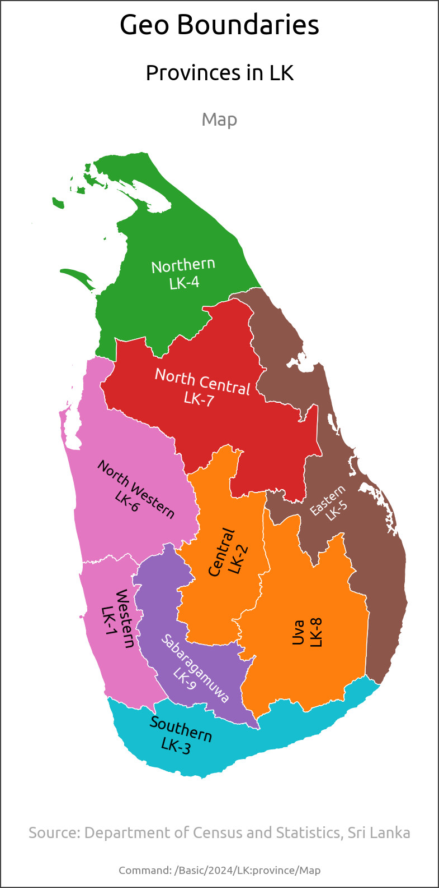
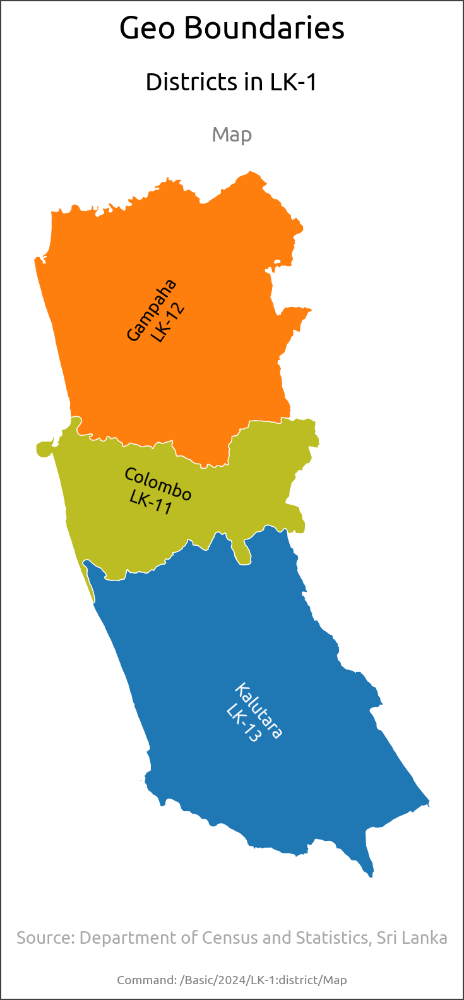
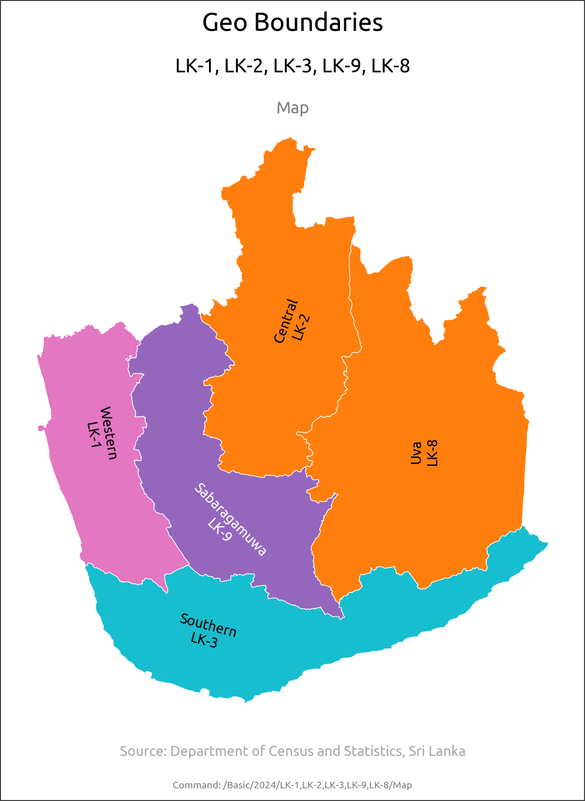
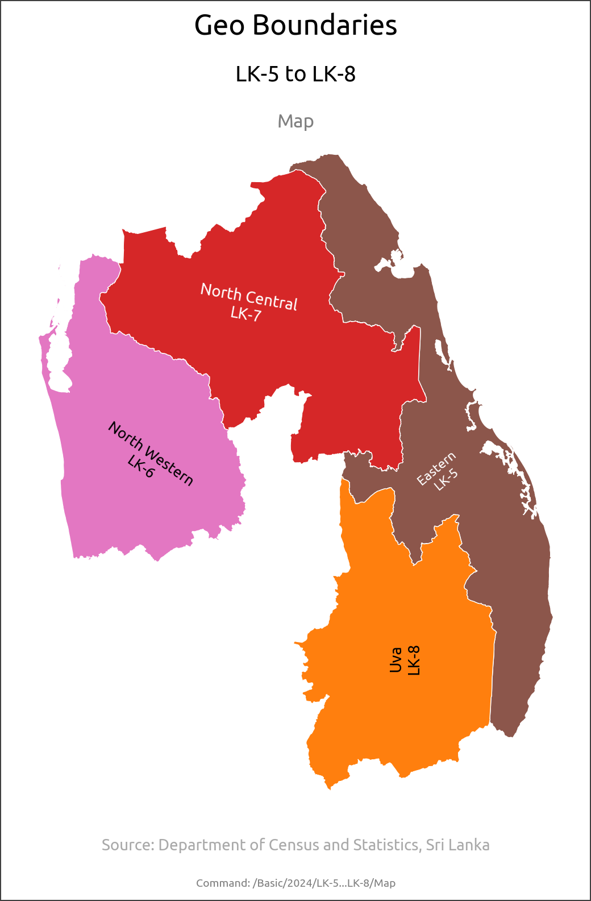
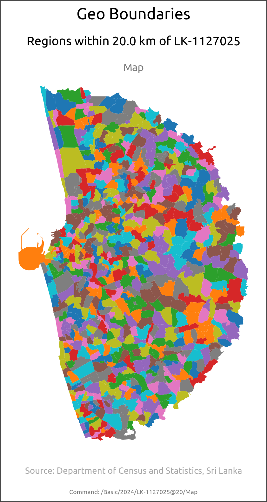

# Lanka Data

This repo implements a simple interface to query data about Sri Lanka.

## Data Sources

- [Department of Census and Statistics, Sri Lanka](https://www.statistics.gov.lk/)
- [lanka_data](https://github.com/nuuuwan/lanka_data/blob/main/README.md)

## Usage

### Run Code

```python
from lanka_data import Db


db = Db("<cmd>")
output = db.run()
print(output)

```

### workflows/single.py

Runs single command.

```bash
python workflows/single.py <cmd>
```

### workflows/console.py

Console tool for running commands.

```bash
python workflows/console.py <cmd>

/Where/What/When/How

> /<cmd>
```

## Example cmds (`<cmd>`)

### 1) Help

#### 1.01) Help

```bash
Help
```

```json
{
    "result": {
        "what_to_whens": {
            "AgeGroup": [
                "2012",
                "2024"
            ],
            "Basic": [
                "2024"
            ],
            "Communication": [
                "2012"
            ],
            "ConstructionYear": [
                "2012"
            ],
            "Economy": [
                "2012"
            ],
            "Education": [
            ... // 101 lines ...
            "Water": [
                "2012",
                "2024"
            ]
        },
        "where": [
            "LK*",
            "EC-*",
            "LG-*"
        ],
        "how": [
            "JSON",
            "Map"
        ],
        "source": "lanka_data",
        "source_url": "https://github.com/nuuuwan/lanka_data/blob/main/README.md"
    },
    "query_time_ms": 0,
    "cache_hit": true
}
```

### 2) Selection

#### 2.01) Map of Basic Information (2024) for Provinces in LK.

```bash
Basic/2024/LK:province/Map
```

```json
{
    "result": {
        "what_description": "Basic Information",
        "when_description": "2024",
        "where_description": "Provinces in LK",
        "how_description": "Map",
        "image_path": "/tmp/lanka_data/output/Basic/2024/LK:province/Map/Image.png",
        "source": "Department of Census and Statistics, Sri Lanka",
        "source_url": "https://www.statistics.gov.lk/",
        "cmd": "Basic/2024/LK:province/Map"
    },
    "query_time_ms": 0,
    "cache_hit": true
}
```



#### 2.02) Map of Basic Information (2024) for Districts in LK-1.

```bash
Basic/2024/LK-1:district/Map
```

```json
{
    "result": {
        "what_description": "Basic Information",
        "when_description": "2024",
        "where_description": "Districts in LK-1",
        "how_description": "Map",
        "image_path": "/tmp/lanka_data/output/Basic/2024/LK-1:district/Map/Image.png",
        "source": "Department of Census and Statistics, Sri Lanka",
        "source_url": "https://www.statistics.gov.lk/",
        "cmd": "Basic/2024/LK-1:district/Map"
    },
    "query_time_ms": 0,
    "cache_hit": true
}
```



#### 2.03) Map of Basic Information (2024) for LK-1, LK-2, LK-3, LK-9, LK-8.

```bash
Basic/2024/LK-1,LK-2,LK-3,LK-9,LK-8/Map
```

```json
{
    "result": {
        "what_description": "Basic Information",
        "when_description": "2024",
        "where_description": "LK-1, LK-2, LK-3, LK-9, LK-8",
        "how_description": "Map",
        "image_path": "/tmp/lanka_data/output/Basic/2024/LK-1,LK-2,LK-3,LK-9,LK-8/Map/Image.png",
        "source": "Department of Census and Statistics, Sri Lanka",
        "source_url": "https://www.statistics.gov.lk/",
        "cmd": "Basic/2024/LK-1,LK-2,LK-3,LK-9,LK-8/Map"
    },
    "query_time_ms": 0,
    "cache_hit": true
}
```



#### 2.04) Map of Basic Information (2024) for LK-5 to LK-8.

```bash
Basic/2024/LK-5...LK-8/Map
```

```json
{
    "result": {
        "what_description": "Basic Information",
        "when_description": "2024",
        "where_description": "LK-5 to LK-8",
        "how_description": "Map",
        "image_path": "/tmp/lanka_data/output/Basic/2024/LK-5...LK-8/Map/Image.png",
        "source": "Department of Census and Statistics, Sri Lanka",
        "source_url": "https://www.statistics.gov.lk/",
        "cmd": "Basic/2024/LK-5...LK-8/Map"
    },
    "query_time_ms": 0,
    "cache_hit": true
}
```



#### 2.05) Map of Basic Information (2024) for Regions within 20.0 km of LK-1127025.

```bash
Basic/2024/LK-1127025@20/Map
```

```json
{
    "result": {
        "what_description": "Basic Information",
        "when_description": "2024",
        "where_description": "Regions within 20.0 km of LK-1127025",
        "how_description": "Map",
        "image_path": "/tmp/lanka_data/output/Basic/2024/LK-1127025@20/Map/Image.png",
        "source": "Department of Census and Statistics, Sri Lanka",
        "source_url": "https://www.statistics.gov.lk/",
        "cmd": "Basic/2024/LK-1127025@20/Map"
    },
    "query_time_ms": 0,
    "cache_hit": true
}
```




[](https://opensource.org/licenses/MIT)
