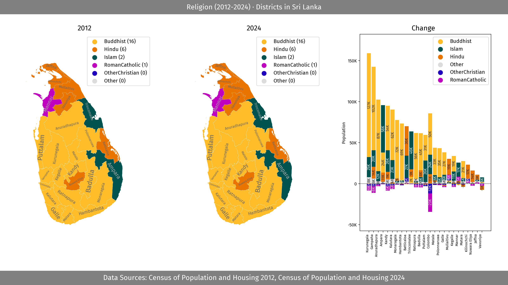
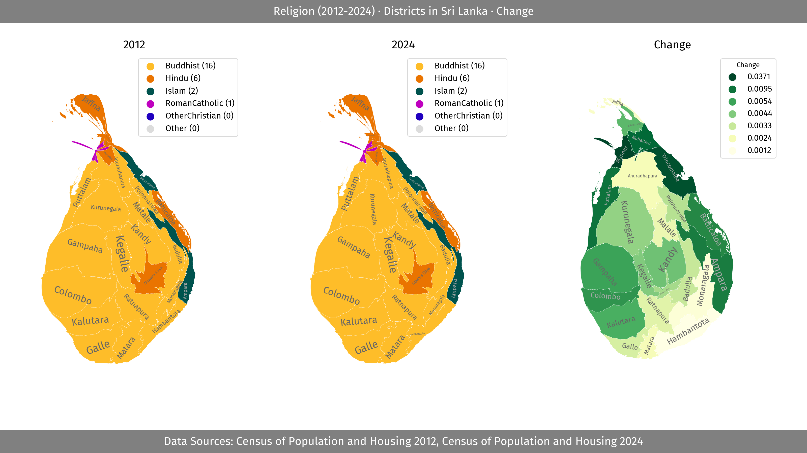
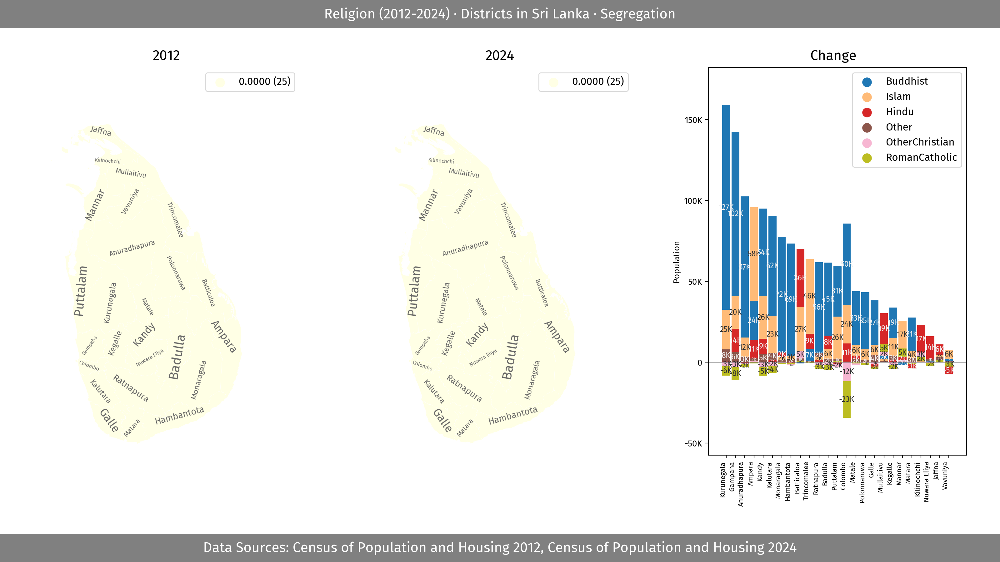
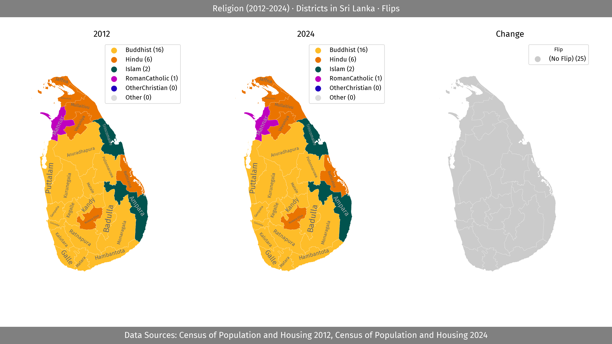

# Lanka Data

This repo implements a simple interface to query data about Sri Lanka.

## Data Sources

- [Election Commission of Sri Lanka](https://www.elections.gov.lk)

## Usage

### Run Code

```python
from lanka_data import Command


db = Command("<cmd>")
output = db.run()
print(output)

```

### workflows/single.py

Runs single command.

```bash
python workflows/single.py <cmd>
```

### workflows/console.py

Console tool for running commands.

```bash
python workflows/console.py <cmd>

/Where/What/When/How

> /<cmd>
```

## Example cmds (`<cmd>`)

### 1) Help

#### 1.01) Help

```bash
Help
```

```json
{
    "result": {
        "what_to_whens": {
            "AgeGroup": [
                "2012",
                "2024"
            ],
            "Basic": [
                "2024"
            ],
            "Communication": [
                "2012"
            ],
            "ConstructionYear": [
                "2012"
            ],
            "Economy": [
                "2012"
            ],
            "Education": [
            ... // 179 lines ...
            "Water": [
                "2012",
                "2024"
            ]
        },
        "where": [
            "LK*",
            "EC-*",
            "LG-*"
        ],
        "how": [
            "JSON",
            "Map"
        ],
        "source": "lanka_data",
        "source_url": "https://github.com/nuuuwan/lanka_data/blob/main/README.md"
    },
    "query_time_ms": 0,
    "cache_hit": true
}
```

Source: [examples/outputs/Help/Output.json](examples/outputs/Help/Output.json)

### 2) Selection

#### 2.01)  of Basic Information (2024) for Provinces in Sri Lanka.

```bash
Basic/2024/LK:province/Map
```

```json
{
    "result": {
        "what_description": "Basic Information",
        "when_description": "2024",
        "where_description": "Provinces in Sri Lanka",
        "how_description": "",
        "image_path": "/tmp/lanka_data/output/Basic/2024/LK:province/Map/Image.png",
        "source_list": [
            "Department of Census and Statistics, Sri Lanka"
        ],
        "cmd": "Basic/2024/LK:province/Map"
    },
    "query_time_ms": 0,
    "cache_hit": true
}
```

Source: [examples/outputs/Basic/2024/LK:province/Map/Output.json](examples/outputs/Basic/2024/LK:province/Map/Output.json)


Source: [examples/outputs/Basic/2024/LK:province/Map/Image.png](examples/outputs/Basic/2024/LK:province/Map/Image.png)

#### 2.02)  of Basic Information (2024) for Districts in the Western PROVINCE.

```bash
Basic/2024/LK-1:district/Map
```

```json
{
    "result": {
        "what_description": "Basic Information",
        "when_description": "2024",
        "where_description": "Districts in the Western PROVINCE",
        "how_description": "",
        "image_path": "/tmp/lanka_data/output/Basic/2024/LK-1:district/Map/Image.png",
        "source_list": [
            "Department of Census and Statistics, Sri Lanka"
        ],
        "cmd": "Basic/2024/LK-1:district/Map"
    },
    "query_time_ms": 0,
    "cache_hit": true
}
```

Source: [examples/outputs/Basic/2024/LK-1:district/Map/Output.json](examples/outputs/Basic/2024/LK-1:district/Map/Output.json)


Source: [examples/outputs/Basic/2024/LK-1:district/Map/Image.png](examples/outputs/Basic/2024/LK-1:district/Map/Image.png)

#### 2.03)  of Basic Information (2024) for the Western PROVINCE, the Central PROVINCE, the Southern PROVINCE, the Sabaragamuwa PROVINCE, the Uva PROVINCE.

```bash
Basic/2024/LK-1,LK-2,LK-3,LK-9,LK-8/Map
```

```json
{
    "result": {
        "what_description": "Basic Information",
        "when_description": "2024",
        "where_description": "the Western PROVINCE, the Central PROVINCE, the Southern PROVINCE, the Sabaragamuwa PROVINCE, the Uva PROVINCE",
        "how_description": "",
        "image_path": "/tmp/lanka_data/output/Basic/2024/LK-1,LK-2,LK-3,LK-9,LK-8/Map/Image.png",
        "source_list": [
            "Department of Census and Statistics, Sri Lanka"
        ],
        "cmd": "Basic/2024/LK-1,LK-2,LK-3,LK-9,LK-8/Map"
    },
    "query_time_ms": 0,
    "cache_hit": true
}
```

Source: [examples/outputs/Basic/2024/LK-1,LK-2,LK-3,LK-9,LK-8/Map/Output.json](examples/outputs/Basic/2024/LK-1,LK-2,LK-3,LK-9,LK-8/Map/Output.json)


Source: [examples/outputs/Basic/2024/LK-1,LK-2,LK-3,LK-9,LK-8/Map/Image.png](examples/outputs/Basic/2024/LK-1,LK-2,LK-3,LK-9,LK-8/Map/Image.png)

#### 2.04)  of Basic Information (2024) for the Eastern PROVINCE to the Uva PROVINCE.

```bash
Basic/2024/LK-5...LK-8/Map
```

```json
{
    "result": {
        "what_description": "Basic Information",
        "when_description": "2024",
        "where_description": "the Eastern PROVINCE to the Uva PROVINCE",
        "how_description": "",
        "image_path": "/tmp/lanka_data/output/Basic/2024/LK-5...LK-8/Map/Image.png",
        "source_list": [
            "Department of Census and Statistics, Sri Lanka"
        ],
        "cmd": "Basic/2024/LK-5...LK-8/Map"
    },
    "query_time_ms": 0,
    "cache_hit": true
}
```

Source: [examples/outputs/Basic/2024/LK-5...LK-8/Map/Output.json](examples/outputs/Basic/2024/LK-5...LK-8/Map/Output.json)


Source: [examples/outputs/Basic/2024/LK-5...LK-8/Map/Image.png](examples/outputs/Basic/2024/LK-5...LK-8/Map/Image.png)

#### 2.05)  of Basic Information (2024) for Regions within 20.0 km of the Kuppiyawatta East GND.

```bash
Basic/2024/LK-1127025@20/Map
```

```json
{
    "result": {
        "what_description": "Basic Information",
        "when_description": "2024",
        "where_description": "Regions within 20.0 km of the Kuppiyawatta East GND",
        "how_description": "",
        "image_path": "/tmp/lanka_data/output/Basic/2024/LK-1127025@20/Map/Image.png",
        "source_list": [
            "Department of Census and Statistics, Sri Lanka"
        ],
        "cmd": "Basic/2024/LK-1127025@20/Map"
    },
    "query_time_ms": 0,
    "cache_hit": true
}
```

Source: [examples/outputs/Basic/2024/LK-1127025@20/Map/Output.json](examples/outputs/Basic/2024/LK-1127025@20/Map/Output.json)


Source: [examples/outputs/Basic/2024/LK-1127025@20/Map/Image.png](examples/outputs/Basic/2024/LK-1127025@20/Map/Image.png)

### 3) Religion

#### 3.01)  of Population distributed by religious affiliation such as Buddhist, Hindu, Islam, and Christian (2012-2024) for Districts in Sri Lanka.

```bash
Religion/2012-2024/LK:district/Map
```

```json
{
    "result": {
        "what_description": "Population distributed by religious affiliation such as Buddhist, Hindu, Islam, and Christian",
        "when_description": "2012-2024",
        "where_description": "Districts in Sri Lanka",
        "how_description": "",
        "image_path": "/tmp/lanka_data/output/Religion/2012-2024/LK:district/Map/Image.png",
        "source_list": [
            "Census of Population and Housing 2012",
            "Census of Population and Housing 2024"
        ],
        "cmd": "Religion/2012-2024/LK:district/Map"
    },
    "query_time_ms": 0,
    "cache_hit": true
}
```

Source: [examples/outputs/Religion/2012-2024/LK:district/Map/Output.json](examples/outputs/Religion/2012-2024/LK:district/Map/Output.json)



Source: [examples/outputs/Religion/2012-2024/LK:district/Map/Image.png](examples/outputs/Religion/2012-2024/LK:district/Map/Image.png)

#### 3.02) Change of Population distributed by religious affiliation such as Buddhist, Hindu, Islam, and Christian (2012-2024) for Districts in Sri Lanka.

```bash
Religion/2012-2024/LK:district/Map:Change
```

```json
{
    "result": {
        "what_description": "Population distributed by religious affiliation such as Buddhist, Hindu, Islam, and Christian",
        "when_description": "2012-2024",
        "where_description": "Districts in Sri Lanka",
        "how_description": "Change",
        "image_path": "/tmp/lanka_data/output/Religion/2012-2024/LK:district/Map:Change/Image.png",
        "source_list": [
            "Census of Population and Housing 2012",
            "Census of Population and Housing 2024"
        ],
        "cmd": "Religion/2012-2024/LK:district/Map:Change"
    },
    "query_time_ms": 0,
    "cache_hit": true
}
```

Source: [examples/outputs/Religion/2012-2024/LK:district/Map:Change/Output.json](examples/outputs/Religion/2012-2024/LK:district/Map:Change/Output.json)


Source: [examples/outputs/Religion/2012-2024/LK:district/Map:Change/Image.png](examples/outputs/Religion/2012-2024/LK:district/Map:Change/Image.png)

#### 3.03) Change of Population distributed by religious affiliation such as Buddhist, Hindu, Islam, and Christian (2012-2024) for Districts in Sri Lanka.

```bash
Religion/2012-2024/LK:district/Cartogram:Change
```

```json
{
    "result": {
        "what_description": "Population distributed by religious affiliation such as Buddhist, Hindu, Islam, and Christian",
        "when_description": "2012-2024",
        "where_description": "Districts in Sri Lanka",
        "how_description": "Change",
        "image_path": "/tmp/lanka_data/output/Religion/2012-2024/LK:district/Cartogram:Change/Image.png",
        "source_list": [
            "Census of Population and Housing 2012",
            "Census of Population and Housing 2024"
        ],
        "cmd": "Religion/2012-2024/LK:district/Cartogram:Change"
    },
    "query_time_ms": 0,
    "cache_hit": true
}
```

Source: [examples/outputs/Religion/2012-2024/LK:district/Cartogram:Change/Output.json](examples/outputs/Religion/2012-2024/LK:district/Cartogram:Change/Output.json)



Source: [examples/outputs/Religion/2012-2024/LK:district/Cartogram:Change/Image.png](examples/outputs/Religion/2012-2024/LK:district/Cartogram:Change/Image.png)

#### 3.04) DiversityPew of Population distributed by religious affiliation such as Buddhist, Hindu, Islam, and Christian (2012-2024) for Districts in Sri Lanka.

```bash
Religion/2012-2024/LK:district/Map:DiversityPew
```

```json
{
    "result": {
        "what_description": "Population distributed by religious affiliation such as Buddhist, Hindu, Islam, and Christian",
        "when_description": "2012-2024",
        "where_description": "Districts in Sri Lanka",
        "how_description": "DiversityPew",
        "image_path": "/tmp/lanka_data/output/Religion/2012-2024/LK:district/Map:DiversityPew/Image.png",
        "source_list": [
            "Census of Population and Housing 2012",
            "Census of Population and Housing 2024"
        ],
        "cmd": "Religion/2012-2024/LK:district/Map:DiversityPew"
    },
    "query_time_ms": 0,
    "cache_hit": true
}
```

Source: [examples/outputs/Religion/2012-2024/LK:district/Map:DiversityPew/Output.json](examples/outputs/Religion/2012-2024/LK:district/Map:DiversityPew/Output.json)


Source: [examples/outputs/Religion/2012-2024/LK:district/Map:DiversityPew/Image.png](examples/outputs/Religion/2012-2024/LK:district/Map:DiversityPew/Image.png)

#### 3.05) Segregation of Population distributed by religious affiliation such as Buddhist, Hindu, Islam, and Christian (2012-2024) for Districts in Sri Lanka.

```bash
Religion/2012-2024/LK:district/Map:Segregation
```

```json
{
    "result": {
        "what_description": "Population distributed by religious affiliation such as Buddhist, Hindu, Islam, and Christian",
        "when_description": "2012-2024",
        "where_description": "Districts in Sri Lanka",
        "how_description": "Segregation",
        "image_path": "/tmp/lanka_data/output/Religion/2012-2024/LK:district/Map:Segregation/Image.png",
        "source_list": [
            "Census of Population and Housing 2012",
            "Census of Population and Housing 2024"
        ],
        "cmd": "Religion/2012-2024/LK:district/Map:Segregation"
    },
    "query_time_ms": 0,
    "cache_hit": true
}
```

Source: [examples/outputs/Religion/2012-2024/LK:district/Map:Segregation/Output.json](examples/outputs/Religion/2012-2024/LK:district/Map:Segregation/Output.json)



Source: [examples/outputs/Religion/2012-2024/LK:district/Map:Segregation/Image.png](examples/outputs/Religion/2012-2024/LK:district/Map:Segregation/Image.png)

#### 3.06) Flips of Population distributed by religious affiliation such as Buddhist, Hindu, Islam, and Christian (2012-2024) for Districts in Sri Lanka.

```bash
Religion/2012-2024/LK:district/Map:Flips
```

```json
{
    "result": {
        "what_description": "Population distributed by religious affiliation such as Buddhist, Hindu, Islam, and Christian",
        "when_description": "2012-2024",
        "where_description": "Districts in Sri Lanka",
        "how_description": "Flips",
        "image_path": "/tmp/lanka_data/output/Religion/2012-2024/LK:district/Map:Flips/Image.png",
        "source_list": [
            "Census of Population and Housing 2012",
            "Census of Population and Housing 2024"
        ],
        "cmd": "Religion/2012-2024/LK:district/Map:Flips"
    },
    "query_time_ms": 0,
    "cache_hit": true
}
```

Source: [examples/outputs/Religion/2012-2024/LK:district/Map:Flips/Output.json](examples/outputs/Religion/2012-2024/LK:district/Map:Flips/Output.json)



Source: [examples/outputs/Religion/2012-2024/LK:district/Map:Flips/Image.png](examples/outputs/Religion/2012-2024/LK:district/Map:Flips/Image.png)

### 4) Ethnicity

#### 4.01)  of GN-level population by ethnic group (Sinhalese, Sri Lanka Tamil, Indian Tamil, Moor, Burgher, Malay, Chetty, Bharatha, Veddha, other). (2024) for Divisional Secretariat Divisions in the Trincomalee DISTRICT.

```bash
Ethnicity/2024/LK-53:dsd/Map
```

```json
{
    "result": {
        "what_description": "GN-level population by ethnic group (Sinhalese, Sri Lanka Tamil, Indian Tamil, Moor, Burgher, Malay, Chetty, Bharatha, Veddha, other).",
        "when_description": "2024",
        "where_description": "Divisional Secretariat Divisions in the Trincomalee DISTRICT",
        "how_description": "",
        "image_path": "/tmp/lanka_data/output/Ethnicity/2024/LK-53:dsd/Map/Image.png",
        "source_list": [
            "Census of Population and Housing 2024"
        ],
        "cmd": "Ethnicity/2024/LK-53:dsd/Map"
    },
    "query_time_ms": 0,
    "cache_hit": true
}
```

Source: [examples/outputs/Ethnicity/2024/LK-53:dsd/Map/Output.json](examples/outputs/Ethnicity/2024/LK-53:dsd/Map/Output.json)


Source: [examples/outputs/Ethnicity/2024/LK-53:dsd/Map/Image.png](examples/outputs/Ethnicity/2024/LK-53:dsd/Map/Image.png)

#### 4.02)  of GN-level population by ethnic group (Sinhalese, Sri Lanka Tamil, Indian Tamil, Moor, Burgher, Malay, Chetty, Bharatha, Veddha, other). (2024) for Divisional Secretariat Divisions in the Trincomalee DISTRICT.

```bash
Ethnicity/2024/LK-53:dsd/Cartogram
```

```json
{
    "result": {
        "what_description": "GN-level population by ethnic group (Sinhalese, Sri Lanka Tamil, Indian Tamil, Moor, Burgher, Malay, Chetty, Bharatha, Veddha, other).",
        "when_description": "2024",
        "where_description": "Divisional Secretariat Divisions in the Trincomalee DISTRICT",
        "how_description": "",
        "image_path": "/tmp/lanka_data/output/Ethnicity/2024/LK-53:dsd/Cartogram/Image.png",
        "source_list": [
            "Census of Population and Housing 2024"
        ],
        "cmd": "Ethnicity/2024/LK-53:dsd/Cartogram"
    },
    "query_time_ms": 0,
    "cache_hit": true
}
```

Source: [examples/outputs/Ethnicity/2024/LK-53:dsd/Cartogram/Output.json](examples/outputs/Ethnicity/2024/LK-53:dsd/Cartogram/Output.json)


Source: [examples/outputs/Ethnicity/2024/LK-53:dsd/Cartogram/Image.png](examples/outputs/Ethnicity/2024/LK-53:dsd/Cartogram/Image.png)

#### 4.03)  of GN-level population by ethnic group (Sinhalese, Sri Lanka Tamil, Indian Tamil, Moor, Burgher, Malay, Chetty, Bharatha, Veddha, other). (Latest) for Divisional Secretariat Divisions in the Central PROVINCE.

```bash
Ethnicity/Latest/LK-2:dsd/Map
```

```json
{
    "result": {
        "what_description": "GN-level population by ethnic group (Sinhalese, Sri Lanka Tamil, Indian Tamil, Moor, Burgher, Malay, Chetty, Bharatha, Veddha, other).",
        "when_description": "Latest",
        "where_description": "Divisional Secretariat Divisions in the Central PROVINCE",
        "how_description": "",
        "image_path": "/tmp/lanka_data/output/Ethnicity/Latest/LK-2:dsd/Map/Image.png",
        "source_list": [
            "Census of Population and Housing 2024"
        ],
        "cmd": "Ethnicity/Latest/LK-2:dsd/Map"
    },
    "query_time_ms": 0,
    "cache_hit": true
}
```

Source: [examples/outputs/Ethnicity/Latest/LK-2:dsd/Map/Output.json](examples/outputs/Ethnicity/Latest/LK-2:dsd/Map/Output.json)


Source: [examples/outputs/Ethnicity/Latest/LK-2:dsd/Map/Image.png](examples/outputs/Ethnicity/Latest/LK-2:dsd/Map/Image.png)

#### 4.04)  of GN-level population by ethnic group (Sinhalese, Sri Lanka Tamil, Indian Tamil, Moor, Burgher, Malay, Chetty, Bharatha, Veddha, other). (2024) for Divisional Secretariat Divisions in the Nuwara Eliya DISTRICT.

```bash
Ethnicity/2024/LK-23:dsd/Map
```

```json
{
    "result": {
        "what_description": "GN-level population by ethnic group (Sinhalese, Sri Lanka Tamil, Indian Tamil, Moor, Burgher, Malay, Chetty, Bharatha, Veddha, other).",
        "when_description": "2024",
        "where_description": "Divisional Secretariat Divisions in the Nuwara Eliya DISTRICT",
        "how_description": "",
        "image_path": "/tmp/lanka_data/output/Ethnicity/2024/LK-23:dsd/Map/Image.png",
        "source_list": [
            "Census of Population and Housing 2024"
        ],
        "cmd": "Ethnicity/2024/LK-23:dsd/Map"
    },
    "query_time_ms": 0,
    "cache_hit": true
}
```

Source: [examples/outputs/Ethnicity/2024/LK-23:dsd/Map/Output.json](examples/outputs/Ethnicity/2024/LK-23:dsd/Map/Output.json)


Source: [examples/outputs/Ethnicity/2024/LK-23:dsd/Map/Image.png](examples/outputs/Ethnicity/2024/LK-23:dsd/Map/Image.png)

### 5) Elections

#### 5.01)  of Results of the 2024 Sri Lankan Parliamentary Election (2024) for Sri Lanka.

```bash
Parliamentary/2024/LK/JSON
```

```json
{
    "result": {
        "what_description": "Results of the 2024 Sri Lankan Parliamentary Election",
        "when_description": "2024",
        "where_description": "Sri Lanka",
        "how_description": "",
        "data_list": [
            {
                "region_id": "LK",
                "region_name": "Sri Lanka",
                "region_type": "country",
                "history_year": "Current",
                "area_sqkm": 65983.58,
                "center_lat": 7.621863,
                "center_lng": 80.698448,
                "other_names": "\u0b87\u0bb2\u0b99\u0bcd\u0b95\u0bc8,\u0dc1\u0dca\u200d\u0dbb\u0dd3 \u0dbd\u0d82\u0d9a\u0dcf",
                "summary": {
                    "electors": 17140354,
                    "polled": 11815246,
                    "valid": 11148006,
                    ... // 2675 lines ...
                "IND05-13": 0.0,
                "IND07-13": 0.0,
                "IND08-14": 0.0,
                "IND32-13": 0.0,
                "IND40-13": 0.0,
                "IND37-13": 0.0,
                "IND33-13": 0.0
            }
        },
        "source_info_list": [
            {
                "label": "Election Commission of Sri Lanka",
                "url": "https://www.elections.gov.lk"
            }
        ],
        "cmd": "Parliamentary/2024/LK/JSON"
    },
    "query_time_ms": 0,
    "cache_hit": true
}
```

Source: [examples/outputs/Parliamentary/2024/LK/JSON/Output.json](examples/outputs/Parliamentary/2024/LK/JSON/Output.json)

#### 5.02)  of Results of the 2024 Sri Lankan Presidential Election (Latest) for Polling Divisions in the Colombo DISTRICT.

```bash
Presidential/Latest/LK-11:pd/Map
```

```json
{
    "result": {
        "what_description": "Results of the 2024 Sri Lankan Presidential Election",
        "when_description": "Latest",
        "where_description": "Polling Divisions in the Colombo DISTRICT",
        "how_description": "",
        "image_path": "/tmp/lanka_data/output/Presidential/Latest/LK-11:pd/Map/Image.png",
        "source_list": [
            "Election Commission of Sri Lanka"
        ],
        "cmd": "Presidential/Latest/LK-11:pd/Map"
    },
    "query_time_ms": 0,
    "cache_hit": true
}
```

Source: [examples/outputs/Presidential/Latest/LK-11:pd/Map/Output.json](examples/outputs/Presidential/Latest/LK-11:pd/Map/Output.json)


Source: [examples/outputs/Presidential/Latest/LK-11:pd/Map/Image.png](examples/outputs/Presidential/Latest/LK-11:pd/Map/Image.png)

#### 5.03)  of Results of the 2025 Sri Lankan Local Election (2025) for Districts in Sri Lanka.

```bash
Local/2025/LK:district/Map
```

```json
{
    "result": {
        "what_description": "Results of the 2025 Sri Lankan Local Election",
        "when_description": "2025",
        "where_description": "Districts in Sri Lanka",
        "how_description": "",
        "image_path": "/tmp/lanka_data/output/Local/2025/LK:district/Map/Image.png",
        "source_list": [
            "Election Commission of Sri Lanka"
        ],
        "cmd": "Local/2025/LK:district/Map"
    },
    "query_time_ms": 0,
    "cache_hit": true
}
```

Source: [examples/outputs/Local/2025/LK:district/Map/Output.json](examples/outputs/Local/2025/LK:district/Map/Output.json)


Source: [examples/outputs/Local/2025/LK:district/Map/Image.png](examples/outputs/Local/2025/LK:district/Map/Image.png)

### 6) History

#### 6.01)  of Basic Information (2012) for Provinces in Sri Lanka.

```bash
Basic/2012/LK-pre1845:province/Map
```

```json
{
    "result": {
        "what_description": "Basic Information",
        "when_description": "2012",
        "where_description": "Provinces in Sri Lanka",
        "how_description": "",
        "image_path": "/tmp/lanka_data/output/Basic/2012/LK-pre1845:province/Map/Image.png",
        "source_list": [
            "Department of Census and Statistics, Sri Lanka"
        ],
        "cmd": "Basic/2012/LK-pre1845:province/Map"
    },
    "query_time_ms": 0,
    "cache_hit": true
}
```

Source: [examples/outputs/Basic/2012/LK-pre1845:province/Map/Output.json](examples/outputs/Basic/2012/LK-pre1845:province/Map/Output.json)


Source: [examples/outputs/Basic/2012/LK-pre1845:province/Map/Image.png](examples/outputs/Basic/2012/LK-pre1845:province/Map/Image.png)

#### 6.02)  of Basic Information (2012) for Provinces in Sri Lanka.

```bash
Basic/2012/LK-pre1873:province/Map
```

```json
{
    "result": {
        "what_description": "Basic Information",
        "when_description": "2012",
        "where_description": "Provinces in Sri Lanka",
        "how_description": "",
        "image_path": "/tmp/lanka_data/output/Basic/2012/LK-pre1873:province/Map/Image.png",
        "source_list": [
            "Department of Census and Statistics, Sri Lanka"
        ],
        "cmd": "Basic/2012/LK-pre1873:province/Map"
    },
    "query_time_ms": 0,
    "cache_hit": true
}
```

Source: [examples/outputs/Basic/2012/LK-pre1873:province/Map/Output.json](examples/outputs/Basic/2012/LK-pre1873:province/Map/Output.json)


Source: [examples/outputs/Basic/2012/LK-pre1873:province/Map/Image.png](examples/outputs/Basic/2012/LK-pre1873:province/Map/Image.png)

#### 6.03)  of Basic Information (2012) for Provinces in Sri Lanka.

```bash
Basic/2012/LK-pre1886:province/Map
```

```json
{
    "result": {
        "what_description": "Basic Information",
        "when_description": "2012",
        "where_description": "Provinces in Sri Lanka",
        "how_description": "",
        "image_path": "/tmp/lanka_data/output/Basic/2012/LK-pre1886:province/Map/Image.png",
        "source_list": [
            "Department of Census and Statistics, Sri Lanka"
        ],
        "cmd": "Basic/2012/LK-pre1886:province/Map"
    },
    "query_time_ms": 0,
    "cache_hit": true
}
```

Source: [examples/outputs/Basic/2012/LK-pre1886:province/Map/Output.json](examples/outputs/Basic/2012/LK-pre1886:province/Map/Output.json)


Source: [examples/outputs/Basic/2012/LK-pre1886:province/Map/Image.png](examples/outputs/Basic/2012/LK-pre1886:province/Map/Image.png)

#### 6.04)  of Basic Information (2012) for Provinces in Sri Lanka.

```bash
Basic/2012/LK-pre1889:province/Map
```

```json
{
    "result": {
        "what_description": "Basic Information",
        "when_description": "2012",
        "where_description": "Provinces in Sri Lanka",
        "how_description": "",
        "image_path": "/tmp/lanka_data/output/Basic/2012/LK-pre1889:province/Map/Image.png",
        "source_list": [
            "Department of Census and Statistics, Sri Lanka"
        ],
        "cmd": "Basic/2012/LK-pre1889:province/Map"
    },
    "query_time_ms": 0,
    "cache_hit": true
}
```

Source: [examples/outputs/Basic/2012/LK-pre1889:province/Map/Output.json](examples/outputs/Basic/2012/LK-pre1889:province/Map/Output.json)


Source: [examples/outputs/Basic/2012/LK-pre1889:province/Map/Image.png](examples/outputs/Basic/2012/LK-pre1889:province/Map/Image.png)

#### 6.05)  of Basic Information (2012) for Provinces in Sri Lanka.

```bash
Basic/2012/LK:province/Map
```

```json
{
    "result": {
        "what_description": "Basic Information",
        "when_description": "2012",
        "where_description": "Provinces in Sri Lanka",
        "how_description": "",
        "image_path": "/tmp/lanka_data/output/Basic/2012/LK:province/Map/Image.png",
        "source_list": [
            "Department of Census and Statistics, Sri Lanka"
        ],
        "cmd": "Basic/2012/LK:province/Map"
    },
    "query_time_ms": 0,
    "cache_hit": true
}
```

Source: [examples/outputs/Basic/2012/LK:province/Map/Output.json](examples/outputs/Basic/2012/LK:province/Map/Output.json)


Source: [examples/outputs/Basic/2012/LK:province/Map/Image.png](examples/outputs/Basic/2012/LK:province/Map/Image.png)

#### 6.06)  of Basic Information (2012) for Districts in Sri Lanka.

```bash
Basic/2012/LK-pre1959:district/Map
```

```json
{
    "result": {
        "what_description": "Basic Information",
        "when_description": "2012",
        "where_description": "Districts in Sri Lanka",
        "how_description": "",
        "image_path": "/tmp/lanka_data/output/Basic/2012/LK-pre1959:district/Map/Image.png",
        "source_list": [
            "Department of Census and Statistics, Sri Lanka"
        ],
        "cmd": "Basic/2012/LK-pre1959:district/Map"
    },
    "query_time_ms": 0,
    "cache_hit": true
}
```

Source: [examples/outputs/Basic/2012/LK-pre1959:district/Map/Output.json](examples/outputs/Basic/2012/LK-pre1959:district/Map/Output.json)


Source: [examples/outputs/Basic/2012/LK-pre1959:district/Map/Image.png](examples/outputs/Basic/2012/LK-pre1959:district/Map/Image.png)

#### 6.07)  of Basic Information (2012) for Districts in Sri Lanka.

```bash
Basic/2012/LK-pre1961:district/Map
```

```json
{
    "result": {
        "what_description": "Basic Information",
        "when_description": "2012",
        "where_description": "Districts in Sri Lanka",
        "how_description": "",
        "image_path": "/tmp/lanka_data/output/Basic/2012/LK-pre1961:district/Map/Image.png",
        "source_list": [
            "Department of Census and Statistics, Sri Lanka"
        ],
        "cmd": "Basic/2012/LK-pre1961:district/Map"
    },
    "query_time_ms": 0,
    "cache_hit": true
}
```

Source: [examples/outputs/Basic/2012/LK-pre1961:district/Map/Output.json](examples/outputs/Basic/2012/LK-pre1961:district/Map/Output.json)


Source: [examples/outputs/Basic/2012/LK-pre1961:district/Map/Image.png](examples/outputs/Basic/2012/LK-pre1961:district/Map/Image.png)

#### 6.08)  of Basic Information (2012) for Districts in Sri Lanka.

```bash
Basic/2012/LK-pre1978:district/Map
```

```json
{
    "result": {
        "what_description": "Basic Information",
        "when_description": "2012",
        "where_description": "Districts in Sri Lanka",
        "how_description": "",
        "image_path": "/tmp/lanka_data/output/Basic/2012/LK-pre1978:district/Map/Image.png",
        "source_list": [
            "Department of Census and Statistics, Sri Lanka"
        ],
        "cmd": "Basic/2012/LK-pre1978:district/Map"
    },
    "query_time_ms": 0,
    "cache_hit": true
}
```

Source: [examples/outputs/Basic/2012/LK-pre1978:district/Map/Output.json](examples/outputs/Basic/2012/LK-pre1978:district/Map/Output.json)


Source: [examples/outputs/Basic/2012/LK-pre1978:district/Map/Image.png](examples/outputs/Basic/2012/LK-pre1978:district/Map/Image.png)

#### 6.09)  of Basic Information (2012) for Districts in Sri Lanka.

```bash
Basic/2012/LK-pre1984:district/Map
```

```json
{
    "result": {
        "what_description": "Basic Information",
        "when_description": "2012",
        "where_description": "Districts in Sri Lanka",
        "how_description": "",
        "image_path": "/tmp/lanka_data/output/Basic/2012/LK-pre1984:district/Map/Image.png",
        "source_list": [
            "Department of Census and Statistics, Sri Lanka"
        ],
        "cmd": "Basic/2012/LK-pre1984:district/Map"
    },
    "query_time_ms": 0,
    "cache_hit": true
}
```

Source: [examples/outputs/Basic/2012/LK-pre1984:district/Map/Output.json](examples/outputs/Basic/2012/LK-pre1984:district/Map/Output.json)


Source: [examples/outputs/Basic/2012/LK-pre1984:district/Map/Image.png](examples/outputs/Basic/2012/LK-pre1984:district/Map/Image.png)

#### 6.10)  of Basic Information (2012) for Districts in Sri Lanka.

```bash
Basic/2012/LK:district/Map
```

```json
{
    "result": {
        "what_description": "Basic Information",
        "when_description": "2012",
        "where_description": "Districts in Sri Lanka",
        "how_description": "",
        "image_path": "/tmp/lanka_data/output/Basic/2012/LK:district/Map/Image.png",
        "source_list": [
            "Department of Census and Statistics, Sri Lanka"
        ],
        "cmd": "Basic/2012/LK:district/Map"
    },
    "query_time_ms": 0,
    "cache_hit": true
}
```

Source: [examples/outputs/Basic/2012/LK:district/Map/Output.json](examples/outputs/Basic/2012/LK:district/Map/Output.json)


Source: [examples/outputs/Basic/2012/LK:district/Map/Image.png](examples/outputs/Basic/2012/LK:district/Map/Image.png)

#### 6.11)  of Population distributed by ethnic group such as Sinhalese, Sri Lanka Tamil, Moor, and others (2012) for Divisional Secretariat Divisions in the Nuwara Eliya DISTRICT.

```bash
Ethnicity/2012/LK-23-pre2019:dsd/Map
```

```json
{
    "result": {
        "what_description": "Population distributed by ethnic group such as Sinhalese, Sri Lanka Tamil, Moor, and others",
        "when_description": "2012",
        "where_description": "Divisional Secretariat Divisions in the Nuwara Eliya DISTRICT",
        "how_description": "",
        "image_path": "/tmp/lanka_data/output/Ethnicity/2012/LK-23-pre2019:dsd/Map/Image.png",
        "source_list": [
            "Census of Population and Housing 2012"
        ],
        "cmd": "Ethnicity/2012/LK-23-pre2019:dsd/Map"
    },
    "query_time_ms": 0,
    "cache_hit": true
}
```

Source: [examples/outputs/Ethnicity/2012/LK-23-pre2019:dsd/Map/Output.json](examples/outputs/Ethnicity/2012/LK-23-pre2019:dsd/Map/Output.json)


Source: [examples/outputs/Ethnicity/2012/LK-23-pre2019:dsd/Map/Image.png](examples/outputs/Ethnicity/2012/LK-23-pre2019:dsd/Map/Image.png)

#### 6.12)  of GN-level population by ethnic group (Sinhalese, Sri Lanka Tamil, Indian Tamil, Moor, Burgher, Malay, Chetty, Bharatha, Veddha, other). (2024) for Divisional Secretariat Divisions in the Nuwara Eliya DISTRICT.

```bash
Ethnicity/2024/LK-23-pre2019:dsd/Map
```

```json
{
    "result": {
        "what_description": "GN-level population by ethnic group (Sinhalese, Sri Lanka Tamil, Indian Tamil, Moor, Burgher, Malay, Chetty, Bharatha, Veddha, other).",
        "when_description": "2024",
        "where_description": "Divisional Secretariat Divisions in the Nuwara Eliya DISTRICT",
        "how_description": "",
        "image_path": "/tmp/lanka_data/output/Ethnicity/2024/LK-23-pre2019:dsd/Map/Image.png",
        "source_list": [
            "Census of Population and Housing 2024"
        ],
        "cmd": "Ethnicity/2024/LK-23-pre2019:dsd/Map"
    },
    "query_time_ms": 0,
    "cache_hit": true
}
```

Source: [examples/outputs/Ethnicity/2024/LK-23-pre2019:dsd/Map/Output.json](examples/outputs/Ethnicity/2024/LK-23-pre2019:dsd/Map/Output.json)


Source: [examples/outputs/Ethnicity/2024/LK-23-pre2019:dsd/Map/Image.png](examples/outputs/Ethnicity/2024/LK-23-pre2019:dsd/Map/Image.png)

#### 6.13)  of GN-level population by ethnic group (Sinhalese, Sri Lanka Tamil, Indian Tamil, Moor, Burgher, Malay, Chetty, Bharatha, Veddha, other). (2024) for Divisional Secretariat Divisions in the Nuwara Eliya DISTRICT.

```bash
Ethnicity/2024/LK-23:dsd/Map
```

```json
{
    "result": {
        "what_description": "GN-level population by ethnic group (Sinhalese, Sri Lanka Tamil, Indian Tamil, Moor, Burgher, Malay, Chetty, Bharatha, Veddha, other).",
        "when_description": "2024",
        "where_description": "Divisional Secretariat Divisions in the Nuwara Eliya DISTRICT",
        "how_description": "",
        "image_path": "/tmp/lanka_data/output/Ethnicity/2024/LK-23:dsd/Map/Image.png",
        "source_list": [
            "Census of Population and Housing 2024"
        ],
        "cmd": "Ethnicity/2024/LK-23:dsd/Map"
    },
    "query_time_ms": 0,
    "cache_hit": true
}
```

Source: [examples/outputs/Ethnicity/2024/LK-23:dsd/Map/Output.json](examples/outputs/Ethnicity/2024/LK-23:dsd/Map/Output.json)


Source: [examples/outputs/Ethnicity/2024/LK-23:dsd/Map/Image.png](examples/outputs/Ethnicity/2024/LK-23:dsd/Map/Image.png)

#### 6.14)  of Basic Information (2024) for Divisional Secretariat Divisions in Sri Lanka.

```bash
Basic/2024/LK:dsd/Map
```

```json
{
    "result": {
        "what_description": "Basic Information",
        "when_description": "2024",
        "where_description": "Divisional Secretariat Divisions in Sri Lanka",
        "how_description": "",
        "image_path": "/tmp/lanka_data/output/Basic/2024/LK:dsd/Map/Image.png",
        "source_list": [
            "Department of Census and Statistics, Sri Lanka"
        ],
        "cmd": "Basic/2024/LK:dsd/Map"
    },
    "query_time_ms": 0,
    "cache_hit": true
}
```

Source: [examples/outputs/Basic/2024/LK:dsd/Map/Output.json](examples/outputs/Basic/2024/LK:dsd/Map/Output.json)


Source: [examples/outputs/Basic/2024/LK:dsd/Map/Image.png](examples/outputs/Basic/2024/LK:dsd/Map/Image.png)

#### 6.15)  of Basic Information (2024) for Grama Niladhari Divisions in Sri Lanka.

```bash
Basic/2024/LK:gnd/Map
```

```json
{
    "result": {
        "what_description": "Basic Information",
        "when_description": "2024",
        "where_description": "Grama Niladhari Divisions in Sri Lanka",
        "how_description": "",
        "image_path": "/tmp/lanka_data/output/Basic/2024/LK:gnd/Map/Image.png",
        "source_list": [
            "Department of Census and Statistics, Sri Lanka"
        ],
        "cmd": "Basic/2024/LK:gnd/Map"
    },
    "query_time_ms": 0,
    "cache_hit": true
}
```

Source: [examples/outputs/Basic/2024/LK:gnd/Map/Output.json](examples/outputs/Basic/2024/LK:gnd/Map/Output.json)


Source: [examples/outputs/Basic/2024/LK:gnd/Map/Image.png](examples/outputs/Basic/2024/LK:gnd/Map/Image.png)

### 7) Other-Whats

#### 7.01)  of GN-level population by five-year age groups from 00–04 up to 95 and above. (2024) for Districts in the Western PROVINCE.

```bash
AgeGroup/2024/LK-1:district/Map
```

```json
{
    "result": {
        "what_description": "GN-level population by five-year age groups from 00\u201304 up to 95 and above.",
        "when_description": "2024",
        "where_description": "Districts in the Western PROVINCE",
        "how_description": "",
        "image_path": "/tmp/lanka_data/output/AgeGroup/2024/LK-1:district/Map/Image.png",
        "source_list": [
            "Census of Population and Housing 2024"
        ],
        "cmd": "AgeGroup/2024/LK-1:district/Map"
    },
    "query_time_ms": 0,
    "cache_hit": true
}
```

Source: [examples/outputs/AgeGroup/2024/LK-1:district/Map/Output.json](examples/outputs/AgeGroup/2024/LK-1:district/Map/Output.json)


Source: [examples/outputs/AgeGroup/2024/LK-1:district/Map/Image.png](examples/outputs/AgeGroup/2024/LK-1:district/Map/Image.png)

#### 7.02)  of Households classified by ownership of communication items such as telephone, radio, and television (2012) for Divisional Secretariat Divisions in the Central PROVINCE.

```bash
Communication/2012/LK-2:dsd/Map
```

```json
{
    "result": {
        "what_description": "Households classified by ownership of communication items such as telephone, radio, and television",
        "when_description": "2012",
        "where_description": "Divisional Secretariat Divisions in the Central PROVINCE",
        "how_description": "",
        "image_path": "/tmp/lanka_data/output/Communication/2012/LK-2:dsd/Map/Image.png",
        "source_list": [
            "Census of Population and Housing 2012"
        ],
        "cmd": "Communication/2012/LK-2:dsd/Map"
    },
    "query_time_ms": 0,
    "cache_hit": true
}
```

Source: [examples/outputs/Communication/2012/LK-2:dsd/Map/Output.json](examples/outputs/Communication/2012/LK-2:dsd/Map/Output.json)


Source: [examples/outputs/Communication/2012/LK-2:dsd/Map/Image.png](examples/outputs/Communication/2012/LK-2:dsd/Map/Image.png)

#### 7.03)  of Housing units classified by the decade or period in which they were constructed (2012) for Divisional Secretariat Divisions in the Southern PROVINCE.

```bash
ConstructionYear/2012/LK-3:dsd/Map
```

```json
{
    "result": {
        "what_description": "Housing units classified by the decade or period in which they were constructed",
        "when_description": "2012",
        "where_description": "Divisional Secretariat Divisions in the Southern PROVINCE",
        "how_description": "",
        "image_path": "/tmp/lanka_data/output/ConstructionYear/2012/LK-3:dsd/Map/Image.png",
        "source_list": [
            "Census of Population and Housing 2012"
        ],
        "cmd": "ConstructionYear/2012/LK-3:dsd/Map"
    },
    "query_time_ms": 0,
    "cache_hit": true
}
```

Source: [examples/outputs/ConstructionYear/2012/LK-3:dsd/Map/Output.json](examples/outputs/ConstructionYear/2012/LK-3:dsd/Map/Output.json)


Source: [examples/outputs/ConstructionYear/2012/LK-3:dsd/Map/Image.png](examples/outputs/ConstructionYear/2012/LK-3:dsd/Map/Image.png)

#### 7.04)  of Households by principal cooking fuel (firewood, kerosene, gas, electricity, sawdust, bio-gas, other). (2024) for Divisional Secretariat Divisions in the Northern PROVINCE.

```bash
Fuel/2024/LK-4:dsd/Map
```

```json
{
    "result": {
        "what_description": "Households by principal cooking fuel (firewood, kerosene, gas, electricity, sawdust, bio-gas, other).",
        "when_description": "2024",
        "where_description": "Divisional Secretariat Divisions in the Northern PROVINCE",
        "how_description": "",
        "image_path": "/tmp/lanka_data/output/Fuel/2024/LK-4:dsd/Map/Image.png",
        "source_list": [
            "Census of Population and Housing 2024"
        ],
        "cmd": "Fuel/2024/LK-4:dsd/Map"
    },
    "query_time_ms": 0,
    "cache_hit": true
}
```

Source: [examples/outputs/Fuel/2024/LK-4:dsd/Map/Output.json](examples/outputs/Fuel/2024/LK-4:dsd/Map/Output.json)


Source: [examples/outputs/Fuel/2024/LK-4:dsd/Map/Image.png](examples/outputs/Fuel/2024/LK-4:dsd/Map/Image.png)

#### 7.05)  of Population classified by economic activity status including employed, unemployed, and economically inactive (2012) for Divisional Secretariat Divisions in the Eastern PROVINCE.

```bash
Economy/2012/LK-5:dsd/Map
```

```json
{
    "result": {
        "what_description": "Population classified by economic activity status including employed, unemployed, and economically inactive",
        "when_description": "2012",
        "where_description": "Divisional Secretariat Divisions in the Eastern PROVINCE",
        "how_description": "",
        "image_path": "/tmp/lanka_data/output/Economy/2012/LK-5:dsd/Map/Image.png",
        "source_list": [
            "Census of Population and Housing 2012"
        ],
        "cmd": "Economy/2012/LK-5:dsd/Map"
    },
    "query_time_ms": 0,
    "cache_hit": true
}
```

Source: [examples/outputs/Economy/2012/LK-5:dsd/Map/Output.json](examples/outputs/Economy/2012/LK-5:dsd/Map/Output.json)


Source: [examples/outputs/Economy/2012/LK-5:dsd/Map/Image.png](examples/outputs/Economy/2012/LK-5:dsd/Map/Image.png)

#### 7.06)  of Population classified by the highest level of educational qualification attained (2012) for Divisional Secretariat Divisions in the North Western PROVINCE.

```bash
Education/2012/LK-6:dsd/Map
```

```json
{
    "result": {
        "what_description": "Population classified by the highest level of educational qualification attained",
        "when_description": "2012",
        "where_description": "Divisional Secretariat Divisions in the North Western PROVINCE",
        "how_description": "",
        "image_path": "/tmp/lanka_data/output/Education/2012/LK-6:dsd/Map/Image.png",
        "source_list": [
            "Census of Population and Housing 2012"
        ],
        "cmd": "Education/2012/LK-6:dsd/Map"
    },
    "query_time_ms": 0,
    "cache_hit": true
}
```

Source: [examples/outputs/Education/2012/LK-6:dsd/Map/Output.json](examples/outputs/Education/2012/LK-6:dsd/Map/Output.json)


Source: [examples/outputs/Education/2012/LK-6:dsd/Map/Image.png](examples/outputs/Education/2012/LK-6:dsd/Map/Image.png)

#### 7.07)  of Occupied housing units by floor material (cement, terrazzo/tile, concrete, mud, wood, sand, other). (2024) for the Central PROVINCE, the Southern PROVINCE.

```bash
Floor/2024/LK-2,LK-3/Map
```

```json
{
    "result": {
        "what_description": "Occupied housing units by floor material (cement, terrazzo/tile, concrete, mud, wood, sand, other).",
        "when_description": "2024",
        "where_description": "the Central PROVINCE, the Southern PROVINCE",
        "how_description": "",
        "image_path": "/tmp/lanka_data/output/Floor/2024/LK-2,LK-3/Map/Image.png",
        "source_list": [
            "Census of Population and Housing 2024"
        ],
        "cmd": "Floor/2024/LK-2,LK-3/Map"
    },
    "query_time_ms": 0,
    "cache_hit": true
}
```

Source: [examples/outputs/Floor/2024/LK-2,LK-3/Map/Output.json](examples/outputs/Floor/2024/LK-2,LK-3/Map/Output.json)


Source: [examples/outputs/Floor/2024/LK-2,LK-3/Map/Image.png](examples/outputs/Floor/2024/LK-2,LK-3/Map/Image.png)

#### 7.08)  of GN-level population disaggregated by sex (male, female). (2024) for Regions within 20.0 km of the Kuppiyawatta East GND.

```bash
Gender/2024/LK-1127025@20/Map
```

```json
{
    "result": {
        "what_description": "GN-level population disaggregated by sex (male, female).",
        "when_description": "2024",
        "where_description": "Regions within 20.0 km of the Kuppiyawatta East GND",
        "how_description": "",
        "image_path": "/tmp/lanka_data/output/Gender/2024/LK-1127025@20/Map/Image.png",
        "source_list": [
            "Census of Population and Housing 2024"
        ],
        "cmd": "Gender/2024/LK-1127025@20/Map"
    },
    "query_time_ms": 0,
    "cache_hit": true
}
```

Source: [examples/outputs/Gender/2024/LK-1127025@20/Map/Output.json](examples/outputs/Gender/2024/LK-1127025@20/Map/Output.json)


Source: [examples/outputs/Gender/2024/LK-1127025@20/Map/Image.png](examples/outputs/Gender/2024/LK-1127025@20/Map/Image.png)

#### 7.09)  of Households by principal lighting source (grid electricity, kerosene lamp, solar, bio-gas, generator, other). (2024) for Divisional Secretariat Divisions in the Kurunegala DISTRICT.

```bash
Lighting/2024/LK-61:dsd/Map
```

```json
{
    "result": {
        "what_description": "Households by principal lighting source (grid electricity, kerosene lamp, solar, bio-gas, generator, other).",
        "when_description": "2024",
        "where_description": "Divisional Secretariat Divisions in the Kurunegala DISTRICT",
        "how_description": "",
        "image_path": "/tmp/lanka_data/output/Lighting/2024/LK-61:dsd/Map/Image.png",
        "source_list": [
            "Census of Population and Housing 2024"
        ],
        "cmd": "Lighting/2024/LK-61:dsd/Map"
    },
    "query_time_ms": 0,
    "cache_hit": true
}
```

Source: [examples/outputs/Lighting/2024/LK-61:dsd/Map/Output.json](examples/outputs/Lighting/2024/LK-61:dsd/Map/Output.json)


Source: [examples/outputs/Lighting/2024/LK-61:dsd/Map/Image.png](examples/outputs/Lighting/2024/LK-61:dsd/Map/Image.png)

#### 7.10)  of Population classified by marital status such as never married, married, widowed, and divorced (2012) for the Southern PROVINCE, the Sabaragamuwa PROVINCE, the Uva PROVINCE.

```bash
Marital/2012/LK-3,LK-9,LK-8/Map
```

```json
{
    "result": {
        "what_description": "Population classified by marital status such as never married, married, widowed, and divorced",
        "when_description": "2012",
        "where_description": "the Southern PROVINCE, the Sabaragamuwa PROVINCE, the Uva PROVINCE",
        "how_description": "",
        "image_path": "/tmp/lanka_data/output/Marital/2012/LK-3,LK-9,LK-8/Map/Image.png",
        "source_list": [
            "Census of Population and Housing 2012"
        ],
        "cmd": "Marital/2012/LK-3,LK-9,LK-8/Map"
    },
    "query_time_ms": 0,
    "cache_hit": true
}
```

Source: [examples/outputs/Marital/2012/LK-3,LK-9,LK-8/Map/Output.json](examples/outputs/Marital/2012/LK-3,LK-9,LK-8/Map/Output.json)


Source: [examples/outputs/Marital/2012/LK-3,LK-9,LK-8/Map/Image.png](examples/outputs/Marital/2012/LK-3,LK-9,LK-8/Map/Image.png)

#### 7.11)  of Housing units classified by occupancy status, distinguishing occupied from vacant units (2012) for Grama Niladhari Divisions in the Thimbirigasyaya DSD.

```bash
Occupancy/2012/LK-1127:gnd/Map
```

```json
{
    "result": {
        "what_description": "Housing units classified by occupancy status, distinguishing occupied from vacant units",
        "when_description": "2012",
        "where_description": "Grama Niladhari Divisions in the Thimbirigasyaya DSD",
        "how_description": "",
        "image_path": "/tmp/lanka_data/output/Occupancy/2012/LK-1127:gnd/Map/Image.png",
        "source_list": [
            "Census of Population and Housing 2012"
        ],
        "cmd": "Occupancy/2012/LK-1127:gnd/Map"
    },
    "query_time_ms": 0,
    "cache_hit": true
}
```

Source: [examples/outputs/Occupancy/2012/LK-1127:gnd/Map/Output.json](examples/outputs/Occupancy/2012/LK-1127:gnd/Map/Output.json)


Source: [examples/outputs/Occupancy/2012/LK-1127:gnd/Map/Image.png](examples/outputs/Occupancy/2012/LK-1127:gnd/Map/Image.png)

#### 7.12)  of Households classified by the ownership status of their dwelling, such as owned or rented (2012) for Divisional Secretariat Divisions in the Trincomalee DISTRICT.

```bash
Ownership/2012/LK-53:dsd/Map
```

```json
{
    "result": {
        "what_description": "Households classified by the ownership status of their dwelling, such as owned or rented",
        "when_description": "2012",
        "where_description": "Divisional Secretariat Divisions in the Trincomalee DISTRICT",
        "how_description": "",
        "image_path": "/tmp/lanka_data/output/Ownership/2012/LK-53:dsd/Map/Image.png",
        "source_list": [
            "Census of Population and Housing 2012"
        ],
        "cmd": "Ownership/2012/LK-53:dsd/Map"
    },
    "query_time_ms": 0,
    "cache_hit": true
}
```

Source: [examples/outputs/Ownership/2012/LK-53:dsd/Map/Output.json](examples/outputs/Ownership/2012/LK-53:dsd/Map/Output.json)


Source: [examples/outputs/Ownership/2012/LK-53:dsd/Map/Image.png](examples/outputs/Ownership/2012/LK-53:dsd/Map/Image.png)

#### 7.13)  of Households classified by the type of living quarters such as housing units, collective living quarters, and makeshift housing (2012) for the Northern PROVINCE to the North Western PROVINCE.

```bash
Quarters/2012/LK-4...LK-6/Map
```

```json
{
    "result": {
        "what_description": "Households classified by the type of living quarters such as housing units, collective living quarters, and makeshift housing",
        "when_description": "2012",
        "where_description": "the Northern PROVINCE to the North Western PROVINCE",
        "how_description": "",
        "image_path": "/tmp/lanka_data/output/Quarters/2012/LK-4...LK-6/Map/Image.png",
        "source_list": [
            "Census of Population and Housing 2012"
        ],
        "cmd": "Quarters/2012/LK-4...LK-6/Map"
    },
    "query_time_ms": 0,
    "cache_hit": true
}
```

Source: [examples/outputs/Quarters/2012/LK-4...LK-6/Map/Output.json](examples/outputs/Quarters/2012/LK-4...LK-6/Map/Output.json)


Source: [examples/outputs/Quarters/2012/LK-4...LK-6/Map/Image.png](examples/outputs/Quarters/2012/LK-4...LK-6/Map/Image.png)

#### 7.14)  of Population classified by their relationship to the head of the household (2012) for Divisional Secretariat Divisions in the Nuwara Eliya DISTRICT.

```bash
RelationshipToHead/2012/LK-23:dsd/Map
```

```json
{
    "result": {
        "what_description": "Population classified by their relationship to the head of the household",
        "when_description": "2012",
        "where_description": "Divisional Secretariat Divisions in the Nuwara Eliya DISTRICT",
        "how_description": "",
        "image_path": "/tmp/lanka_data/output/RelationshipToHead/2012/LK-23:dsd/Map/Image.png",
        "source_list": [
            "Census of Population and Housing 2012"
        ],
        "cmd": "RelationshipToHead/2012/LK-23:dsd/Map"
    },
    "query_time_ms": 0,
    "cache_hit": true
}
```

Source: [examples/outputs/RelationshipToHead/2012/LK-23:dsd/Map/Output.json](examples/outputs/RelationshipToHead/2012/LK-23:dsd/Map/Output.json)


Source: [examples/outputs/RelationshipToHead/2012/LK-23:dsd/Map/Image.png](examples/outputs/RelationshipToHead/2012/LK-23:dsd/Map/Image.png)

#### 7.15)  of Occupied housing units by roof material (tile, asbestos, concrete, metal sheet, cadjan/straw, other). (2024) for Divisional Secretariat Divisions in the Sabaragamuwa PROVINCE.

```bash
Roof/2024/LK-9:dsd/Map
```

```json
{
    "result": {
        "what_description": "Occupied housing units by roof material (tile, asbestos, concrete, metal sheet, cadjan/straw, other).",
        "when_description": "2024",
        "where_description": "Divisional Secretariat Divisions in the Sabaragamuwa PROVINCE",
        "how_description": "",
        "image_path": "/tmp/lanka_data/output/Roof/2024/LK-9:dsd/Map/Image.png",
        "source_list": [
            "Census of Population and Housing 2024"
        ],
        "cmd": "Roof/2024/LK-9:dsd/Map"
    },
    "query_time_ms": 0,
    "cache_hit": true
}
```

Source: [examples/outputs/Roof/2024/LK-9:dsd/Map/Output.json](examples/outputs/Roof/2024/LK-9:dsd/Map/Output.json)


Source: [examples/outputs/Roof/2024/LK-9:dsd/Map/Image.png](examples/outputs/Roof/2024/LK-9:dsd/Map/Image.png)

#### 7.16)  of Households classified by the number of rooms in the dwelling (2012) for Polling Divisions in the Central PROVINCE.

```bash
Rooms/2012/LK-2:pd/Map
```

```json
{
    "result": {
        "what_description": "Households classified by the number of rooms in the dwelling",
        "when_description": "2012",
        "where_description": "Polling Divisions in the Central PROVINCE",
        "how_description": "",
        "image_path": "/tmp/lanka_data/output/Rooms/2012/LK-2:pd/Map/Image.png",
        "source_list": [
            "Census of Population and Housing 2012"
        ],
        "cmd": "Rooms/2012/LK-2:pd/Map"
    },
    "query_time_ms": 0,
    "cache_hit": true
}
```

Source: [examples/outputs/Rooms/2012/LK-2:pd/Map/Output.json](examples/outputs/Rooms/2012/LK-2:pd/Map/Output.json)


Source: [examples/outputs/Rooms/2012/LK-2:pd/Map/Image.png](examples/outputs/Rooms/2012/LK-2:pd/Map/Image.png)

#### 7.17)  of Occupied housing units by building structure type (single/attached houses by storey count, other). (2024) for Districts in the Southern PROVINCE.

```bash
Structure/2024/LK-3:district/Map
```

```json
{
    "result": {
        "what_description": "Occupied housing units by building structure type (single/attached houses by storey count, other).",
        "when_description": "2024",
        "where_description": "Districts in the Southern PROVINCE",
        "how_description": "",
        "image_path": "/tmp/lanka_data/output/Structure/2024/LK-3:district/Map/Image.png",
        "source_list": [
            "Census of Population and Housing 2024"
        ],
        "cmd": "Structure/2024/LK-3:district/Map"
    },
    "query_time_ms": 0,
    "cache_hit": true
}
```

Source: [examples/outputs/Structure/2024/LK-3:district/Map/Output.json](examples/outputs/Structure/2024/LK-3:district/Map/Output.json)


Source: [examples/outputs/Structure/2024/LK-3:district/Map/Image.png](examples/outputs/Structure/2024/LK-3:district/Map/Image.png)

#### 7.18)  of Households by toilet facility type and exclusivity (within unit/premises, shared, common/public, none). (2024) for Divisional Secretariat Divisions in the Trincomalee DISTRICT.

```bash
Toilet/2024/LK-53:dsd/Map
```

```json
{
    "result": {
        "what_description": "Households by toilet facility type and exclusivity (within unit/premises, shared, common/public, none).",
        "when_description": "2024",
        "where_description": "Divisional Secretariat Divisions in the Trincomalee DISTRICT",
        "how_description": "",
        "image_path": "/tmp/lanka_data/output/Toilet/2024/LK-53:dsd/Map/Image.png",
        "source_list": [
            "Census of Population and Housing 2024"
        ],
        "cmd": "Toilet/2024/LK-53:dsd/Map"
    },
    "query_time_ms": 0,
    "cache_hit": true
}
```

Source: [examples/outputs/Toilet/2024/LK-53:dsd/Map/Output.json](examples/outputs/Toilet/2024/LK-53:dsd/Map/Output.json)


Source: [examples/outputs/Toilet/2024/LK-53:dsd/Map/Image.png](examples/outputs/Toilet/2024/LK-53:dsd/Map/Image.png)

#### 7.19)  of Occupied housing units by wall construction material (bricks, cement block, cabook, mud, cadjan, sheets, other). (2024) for Divisional Secretariat Divisions in the Uva PROVINCE.

```bash
Walls/2024/LK-8:dsd/Map
```

```json
{
    "result": {
        "what_description": "Occupied housing units by wall construction material (bricks, cement block, cabook, mud, cadjan, sheets, other).",
        "when_description": "2024",
        "where_description": "Divisional Secretariat Divisions in the Uva PROVINCE",
        "how_description": "",
        "image_path": "/tmp/lanka_data/output/Walls/2024/LK-8:dsd/Map/Image.png",
        "source_list": [
            "Census of Population and Housing 2024"
        ],
        "cmd": "Walls/2024/LK-8:dsd/Map"
    },
    "query_time_ms": 0,
    "cache_hit": true
}
```

Source: [examples/outputs/Walls/2024/LK-8:dsd/Map/Output.json](examples/outputs/Walls/2024/LK-8:dsd/Map/Output.json)


Source: [examples/outputs/Walls/2024/LK-8:dsd/Map/Image.png](examples/outputs/Walls/2024/LK-8:dsd/Map/Image.png)

#### 7.20)  of Households classified by the method used for solid waste disposal (2012) for Divisional Secretariat Divisions in the Western PROVINCE.

```bash
Waste/2012/LK-1:dsd/Map
```

```json
{
    "result": {
        "what_description": "Households classified by the method used for solid waste disposal",
        "when_description": "2012",
        "where_description": "Divisional Secretariat Divisions in the Western PROVINCE",
        "how_description": "",
        "image_path": "/tmp/lanka_data/output/Waste/2012/LK-1:dsd/Map/Image.png",
        "source_list": [
            "Census of Population and Housing 2012"
        ],
        "cmd": "Waste/2012/LK-1:dsd/Map"
    },
    "query_time_ms": 0,
    "cache_hit": true
}
```

Source: [examples/outputs/Waste/2012/LK-1:dsd/Map/Output.json](examples/outputs/Waste/2012/LK-1:dsd/Map/Output.json)


Source: [examples/outputs/Waste/2012/LK-1:dsd/Map/Image.png](examples/outputs/Waste/2012/LK-1:dsd/Map/Image.png)

#### 7.21)  of Households by principal drinking water source (wells, tube well, pipe-borne, bottled, RO filter, bowser, other). (2024) for Divisional Secretariat Divisions in the Northern PROVINCE.

```bash
Water/2024/LK-4:dsd/Map
```

```json
{
    "result": {
        "what_description": "Households by principal drinking water source (wells, tube well, pipe-borne, bottled, RO filter, bowser, other).",
        "when_description": "2024",
        "where_description": "Divisional Secretariat Divisions in the Northern PROVINCE",
        "how_description": "",
        "image_path": "/tmp/lanka_data/output/Water/2024/LK-4:dsd/Map/Image.png",
        "source_list": [
            "Census of Population and Housing 2024"
        ],
        "cmd": "Water/2024/LK-4:dsd/Map"
    },
    "query_time_ms": 0,
    "cache_hit": true
}
```

Source: [examples/outputs/Water/2024/LK-4:dsd/Map/Output.json](examples/outputs/Water/2024/LK-4:dsd/Map/Output.json)


Source: [examples/outputs/Water/2024/LK-4:dsd/Map/Image.png](examples/outputs/Water/2024/LK-4:dsd/Map/Image.png)


[](https://opensource.org/licenses/MIT)
