# Lanka Data

This repo implements a simple interface to query data about Sri Lanka.

## Data Sources

- [Census of Population and Housing 2012](https://www.statistics.gov.lk/Resource/en/Population/CPH_2011/CPH_2012_5Per_Rpt.pdf)
- [Department of Census and Statistics, Sri Lanka](https://www.statistics.gov.lk/)
- [Election Commission of Sri Lanka](https://www.elections.gov.lk)

## Usage

### Run Code

```python
from lanka_data import Db


db = Db("<cmd>")
output = db.run()
print(output)

```

### workflows/run.py

```bash
python workflows/run.py <cmd>
```

### workflows/console.py

```bash
python workflows/console.py <cmd>

/Where/What/When/How

> /<cmd>
```

## Example cmds (`<cmd>`)

### 01. Basic

#### 01.01. `LK`

```json
{
    "result": {
        "title_items": [
            "Sri Lanka Country",
            "Basic Information",
            "2024",
            "JSON"
        ],
        "data_list": [
            {
                "region_id": "LK",
                "region_name": "Sri Lanka",
                "region_type": "country",
                "history_year": "Current",
                "area_sqkm": 65983.58,
                "center_lat": 7.621863,
                "center_lng": 80.698448
            }
        ],
        "source": "Department of Census and Statistics, Sri Lanka",
        "source_url": "https://www.statistics.gov.lk/"
    },
    "query_time_ms": 0,
    "cache_hit": false
}
```

#### 01.02. `LK-1:district`

```json
{
    "result": {
        "title_items": [
            "Colombo, Gampaha, Kalutara Districts",
            "Basic Information",
            "2024",
            "JSON"
        ],
        "data_list": [
            {
                "region_id": "LK-11",
                "region_name": "Colombo",
                "region_type": "district",
                "history_year": "Current",
                "area_sqkm": 688.17,
                "center_lat": 6.869822,
                "center_lng": 80.018487,
                "province_id": "LK-1",
                "ed_id": "EC-01",
                "pd_id": null
                ... // 12 lines ...
            },
            {
                "region_id": "LK-13",
                "region_name": "Kalutara",
                "region_type": "district",
                "history_year": "Current",
                "area_sqkm": 1646.99,
                "center_lat": 6.577185,
                "center_lng": 80.127744,
                "province_id": "LK-1",
                "ed_id": "EC-03",
                "pd_id": null
            }
        ],
        "source": "Department of Census and Statistics, Sri Lanka",
        "source_url": "https://www.statistics.gov.lk/"
    },
    "query_time_ms": 0,
    "cache_hit": false
}
```

#### 01.03. `LK-2,LK-2`

```json
{
    "result": {
        "title_items": [
            "Central Province",
            "Basic Information",
            "2024",
            "JSON"
        ],
        "data_list": [
            {
                "region_id": "LK-2",
                "region_name": "Central",
                "region_type": "province",
                "history_year": "Current",
                "area_sqkm": 5731.25,
                "center_lat": 7.324022,
                "center_lng": 80.717397
            }
        ],
        "source": "Department of Census and Statistics, Sri Lanka",
        "source_url": "https://www.statistics.gov.lk/"
    },
    "query_time_ms": 0,
    "cache_hit": false
}
```

#### 01.04. `LK-3,LK-9,LK-4/Map`

```json
{
    "result": {
        "title_items": [
            "Southern, Northern, Sabaragamuwa Provinces",
            "Basic Information",
            "2024",
            "Map"
        ],
        "image_path": "/tmp/lanka_data/images/450c8169.png",
        "source": "Department of Census and Statistics, Sri Lanka",
        "source_url": "https://www.statistics.gov.lk/"
    },
    "query_time_ms": 0,
    "cache_hit": false
}
```

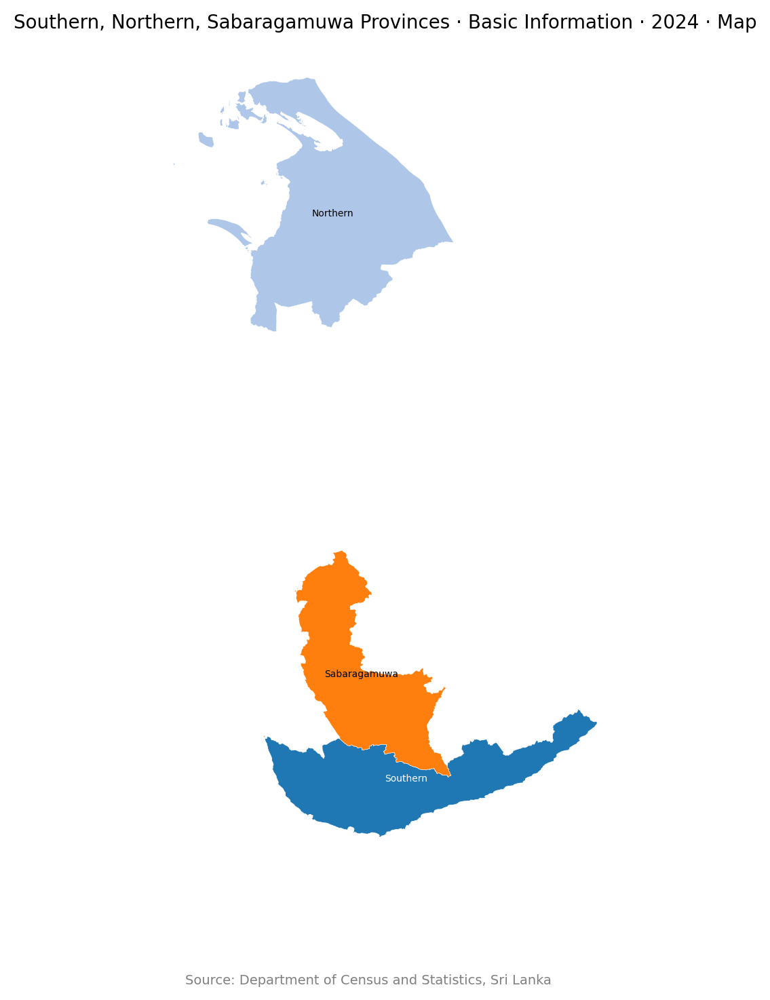

#### 01.05. `LK-4...LK-6/Map`

```json
{
    "result": {
        "title_items": [
            "Northern, Eastern, North Western Provinces",
            "Basic Information",
            "2024",
            "Map"
        ],
        "image_path": "/tmp/lanka_data/images/04979af2.png",
        "source": "Department of Census and Statistics, Sri Lanka",
        "source_url": "https://www.statistics.gov.lk/"
    },
    "query_time_ms": 0,
    "cache_hit": false
}
```


#### 01.06. `LK-1127025@10/Map`

```json
{
    "result": {
        "title_items": [
            "267 Gnds",
            "Basic Information",
            "2024",
            "Map"
        ],
        "image_path": "/tmp/lanka_data/images/51e54ec5.png",
        "source": "Department of Census and Statistics, Sri Lanka",
        "source_url": "https://www.statistics.gov.lk/"
    },
    "query_time_ms": 0,
    "cache_hit": false
}
```


#### 01.07. `LK-1103&EC-01B/Map`

```json
{
    "result": {
        "title_items": [
            "24 Gnds",
            "Basic Information",
            "2024",
            "Map"
        ],
        "image_path": "/tmp/lanka_data/images/15de4034.png",
        "source": "Department of Census and Statistics, Sri Lanka",
        "source_url": "https://www.statistics.gov.lk/"
    },
    "query_time_ms": 0,
    "cache_hit": false
}
```

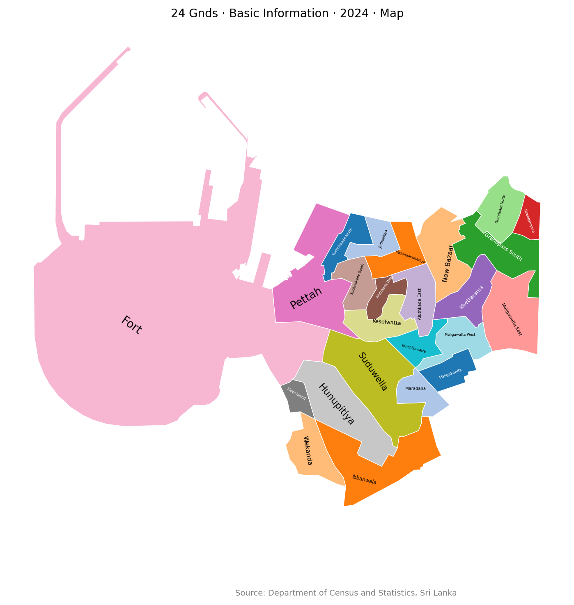

#### 01.08. `LK-61/Map`

```json
{
    "result": {
        "title_items": [
            "Kurunegala District",
            "Basic Information",
            "2024",
            "Map"
        ],
        "image_path": "/tmp/lanka_data/images/f3dd60f4.png",
        "source": "Department of Census and Statistics, Sri Lanka",
        "source_url": "https://www.statistics.gov.lk/"
    },
    "query_time_ms": 0,
    "cache_hit": false
}
```

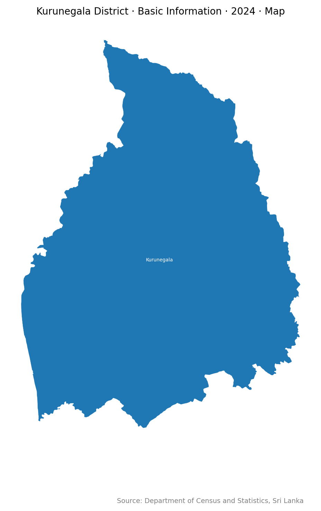

#### 01.09. `LK-71:district/Map`

```json
{
    "result": {
        "title_items": [
            "Anuradhapura District",
            "Basic Information",
            "2024",
            "Map"
        ],
        "image_path": "/tmp/lanka_data/images/cca3cd4e.png",
        "source": "Department of Census and Statistics, Sri Lanka",
        "source_url": "https://www.statistics.gov.lk/"
    },
    "query_time_ms": 0,
    "cache_hit": false
}
```

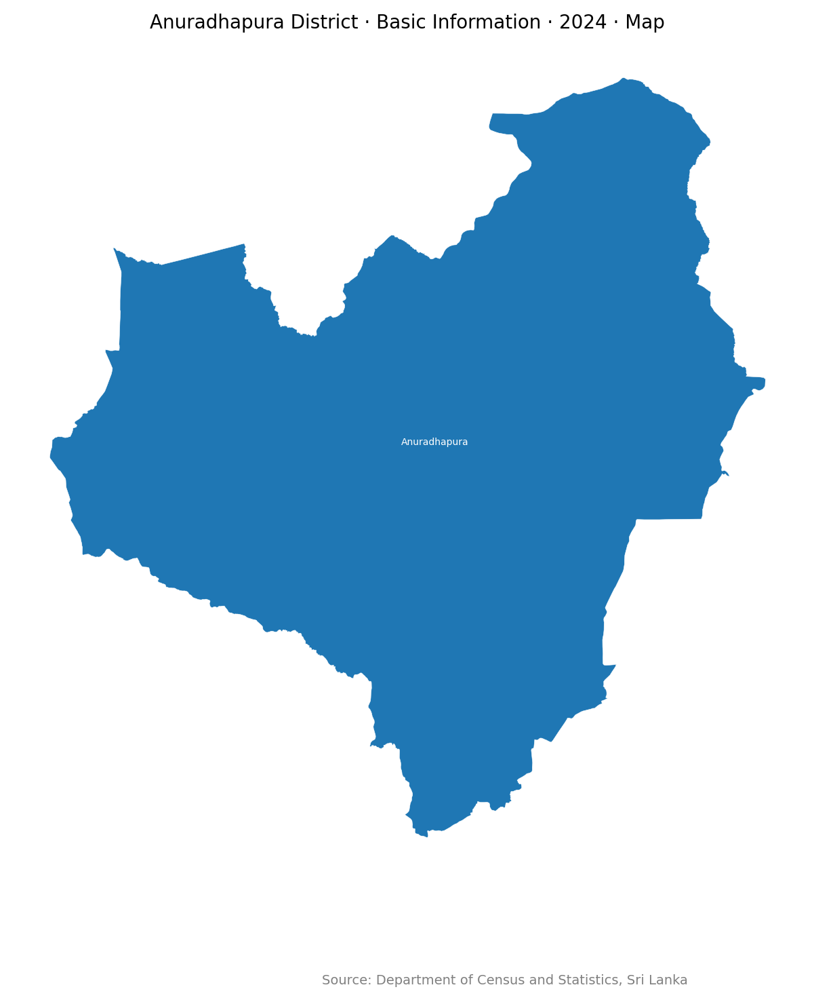

#### 01.10. `LK-81:pd/Map`

```json
{
    "result": {
        "title_items": [
            "9 Pds",
            "Basic Information",
            "2024",
            "Map"
        ],
        "image_path": "/tmp/lanka_data/images/bfa7d721.png",
        "source": "Department of Census and Statistics, Sri Lanka",
        "source_url": "https://www.statistics.gov.lk/"
    },
    "query_time_ms": 0,
    "cache_hit": false
}
```

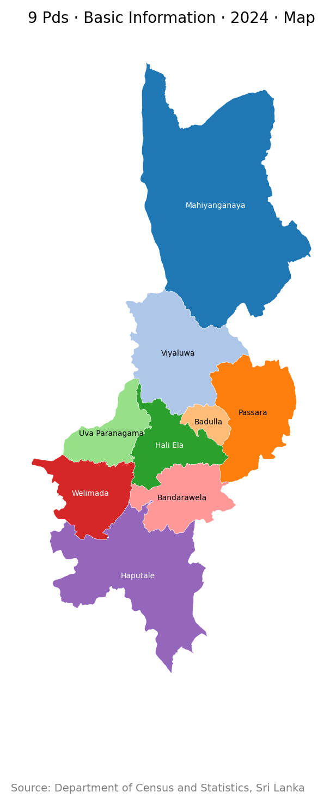

#### 01.11. `LK-23:dsd/Religion/2012/Map`

```json
{
    "result": {
        "title_items": [
            "Kotmale, Hanguranketa (pre 2019), Walapane (pre 2019), Nuwara Eliya (pre 2019), Ambagamuwa Dsds",
            "Religion",
            "2012",
            "Map"
        ],
        "image_path": "/tmp/lanka_data/images/a2b164d4.png",
        "source": "Department of Census and Statistics, Sri Lanka",
        "source_url": "https://www.statistics.gov.lk/"
    },
    "query_time_ms": 0,
    "cache_hit": false
}
```

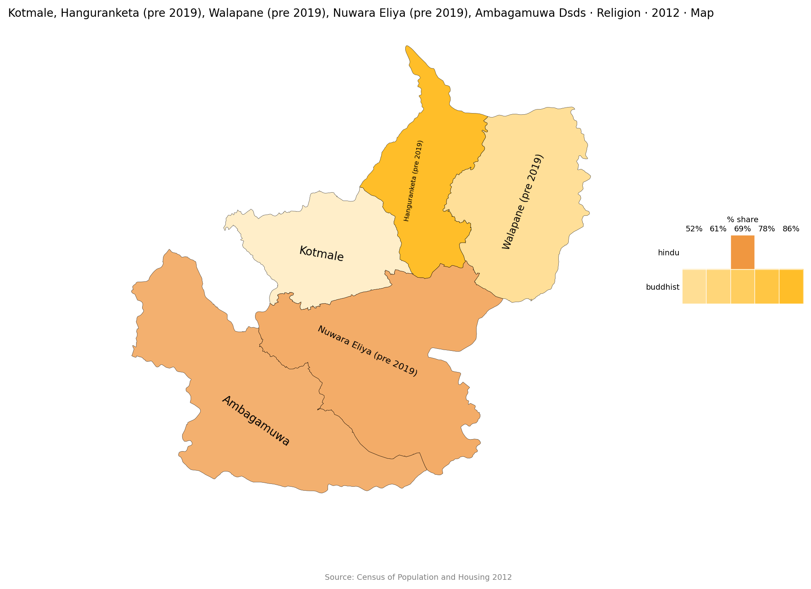

#### 01.12. `LK-23:dsd/Religion/2024/Map`

```json
{
    "result": {
        "title_items": [
            "10 Dsds",
            "Religion",
            "2024",
            "Map"
        ],
        "image_path": "/tmp/lanka_data/images/3147011c.png",
        "source": "Department of Census and Statistics, Sri Lanka",
        "source_url": "https://www.statistics.gov.lk/"
    },
    "query_time_ms": 0,
    "cache_hit": false
}
```

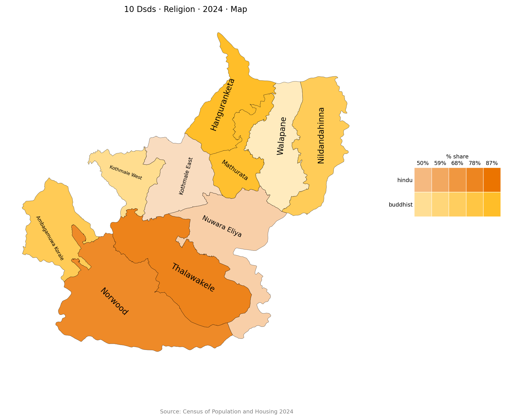

#### 01.13. `LK-1103:gnd/Religion/2012/JSON`

```json
{
    "result": {
        "title_items": [
            "35 Gnds",
            "Religion",
            "2012",
            "JSON"
        ],
        "data_list": [
            {
                "region_id": "LK-1103005",
                "region_name": "Sammanthranapura",
                "region_type": "gnd",
                "history_year": "Current",
                "area_sqkm": 0.18,
                "center_lat": 6.977933,
                "center_lng": 79.878128,
                "num": " ",
                "country_id": "LK",
                "province_id": "LK-1",
                ... // 1185 lines ...
                "roman_catholic": 42435,
                "other_christian": 10715,
                "other": 251
            },
            "total_value": 323223,
            "pct_values": {
                "islam": 0.4177,
                "hindu": 0.227,
                "buddhist": 0.1901,
                "roman_catholic": 0.1313,
                "other_christian": 0.0332,
                "other": 0.0008
            }
        },
        "source": "Census of Population and Housing 2012",
        "source_url": "https://www.statistics.gov.lk/Resource/en/Population/CPH_2011/CPH_2012_5Per_Rpt.pdf"
    },
    "query_time_ms": 0,
    "cache_hit": false
}
```

#### 01.14. `LK-1127:gnd/Religion/2012/Map`

```json
{
    "result": {
        "title_items": [
            "20 Gnds",
            "Religion",
            "2012",
            "Map"
        ],
        "image_path": "/tmp/lanka_data/images/0d265f1a.png",
        "source": "Department of Census and Statistics, Sri Lanka",
        "source_url": "https://www.statistics.gov.lk/"
    },
    "query_time_ms": 0,
    "cache_hit": false
}
```

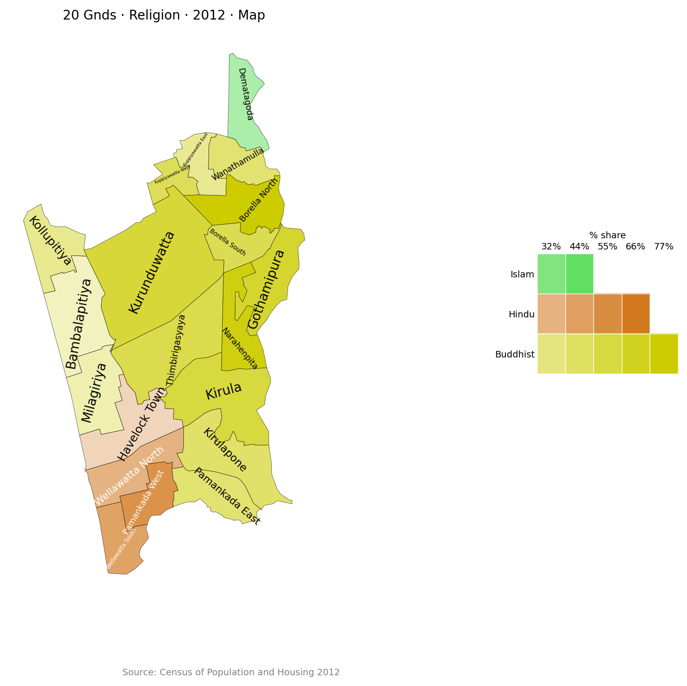

#### 01.15. `LK-53:dsd/Ethnicity/2024/Map`

```json
{
    "result": {
        "title_items": [
            "11 Dsds",
            "Ethnicity",
            "2024",
            "Map"
        ],
        "image_path": "/tmp/lanka_data/images/8069c8aa.png",
        "source": "Department of Census and Statistics, Sri Lanka",
        "source_url": "https://www.statistics.gov.lk/"
    },
    "query_time_ms": 0,
    "cache_hit": false
}
```

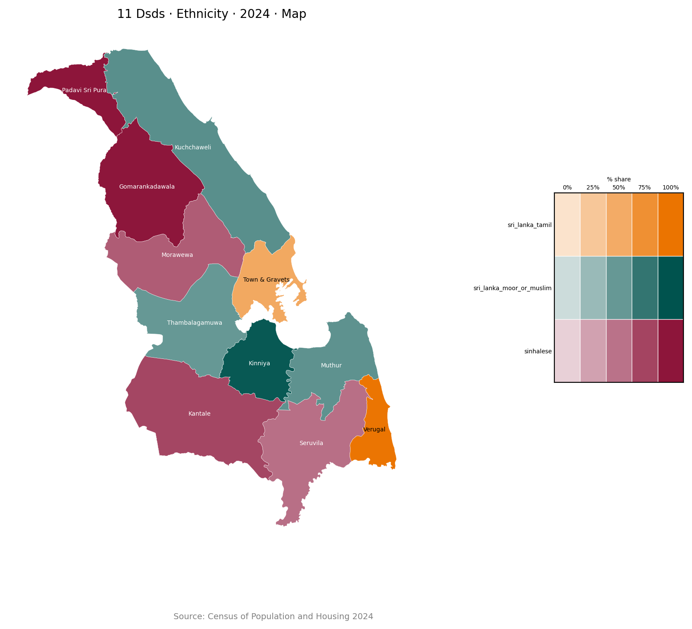

#### 01.16. `LK/ParliamentaryElection/2024`

```json
{
    "result": {
        "title_items": [
            "Sri Lanka Country",
            "ParliamentaryElection",
            "2024",
            "JSON"
        ],
        "data_list": [
            {
                "region_id": "LK",
                "region_name": "Sri Lanka",
                "region_type": "country",
                "history_year": "Current",
                "area_sqkm": 65983.58,
                "center_lat": 7.621863,
                "center_lng": 80.698448,
                "summary": {
                    "electors": 17140354,
                    "polled": 11815246,
                    ... // 1337 lines ...
                "IND28-13": 0.0,
                "IND36-13": 0.0,
                "IND42-13": 0.0,
                "IND34-13": 0.0,
                "IND26-12": 0.0,
                "IND05-13": 0.0,
                "IND07-13": 0.0,
                "IND08-14": 0.0,
                "IND32-13": 0.0,
                "IND40-13": 0.0,
                "IND37-13": 0.0,
                "IND33-13": 0.0
            }
        },
        "source": "Election Commission of Sri Lanka",
        "source_url": "https://www.elections.gov.lk"
    },
    "query_time_ms": 0,
    "cache_hit": false
}
```

#### 01.17. `LK-2:pd/PresidentialElection/Latest/Map`

```json
{
    "result": {
        "title_items": [
            "21 Pds",
            "PresidentialElection",
            "Latest",
            "Map"
        ],
        "image_path": "/tmp/lanka_data/images/35e3a262.png",
        "source": "Department of Census and Statistics, Sri Lanka",
        "source_url": "https://www.statistics.gov.lk/"
    },
    "query_time_ms": 0,
    "cache_hit": false
}
```

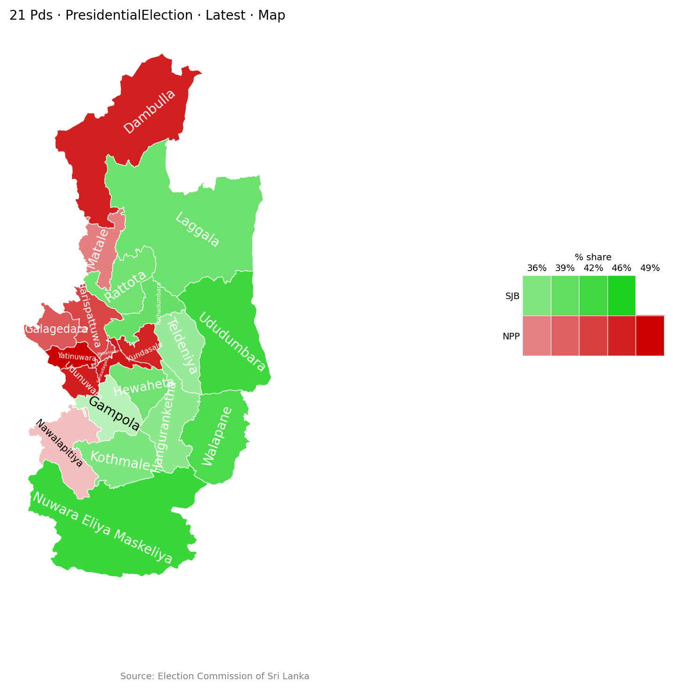

#### 01.18. `LK-2:dsd/Ethnicity/Latest/Map`

```json
{
    "result": {
        "title_items": [
            "41 Dsds",
            "Ethnicity",
            "Latest",
            "Map"
        ],
        "image_path": "/tmp/lanka_data/images/bade8195.png",
        "source": "Department of Census and Statistics, Sri Lanka",
        "source_url": "https://www.statistics.gov.lk/"
    },
    "query_time_ms": 0,
    "cache_hit": false
}
```


#### 01.19. `LK-41:dsd/Religion/2012/Map:2nd`

```json
{
    "result": {
        "title_items": [
            "15 Dsds",
            "Religion",
            "2012",
            "Map (2nd)"
        ],
        "image_path": "/tmp/lanka_data/images/09cd4316.png",
        "source": "Department of Census and Statistics, Sri Lanka",
        "source_url": "https://www.statistics.gov.lk/"
    },
    "query_time_ms": 0,
    "cache_hit": false
}
```

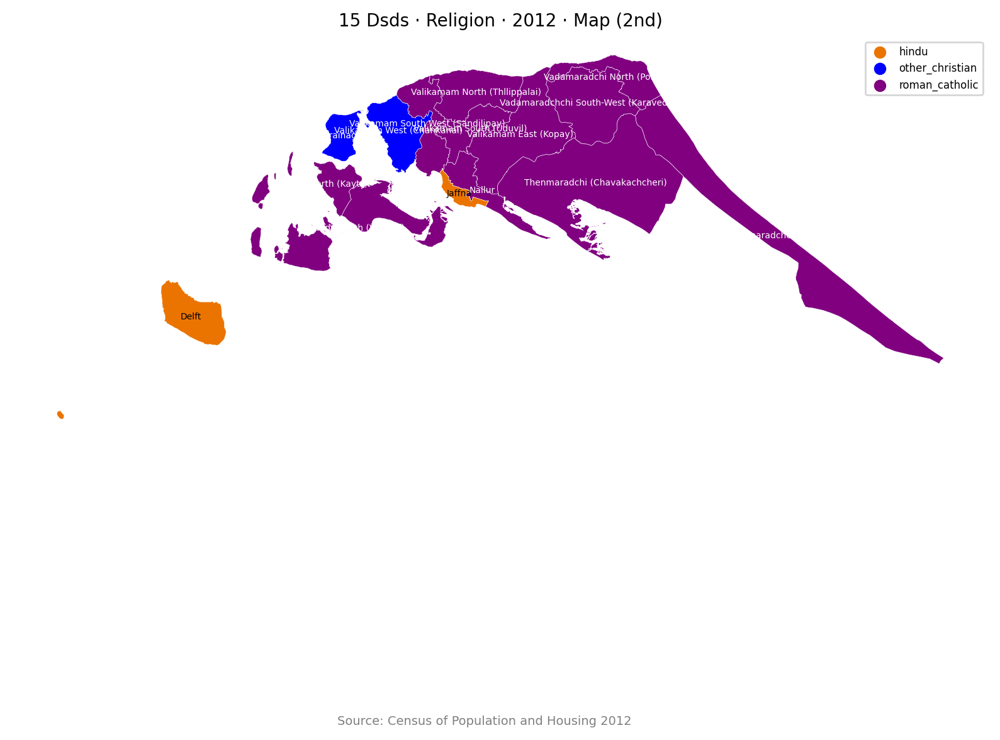

#### 01.20. `LK-51:dsd/Religion/2012/Map:buddhist`

```json
{
    "result": {
        "title_items": [
            "14 Dsds",
            "Religion",
            "2012",
            "Map (buddhist)"
        ],
        "image_path": "/tmp/lanka_data/images/75a61fa4.png",
        "source": "Department of Census and Statistics, Sri Lanka",
        "source_url": "https://www.statistics.gov.lk/"
    },
    "query_time_ms": 0,
    "cache_hit": false
}
```

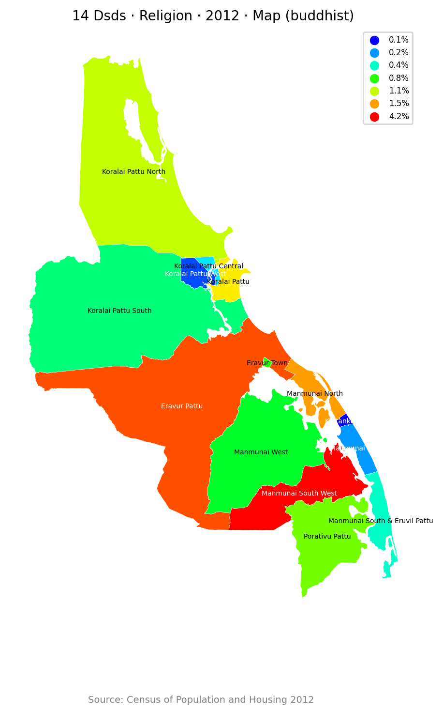

#### 01.21. `LK-pre1984:district/Basic/2012/JSON`

```json
{
    "result": {
        "title_items": [
            "24 Districts",
            "Basic Information",
            "2012",
            "JSON"
        ],
        "data_list": [
            {
                "region_id": "LK-11",
                "region_name": "Colombo",
                "region_type": "district",
                "history_year": "1984",
                "area_sqkm": 688.17,
                "center_lat": 6.869822,
                "center_lng": 80.018487,
                "current_ids": [
                    "LK-11"
                ]
                ... // 265 lines ...
            },
            {
                "region_id": "LK-92",
                "region_name": "Kegalle",
                "region_type": "district",
                "history_year": "1984",
                "area_sqkm": 1657.73,
                "center_lat": 7.104294,
                "center_lng": 80.342772,
                "current_ids": [
                    "LK-92"
                ]
            }
        ],
        "source": "Department of Census and Statistics, Sri Lanka",
        "source_url": "https://www.statistics.gov.lk/"
    },
    "query_time_ms": 0,
    "cache_hit": false
}
```

#### 01.22. `LK-pre1959:district/Religion/2012/Map`

```json
{
    "result": {
        "title_items": [
            "20 Districts",
            "Religion",
            "2012",
            "Map"
        ],
        "image_path": "/tmp/lanka_data/images/4e535cda.png",
        "source": "Department of Census and Statistics, Sri Lanka",
        "source_url": "https://www.statistics.gov.lk/"
    },
    "query_time_ms": 0,
    "cache_hit": false
}
```

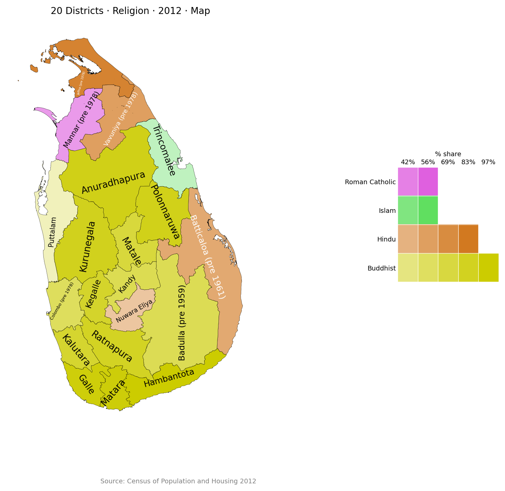

#### 01.23. `LK-pre1845:province/Basic/2012/Map`

```json
{
    "result": {
        "title_items": [
            "Western (pre 1845), Central (pre 1886), Southern (pre 1886), Northern (pre 1873), Eastern (pre 1873) Provinces",
            "Basic Information",
            "2012",
            "Map"
        ],
        "image_path": "/tmp/lanka_data/images/a85c9f82.png",
        "source": "Department of Census and Statistics, Sri Lanka",
        "source_url": "https://www.statistics.gov.lk/"
    },
    "query_time_ms": 0,
    "cache_hit": false
}
```

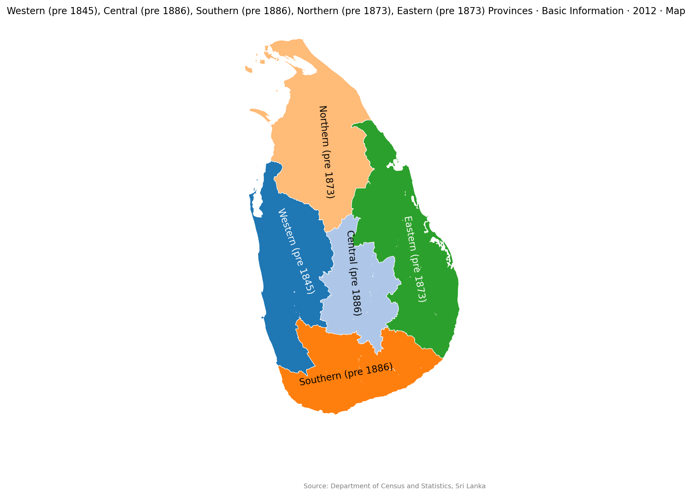

#### 01.24. `LK-23-pre2019:dsd/Ethnicity/2012/Map`

```json
{
    "result": {
        "title_items": [
            "Kotmale, Hanguranketa (pre 2019), Walapane (pre 2019), Nuwara Eliya (pre 2019), Ambagamuwa Dsds",
            "Ethnicity",
            "2012",
            "Map"
        ],
        "image_path": "/tmp/lanka_data/images/d9a29dc7.png",
        "source": "Department of Census and Statistics, Sri Lanka",
        "source_url": "https://www.statistics.gov.lk/"
    },
    "query_time_ms": 0,
    "cache_hit": false
}
```

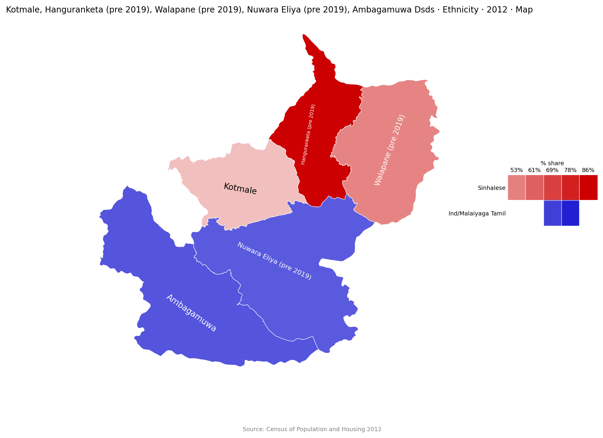

#### 01.25. `LK-23-pre2019:dsd/Ethnicity/2024/Map`

```json
{
    "result": {
        "title_items": [
            "Kotmale, Hanguranketa (pre 2019), Walapane (pre 2019), Nuwara Eliya (pre 2019), Ambagamuwa Dsds",
            "Ethnicity",
            "2024",
            "Map"
        ],
        "image_path": "/tmp/lanka_data/images/a7f89f48.png",
        "source": "Department of Census and Statistics, Sri Lanka",
        "source_url": "https://www.statistics.gov.lk/"
    },
    "query_time_ms": 0,
    "cache_hit": false
}
```

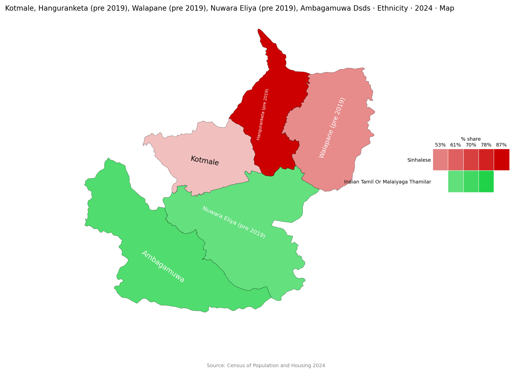

#### 01.26. `LK-23:dsd/Ethnicity/2024/Map`

```json
{
    "result": {
        "title_items": [
            "10 Dsds",
            "Ethnicity",
            "2024",
            "Map"
        ],
        "image_path": "/tmp/lanka_data/images/d6f9c6e3.png",
        "source": "Department of Census and Statistics, Sri Lanka",
        "source_url": "https://www.statistics.gov.lk/"
    },
    "query_time_ms": 0,
    "cache_hit": false
}
```

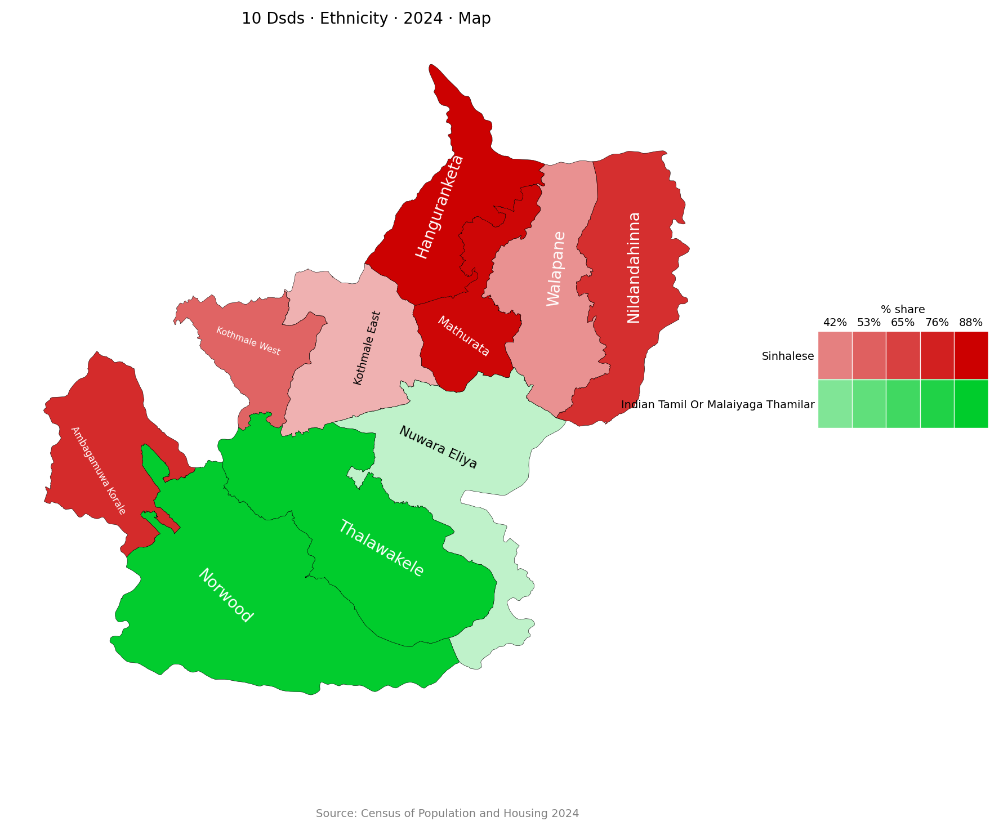


[](https://opensource.org/licenses/MIT)
