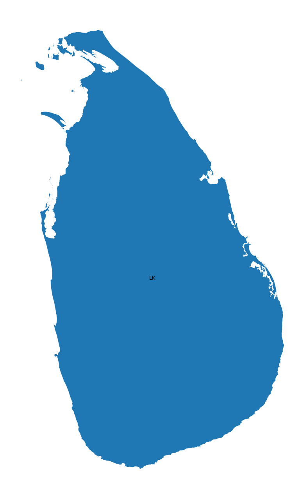
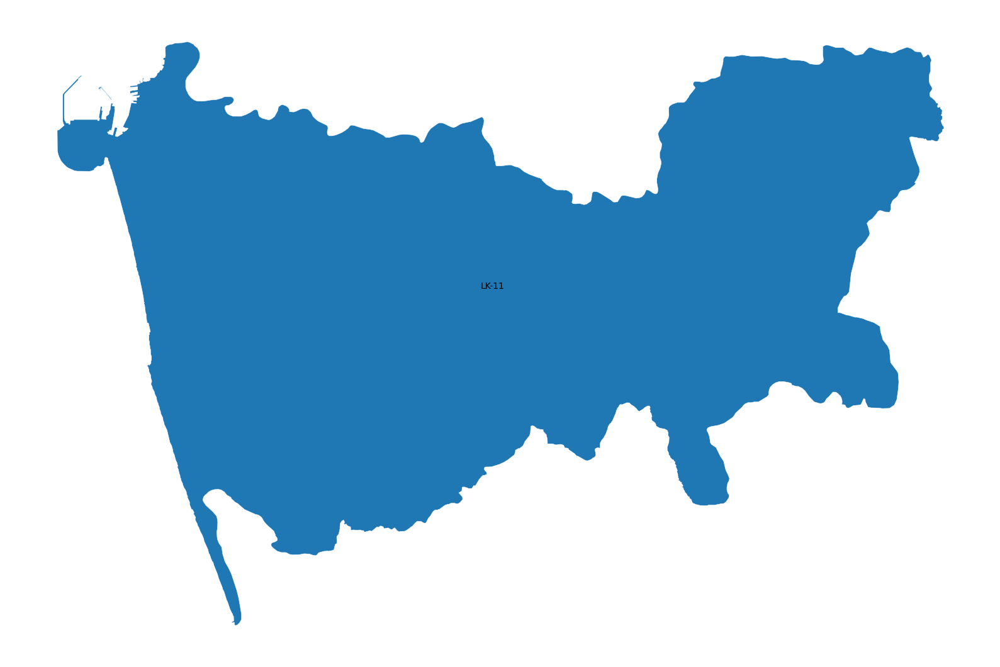
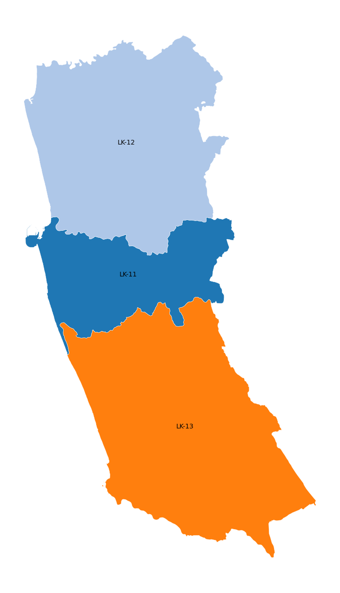
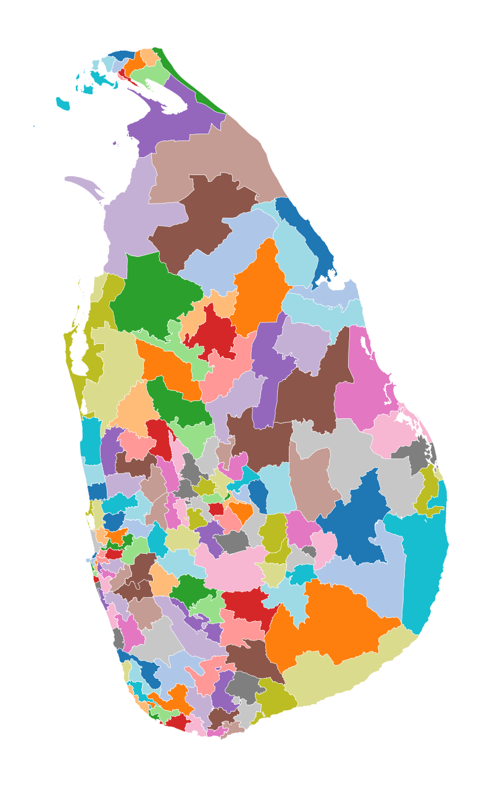
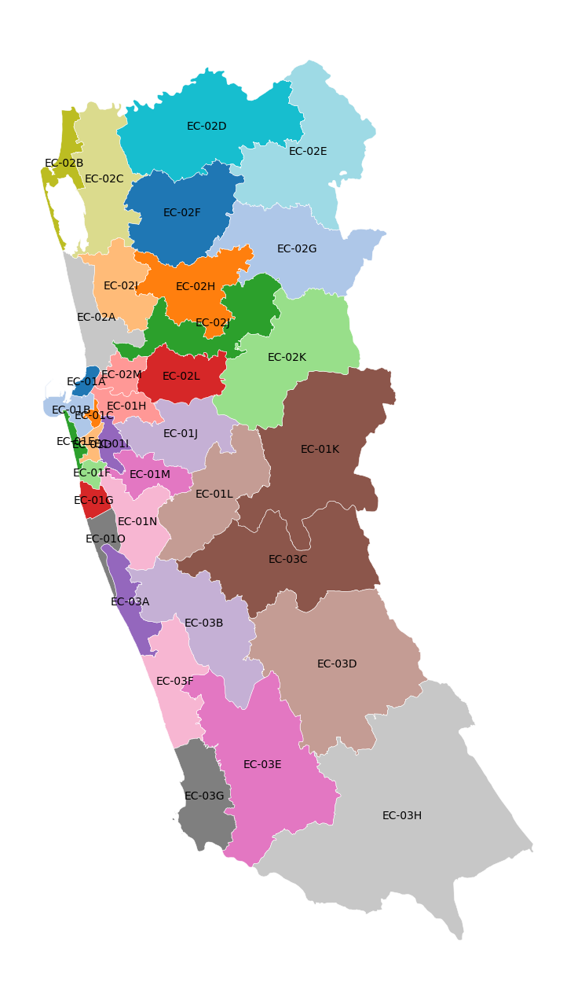

# Lanka Data

This repo implements a simple interface 
to query data about Sri Lanka.

## Data Sources

- Department of Census and Statistics, Sri Lanka

## Usage

### Run Code

```python
from lanka_data import Db


db = Db("<cmd>")
output = db.run()
print(output)

```

### workflows/run.py

```bash
python workflows/run.py <cmd>
```

### workflows/console.py

```bash
python workflows/console.py <cmd>

/Where/What/When/How

> /<cmd>
```

## Example Commands (`<cmd>`)

### 01. `LK`

```json
{
    "error": "list indices must be integers or slices, not str"
}
```

### 02. `LK-99`

```json
{
    "error": "Region ID not found: LK-99"
}
```

### 03. `LK-1:district`

```json
{
    "error": "list indices must be integers or slices, not str"
}
```

### 04. `LK/Map`

```json
{
    "result": {
        "image_path": "/tmp/lanka_data/cache/lk-map.png",
        "source": "Department of Census and Statistics, Sri Lanka",
        "source_url": "https://www.statistics.gov.lk/"
    },
    "query_time_ms": 142,
    "cache_hit": false
}
```



### 05. `LK-11/Map`

```json
{
    "result": {
        "image_path": "/tmp/lanka_data/cache/lk-11-map.png",
        "source": "Department of Census and Statistics, Sri Lanka",
        "source_url": "https://www.statistics.gov.lk/"
    },
    "query_time_ms": 44,
    "cache_hit": false
}
```



### 06. `LK-1:district/Map`

```json
{
    "result": {
        "image_path": "/tmp/lanka_data/cache/lk-1:district-map.png",
        "source": "Department of Census and Statistics, Sri Lanka",
        "source_url": "https://www.statistics.gov.lk/"
    },
    "query_time_ms": 37,
    "cache_hit": false
}
```



### 07. `LK:pd/Map`

```json
{
    "result": {
        "image_path": "/tmp/lanka_data/cache/lk:pd-map.png",
        "source": "Department of Census and Statistics, Sri Lanka",
        "source_url": "https://www.statistics.gov.lk/"
    },
    "query_time_ms": 92,
    "cache_hit": false
}
```



### 08. `LK-1:pd/Map`

```json
{
    "result": {
        "image_path": "/tmp/lanka_data/cache/lk-1:pd-map.png",
        "source": "Department of Census and Statistics, Sri Lanka",
        "source_url": "https://www.statistics.gov.lk/"
    },
    "query_time_ms": 63,
    "cache_hit": false
}
```



### 09. `LK-11/Religion/2012`

```json
{
    "result": [
        {
            "region_id": "LK-11",
            "region_name": "Colombo",
            "values": {
                "buddhist": 1632125,
                "islam": 274067,
                "hindu": 186303,
                "roman_catholic": 162260,
                "other_christian": 66947,
                "other": 2262
            },
            "total_value": 2323964,
            "pct_values": {
                "buddhist": 0.7023,
                "islam": 0.1179,
                "hindu": 0.0802,
                "roman_catholic": 0.0698,
                "other_christian": 0.0288,
                "other": 0.001
            },
            "source": "Census of Population and Housing 2012",
            "source_url": "https://www.statistics.gov.lk/Resource/en/Population/CPH_2011/CPH_2012_5Per_Rpt.pdf"
        }
    ],
    "query_time_ms": 13,
    "cache_hit": false
}
```

### 10. `LK-9:district/Ethnicity/2012`

```json
{
    "result": [
        {
            "region_id": "LK-91",
            "region_name": "Ratnapura",
            "values": {
                "sinhalese": 947811,
                "ind_tamil": 62124,
                "sl_tamil": 54437,
                "sl_moor": 22346,
                "other_eth": 549,
                "burgher": 405,
                "malay": 288,
                "sl_chetty": 35,
                "bharatha": 12
            },
            "total_value": 1088007,
            "pct_values": {
                "sinhalese": 0.8711,
                "ind_tamil": 0.0571,
                "sl_tamil": 0.05,
                "sl_moor": 0.0205,
                "other_eth": 0.0005,
                "burgher": 0.0004,
                "malay": 0.0003,
                "sl_chetty": 0.0,
                "bharatha": 0.0
            },
            "source": "Census of Population and Housing 2012",
            "source_url": "https://www.statistics.gov.lk/Resource/en/Population/CPH_2011/CPH_2012_5Per_Rpt.pdf"
        },
        {
            "region_id": "LK-92",
            "region_name": "Kegalle",
            "values": {
                "sinhalese": 718369,
                "sl_moor": 59997,
                "ind_tamil": 43748,
                "sl_tamil": 17861,
                "burgher": 227,
                "other_eth": 209,
                "malay": 184,
                "sl_chetty": 49,
                "bharatha": 4
            },
            "total_value": 840648,
            "pct_values": {
                "sinhalese": 0.8545,
                "sl_moor": 0.0714,
                "ind_tamil": 0.052,
                "sl_tamil": 0.0212,
                "burgher": 0.0003,
                "other_eth": 0.0002,
                "malay": 0.0002,
                "sl_chetty": 0.0001,
                "bharatha": 0.0
            },
            "source": "Census of Population and Housing 2012",
            "source_url": "https://www.statistics.gov.lk/Resource/en/Population/CPH_2011/CPH_2012_5Per_Rpt.pdf"
        }
    ],
    "query_time_ms": 15,
    "cache_hit": false
}
```

### 11. `LK-1103/Religion/2024`

```json
{
    "result": [
        {
            "region_id": "LK-1103",
            "region_name": "Colombo",
            "values": {
                "islam": 125890,
                "hindu": 71811,
                "buddhist": 47726,
                "roman_catholic": 36117,
                "other_christian": 10381,
                "other": 164
            },
            "total_value": 292089,
            "pct_values": {
                "islam": 0.431,
                "hindu": 0.2459,
                "buddhist": 0.1634,
                "roman_catholic": 0.1237,
                "other_christian": 0.0355,
                "other": 0.0006
            },
            "source": "Census of Population and Housing 2024",
            "source_url": "https://www.statistics.gov.lk/Population/StaticalInformation/CPH2024"
        }
    ],
    "query_time_ms": 0,
    "cache_hit": false
}
```


[](https://opensource.org/licenses/MIT)
