# A Brief History of Administrative Regions in Sri Lanka

Sri Lanka's administrative map (nine provinces, twenty-five districts, and thousands of smaller divisions) took its current shape over nearly two centuries. This article traces the key changes to those boundaries and the circumstances behind each one.

## History of Provinces

### Before 1833: Three islands on one island

There were no provinces in the modern sense. The British held the maritime belt from 1796. The Kingdom of Kandy stayed sovereign in the interior until 1815. After Kandy fell, the British administered the island through **three separate structures**: one for the Low Country Sinhalese, one for the Kandyan Sinhalese, and one for the Tamil areas, each with its own administration [1].

### 1833: The Colebrooke–Cameron unification

The Colebrooke–Cameron Commission, sent from London, reviewed the colonial administration and recommended consolidation: the three separate administrations were abolished and the island was reorganised into **five geographic provinces** under a single government [1, 2]. The same reforms abolished the *rajakariya* (compulsory labour) system and the cinnamon monopoly [3].

The five: **Western, Central, Southern, Northern, Eastern.**

The four provinces added between 1845 and 1889 each responded to growth in population and economic activity. The coffee boom around Kandy after 1840, which saw hundreds of estates established on crown land, significantly increased the administrative load on existing units [5].

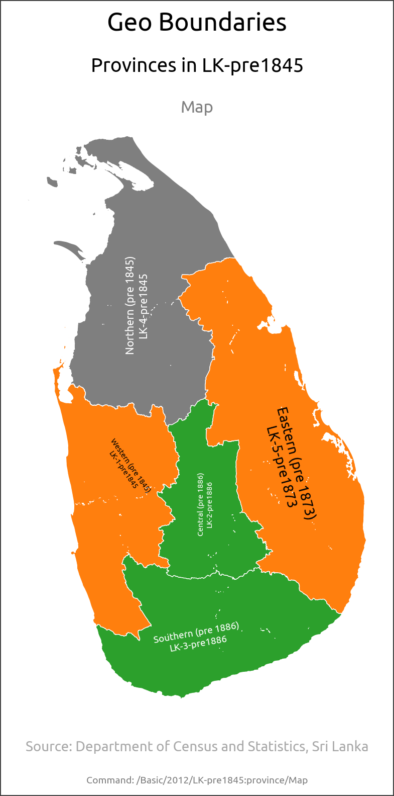

### 1845: North Western Province

Split from Western Province, taking the maritime districts of Chilaw and Puttalam and the Kandyan Seven Korales [4]. The coastal trade and the interior plantation frontier had grown too large to govern from Colombo.

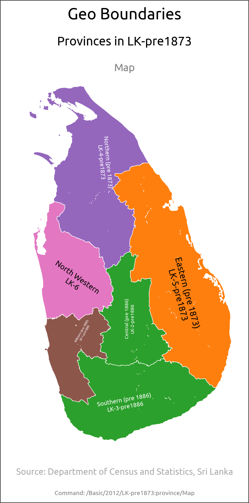

### 1873: North Central Province

Assembled from the southern Northern Province (Nuwara Kalawiya) and north-western Eastern Province (Tamankaduwa) [4]. This was the dry-zone heartland, sparsely settled ancient irrigation country that was later the target of major resettlement schemes.

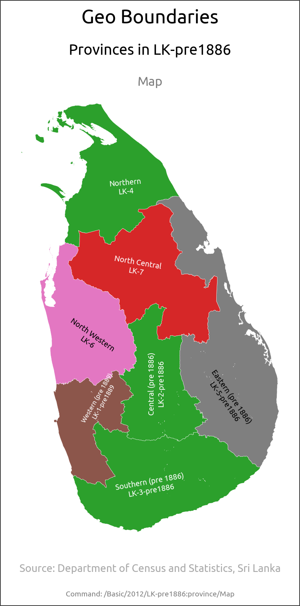

### 1886: Uva Province

Carved from parts of Central, Eastern (Bintenna) and Southern (Wellassa) [4]. Remote eastern hill country, hard to administer from Kandy, and increasingly drawn into the plantation economy.

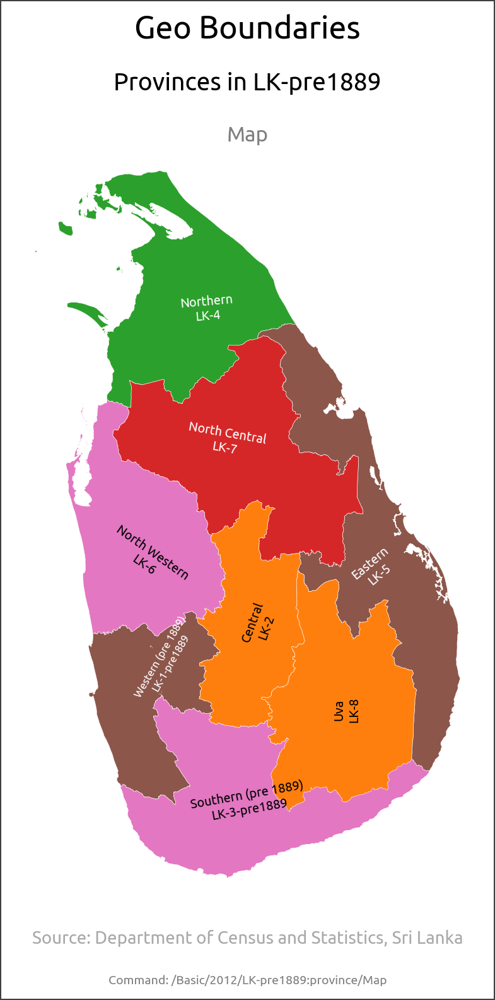

### 1889: Sabaragamuwa Province

Split from Southern and Western [4]. This completed the nine provinces still in use today. The boundaries have not changed since 1889. For most of their existence, provinces functioned primarily as administrative units with limited devolved powers [7].

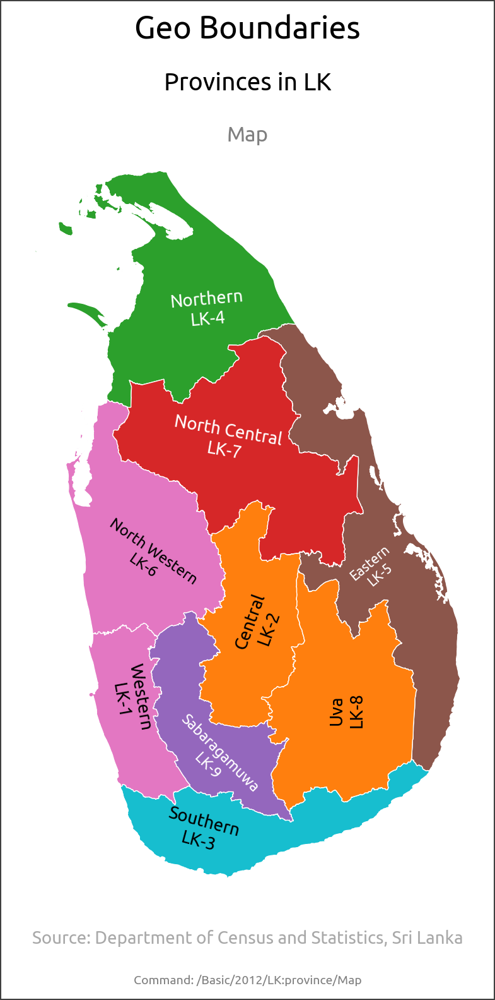

### 1987–88: The merger of Northern and Eastern Provinces

The provincial map remained unchanged for 98 years.

The **Thirteenth Amendment** (1987) established elected Provincial Councils, devolved a range of subjects to the provinces, and made Tamil an official language [8]. It followed the Indo-Lanka Accord between Rajiv Gandhi and J.R. Jayewardene, which was concluded in the context of the ongoing civil conflict [9].

A key provision of the Accord merged the **Northern and Eastern provinces** into one **North-Eastern Province**, covering approximately a quarter of the island [10]. A referendum to make the merger permanent was provided for but was not held; the arrangement was instead renewed by presidential proclamation each year [10].

### 2006–07: The demerger

The JVP petitioned the Supreme Court. On 16 October 2006 a five-judge bench ruled Jayewardene's 1988 proclamations invalid [11]. On 1 January 2007 the North-East formally split back into **Northern** and **Eastern** [12].

The North-Eastern Province is the only province added after 1889, and also the only one subsequently dissolved. The total stands at nine provinces.

## History of Districts

Districts began as sub-units of provinces. In **1955** they became the country's primary administrative tier for central government delivery [13]. The district map changed five times after that.

The Administrative Districts Act (No. 22 of 1955) fixed twenty districts as the working middle tier between province and village [13].

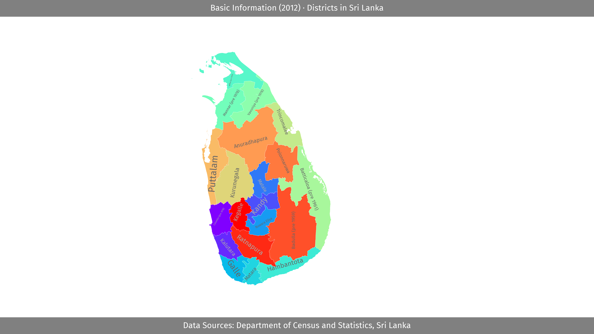

### 1959: Monaragala District

Split from Badulla [14]. The vast, thinly-settled Uva dry zone needed its own seat, far from the hill-country administration at Badulla.

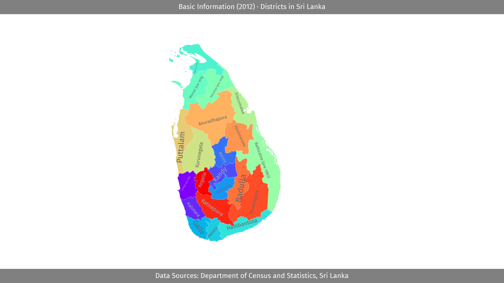

### 1961: Ampara District

Carved from southern Batticaloa [14]. A development district built around the Gal Oya irrigation and resettlement scheme, which drew in Sinhalese, Tamil and Muslim settlers from across the island.

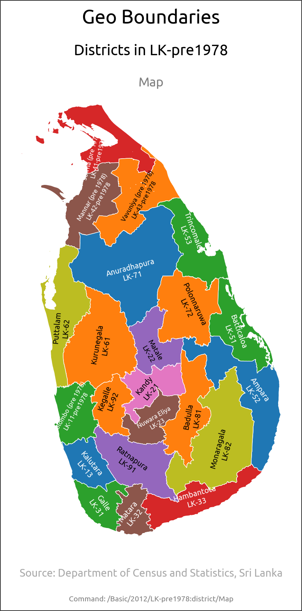

### 1978: Gampaha & Mullaitivu District

Gampaha was split from Colombo due to population growth [15]. Greater Colombo's northern suburbs had outgrown a single district. Today Gampaha holds over 2.4 million people, the second-most populous district in the country.

Mullaitivu was assembled the same year from parts of Vavuniya, Jaffna and Mannar [16]. A sparse northern district in the far north.

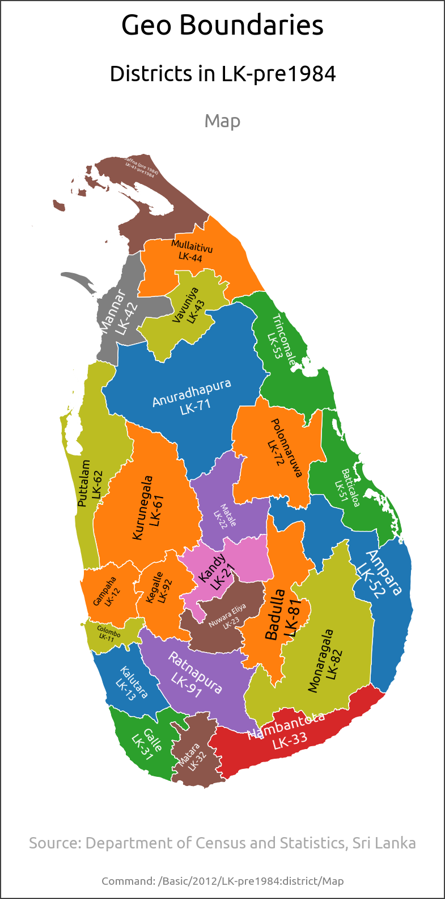

### 1984: Kilinochchi District

The last district, split from Jaffna [14]. No district has been created in over forty years. The total stands at **twenty-five**.

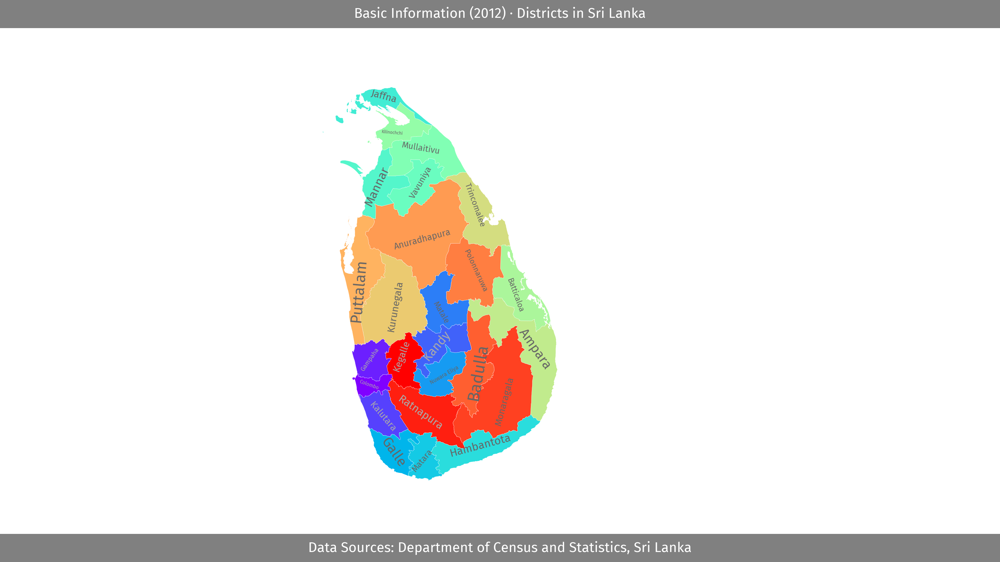

## Divisional Secretariats and Grama Niladhari Divisions

Below the district, there are two further tiers: **331 Divisional Secretariat Divisions (DSDs)** and roughly **14,000 Grama Niladhari Divisions (GNDs)** [17].

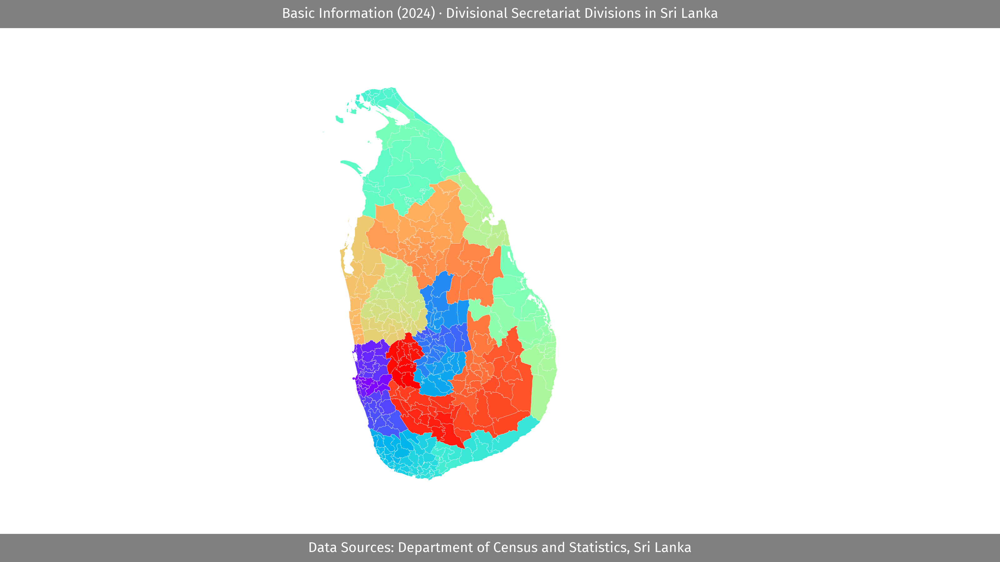

These differ from provinces and districts in how they change. Provincial and district boundaries move only through Parliament, constitutional amendment, or a Supreme Court ruling. DSD and GND boundaries are adjusted by gazette notification to keep units at a workable size.

The most common reason for change is growth in population or area. The GND is the government's smallest contact point, with one Grama Niladhari handling records, certificates and welfare for a community [17]. When a division's population or area grows too large to serve, it is split. The number of GNDs climbed from 4,451 in 1987 to over 14,000 today, mostly by absorbing field officers and subdividing crowded divisions [18].

There is significant variation in the size of GNDs: some urban GNDs have populations over 20,000, while some dry-zone divisions cover hundreds of square kilometres [19]. Recent changes have generally been splits of larger divisions, for example Colombo divisions subdivided into A/B units, and Attanagalla's GND count rising from 86 to 151 [20].

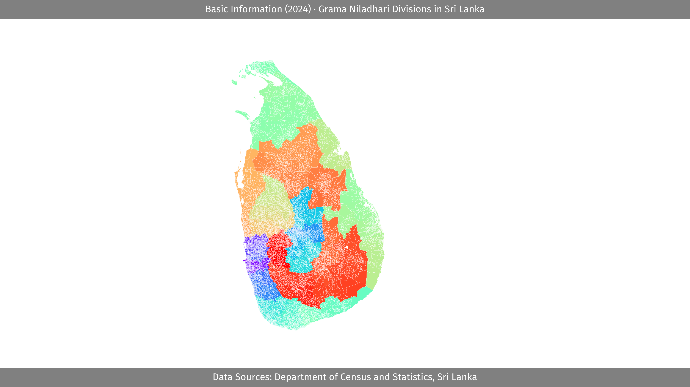

## Current Status

No new provinces or districts have been created since 1984. The nine-province structure dates to 1889 (with the brief exception of the North-Eastern merger from 1988 to 2007), and the twenty-five-district structure has been stable since 1984.

Below the district level, GND and DSD boundaries continue to be adjusted by gazette notification. Open census and GIS data now make it possible to analyse the population and area characteristics of individual divisions [19].

---

## Appendix: Code

See [README.md](../README.md)

---

## Appendix: References

1. Provinces of Sri Lanka — Wikipedia. <https://en.wikipedia.org/wiki/Provinces_of_Sri_Lanka>
2. Colebrooke–Cameron Commission — Wikipedia. <https://en.wikipedia.org/wiki/Colebrooke%E2%80%93Cameron_Commission>
3. "The Colebrooke-Cameron Reforms," GlobalSecurity / U.S. Country Studies. <https://countrystudies.us/sri-lanka/13.htm>
4. "History," Provinces of Sri Lanka. <https://www.liquisearch.com/provinces_of_sri_lanka/history>
5. Coffee production in Sri Lanka — Wikipedia. <https://en.wikipedia.org/wiki/Coffee_production_in_Sri_Lanka>
6. Kamalika Pieris, "The Provinces of Modern Sri Lanka," LankaWeb. <https://www.lankaweb.com/news/items/2016/06/21/the-provinces-of-modern-sri-lanka/>
7. "Sri Lanka: Self-Rule," Marks comparative regional authority dataset. <https://garymarks.web.unc.edu/wp-content/uploads/sites/13018/2021/03/Sri-Lanka_combined.pdf>
8. Thirteenth Amendment to the Constitution of Sri Lanka — Wikipedia. <https://en.wikipedia.org/wiki/Thirteenth_Amendment_to_the_Constitution_of_Sri_Lanka>
9. "What is the 13th Amendment to the Constitution of Sri Lanka?" Vajiram & Ravi. <https://vajiramandravi.com/upsc-daily-current-affairs/prelims-pointers/what-is-the-13th-amendment-to-the-constitution-of-sri-lanka/>
10. North Eastern Province, Sri Lanka — Wikipedia. <https://en.wikipedia.org/wiki/North_Eastern_Province,_Sri_Lanka>
11. "The Issue of Northeast De-Merger," Institute of Peace and Conflict Studies. <https://www.ipcs.org/comm_select.php?articleNo=2165>
12. International Crisis Group, "Sri Lanka's Eastern Province: Land, Development, Conflict." <https://www.crisisgroup.org/asia/south-asia/sri-lanka/sri-lanka-s-eastern-province-land-development-conflict>
13. Districts of Sri Lanka — Wikipedia. <https://en.wikipedia.org/wiki/Districts_of_Sri_Lanka>
14. Ampara District — Wikipedia. <https://en.wikipedia.org/wiki/Ampara_District>
15. Gampaha District — Wikipedia. <https://en.wikipedia.org/wiki/Gampaha_District>
16. "Sri Lanka Self-Rule: Institutional Depth and Policy Scope," UNC. <https://garymarks.web.unc.edu/wp-content/uploads/sites/13018/2021/03/Sri-Lanka_combined.pdf>
17. Maps — Sri Lanka, Northwestern Pritzker Legal Research Center. <https://library.law.northwestern.edu/c.php?g=1182176&p=8644720>
18. "History of Administrative Regions in Sri Lanka" (source document); Department of Census and Statistics, Sri Lanka. <https://www.statistics.gov.lk>
19. N. I. Senaratna, "When GNDs are Too Big," On Politics (Medium). <https://medium.com/on-politics/when-gnds-are-too-big-c269b36bd09e>
20. Attanagalla Divisional Secretariat — Wikipedia. <https://en.wikipedia.org/wiki/Attanagalla_Divisional_Secretariat>
